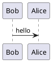

# Showcase

Itt láthatod, hogy hogyan jelenik meg egy Markdown fájl tartalma.  *(A dokumentum a repository-ban a `doc/for_contributors/showcase.md` útvonalon érhető el.)*

---

# H1
## H2
### H3
#### H4
##### H5

--- 

**bold1** __bold2__

*italic1* _italic2_

<u>underline</u>

[link](https://youtu.be/dQw4w9WgXcQ)

> block quote
> "If a machine is expected to be infallible, it cannot also be intelligent." - Alan Turing

---

Unordered list: 

- level 1
    - level 2
        - level 3

Ordered list:

1. level 1
    1. level 2
        1. level 3

Checkboxes:

- [ ] todo 1
    - [ ] a
    - [x] b
    - [ ] c


---

KaTeX inline: $e = m \cdot c^2$

Multiline 1:

\[
I =
\begin{bmatrix}
1 & 0 & 0 \\
0 & 1 & 0 \\
0 & 0 & 1 \\
\end{bmatrix}    
\]

Multiline 2:

$$
\displaystyle \sin \left(\alpha + \frac{\pi}{2} \right) = \cos(\alpha) 
$$

---

Code inline: `cd ./nginx `

Code: 
```py
def main() -> str:
    return "Hello world!"
```

Git diff:
```diff
+ added something
- removed another
same thing
```

---

Some emojis: :blush: :heart_eyes: :+1: :pray: :eyes: :100:

---

Global image: 


Sized image: { height=25 }

Web based: { height=25 }
 
Local image: { height=25 }

Emote: 


---

Tables:

| a | b |
| - | - |
| 1 | 2 |

---

Admonitions:

!!! note 
    Without title

!!! quote Ne halat adj az éhezőnek...
    Hanem címet az admonition-re

???+ warning Összecsukhatós
    Sajnos ezt nem támogatja a Markdown Preview Enhanced, szóval nem sok ilyennel találkozhatsz

---

PlantUML support:


---

!!! warning Graphviz
    A graphviz diagrammok jelenleg még nem támogatottak az oldalon

    ```dot
    digraph G {
        rankdir=LR
        Earth [peripheries=2]
        Mars
        Earth -> Mars
    }
    ```