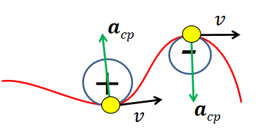
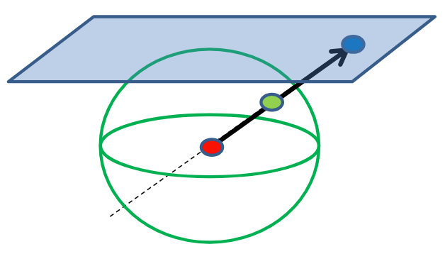
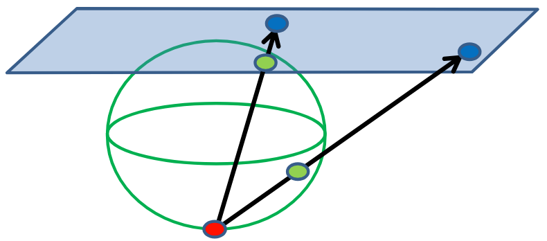
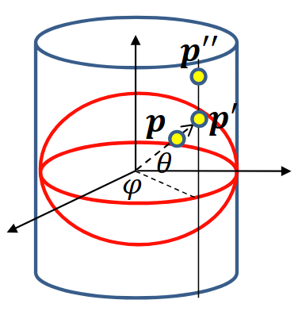
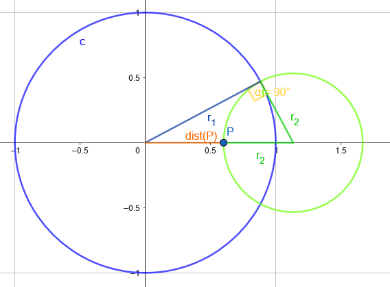

# 1. fejezet: Geometriák és algebrák

A geometriák különböző axiómákra épülnek. Az axiómákat eleinte _tapasztalatok_ határozták meg, és ezek olyan állítások, amikben _vallásosan hiszünk_. Tételek kiindulási pontjaként szolgálnak, és általában az alapfogalmakat impliciten ezekkel definiáljuk.
Például az Euklideszi síkgeometriában az egyik legfontosabb, hogy egy egyenesre egy külső pontból legfeljebb egy olyan egyenes húzható, ami nem metszi (ez a párhuzamossági posztulátum).

Mi most absztrakt geometriai fogalmakhoz, mint például _pont_, _egyenes_, vagy _metszi_ próbálunk számokat és függvényeket rendelni, hiszen ezekkel lehet programozni. Pontosabban bizonyos axiómák által alkotott _geometriához_ próbálunk egy _algebrát_ hozzá rendelni, amelyből már tudunk programokat írni. Viszont eközben sosem szabad a választott geometriánk axiómarendszerével ellentmondani.

Az axiómáink a megváltoztatása különböző eredményekhez vezethet, például ha olyan axiómarendszert alkotunk, ahol a háromszög belső szögeinek összege kevesebb mint $180˚$, akkor _hiperbolikus geometriát_ kaptunk, mely egy gyakori model az asztrofizikában. Ha viszont több lenne, mint $180˚$, akkor _gömbi geometriát_ kapnánk, mely a bolygónk modellezésében elengedhetetlen szerepet játszik.

## 1.1. Ambiens terek

A különböző geometriákat _ambiens térrel_, más szóval beágyazó térrel, fogjuk ábrázolni.

!!! info 1.1. Definíció (Ambiens tér, [ambient space](https://en.wikipedia.org/wiki/Ambient_space_(mathematics)))
    Egy olyan tér, ami valamilyen objektumot (pl. sík, gömb) körbevesz.

Az euklideszi síkgeometria esetében például ez azt jelenti, hogy a szokásos két dimenziós ábrázolás helyett egy három dimenziós teret kell elképzelni, amelyben felveszünk egy síkot. Ez a sík az eredeti síkgeometria, viszont mivel három dimenzióban vagyunk, ezért nem limitálódunk le csak két dimenzióra.

Például fel tudjuk használni ezt a harmadik koordinátát arra, hogy elkülönítsük a pontokat és a vektorokat. Alapból (ránézésre) nem tudnánk megmondani a $(2, 3)$ koordinátáról, hogy ez egy pontot ábrázol, vagy egy helyvektort, mely a $(2, 3)$ pontba mutat. Viszont most mondhatjuk azt, hogy az összes pont legyen $[x, y, 1]$ alakú, és az összes vektor pedig $[x, y, 0]$.

Más geometriákat is beágyazhatunk ambiens terekbe, például ha nem a $(x, y, 1)$ síkon választanánk pontokat, hanem azt mondanánk, hogy minden pont $x, y$ és $w$ koordinátáinak az $x^2 + y^2 + w^2 = 1$ egyenletet kéne kielégítenie, akkor elliptikus geometriát ábrázolnánk. Az a fontos, hogy mindig ezeken az objektumokon (sík, félgömb, gömb, stb) választunk pontokat.
Hiperbolikus geometria esetén a pontokat az $x^2 + y^2 - w^2 = -1$ egyenlet alapján választjuk.

## 1.2. Metrika

Korábban különböző metrikákkal (pl. hossz, szög) definiáltuk a különböző műveleteket (pl. skaláris szorzás). Most viszont fordítva fogjuk csinálni: tudjuk, hogy akarunk egy skaláris szorzás műveletet, ami rendelkezik a már megszokott tulajdonságaival (kommutatív, bilineáris).

Viszont most nem a metrikáinkkal definiáljuk a műveletet, hanem a művelettel definiáljuk a metrikáinkat: egy vektor hosszát definiálhatjuk úgy, mint a saját magával vett skaláris szorzatának a négyzetgyöke. Ez az euklideszi geometriában pontosan megegyezik az általunk ismert hossz fogalmával, viszont így algebrailag is meg tudjuk fogalmazni, hogy mit értünk egy vektor "hosszán".

## 1.3. Euklideszi síkgeometria

Kettő dimenzióról beszélünk ($x$,$y$ koordinátákkal), amihez felveszünk egy harmadik tulajdonságot ($w$-t).

!!! info 1.2. Definíció (skaláris szorzás)
    Vegyük az ambiens tér két elemét, legyenek ezek $a_1$ és $a_2$. Ekkor ezek _skaláris szorzata_ a következő:
    $$ a_1 \cdot a_2 = x_1 x_2 + y_1 y_2 + w_1 w_2 $$

Ez a művelet kommutatív ($a \cdot b = b \cdot a$), disztributív (bilineáris) ($a \cdot [b + c] = a \cdot b + a \cdot c$) és skálázható ($[sa] \cdot b = s[a \cdot b]$). Viszont **nem** asszociatív.

??? info Emlékeztető (asszociativitás fogalma)
    Egy (kétváltozós) műveletre (legyen most $*$) akkor mondjuk, hogy asszociatív, ha nem számít az elvégzésének sorrendje, azaz
    $$(u * v) * w = u * (v * w) = u * v * w.$$
    Ha egy művelet _nem_ asszociatív, akkor az azt jelenti, hogy $(u * v) * w \neq u * (v * w)$. Egy példa egy nem asszociatív műveletre az osztás:
    $$
    \frac{1}{6} = \frac{\frac{1}{2}}{3} = \underbrace{(1/2)/3 \neq 1/(2/3)}_{
        \footnotesize (u * v) * w \neq u * (v * w)
    } = \frac{1}{\frac{2}{3}} = \frac{3}{2}
    $$

Az ambiens terünk elemei a _pontok_ és a _vektorok_. Az ambiens vektorokat képesnek kell lennünk összeadni és skálázni, ebből következik, hogy $w=0$ a vektoroknál és $w=1$ a pontoknál (egyéb $w$-k se nem pontok, se nem vektorok). A pontok esetén $w=1$ azért áll fenn, hogy az eltolás lineáris leképezés maradjon. Továbbá így két pont különbsége pont egy vektor, hiszen a két $w$ tag különbsége $0$ lesz.

### Vektorok tulajdonságai

- Két pont különbsége egy vektor.
- Az ambiens térnek elemei: $\underline{v} = [x,y,0]$
- Hossza: $|v| = \sqrt{v \cdot v}$
- Merőlegesség: $u \perp v$ ha $u \cdot v = 0$
    - Minden vektorra végtelen sok merőleges vektor létezik $\lambda [y, -x, 0]$ alakban.
- Párhuzamosság: $u \parallel v$ ha $u = \lambda v$
    - Minden vektorra végtelen sok párhuzamos vktor létezik $\lambda [x, y, 0]$ alakban.
- Egységvektor: $\displaystyle|v^0| = 1, v^0 \cdot v^0 = 1, v^0 = \frac{v}{|v|} = \frac{v}{\sqrt{v \cdot v}}$ (normalizálás)

### Egyenes egyenletei

!!! info 1.3. Definíció (Egyenes paraméteres egyenletei)
    Egy $r$ egyenes parametrikus egyenlete a következő:
    $$r(t) = p + vt$$
    Koordináták használatával pedig:
    $$[x(t),y(t),w(t)] = [p_x,p_y,1] + [v_x,v_y,0] \cdot t$$
    Végezetül két pont ($p, q$) kombinációjaként:
    $$[x(t),y(t),w(t)] = [p_x,p_y,1] \cdot (1 - t) + [q_x,q_y,1] \cdot t$$

??? tip Fizikai értelmezés
    Fizikai megközelítésből ez egy _állandó sebességű mozgásnak_ felel meg, hiszen az első idő szerinti deriváltja a sebesség, a második pedig a gyorsulás:
    $$
    \dot{r}(t) = v \newline
    \ddot{r}(t) = 0
    $$

Azaz $p$ pontból $t$ ideje indultunk el $v$ vektorral - ha végig gondoljuk ez valóban pontok gyűjteménye, hiszen $w=1$ végig. Fel lehet fogni továbbá az ambiens tér síkjának (melyet az origó, $p$ és $q$ pontok alkotnak) és a $w=1$ síknak a metszeteként.

!!! info 1.5. Definíció (Egyenes implicit egyenlete)
    Egy $r$ egyenes implicit egyenlete a következő:
    $$n\cdot (r - p) = 0$$

Ahol $r$ egyenest határozzuk meg $p$ pontja és $\underline{n}$ normálvektora segítségével:
$$ r(x,y) \Rightarrow [n_x, n_y, 0] \cdot [x - p_x, y - p_y, 0] = 0 $$
vagyis
$$\boxed{n_x x + n_y y + d = 0}$$
ahol $d = -n \cdot p$.

Ha $r$ helyére behelyettesítünk, akkor könnyen eldönthetjük, hogy egy pont rajta van-e (egyébként pont ezért _implicit_ egyenlet, mert az $r$ egyenest nem fejezzük ki expliciten).

## 1.4. Euklideszi térgeometria

A célunk az, hogy minden legyen ugyan olyan mint a síkgeometriánál, csak most már egyel magasabb dimenzióban: itt az ambiens tér négy dimenziós, az elemeit $[x, y, z, w]$ alakban adjuk meg.

A korábban megbeszélt műveletek nem változnak, az egyenes egyenletek továbbra is megmaradnak.

### Sík egyenletei

!!! info 1.6. Definíció (Sík explicit egyenlete)
    Egy $p$ pontot tartalmazó, $\underline{a}$ és $\underline{b}$ nem párhuzamos vektorok ($\underline{a} \not\perp \underline{b}$) által kifeszített sík explicit egyenlete a következő:
    $$r(u,v) = p + au + bv$$
    ahol $u,v$ valós paraméterek.

!!! info 1.7. Definíció (Sík implicit egyenlete)
    Egy sík implicit egyenlete a következő: $n \cdot (r-p) = 0$

Ahol $\underline{n}$ normálvektor merőleges $\underline{a}, \underline{b}$ vektorokra, vagyis: $n_x x + n_y y + n_z z + d = 0$

Két sík $N_1, N_2$ akkor egyezik meg, ha $N_1 = N_2 \lambda$.

## 1.5. Görbület

### 1.5.1. Görbék görbülete

Egy adott pontra az alábbi két definíció egyikét használhatjuk:

!!! info 1.8. Definíció (Adott pontbeli görbület)
    A $\kappa$ _görbület_ az egysebességű centripetális gyorsulás:
    $$a_{cp} = \frac{v^2}{R}$$

Ahol egysebességű alatt azt értjük, hogy a sebesség nagysága állandó.

!!! info 1.9. Definíció (Adott pontbeli görbület)
    A $K$ _görbület_ a simuló kör sugarának reciproka:
    $$K = \frac{1}{r} = \frac{v^2}{r}$$

### 1.5.2. Gauss görbület

Egy felület (mondjuk henger) görbületét szeretnénk meghatározni egy adott pontban. Feltehető, hogy ebben a pontban a felületnek van egy normálvektora, ami merőleges a felület síkjára. Ekkor az alakzatot felvághatjuk olyan síkokkal amik az adott pontot metszik és a normálvektorral párhuzamosak. Ezek a síkok bármerre állhatnak és a felületet ahogy metszik, úgy egy görbét határoznak meg.

Az így kapott görbék közül van kettő, ahol az egyiknél minimális a görbület, a másiknál maximális. Ezek a metszési irányok egymásra merőlegesek. Ezek a _principális_ vagy _főgörbületi_ irányok.

Az itt található görbületek szorzata az úgynevezett _Gauss-görbület_.

??? example Részletek
    [_Ezen_](https://youtu.be/0ZV4TjgI424?t=621) a linken elérhető a hivatalos grafika youtube videó ezzel kapcsolatban. A diasorokon voltak még további alakzatok, ezeken érdemes ezt végig gondolni, a legfontosabb, hogy a normállal mindig párhuzamosak ezek a metszések.

## 1.6. Gömbi geometria

Itt a görbület állandóan pozitív, az egyenesek is görbék. További fontos változások:

- Két pont nem mindig határoz meg egyértelműen egy egyenest.
- Két egyenes mindig két pontban metszi egymást.
- Nincsenek olyan egyenesek, amik ne metszenék egymást (még a párhuzamosok is metszik egymást).

Ezek a változtatások új axiómákat eredményeznek.

### 1.6.1. Alap definíciók

!!! info 1.10. Definíció (A gömb egyenlete)
    Egy $k$ kör egyenlete a következő: $\displaystyle k\colon x^2 + y^2 + z^2 = R^2 = \frac{1}{K}$

Itt a $K$ görbület mindig pozitív.

!!! info 1.11. Definíció (Főkör)
    Két pont és a gömb közepe meghatároz egy síkot. A kört, ami a sík és gömb metszésével jön létre _főkörnek_ nevezzük.

A főkör az egyenes analógja, hiszen ez lesz a legrövidebb út két pont között.

Fontos kiemelni, hogy a főkört nem mindig lehet egyértelműen meghatározni, pl. Északi sark, Déli sark, Origó pontokkal végtelen sok sík van.

A távolság analógja az _ívhossz_: $\displaystyle R \theta =  \frac{\theta}{\sqrt{K}}$.

!!! info 1.12. Definíció (Főkör egyenlete)
    A főkör egyenlete a következő:
    $$r(t) = p \cos(t/R) + v^0 R \sin(t/R)$$
    ahol felhasználtuk, hogy egységsebességnél a távolság képlete $R \theta = t$.

### 1.6.2. Elliptikus geometria

Ez a geometria nagyrészt analóg a gömbi geometriával, viszont egy fontos változtatás, hogy _az átellenes pontok egynek számítanak_.

### 1.6.3. Háromszögek gömbi geometriában

Gömbi geometriában a háromszögek belső szögösszege nagyobb mint $180˚$, a területük pedig:
$$ T = (\alpha + \beta + \gamma - \pi)/K$$
ahol $\alpha, \beta, \gamma$ a háromszög belső szögei radiánban. Derékszögű háromszögekre pedig az alábbi egyenlőtlenség teljesül:
$$a^2 + b^2 > c^2$$
ahol $a,b,c$ a háromszög oldalai.

### 1.6.4 Az ambiens tér elemei

Az ambiens tér elemei a pontok és a vektorok egy adott pontban, ahol a $p$ pontokra teljesül, hogy
$$
\begin{align*}
p \cdot p = 1 \newline
p_x^2 + p_y^2 + p_w^2 = 1
\end{align*}
$$
ahol a skaláris szorzás definíciója változatlan az euklideszi síkgeometriához képest.

A vektorokat csak adott $p$ pontokban definiáljuk; úgy, hogy egy $v$ vektorra teljesüljön, hogy
$$p \cdot v = 0$$
Fontos kiemelni, hogy a vektorok mások a tér különböző pontjaiban, és egy vektor a hozzá tartozó pont tangens terének az eleme.

### 1.6.5. Egyenesek

Az egyenest továbbra is lehet egységsebességű mozgásként értelmezni, viszont itt már máshogy kell azt a mozgást leírni:

!!! info 1.13. Definíció (Az egyenes parametrikus egyenlete gömbi geometriában)
    Egy $r$ egyenes parametrikus egyenlete a következő:
    $$r(t) = p \cos(t) + v^0 \sin(t)$$

Továbbá is értelmezhető úgy, mint az ambiens tér síkjának és a geometriának a metszete.

!!! info 1.14 Definíció (Gömbi kombináció, slerp)
    $$r(td) = p \frac{\sin(1-t)d}{\sin(d)} + q \frac{\sin(td)}{\sin(d)}$$

Természetesen a pontok nem hagyják el a gömb felszínét, így $r(t) \cdot r(t) = 1$, és mivel egységsebességű mozgás, ezért $\dot{r}(t) \cdot \dot{r}(t) = 1$.
A Gauss görbületet pedig a második idő szerinti deriváltból kaphatjuk meg:
$$\ddot{r}(t) = -(r)t \Rightarrow K = \ddot{r}_{min} \cdot \ddot{r}_{max} = 1$$

### 1.6.6. Távolság

<!-- TODO: Több magyarázat -->
Két pont távolsága az egységsebességű, egyenesvonalú mozgás ideje:
$$d(p, q) = \arccos(q \cdot p)$$
ebből meghatározható a kör implicit egyenlete:

!!! info 1.15. Definíció (A kör implicit egyenlete gömbi geometriában)
    $$r \cdot c = \cos(R)$$

ahol felhasználtuk, hogy $R = d(r,c) = \arccos(r \cdot c)$.

### 1.6.7. Térképek

Nézzünk egy való világ beli alkalmazást. A célunk az, hogy egy gömböt (például a Föld felszínét) levetítsünk egy síkra úgy, hogy minél jobban igazodjon a valós gömbhöz. Elvárjuk tőle, hogy euklideszi legyen, hogy könnyen ábrázolni tudjuk. Ezen felül két hasonlósági metrikáról beszélhetünk:

- **Topológiai hasonlóság**
    - Ekkor egyértelmű folytonos leképezés van a valódi helyek és utak, illetve az ábrázolt helyek és utak között.
    - Az orientáció is megmarad, azaz ami a térképen "balra van" az a való világban is "balra van".

- **Geometriai hasonlóság**
    - Ami a való világban egy kör vagy egy egyenes, az a térképen is látszódjon annak.
    - Szög-, távolság-, és területarány tartó; egyszóval a Gauss görbület egyezzen meg.
    - Példa: Ha egy hajón utazunk, és el szeretnénk kanyarodni Afrika felé, és a (sík) térképen megmértük, hogy $45˚$-ot kell ehhez balra kanyarodni, akkor a valóságban (gömb felszínén) is pont $45˚$-ot kell forgatni a kormányon.

Fontos, hogy távolságoknál és területeknél csak _arányokról_ beszélünk.

??? question De miért nem lehet olyan térkép, ami mindent megtart?
    Ha meg akarnánk tartani mind a szögeket, a távolságarányokat, és a területarányokat, akkor az azt jelentené, hogy nem változtathatunk a Gauss görbület értékén, hiszen $K$ attól függ, hogy a felületen hogyan mérünk szöget és távolságot, és független a felület térbeli alakjától (Theorema Egregium). Viszont a gömbi geometriában a görbület állandóan pozitív, azaz $K \gt 0$, viszont a síkoknál $K = 0$, szóval muszáj lesz változtatnunk $K$ értékén, azaz nem tudunk mindent megtartani.

### 1.6.8. Gömbök vetítése

Három különböző vetítési módot tárgyalunk:

#### Középpontos vetítés

A vetítési középpontot összekötjük a gömb felületével, és megnézzük, hogy ez az egyenes hol metszi el a síkot amire vetítünk. Ez a metszéspont lesz a gömb felszínén lévő pontnak a vetített pontja. Ha ezt megcsináljuk a gömb minden pontjára, akkor levetítettük a gömböt a síkra. Viszont mivel a vetítési középpont és a gömb felszínének egy pontja által meghatározott egyenes két pontot metszik a gömb felszínén (ez egy átmérő lényegében, szóval két átellenes pontot határoz meg), ezért redundáns a vetítés, általában csak a _felső félgömböt_ vetítjük. Továbbá ez a vetítés _egyenestartó_ (a gömbi főkör pontjait vetítve egyenest kapunk a síkon), de **nem** kör-, szög- vagy távolságtartó.

??? info Kép
    

#### Sztereografikus vetítés

Az elv teljesen analóg a középpontos vetítéssel, csak itt nem a gömb középpontja lesz a vetítési központ, hanem a gömb egy másik, tetszőleges pontja. Általában ez a gömb valameliyk pólusa szokott lenni, tipikusan a déli. Ekkor a _déli pólus kivételével mindent_ vetítünk, továbbá ez a vetítés _kör-_ és _szögtartó_, de **nem** egyenes- és távolságtartó. Bizonyos értelemben inverze a középpontos vetítésnek, hiszen a távolságon kívül pont ellentétes dolgokat tartanak meg.

??? info Kép
    

#### Mercator térkép

Eddig a gömböket egyenesen síkokra vetítettünk, de most járjunk el másképp. Vegyük körbe a gömbünket egy hengerrel, és vetítsük a gömb felszínének a pontjait ennek a palástjára; ezt a palástot kitekerve ugyan úgy egy síkot kapunk. Az eljárás hasonló a középpontos vetítéshez, ugyan úgy a gömb középpontjából vetítünk pontokat, de mielőtt kitekerjük a henger palástját, meg kell nyújtanunk felfelé, hogy biztosítsük a szögtartóságot. Ez az egyik legelterjedtebb térkép féle. Ez a vetítés _szögtartó_, de **nem** távolságtartó.

??? info Kép
    

???+ question Miért kell megnyújtani a hengert?
    A képzeletbeli hengerünk végtelen magas, és mi csak a palástjára vetítünk. Ennek az a következménye, hogy az északi és déli pólusoknak nem lesz vetített pontja a paláston, hiszen a pólusok és a középpont által meghatározott egyenes párhuzamos a palásttal, nem fogja sehol metszeni. Viszont ha egy nagyon picit elmozdulunk a pólusoktól, akkor már metszeni fogja, csak nagyon nagyon messze a középponttól. Ilyenkor nagyon pici szögváltoztatással is a gömb méretéhez relatívan óriási változások lesznek a vetített pontok helyzetében.

    Ezzel ellentétben ha az "egyenlítő" körüli pontokat vetítjük, itt kicsi változtatások a szögben nem eredményeznek olyan nagy változást a vetített pontok helyzetén. Így ahhoz, hogy szögtartó lehessen, muszáj lesz függőlegesen megnyújtani a hengert.

<!-- NOTE: A 2024/2025/2 évi előadáson ez a témakör a félév végén lett leadva. Meghagytam itt, de nem tudtam semmivel sem kiegészíteni. - levy04 -->
## 1.7. Hiperbolikus geometria

Itt a görbület állandóan negatív. További fontos változás, hogy egy egyenesre egy külső pontból több nem metsző egyenes húzható.

!!! info 1.16. Definíció (Hiperboloid egyenlete)
    A $h$ hiperboloid egyenlete a következő: $\displaystyle h\colon x^2 + y^2 - z^2 = -R^2 = \frac{1}{\kappa}$

    Ez levezethető komplex számokkal is: $h\colon (iR)^2 = -R^2$

### 1.7.1. Hiperbolikus terek vetítése egy diszkre

??? info Emlékeztető (3. háziból 2 kör merőleges)
    

### 1.7.2. Minkowski tér

A háromdimenziós teret kiterjesztjük egy negyedik dimenzióval, ami az _idő_. Itt nem pontok, hanem _események_ vannak jelen, hiszen ugyanaz a hely szerepelhet kétszer, de különböző időpontokban, más-más események közben.
Ebben a rendszerben a távolságot úgy kell érteni, hogy az $x_1$ helyről $t$ idő alatt egy hatás elér-e egy $x_2$ helyre.

## 1.8. Projektív geometria

Ez az egyik legfontosabb geometriai rendszer amit tárgyalunk, mivel az emberi vizuális látás is így értelmezi a világot, szóval amikor grafikai programot csinálunk, akkor ehhez kell igazodni (a GPU mindegyik geometriát támogatja, de projektív geometriában gondolkodik). Az euklideszi geometria tapasztalati alapon készült, viszont a gyakorlatban tapasztaltakat nem írja le pontosan: ha sínekre állunk, akkor azt látjuk, hogy ezek a végtelenben "találkoznak", pedig párhuzamos egyenesek, szóval Euklidesz szerint nem lehet metszéspontjuk.

Úgy fogjuk módosítani az euklideszi geometriát, hogy a gyakorlatban tapasztaltakat is pontosan le tudja írni. Mostantól bármilyen két egyenes - legyenek azok párhuzamosak vagy sem - pontosan egy pontban metszik egymást, így a "párhuzamos", mint fogalom értelmét veszti.

Előnye ennek a geometriának - azon felül, hogy pontosabban ábrázolja a valóságban tapasztaltakat - az az, hogy lényegesen leegyszerüsíti a programozást: nem kell olyan edge-caseket vizsgálni, hogy két egyenes párhuzamos, hanem mindig létezik bármely két egyenes metszéspontja. Hátránya viszont az, hogy mivel most már két, euklideszi geometriában párhuzamos egyenes a "végtelenben" metszik egymást, így bekerül a "végtelen" is a geometriánkba, és így már nem lehet távolságot mérni. Nem lehet Descartes- vagy polárkoordinátákkal dolgozni, hiszen azok alkalmatlanok a "végtelen" távol lévő pont kezelésére.

### 1.8.1. Ambiens tér elemei

A sík, amit az ambiens tér körbe vesz az ugyan az mint az euklideszi geometriában, csak hozzáveszünk _ideális pontokat_. Ezek a pontok azok, ahol metszik egymást a "végtelenben" a párhuzamos egyenesek. Végtelen sok ilyen pont van, minden irányhoz tartozik egy.

A beágyazás maga is máshogy történik, mivel az ideális pontokat valahogy reprezentálnunk kell. Ezt úgy érjük el, hogy az euklideszi pontokat kibővítjük egyenesekké. Kiválasztunk a projektív síkon egy pontot, és ezt összekötjük az origóval. Az így kapott egyenes reprezentálja a projektív pontot:

$$
\underbrace{(x,y)}_{\text{ Euklideszi pont}}
\rightarrow
\underbrace{[x,y,1]}_{\substack{\text{Projektív síkra}\\
                                \text{kerül}}}
\sim
\underbrace{[x \cdot w, y \cdot w, w]}_{\substack{\text{Ennek a pontnak az} \\
                                                  \text{eltolása valami $\scriptsize w$ konstanssal,} \\
                                                  \text{egy egyenest adva.}}}
= [X, Y, w]
$$

ahol $\displaystyle x = \frac{X}{w}, y = \frac{Y}{w}$ (ez az un. _homogén osztás_) és $w \neq 0$.

Így ábrázolni tudunk minden euklideszi pontot mint egyenest. Az ideális pontok pedig $[X,Y,0]$ alakúak, azaz náluk $w$ lehet $0$. Még fontos kiemelni, hogy az egyenes "két végén" ugyan az az ideális pont van, tehát az mindegy, hogy melyik irányba indulunk el az eredeti ponttól ezen az egyenesen, a végén ugyan ahhoz a projektív ponthoz jutunk. Erre úgy is lehet gondolni, hogy ez az egyenes topológiailag egy kör.

Ha már vannak projektív pontjaink, akkor tekintsünk _projektív egyeneseket_. Az egyenes továbbra is a legrövidebb távolság két pont között.

!!! info 1.17. Definíció (A projektív egyenes explicit/parametrikus képlete)
    Legyen két pontunk $P_1 = [X_1, Y_1, w_1]$ és $P_2 = [X_2, Y_2, w_2]$ alakban. Vegyünk fel egy $t$ futóváltozót. Ekkor a $P_1$ és $P_2$ által meghatározott egyenes parametrikus képlete:
    $$[X(t),Y(t),w(t)] = [X_1,Y_1,w_1] \cdot (1-t) + [X_2,Y_2,w_2] \cdot t$$

Itt a $t$ futóváltozót ahogy elkezdjük növelni $0$ és $1$ között, úgy nagyobb arányban számolja bele az egyik pont koordinátáit egy adott pontba mint a másikét. Ha vesszük az összes ilyen pontot $t$ minden értékére akkor megkapjuk az egyenest $P_1$ és $P_2$ pont között.

Az implicit egyenletet is hasonlóan vissza tudjuk vezetni az euklideszi esetre. Egy euklideszi egyenest egy $\underline{n}$ normálvektorral és az eltolással írjuk le:
$$ n_x x + n_y y + d = 0 $$
Ha homogén koordinátákra váltunk ($\displaystyle x = \frac{X}{w}, y = \frac{Y}{w}$), akkor az alábbi alakot kapjuk:
$$n_x X / w + n_y Y / w + d = 0 \qquad (w \neq 0)$$
Ebből az egyenletből pedig megkapjuk a projektív egyenes implicit egyenletét:

!!! info 1.18. Definíció (A projektív egyenes implicit egyenlete)
    Adott egy $P$ projektív pont $[X, Y, w]$ alakban, és egy $\underline{n}$ normálvektor $\displaystyle \begin{bmatrix}
    n_x \newline
    n_y \newline
    d\end{bmatrix}$ alakban. Ekkor a projektív egyenes implicit egyenlete a következő:
    $$n_x X + n_y Y + dw = 0 \qquad \bcancel{\cancel{(w \neq 0)}}$$
    azaz $P \cdot \underline{n} = 0$

Fontos megjegyezni, hogy a pont egy sorvektor, az egyenes pedig egy oszlopvektor, és $w$ lehet $0$.

A projektív tér esetében az euklideszi pontokra ugyan úgy $w=1$, csak most $[x,y,z,1]$ alakúak. Itt is beszorozhatunk $w$-vel, teljesen analóg a síkban lévő projektív pontokkal.

## 1.8.2. Dualitás, metszés, illeszkedés

Ha egy tétel pontokról és egyenesekről szól (mint például a projektív egyenes implicit egyenlete), akkor a pontok és egyenesek szerepe felcserélhető benne, és a tétel igaz marad.

Így a 2D egyenes egyenlete az
$$ p \cdot l = 0$$
azaz point $\cdot$ line $= 0$. Ezt át lehet vezetni 2D-ből 3D-be, ahol kényelmesebb a metszés és illeszkedés példája erre:

!!! info Tétel:
    A $p_1$ és $p_2$ pontokra illeszkedő $l$ egyenes:
    $$\underbrace{p_1 \cdot l = 0}_{\displaystyle \hspace{6pt} l \perp p_1}, \quad \underbrace{p_2 \cdot l = 0}_{\displaystyle \hspace{6pt} l \perp p_2} \rightarrow l = p_1 \times p_2$$

Ennek az állításnak a duálisa:

!!! info Tétel:
    A $l_1$ és $l_2$ egyenesekre illeszkedő $p$ pont (metszéspont):
    $$\underbrace{l_1 \cdot p = 0}_{\displaystyle \hspace{2pt} p \perp l_1}, \quad \underbrace{l_2 \cdot p = 0}_{\displaystyle \hspace{2pt} p \perp l_2} \rightarrow p = l_1 \times l_2$$

Illetve még a metszésekhez kacspolódó tétel:

!!! info Tétel:
    A $p$ ponton átmenő $L$ egyenesre merőleges $l$ egyenes:
    $$p \cdot l = 0, \quad l \cdot L^* = 0 \rightarrow l = p \times L^* $$
    ahol $L^*$: $L$-ből a $w$ törlése

---

# Kvíz

!!! question 1\. Milyen messze van az $(-5, 4)$ pont a $3x + 4y + 5 = 0$ implicit egyenletű egyenestől

??? tip Megoldás
    **Középiskolában tanultakkal megoldható:**
    _(ha van gyorsabb megoldás javítsátok)_

    1. Egyenesre normálvektort állítasz
    $(3, 4) \Rightarrow (4, -3)$
    2. Normálvektorral új egyenes, ami átmegy a ponton
    $4 * (-5) + (-3) * 4 + d = 0$
    $d = 32 \Rightarrow 4x -3y + 32 = 0$
    3. Az egyenesek metszéspontjának megtalálása
    $4x -3y + 32 = 0 \text{ és } 3x + 4y + 5 = 0$
    *(Mondjuk hozzáadom $\frac{3}{4}$-szer az másodikat az elsőhöz, de sok jó út van)*
    $\frac{25}{4} x + \frac{133}{4} = 0 \Rightarrow x = \frac{-143}{25}$
    $\Rightarrow y = \frac{76}{25}$
    4. Metszés pont és eredeti pont távolságának kiszámítása
    $d = \sqrt{(((-5) - (\frac{-143}{25}))^2 + (4 - \frac{76}{25})^2)} = 1.2$

??? tip Másik megoldás
    **Alternatív megoldás:**

    - képletet használunk $d = n \cdot (r-p)$, ahol $r$ az egyenes és $n$ egység hosszú
        1. a normálvektort egységhosszúvá tesszük
        $n = (3, 4) \Rightarrow n = \frac{(3, 4)}{\sqrt{3^2 + 4^2}} = (\frac{3}{5}, \frac{4}{5})$
        *(figyeljünk, implicit egyenletnél a koordináta sorrendre)*
        2. az $r-p$ kivonást elvégezzük: *(ez egy vektor r és p között)*
        A számításához használhatjuk az $r$ bármely pontját *(én az x=0 pontot választottam)*
        $R = (0, \frac{-5}{4})$
        Ekkor $r - p = (0, \frac{-5}{4}) - (-5, 4) = (5, -\frac{21}{4})$
        3. elvégezzük a skaláris szorzást:
        $n \cdot (r-p) = (\frac{3}{5}, \frac{4}{5}) \cdot (5, -\frac{21}{4}) = \frac{3}{5} * 5 + \frac{4}{5} *  -\frac{21}{4} = 3 - \frac{21}{5} = -1.2$
        4. De miért negatív?
        Ez egy előjeles távolság, szóval függ attól, hogy a p pont az egyenes melyik oldalán van
        Vagyis, ha abszolútértékkel használjuk, akkor helyes megoldást kapunk
        $|-1.2| = 1.2$
        :cake:
        [(a képlet kb így jön ki)](https://brilliant.org/wiki/dot-product-distance-between-point-and-a-line/)

---
!!! question 2\. Tekintsünk két várost $A$-t és $B$-t az északi szélesség (lattitude) $45$ fokán. Az $A$ város keleti hosszúsága $150$, a $B$ város keleti hosszúsága $100$. Mekkora az $A$ és $B$ város távolsága km-ben, ha a föld sugarát $6000$ km-nek vesszük?

??? tip Megoldás
    Távolságot a főkörön mérjük, ott a legrövidebb. $\newline$
    1\. 45°-nál mekkora egy kör kerülete: $\newline$
    $$R' =  R \cdot \sin(\theta) = 6000 \cdot \sin(45°) \approx 4242.64$$
    2\. Ezen a körön már tudjuk, hogy a közrezárt szög $150-100 = 50$ fok: $\newline$
    Ami radiánban: $\theta' = 50 \cdot \frac{\pi}{180} = 0.8727$
    $$\text{dist} = R' \cdot \theta' = 3702.5519...$$

---
!!! question 3\. A gömbi geometriánk Gauss görbülete $0.8$. Mekkora a $0.2$ sugarú kör kerülete ebben a geometriában?

??? tip Megoldás
    1. Gauss görbületből a gömb sugara: $\displaystyle K = 1/R^2 \Rightarrow R = 1 / \sqrt{K} = 1 / \sqrt{0.8} \approx 1.12$
    2. A kör sugara most a gömbön található egyenesben mérve van megadva (a korábbi ábrán ez volt $r$): $\displaystyle r = R * \theta \Rightarrow \theta = 0.2 / 1.12 \approx 0.18$
    3. A kör kerülete pedig: $\displaystyle 2 \pi R \sin(\theta) = 2 \pi * 1.12 * \sin(0.18) = 1.2499$
    Ha pontos értékekkel számolunk, ha kerekítve, akkor kb. $1.26$.

---
!!! question 4\. Egy pont koordinátái a $t$ idő alábbi függvényei: $\displaystyle x(t) = t*t, y(t) = \frac{1}{t}$ mekkora a mozgás sebességének a négyzete az első másodpercben?

??? tip Megoldás
    1. A sebesség a mozgás idő szerinti első deriváltja: $\displaystyle x'(t) = 2t \qquad y'(t) = -1 / t^2$
    2. Ezt szeretnénk tudni az 1 időpontban: $\displaystyle x'(1) = 2 \qquad y'(1) = -1 / 1$
    3. Ebből a sebesség: $\displaystyle v = \sqrt{2^2 + (-1)^2} = \sqrt{5}$
    4. Vagyis a sebesség négyzete: $\displaystyle (\sqrt{5})^{2} = 5$

---
!!! question 5\. Az alábbi műveletek közül melyek asszociatívak?
    Emlékeztető: Akkor asszociatív, ha $(x * y) * z = x * (y * z)$.
    - Komplex számok szorzata
    - Duális számok szorzata
    - Mátrixok szorzata
    - Vektorok elemenkénti szorzata

??? tip Megoldás
    A vekoriális és a skaláris szorzás nem asszociatívak, a többi igen.

---
!!! question 6\. Az alábbi műveletek közül melyek kommutatívak?
    Emlékeztető: Akkor kommutatív, ha $a * b = b * a$.
    - Komplex számok szorzata
    - Duális számok szorzata
    - Vektorok skaláris szorzata
    - Vektorok elemenkénti szorzata

<!-- fact check required as még vettem a tárgyat, de korábbi matekos ismereteim alapján az összes kommutatív. -->
??? tip Megoldás
    Az összes kommutatív.

---
!!! question 7\. Mi igaz Euklideszi geometriában?
    - $\sinh(3x + 4y + 5) = 0$ egy egyenes
    - $3x + 4y + 5 = 0$ egyenesre merőleges a $4x -3y + 5 = 0$
    - $3x + 4y + 5 = 0$ egyenes megegyezik a $-3x -4y - 5 = 0$-tel
    - $3x + 4y + 5 = 0$ egyenes párhuzamos a $9x 3y + 5 = 0$-tel

??? tip Megoldás
    $\sinh(3x + 4y + 5) = 0$
    $3x + 4y + 5 = 0$ egyenes párhuzamos a $9x 3y + 5 = 0$-tel

---
!!! question 8\. Milyen műveleti eredmények értelmezhetők Euklideszi geometriában?
    - pont szorzása vektorral
    - két vektor összege
    - pont és vektor összege
    - két pont összege
    - két vektor kombinációja
    - két pont kombinációja
    - vektor szorzása számmal

??? tip Megoldás
    - [ ] pont szorzása vektorral
    - [x] két vektor összege
    - [x] pont és vektor összege
    - [ ] két pont összege
    - [x] két vektor kombinációja
    - [x] két pont kombinációja
    - [x] vektor szorzása számmal

---
!!! question 9\. Mi igaz a geometriákra?
    - A görbületük milyen?
    - Az egyenes tényleg a legrövidebb út két pont között?
    - A háromszög szögösszege?
    - A pitagorasz tétel igaz vagy sem?
    - Az euklideszi axiómáktól való fő eltérés?

??? tip Megoldás
    |   | Gömbi | Hiperbolikus |
    | - | ----- | ------------ |
    | A sík görbülete | Pozitív | Negatív |
    | Egyenes a 2 pont közti legrövidebb út | igaz | igaz |
    | Háromszög szögeinek összege | > 180° | < 180° |
    | A pitagorasz tétel | nem igaz | nem igaz |
    | Egyéb | Két különböző egyenes 2 pontban metszi egymást | 1 egyenesre 1-nél több nem metsző egyenes van |

[Következő fejezet](2.md)
