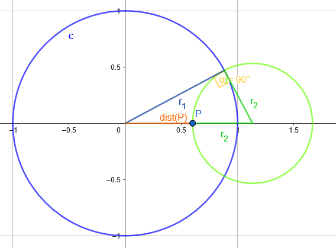
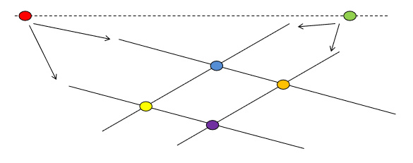

# Geometriák és algebrák:
> A geometriák különböző axiómákra épülnek. 
> Például az Euklidészi síkgeometriában az egyik legfontosabb, hogy egy egyenesre egy külső pontból legfeljebb 1 olyan egyenes húzható, ami nem metszi *(ez a párhuzamos)*

- Ezeknek az axiómáknak a megváltoztatása különböző eredményekhez vezethet. Például a háromszög szögeinek összege mindig:
    - Hiperbolikus geometriában: $< 180°$
    - Euklidészi geometriában: $180°$
    - Gömbi geometriában: $> 180°$

## Görbület
- **Görbék görbülete:** 
    - Egy adott pontra az alábbi két definíció egyikét használhatjuk:
        - A görbület az egysebességű centripetális gyorsulás ($a_{cp} = \frac{v^2}{R}$, egysebességű = a sebesség nagysága állandó)
        - A simuló kör sugarának reciproka
    - 
    - *($\kappa = \frac{1}{r} = \frac{v^2}{r}$)*
    
- **Gauss görbület:**
    - Egy felület (mondjuk henger) görbületét szeretnénk meghatározni egy adott pontban.
    *(Ebben a pontban a felületnek van egy normálvektora, ami merőleges a felület síkjára)*. 
    - Ekkor az alakzatot a felvághatjuk síkokkal *(amik a pontot metszik és a normálvektorral párhuzamosak)*
    - Azek a síkok bármerre állhatnak és a felületet ahogy metszik, úgy egy görbét határoznak meg.
    Az így kapott görbék közül van 2, ahol az egyiknél minimális a görbület, a másiknál maximális. Ezek a metszési irányok egymásra merőlegesek *(ezek a principális / főgörbületi irányok)*
    - Az itt található görbületek szorzata a Gauss-görbület
    - 
- [*Részletesebben*](https://youtu.be/0ZV4TjgI424?t=621)
*(a diasorokon voltak még további alakzatok, ezeken érdemes ezt végig gondolni, a legfontosabb, hogy a normállal mindig párhuzamosak ezek a metszések)*

## Gömbi geometria
- Gömb egyenlete: $x^2 + y^2 + z^2 = R^2 = \frac{1}{K}$
- Itt a görbület állandóan pozitív, az egyenesek is görbék
- Fontos változás:
    - Két pont nem mindig határoz meg egy egyenest egyértelműen
    - Két egyenes mindig 2 pontban metszi egymást
    - Itt 0 darab nem metsző egyenes van (még a párhuzamosok is metszik egymást)
- **Főkör:** 2 pont és a gömb közepe meghatároz egy síkot. A kör, ami a sík és gömb metszésével jön létre a főkör
*(Nem mindig lehet egyértelműen meghatározni, pl. Északi sark, Déli sark, Origó pontokkal végtelensok sík van)*
- Gömbi geometriában a legrövidebb út két pont között mindig a főkörön van
- **Elliptikus geometria:** olyan geometria, ahol az átellenes pontok egynek számítanak

- **Gömbök vetítése:**
    

    1. Középpontos vetítés: 
        - csak a felső gömböt
        - egyenes tartó
        - nem kör, szög és távoltástartó
    2. Sztereografikus vetítés:
        - a déli pólus kivételével mindent
        - nem egyenestartó
        - kör és szögtartó, de nem távolságtartó

- **Mercator térkép:** hengerre vetít a gömb középpontból, de emiatt megnyúlik. 
    - Szögtartó
    - Nem távolságtartó

- **Számolások gömbi geometriánál:**
    - A görbület: $\kappa = 1/R^2$ <!--ez elég triviális-->
    - Távolság: $R \theta = \theta / \sqrt{\kappa}$
    *(ez egy körív, ahol 2 pont között $\theta$ szög van - radiánban)*
    - Kör kerülete: 
    
    - Háromszögek:
        - $a^2 + b^2 > c^2$
        - $T = (\alpha + \beta + \gamma - \pi) / \kappa$

## Hiperbolikus geometria
- Hiperboloid egyenlete: $x^2 + y^2 - z^2 = -R^2 = \frac{1}{\kappa}$
    - *Ez levezethető komplex számmal is $(iR)^2$*
- Itt a görbület állandóan negetív
- Fontos változások:
    - Egy egyenesre egy külső ponból több nem metsző egyenes húzható
- Hiperbolikus terek vetítése egy diszkre:

- *Emlékeztető a 3. háziból - 2 kör merőleges:*

### Minkowski tér
- A háromdimenziós teret kiterjesztjük egy negyedik dimenzióval, ami az idő
- Itt nem pontok, hanem események vannak jelen
    - *Mert ugyanaz a hely szerepelhet kétszer, de különböző időpontokban más-más esemény közben van*
- Ebben a rendszerben a távolságot úgy kell érteni, hogy $x_1$ helyről $t$ idő alatt egy hatás elér-e egy $x_2$ helyre

#### Projektív geometria
> a GPU mindegyik geometriát támogatja, de projektív geometriában gondolkodik

- Euklideszi geometriában nem beszélhetünk végtelenről, viszont a projektív geometriában létezik.
- Fontos változás:
    - Itt két egyenes pontosan egy pontban metszi egymást 
    *(vagy 1 pontban metszenek, vagy a végtelenben. Ha azon gondolkodnál, hogy de balra és jobbra is van végtelen, az ne aggasszon, mert az a pont jobbra és balra ugyanaz a végtelen)*
- *Ez a rendszer nem metrikus, mert nem lehet pl. távolságról beszélni, hiszen ha a végtelen is része, akkor ami végtelen távol van, azt nem lehet számításba venni*
- Nincsenek olyan koordináta rendszerek, amik távolságokat használnak *(fentebb említett ok miatt)* - Vagyis Descartes és Polár koordinátarendszerek nem használhatók
    - 
    - Itt a zöld és a piros pontok az **ideális pontok** ahol az egyenesek metszenék egymást. 
    Mivel a geometriánkban végtelen sok egyenes lehet, ezért a piros és zöld pontok között végtelen sok ideális pont lehet még. 
- *Ha átgondoljuk, hogy van végtelen sok ideális pont, amik jobbra és balra nézve is önmaguk képviselik, akkor láthatjuk, hogy ez egy elliptikus geometria (fogalma fentebb) csak szög és távolság fogalom nélkül*

## Síkgeometria
- 2 dimenzióról beszélünk ($x$,$y$ koordinátákkal), amihez felveszünk egy harmadik tulajdonságot ($w$-t). Így képesek vagyunk Euklideszi és Projektív geometriát is mejeleníteni.
    - Projektív esetben mondjuk azt, hogy csak az egyenes, ami átmegy az origón. 
    
    Vagyis akkor van egy bizonyos végtelen pontunk, ahol minden egyenes találkozik.
    Ekkor minden pont végtelen távoli, ahol $w$ = 0, hiszen bármely egyenes, ami rajtuk átmegy, az az origón is. Vagyis az egyenesük párhuzamos lesz a (kék) síkkal, amit látunk.
- Ambiens tér ([ambient space](https://en.wikipedia.org/wiki/Ambient_space_(mathematics))): egy olyan tér, ami valamilyen objektumot körbevesz
    - Ezek a befoglaló terek nekünk az ábrázolást segítik. Ezért az ambiens vektorokat képesnek kell lennünk összeadni és skálázni.
    - Ebből következik, hogy $w=0$ a vektoroknál és $w=1$ a pontoknál (egyéb $w$-k se nem pontok, se nem vektorok).
- **Skaláris szorzás:**
    - $a_1 \cdot a_2 = |a_1| |a_2| \cos(\alpha)$
    - Euklideszi geometriában: $a_1 \cdot a_2 = x_1 x_2 + y_1 y_2 + z_1 z_2$
    - Nem asszociatív művelet (számít a szorzások sorrendje)
    $(u \cdot v) \cdot w \neq u \cdot (v \cdot w)$
- **Vektoriális szorzás (kereszt szorzás):**
    - $|a_1 \times a_2 | = |a_1| |a_2| \sin(\theta)$
    - $c_x = a_y b_z - a_z b_y$
      $c_y = a_z b_x - a_x b_z$
      $c_z = a_x b_y - a_y b_x$
    - Ez sem asszociatív
- **Vektorok tulajdonságai:**
    - Két pont különbsége vektor
    - Az ambiens térnek elemei $[x,y,0]$
    - Hossz: $|v| = \sqrt{v \cdot v}$
    - Merőlegesség: $u \perp v$ ha $u \cdot v = 0$
        - Minden vektorra végtelensok merőleges van $\lambda [y, -x, 0]$
    - Párhuzamosság: $u \parallel v$ ha $u = \lambda v$
        - Minden vektorra végtelensok párhuzamos van $\lambda [x, y, 0]$
- **Egyenesek:**
    - Parametrikus egynlet: $r(t) = p + vt$
    *(vagyis p pontból t ideje indultunk el v vektorrala - ha végig gondolod ez valóban pontok gyűjteménye, hiszen $w=1$ mindig)*
    - Implicit egyenlet: $n \cdot (r - p) = 0$
        - Ahol $r$ egyenest határozzuk meg $p$ pontja és $n$ normálvektora segítségével
        $r(x,y) \Rightarrow [n_x, n_y, 0] \cdot [x - p_x, y - p_y, 0] = 0$
        Vagyis: $n_x x + n_y y + d = 0$
        - Ha $r$ helyére behelyettesítünk, akkor könnyen eldönthetjük, hogy egy pont rajta van-e
        *(egyébként pont azért implicit egyenlet, mert az r egyenest nem fejezzük ki explicit)*

## Térgeometria
- A cél, hogy minden legyen ugyanolyan mint a síknál, csak mostmár egyel magasabb dimenzióban
- vektor: $[x,y,z,0]$, pont: $[x,y,z,1]$
- a korábban megbeszélt műveletek nem válltoznak 
- az egynes egynletek továbbra is megmaradnak
- **Sík egyenlete:** 
    - Explicit: $r(u,v) = p + au + bv \qquad$ (ahol $a, b$ nem párhuzamos vektorok)
    - Implicit: $n \cdot (r-p) = 0 \qquad \qquad$ (ahol $n$ normálvektor merőleges $a, b$ vektorokra)
    Vagyis: $n_x x + n_y y + n_z z + d = 0$

## Homogén koordináták
- Homogén koordináták: ahol +1 dimenzióban megadunk egy értéket ami jelöli, hogy ideális pontról beszélünk-e
- Ezt valamennyire láttuk, a fontos különbség, hogy a $w$ távolság jelölést is segíti nekünk
    - $[2x,2y,1] = [x,y,\frac{1}{2}]$
    mert ha osztjuk a $w$ koordinátájával, akkor $[x,y,\frac{1}{2}] / \frac{1}{2} = [2x,2y,1]$
- Az egyenes implicit egyenlete:
    - $[X(t),Y(t),w(t)] = [X_1,Y_1,w_1](1-t) + [X_2, Y_2,w_2] \cdot t$
    - Ez 2 különböző pontból segít meghatározni az egyenest
    - *De mégis miért jobb ez? Mert ez magától kezeli a végtelen pontokat a Descartes koordinátákkal szemben*
    $n_x X / w + n_y Y / w + d = 0 \qquad w \neq 0$
    $n_x X + n_y Y + dw = 0\qquad w \neq 0$
- Hogyan csináljunk Euklidésziből homogént: 
    - Fogjuk a pontokat és mindenhol kibővítjük a pontok koordinátáit $w = 1$-el.

---

# Kvíz

> 1\. Milyen messze van az $(-5, 4)$ pont a $3x + 4y + 5 = 0$ implicit egyenletű egyenestől

**Középiskolában tanultakkal megoldható:** 
*(ha van gyorsabb megoldás javítsátok)*

1. Egyenesre normálvektort állítasz
$(3, 4) \Rightarrow (4, -3)$
2. Normálvektorral új egyenes, ami átmegy a ponton
$4 * (-5) + (-3) * 4 + d = 0$
$d = 32 \Rightarrow 4x -3y + 32 = 0$
3. Az egyenesek metszéspontjának megtalálása
$4x -3y + 32 = 0 \text{ és } 3x + 4y + 5 = 0$ 
*(Mondjuk hozzáadom $\frac{3}{4}$-szer az másodikat az elsőhöz, de sok jó út van)*
$\frac{25}{4} x + \frac{133}{4} = 0 \Rightarrow x = \frac{-143}{25}$
$\Rightarrow y = \frac{76}{25}$
4. Metszés pont és eredeti pont távolságának kiszámítása
$d = \sqrt{(((-5) - (\frac{-143}{25}))^2 + (4 - \frac{76}{25})^2)} = 1.2$

**Alternatív megoldás:** 

- képletet használunk $d = n \cdot (r-p)$, ahol $r$ az egyenes és $n$ egység hosszú    
    1. a normálvektort egységhosszúvá tesszük 
    $n = (3, 4) \Rightarrow n = \frac{(3, 4)}{\sqrt{3^2 + 4^2}} = (\frac{3}{5}, \frac{4}{5})$
    *(figyeljünk, implicit egyenletnél a koordináta sorrendre)*
    
    2. az $r-p$ kivonást elvégzzük: *(ez egy vektor r és p között)*
    A számításához használhatjuk az $r$ bármely pontját *(én az x=0 pontot választottam)* 
    $R = (0, \frac{-5}{4})$ 
    Ekkor $r - p = (0, \frac{-5}{4}) - (-5, 4) = (5, -\frac{21}{4})$
    3. elvégezzük a skaláris szorzást: 
    $n \cdot (r-p) = (\frac{3}{5}, \frac{4}{5}) \cdot (5, -\frac{21}{4}) = \frac{3}{5} * 5 + \frac{4}{5} *  -\frac{21}{4} = 3 - \frac{21}{5} = -1.2$
    4. De miért negatív?
    Ez egy előjeles távolság, szóval függ attól, hogy a p pont az egyenes melyik oldalán van
    Vagyis, ha abszolútértékkel használjuk, akkor helyes megoldást kapunk
    $|-1.2| = 1.2$
    :cake:
 
[(a képlet kb így jön ki)](https://brilliant.org/wiki/dot-product-distance-between-point-and-a-line/)

---
> 2\. Tekintsünk 2 várost "A"-t és "B"-t az északi szélesség (lattitude) 45 fokán. Az "A" város keleti hosszúsága 165 fok, a "B" város keleti hosszúsága 50 fok.
> Mekkora az A és B város távolsága km-ben, ha a föld sugarát 6000 km-nek vesszük?

*(Ilyenkor nem használhatjuk a Távolság: $R \theta$ képletet direktben, mert x és y tengelyen is van bezárt szög és ezért vagy a sugár méretét kéne arányosítani, vagy a szöget kéne újraszámolni)*

Keressük tehát azt a $\theta$ szöget, melyet a A és B *(pontosabban a beléjük húzott sugarak)* bezárnak a rajtuk átmenő főkörön.

 
    
 
        Konkrét megoldás:
    

Ellenőrzésre és általános esetre [script](./code/dist.py).

<!-- Ez nem jó. Távolságot a főkörön mérjük, ott a legrövidebb.

Szerencsére volt erre egy másik képlet:
1. 45°-nál mekkora egy kör kerülete: 
$R' =  R * sin(\theta) = 6000 * \sin(45°) \approx 4242.64$
1. Ezen a körön már tudjuk, hogy a közrezárt szög 145-105 = 40 fok:
Ami radiánban: $\theta' = (40/180) * \pi = 0.6981$
$dist = R' * \theta' = 2961.92$
-->

---
> 3\. A gömbi geometriánk Gauss görbülete $0.8$. Mekkora a $0.2$ sugarú kör kerülete ebben a geometriában?

1. Gauss görbületből a gömb sugara:
$K = 1/R^2 \Rightarrow R = 1 / \sqrt{K} = 1 / \sqrt{0.8} \approx 1.12$ 
2. A kör sugara most a gömbön található egyenesben mérve van megadva. *(a korábbi ábrán ez volt $r$)*
$r = R * \theta \Rightarrow \theta = 0.2 / 1.12 \approx 0.18$
3. A kör kerülete pedig:
$2 \pi R \sin(\theta) = 2 \pi * 1.12 * \sin(0.18) = 1.2499$ 
*(ha pontos értékekkel számolunk, ha kerekítve, akkor 1.26 kb)*

---
> 4\. Egy pont koordinátái a t idő alábbi függvényei: x(t) = t*t, y(t) = 1/t mekkora a mozgás sebességének a négyzete 1 sec-ben?

1. A sebesség a mozgás idő szerinti első deriváltja:
$x'(t) = 2t \qquad y'(t) = -1 / t^2$
2. Ezt szeretnénk tudni az 1 időpontban:
$x'(1) = 2 \qquad y'(1) = -1 / 1$
3. Ebből a sebesség:
$v = \sqrt{2^2 + (-1)^2} = \sqrt{5}$
4. Vagyis a sebesség négyzete:
$\sqrt{5}^2 = 5$

---
> 5\. Asszociatív műveletek:
> (x * y) * z = x * (y * z)

- Komplex számok szorzata
- Duális számok szorzata
- Mátrixok szorzata
- Vektorok elemenkénti szorzata
*(ez csak arra ment ki, hogy a vekoriális és a skaláris szorzás ne asszociatív)*

---
> 10\. Kommutatív műveletek:
> a * b = b * a

- Komplex számok szorzata
- Duális számok szorzata
- Vektorok skaláris szorzata
- Vektorok elemenkénti szorzata

---
> 6\. Mi igaz Euklideszi geometriában

- sinh(3x + 4y + 5) = 0 egy egynes *(valóban az)*
- 3x + 4y + 5 = 0 egyenesre merőleges a 4x -3y + 5 = 0
- 3x + 4y + 5 = 0 egyenes megegyezik a -3x -4y - 5 = 0-tel
- 3x + 4y + 5 = 0 egyenes párhuzamos a 9x 3y + 5 = 0-tel *(ráadásul meg is egyeznek)*

---
> 7\. Milyen műveleti eredmények értelmezhetők Euklideszi geometriában?

- Két pont kombinációja *(ha jól gondolom, ez egy egyenes)*
- Két vektor kombinációja
- Két vektor összege
- Vektor szorzása számmal
- Pont és vektor összege

*(pont szorzása vektorral és két pont összege pedig nem létező műveletek)*

---
> 8-9\. Mi igaz a geometriákra

|   | Gömbi | Hiperbolikus |
| - | ----- | ------------ |
| A sík görbülete | Pozitív | Negatív |
| Egyenes a 2 pont közti legrövidebb út | igaz | igaz |
| Háromszög szögeinek összege | > 180° | < 180° |
| A pitagorasz tétel | nem igaz | nem igaz |
| Egyéb | Két különböző egyenes 2 pontban metszi egymást | 1 egyenesre 1-nél több nem metsző egyenes van |

[Következő](2.md)