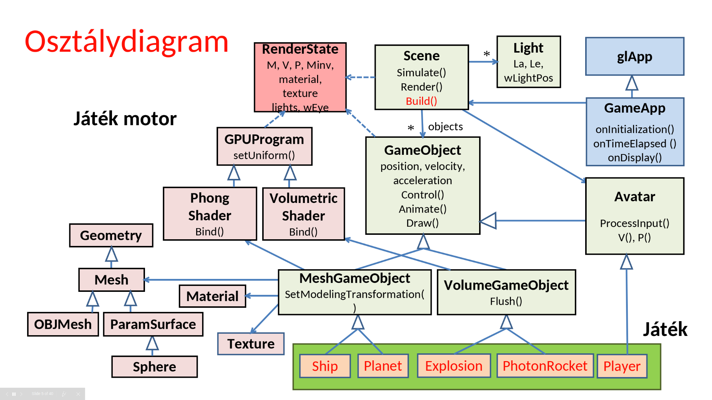
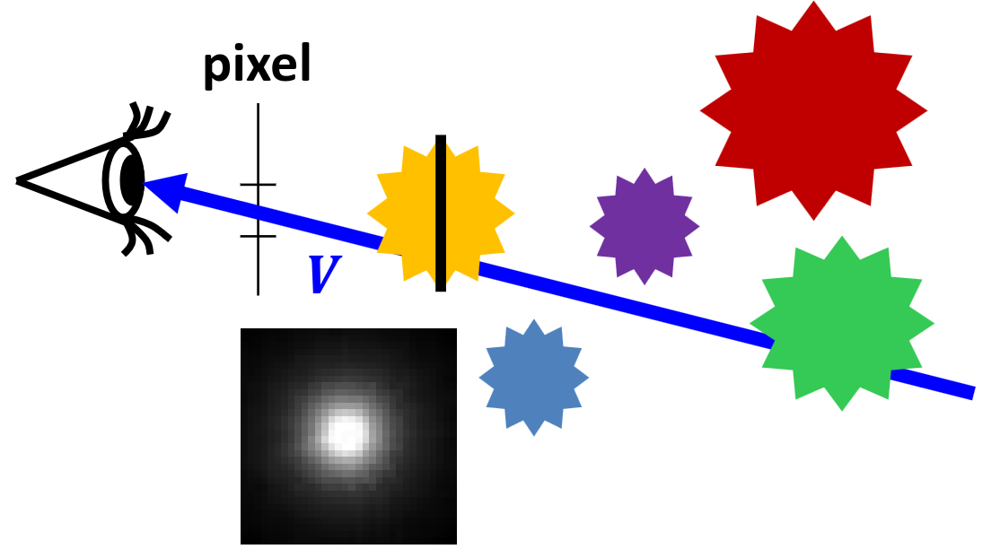
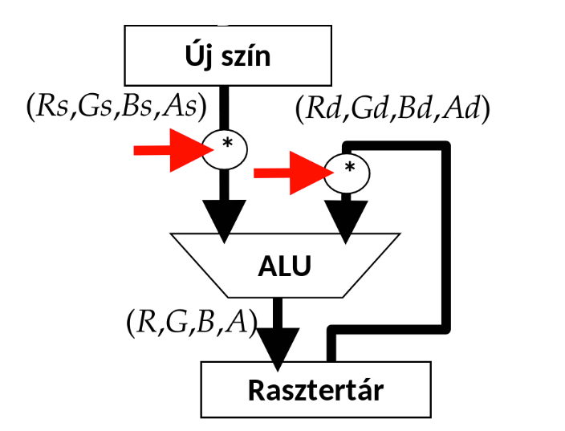
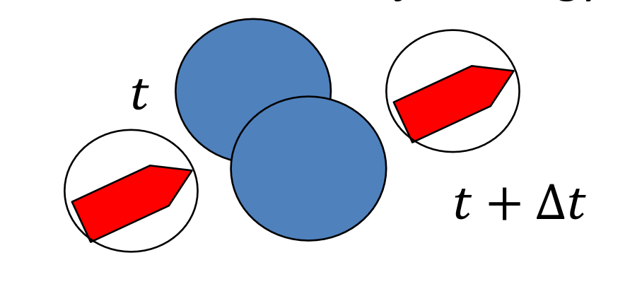
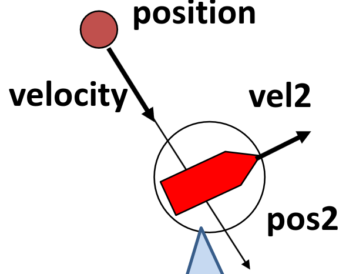

# Játékfejlesztés

## Virtuális valóság

Az egyes játékokban a számítógépünk RAMjában "élnek" a játékobjektumok, de mit is jelent az, hogy "élnek"? A mi esetünkben azt, hogy van állapotuk, és ezt az állapotot tudják változtatni a világ és a többi objektum állapota alapján. Ha minden objektum ezt csinálja, akkor a rendszerünk életre tud kelni. Viszont kell lennie egy kitüntetett objektumnak, ami az állapotát nem csak a többi objektum és a világ alapján változtatja, hanem a külvilág, a játszó ember alapján is. Ez az objektum reprezentál minket a virtuális világban, ez az _avatár_ képvisel minket. Ő a szemünk (az ő szemszögéből látjuk a virtuális világot) és őt vezéreljük, szemben a többi objektummal, akik magukról döntenek.

## Feladatok

- képszintézis az avatár nézőpontjából (a mi esetünkben csak egy darab szemből)
- avatár vezérlése valamilyen beviteli eszközzel (akár többel, legtöbbször keyboard-al)
- intelligens objektumok (AI/állapotgép)
- a fizika világ szimulációja (legtöbbször Newtoni fizika, mert ez az ismerős)

Ezek a feladatok annyira általánosak, hogy szinte minden játéknak a részei, ezért ezeket előre elkészíthetjük egy általános formában, azaz egy keretrendszer (ún. game engine) formájában. A game engine-nek hála nekünk elég csak a játék konkrétumait, működését és kinézetét megadni, leprogramozni.

## Objektum orientáltság

Létre kell hozni az objektumokat, amik a játékban lesznek (`Build()`), viszont ezután el kell dönteni, hogy melyik objektumnak milyen műveletek kellenek. Minden objektum frissíti a saját állapotát (`Control()`), és ténylegesen fel is veszi ezt az új állapotot (`Animate()`, viszont ez még nem jelenik meg grafikusan! Ez egy belső állapotfelvétel.).

!!! info Miért választjuk szét az állapot frissítését, és felvevését?
    A valós világ aszinkron, de a számítógépünk egy szekvenciális szimuláció (gondoljunk csak az órajelre), tehát minden állapotváltozást csak egymás után tud szimulálni. Ha lenne 100 objektumunk, és ebből az egyik változna, akkor ő neki kell tudnia az összes többi objektum állapotát, hogy el tudja dönteni, hogy ő milyet kell felvegyen. Itt még nincsen semmi baj, viszont ha ezt rögtön fel is veszi, és a második objektum is meg akar változni, akkor gondba ütközünk: amikor a második objektum körbenéz, akkor ő 98 darab "régi" állapotban lévő objektumot lát, és 1 olyat, ami már egy új állapotban van. A harmadik objektum már két darab "új" állapotú objektumot látna, és a végére amikor az utolsó objektum akarná frissíteni az állapotát, már minden más objektum valami teljesen más állapotot vett fel, mint amikor ő állapotot akart frissíteni. A való világ persze nem így működik, szóval először minden objektum meghatározza, hogy mi lesz a következő állapota, és mindenki egyszerre veszi ezeket fel, amikor már senki sem számolja a saját állapotát a többiek állapota alapján.

Az új állapotot meg is kell grafikusan jeleníteni (`Draw()`). Az avatár egy speciális objektum, tehát az ő esetében kell egy módszer arra, hogy irányítani tudjuk (`ProcessInput()`), és arra, hogy megmutassuk a felhasználónak, hogy mi a világ jelenlegi állapota (`setCameraTransform()`)



Tekintsünk kicsit mélyebben a `GameObject` osztály implementációjába:

### GameObject

```cpp
struct GameObject {
   vec3  position, velocity, acceleration; // fizikai animációhoz
   bool  alive = true;                     // él még
   float boundingRadius = 0;               // ütközésdetektáláshoz
 
   virtual void Control(float tstart, float tend, Scene * scene) { } 
   bool Collide(GameObject * obj);      // diszkrét ütközésdetektálás
   bool Collide(GameObject * obj, float& tHit, vec3& wHit); // folytonos ütközés 
   virtual void Animate(float tstart, float tend) { // állapotváltás
      float dt = tend - tstart;
      position += velocity * dt;        // Euler-integrálás
      velocity += acceleration * dt;
   }
   virtual void Draw(RenderState state) { }  // rajzolás
   virtual void Kill() { alive = false; }
};
```

```cpp
struct MeshGameObject : GameObject {
   static PhongShader* shader;     // árnyalóprogram
   Texture* texture = nullptr;
   Material* material = nullptr;
   Mesh* geometry = nullptr;
public:
   virtual void SetModelingTransformation(RenderState& state) {
      state.M = translate(position); state.Minv = translate(-position);
   }
   virtual void Draw(RenderState state) {
      SetModelingTransformation(state);  // modellezési transzformáció
      state.material = material; state.texture = texture;
      shader->Bind(state); // transzformációk, anyag, textúra a GPU-ra
      geometry->Draw();    // az objektum végigmegy a szerelőszalagon
   }
};
```

A játékunk érzékelhető része `GameObject`-ekből áll, majdnem minden amit megjelenítünk egy `GameObject` (vagy annak leszármazottja, lásd fentebb a `MeshGameObject`-et). Ezek tárolás egy fa struktúrát követ, a gyökere a `Scene`, az összes többi csúcsban `GameObject`ek vannak, és ők is tartalmazhatnak más `GameObject`eket (`children`).

Egy `GameObject` tudja magáról a megjelenítéséhez szükséges tulajdonságait és alakját. A kirajzoláskor ezeket beállítja a `RenderState`-be, mielőtt meghívná a `geometry`-ájára a kirajzolást. Fontos megemlíteni hogy az `M` transzformációs mátrixot (és inverzét) nem felülírja, hanem megszorozza az eddigi állapotot. Ez azért van így, mert a `GameObject`ek `child`-jainak helyzetét a `parent`-hez relatívan értelmezzük.

!!! info Példa a helyzet relatív értelmezéséhez
    A `Scene` objektum indul a $(0, 0, 0)$ origó középpontból, a karakterünket direktben tartalmazza, melynek koordinátája egyenlő lesz a világbeli koordinátáival, mondjuk $(1, 1, 1)$. A karakter egyik `child` objektuma a kalapja, ennek koordinátái a (0, 0, 2), relatíven értelmezzük, tehát a karakterünk origójától lesz ilyen távolságban. Ha az ezekhez tartozó mátrixokat egymás után összeszorozzuk, kapjuk meg a `child` `GameObject`-ek tényleges világbeli pozícióját, itt ez most $(1, 1, 3)$ lenne.

### Szimulációs hurok (Game loop)

```cpp
void onTimeElapsed(float tstart, float tend) {
      scene->Simulate(tstart, tend);
      refreshScreen();
   }
```

Amikor a programunk éppen nem renderel, megmérjük az előző `Simulate` óta eltelt időt, majd meghívjuk a szimuláló függvényt:

```cpp
void Scene::Simulate(float tstart, float tend) {
   avatar->ProcessInput();    
   const float dt = 0.01f; // dt kicsi
   for (float t = tstart; t < tend; t += dt) {
      float Dt = fmin(dt, tend - t);
      for (auto* obj : objects) obj->Control(t, t+Dt, this); 
      for (auto* obj : objects) obj->Animate(t, t+Dt); 
   }
```

Mi itt a `Dt`? Ez az ún. _delta time_, ami méri két kirajzolt képkocka (azaz két szimulációs "update tick") közti időt. Ha az eltelt idő (`te - ts`) nagyon nagy, az szimulációs anomáliákhoz (pl. hibás ütközés, lásd [Ütközések](10.md/#ütközések)) vezethet, ezért bevezetünk egy maximum delta time változót (`dt`). Ha `te - ts` túllépné ezt a maximumot, akkor ezt az időegységet a biztonság kedvéért kisebb szeletekre bontjuk, kis lépésekben szimuláljuk le.

A szimulálás után pedig kirendereljük a jelenlegi állapotot:

```cpp
void onDisplay() {
      glViewport(0, 0, winWidth, winHeight);
      glClear(GL_COLOR_BUFFER_BIT | GL_DEPTH_BUFFER_BIT);
      scene->Render();
   }
```

ahol a `Render()`:

```cpp
void Scene::Render() {
   RenderState state;
   state.wEye = avatar->position; state.light = light;
   state.V = avatar->V(); state.P = avatar->P();
   for (auto* obj : objects) obj->Draw(state);
   VolumetricGameObject::Flush(state);
}

```

Figyeljük meg, hogy új `RenderState`t hozunk létre, `M` és `Minv` az egységmátrix lesznek, azaz nem nyújtunk, nem forgatunk, nem méretezünk.

## Volumetric shader



Kiterjedt, de nem egyértelműen meghatározható geometriájú térfogatok ("fuzzy"). Ezeknél vagy nem definiálható egy éles határ, vagy túlságosan számításigényes lenne, minimális előnyökért. Ezek tipikusan valamilyen szinten átlátszóak, a sűrűségük változó lehet. Kicsi pamacsokból rakjuk ezeket össze, ahol a pamacsok méretét, sűrűségét és színét változtatva tudunk elérni egy kívánt összhatást. A pamacs/flötyi (igen, ez a szakszó rá) geometriailag bonyolultnak tűnik, szóval csalunk: feltöltünk egy átlátszó képet a megjeleníteni kívánt pamacsról, és rátextúrázzuk a pamacs objektumokra (`VolumetricGameObject`, lásd alább).

```cpp
struct VolumetricGameObject : GameObject {
   static VolumetricShader* shader;       // árnyalóprogram
   static Volume* volume;                 // az összes pamacs
   static Texture* splatTexture;          // pamacstextúra
   // az összegyűlt pamacsok lefényképezése
   static void Flush(RenderState state) {
      glEnable(GL_PROGRAM_POINT_SIZE);
      glEnable(GL_BLEND); // kompozitálás engedélyezése
      glBlendFunc(GL_SRC_ALPHA, GL_ONE_MINUS_SRC_ALPHA);
      splatTexture->Bind();
      shader->Bind(state);
      volume->Sort(state.wEye);
      volume->Draw();
      glDisable(GL_BLEND); // kompozitálás tiltása
   }
};
```

Mivel a kép határai átlátszóak, ezért nem lesz pontos határa. Viszont ha egy másik irányból is megnézzük a pamacsot, akkor lebukunk, hiszen a pamacsunk csak szemből néz ki úgy, ahogy akarjuk, hiszen egy képről beszélünk, végtelenül vékony. Viszont ha még egyet csalunk, akkor tudjuk orvosolni a problémát: ha folyton a néző felé forgatjuk a képet, akkor mindig pontosan azt látjuk, amit szeretnénk. Ezzel csak az a probléma, hogy feltűnő lehet, ha csak egy képet használunk, szóval a harmadik csalásunk az, hogy egy kép helyett mondjuk csinálunk 4-8 képet a pamacsunkról, mind különböző szögekben, aztán ezeket elforgatva rárakjuk az objektumunkra. Ha jól csináltuk, akkor már egy egész realisztikus képet kapunk a pamacsunkról.

Vertex shader:

```c
uniform mat4 VP;      
uniform int viewportHeight;
layout(location = 0) in vec3  wPos;           
layout(location = 1) in vec4  color;            
layout(location = 2) in float size;
out vec4 modulated;
void main() {
   gl_Position = VP * vec4(wPos, 1.0f); 
   gl_PointSize = size * viewportHeight / gl_Position.w;
   modulated = color;
}
```

Fragment shader:

```c
uniform sampler2D textMap;
in vec4 modulated;
out vec4 outColor; 
void main() { 
   outColor = texture(textMap, gl_PointCoord.xy) * modulated;
}
```

Ahhoz, hogy az átlátszóság működjön, kicsit kell állítgatni az OpenGL-t is CPU oldalról:

```cpp
glEnable(GL_PROGRAM_POINT_SIZE);
glEnable(GL_BLEND);
glBlendFunc(GL_SRC_ALPHA, 
            GL_ONE_MINUS_SRC_ALPHA);

// VBO feltöltés a világkoord-ban 
// Draw
glDisable(GL_BLEND);
```



### Billboard

Mindig a kamera felé néző téglalap. Régen egy teljes téglalapra tették rá, de az OpenGL-be pontosan a pamacsok miatt behozták azt, hogy egy `Point`-ra is lehet textúrázni, így nem kell négy pontot eltárolni egy pamacsra, hanem elég csak egyet.

```cpp
vec3 w = wEye - pos;        // szem felé mutat
vec3 r = cross(up, w);      // billboard vízszintes (jobb)
vec3 u = cross(r, w);       // billboard függőleges (fel)
r = normalize(r) * size;    // normalizáljuk és beállítjuk a méretet
u = normalize(u) * size;
```

Tehát a transzformációs mátrixa:

$$ \bold{T} =
\begin{bmatrix}
r_x & r_y & r_z & 0 \newline
u_x & u_y & u_z & 0 \newline
0 & 0 & 1 & 0 \newline
pos_x & pos_y & pos_z & 1
\end{bmatrix}
$$

## Avatar

```cpp
struct Avatar : public GameObject {
   vec3  wVup;   
   float fov = M_PI / 2.0f, fp = 0.01f, bp = 100.0f;
   float asp = (float)winWidth / winHeight;

   virtual void ProcessInput() = 0; 
   mat4 V() { return lookAt(position, position + velocity, wVup); }
   mat4 P() { return perspective(fov, asp, fp, bp); }
};
```

A `wVup` lehet egyszerűen `[0, 1, 0]` vagy a pillanatnyi gyorsulásból és a korábbi `wVup` átlagából kaphatjuk meg.

## Keyboard polling

```cpp
bool keys[256]; // is pressed?
void onKeyboard(unsigned char key, int pX, int pY)
{
    keys[key] = true;
}
void onKeyboardUp(unsigned char key, int pX, int pY)
{
    keys[key] = false;
}
```

Egy tömbben tároljuk, hogy éppen mi a billentyűk állása, a fenti két eseményben állítjuk. `Simulate` közben ebből a tömbből polloljuk az állását.

## Euler karakterisztika

Olyan objektumokat szeretnénk felrajzolni, amik a valóságban is létezhetnek (pl. nincsen végtelenül keskeny dolog a valóságban). Ezt úgy érjük el, hogy kiindulunk egy olyan alakzatból, amiről tudjuk, hogy a valóságban is létezhet (például egy kocka, vagy egy téglatest), ezután pedig olyan transzformációkat hajtunk végre rajta, amik "nem rontják el". Az ilyen féle transzformációkra azt mondjuk, hogy az Euler karakterisztika _invariáns_ alattuk. Az Euler karakterisztika az alábbi kifejezés:

$$\text{csúcs} - \text{él} + \text{lap} = \chi$$

ahol $\chi$ a felület topológiájától függ. Poliéderek esetén $\chi = 2$.

## Frenet keret

Egy transzformációval érjük el, hogy a nézőpont/geometria kijelölt "feje" a sebesség irányába nézzen.


<!-- még jó hogy ez is jól le van írva a jegyzetben (: -->

$$M =
\begin{bmatrix}
i' & j' & k' & r \\
0 & 0 & 0 & 1 \\
\end{bmatrix}
$$

### Levezetés

Először kiszámoljuk a **nem ortonormált** (ortonormált = vektorok merőlegesek egymásra és egység hosszúak) formájában:

$j' = v$

$k^* = k'(1-\alpha) + a \cdot \alpha$ 

$i' = j' \times k^*$

ahol $k'$ az előző tickben/állapotan lett meghatározva (kiindulásként lehet például $k' = a$), $\alpha$ pedig egy súlyozási tényező, lehetővé teszi hogy az új és az előző $k'$ előző között egy sima átmenetet biztosítsunk, és véd az $a = 0$ eset ellen is.

Majd **ortogonalizáljuk** (Gram-Schmidt ortogonalizáció):

$j' = v/|v| \quad\qquad$ (normalizáljuk)

$i' = \cfrac{j' \times k^* }{|j' \times k^*|}\quad~~$ (ezt is)

$k' = i' \times j'\qquad~$ (ezt már nem kell, hiszen két normalizált vektort keresztszoroztunk)

Esélyes hogy $a$ és $v$ nincs megadva. $r$ első deriváltja $v$, második deriváltja $a$.

Ez kicsit leegyszerűsítve, $\alpha = 1$ esetben a következő:

$j' = \^v$

$i' = \^v \times \^a$

$k' = \^v \times \^a \times \^v$

## Ütközések

Ütközés szempontjából mindent gömbként kezelünk (vagy belerakjuk az objektumot egy gömbbe, és azok a gömbök ütköznek), és a távolságuk alapján döntjük el, hogy összeérnek-e.

```cpp
bool GameObject::Collide(GameObject * obj) {
   float dist = length(position - obj->position); // távolság
   return (boundingRadius + obj->boundingRadius < dist);
}
```

Probléma: ha az objektum gyors, és/vagy a delta time nagy, akkor átmehetünk az objektumokon anélkül, hogy ütköznénk vele (diszkrét eset).



Megoldás: Folytonos ütközésdetektálás. Egy sugarat bocsátunk ki a mozgatás irányában, megnézzük hogy beleütközik-e valamibe.



A koordinátákat a vizsgált objektumhoz rögzítjük.

```cpp
rel_pos = position - pos2
rel_velocity = velocity - vel2
Ray: rel_pos + rel_velocity * t

if (ray intersects bounding sphere first && tintersect < dt) 
    //collision
```

Bár még mindig nem tökéletes, mivel a mozgatott objektumnak nem vesszük figyelembe a kiterjedését.

## Részecskerendszer (particlesystem)

> ez amúgy egy jó dolog de nem mennék részletekbe, mert aki tudja tudja és valszeg nem lesz a vizsgán
> egy rakás billboard, de egyben kezeljük

Példának vegyünk porszemcséket, amit a szél fúj. Ezt a szelet tekintsük egy erőtérnek.

```text
pos:                pos += velocity * dt
velocity:           velocity += acceleration * dt
acceleration:       acceleration = force / weight
lifetime:           random kezdeti érték
age:                age += dt; if (age > lifetime) Kill();
size, dsize:        size += dsize * dt;
weight, dweight:    weight += dweight * dt
color, dcolor:      color += dcolor * dt
```

---

# Kvíz

!!! question 1\. A virtuális világban egy pontszerű test és egy gömb mozog. A pontszerű test a szimulációs időlépés kezdetén a $(1,2,5)$ pontban van (mértékegység parsec) és $(3,5,2)$ parsec/sec sebességgel halad. A gömb középpontja a szimulációs időlépés kezdetén a $(2,3,7)$ pontban van és $(9,6,2)$ parsec/sec sebességgel halad. Mekkora az a minimális gömbsugár, amely felett a két objektum a dt=100 msec időlépésben az intervallum elején tesztelő diszkrét ütközésdetektálási algoritmus szerint ütközik?

??? tip Megoldás
    Váltsuk át a pontszerű test koordinátáit a gömbhöz relatíven.
    $$p_r = p_p - p_g = (1, 2, 5) - (2, 3, 7) = (-1, -1 -2)$$
    $$v_r = v_p - v_g = (3, 5, 2) - (9, 6, 2) = (-6, -1, 0)$$
    Vegyük észre, hogy a pont egyre csak még inkább távolodni fog a gömbtől, ha ütközést szeretnénk detektálni azt mihamarabb.
    Időlépés intervallum **elején** tesztelő, **diszkrét**
    Magyarán az első teszt $t = 0 \cdot dt$ időben fut le.
    Ekkor a távolságuk $|p_r| = \sqrt{6} \approx 2.45$

---
!!! question 2\. Egy test $3$ darab különálló poliéder részből áll, és egyik rész sem tartalmaz lyukat. A testen összesen $10$ csúcsot és $18$ lapot számoltunk meg. Hány éle van? 

??? tip Megoldás
    <!-- még milyen jó hogy benne van a jegyzetben (: -->
    Euler karakterisztika invariánst felhasználva:
    $$\text{csúcs} - \text{él} + \text{lap} = \chi$$
    poliéderek esetén $\chi = 2$, nekünk $3$ poliéderünk van tehát $\chi = 2 \cdot 3 = 6$
    Behelyettesítve ez
    $$6 = 10 - \text{él} + 18$$
    $$\text{él} = 22$$

---
!!! question 3\. Egy billboard (plakát) referencia helyzetében az origóban van és az $x, y$ síkra fekszik. Adjuk meg a modellezési transzformáció elemeit egy értékes jegyre, ha a
    - a billboard mérete nem változik a transzformáció során
    - a szem a világ $(4,2,7)$ pontjában van
    - a billboard által reprezentált objektum a $(1,2,3)$ pontban van
    - a billboard preferált függőleges iránya a $(0,1,0)$

??? tip Megoldás
    ```text
    vec3 w = wEye - pos;        // szem felé mutat
    vec3 r = cross(w, up);      // billboard vízszintes (jobb)
    vec3 u = cross(r, w);       // billboard függőleges (fel)
    r = normalize(r) * size;    // normalizáljuk és beállítjuk a méretet
    u = normalize(u) * size;
    ```
    Kiszámoljuk $w, r, u$ értékeket:
    $$w = \text{eye} - \text{pos} = (3, 0, 4)$$
    $$r = \text{up} \times w = (4, 0, -3) \rightarrow \^{r} = (-0.8, 0, 0.6)$$
    $$u = r \times w = (0, 25, 0) \rightarrow \^{u} = (0, 1, 0)$$
    Behelyettesítünk:
    $$
    \begin{bmatrix}
    r_x & r_y & r_z & 0 \newline
    u_x & u_y & u_z & 0 \newline
    0 & 0 & 1 & 0 \newline
    pos_x & pos_y & pos_z & 1
    \end{bmatrix} =
    \begin{bmatrix}
    0.8 & 0 & -0.6 & 0 \newline
    0 & 1 & 0 & 0 \newline
    0 & 0 & 1 & 0 \newline
    1 & 2 & 3 & 1
    \end{bmatrix}
    $$

---
!!! question 4\. Egy FPS játékban az avatár pillanatnyi pozíciója $(0, 0, 0)$, sebessége $(6, 8, 0)$, gyorsulása $(12, -9, 0)$. A kamera orientációt a Frenet kerettel állítjuk be. Mi lesz a kamera View transzformációja?
<!-- pov: a jegyzetben fél diában el nem magyarázott dolgot kéne megfejteni :3 -->

??? tip Megoldás
    Nincs mese, ki kell számolni.
    $$r = (0, 0, 0)$$
    $$j' = \^v = (0.6, 0.8, 0)$$
    $$i' = \^v \times \^a = (0.6, 0.8, 0) \times (0.8, -0.6, 0) = (0,0,-1)$$
    $$k' = i' \times j' = (0.8, -0.6, 0)$$
    Ez egy transzformációs mátrix, nem a kamera View transzformációja. Tehát a mátrix:
    $$
    \bold{T}_V =
    \begin{bmatrix}
    1 & 0 & 0 & 0\newline
    0 & 1 & 0 & 0\newline
    0 & 0 & 1 & 0\newline
    -e_x & -e_y & -e_z & 1\newline
    \end{bmatrix}
    \begin{bmatrix}
    u_x & u_y & u_z & 0\newline
    v_x & v_y & v_z & 0\newline
    w_x & w_y & w_z & 0\newline
    0 & 0 & 0 & 1\newline
    \end{bmatrix}^{-1}
    $$
    Ahol:
    $$e = r$$
    $$u = i$$
    $$v = k$$
    $$w = -j$$
    (ugye nem felejtettük el, <!-- az adóbevallási határidő március 18 --> hogy a view $-z$ irányba néz, és azt szeretnénk, hogy a irányába nézzünk)
    Megfeleltetés után, és annak tudatában, hogy a második mátrix ortonormált (tehát inverze önmaga transzponáltja)
    $$
    \begin{bmatrix}
    1 & 0 & 0 & 0\newline
    0 & 1 & 0 & 0\\newline
    0 & 0 & 1 & 0\\newline
    0 & 0 & 0& 1\\newline
    \end{bmatrix}
    \begin{bmatrix}
    0 & 0 & -1 & 0 \\newline
    0.8 & -0.6 & 0 & 0 \\newline
    -0.6 & -0.8 & 0 & 0 \\newline
    0 & 0 & 0 & 1
    \end{bmatrix}^{-1}=
    \begin{bmatrix}
    0 & 0.8 & -0.6 & 0 \\newline
    0 & -0.6 & -0.8 & 0 \\newline
    -1 & 0 & 0 & 0 \\newline
    0 & 0 & 0 & 1 \\newline
    \end{bmatrix}
    $$
    <!-- it makes so much sense :) -->

---
!!! question 5\. Egy játékobjektum orr iránya referencia helyzetben az $y$ tengely, függőleges iránya pedig a $z$ tengely. Az objektum pályája $r(t)=(\cos(t), \sin(t), t)$.
    Adjuk meg a modellezési transzformáció elemeit egy értékes jegyre a $t=\pi/4$-re, ha az objektumot Frenet keret módszerrel animáljuk.
<!-- még egy frenet és nem állok jót magamért -->
??? tip Megoldás
    $$r(t)=(\cos(t), \sin(t), t)$$
    $$v(t) = \.r(t)=(-\sin(t), \cos(t), 1)$$
    $$a(t) = \"r(t)=(-\cos(t), -\sin(t), 0)$$
    Ezek a $t=\frac\pi 4$ helyen:
    $$r(\frac\pi 4) = (\frac{\sqrt{2}} 2, \frac{\sqrt{2}} 2, \frac\pi 4)$$
    $$v(\frac\pi 4) = (-\frac{\sqrt{2}} 2, \frac{\sqrt{2}} 2, 1)$$
    $$a(\frac\pi 4) = (-\frac{\sqrt{2}} 2, -\frac{\sqrt{2}} 2, 0)$$
    És akkor számolunk...
    $$r = (\frac{\sqrt{2}} 2, \frac{\sqrt{2}} 2, \frac\pi 4)$$
    $$j' = \^v = (-\frac 1 2, \frac 1 2, \frac{\sqrt{2}} 2)$$
    $$i' = \^v \times \^a = (\frac 1 2, -\frac 1 2, \frac{\sqrt{2}} 2)$$
    $$k' = i' \times j' = (-\frac{\sqrt{2}} 2, -\frac{\sqrt{2}} 2, 0)$$
    <!-- mire ezt belatekolod gec -->
    Tehát a mátrixunk nem más, mint
    $$M = 
    \begin{bmatrix}
    i' & 0 \\newline
    j' & 0 \\newline
    k' & 0 \\newline
    r  & 1 \\newline
    \end{bmatrix}=
    \begin{bmatrix}
    \frac1 2 & -\frac 1 2 & \frac{\sqrt{2}} 2 & 0 \\newline
    -\frac1 2 & \frac 1 2 & \frac{\sqrt{2}} 2 & 0 \\newline
    -\frac{\sqrt{2}} 2 & -\frac{\sqrt{2}} 2 & 0 & 0 \\newline
    \frac{\sqrt{2}} 2 & \frac{\sqrt{2}} 2 & \frac\pi 4 & 1
    \end{bmatrix}=
    \begin{bmatrix}
    0.5 & -0.5 & 0.7 & 0 \\newline
    -0.5 & 0.5 & 0.7 & 0 \\newline
    -0.7 & -0.7 & 0 & 0 \\newline
    0.7 & 0.7 & 0.8 & 1
    \end{bmatrix}
    $$

---
!!! question 6\. Az alábbi programsorok egy szimulációs hurkot (game loop) valósítanak meg, de nem jól működik. Válassza ki a hibás sorokat:
    ```cpp
    void onIdle ( ) {   // idle call back
    1)  float tend = 0;
    2)  float tstart = tend;
    3)  tend = glutGet(GLUT_ELAPSED_TIME)/1000;
    4)  avatar->ProcessInput( );
    5)  for(float t = tstart; t < tend; t += dt) {
    6)      float Dt = min(dt, tend - t);
    7)      for (GameObject * obj : objects) obj->Control(dt);
    8)      for (GameObject * obj : objects) obj->Animate(dt);
        }
    9)   onDisplay();
    }
    ```

??? tip Megoldás
    Hibás sorok:$\newline$
    - 1: `tend` vagy `static`, vagy a függvényen kívül kell léteznie, nem nullázhatjuk mindig $\newline$
    - 3: nem kell leosztanunk milliszekundumra $\newline$
    - 8-9: először animálunk, utána irányítunk $\newline$

---
!!! question 7\. Mely problémák megoldásánál használnak Gram-Schmidt ortogonalizációt?

??? tip Megoldás
    - [x] Billboard (plakát)
    - [x] Frenet keret
    - [x] 3D kamera transzformáció
    - [ ] Fizikai animáció
    - [ ] 2D kamera transzformáció

---
!!! question 8\. Egy kockát két szinten Catmull-Clark algoritmussal felosztunk. Hány háromszög keletkezik?

??? tip Megoldás
    Catmull-Clark algoritmusnál $1$ négyszögből csinálunk $4$-et. $\newline$ 
    Ezt kétszer is megcsináljuk: $6 \cdot 4 \cdot 4 = 96$ négyszög, ami kétszer ennyi háromszög, azaz $192$.

<!-- i can finally krill myself -->

[Előző](./9.md)

[Következő](./11.md)