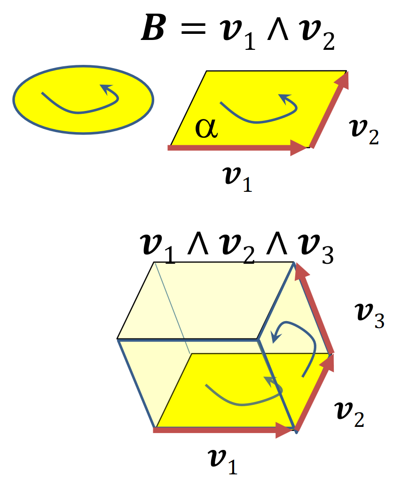
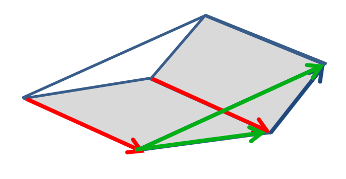
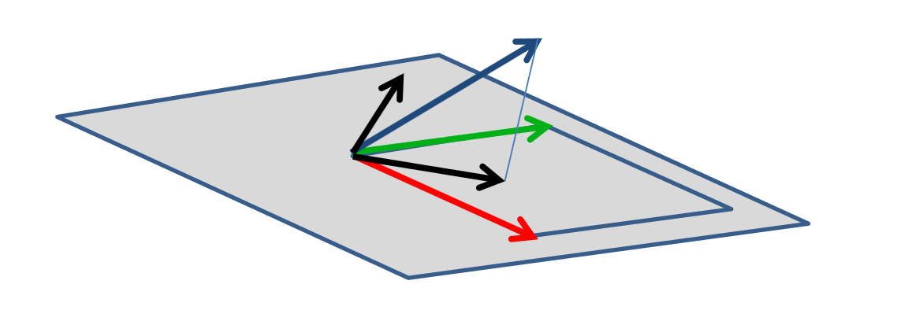
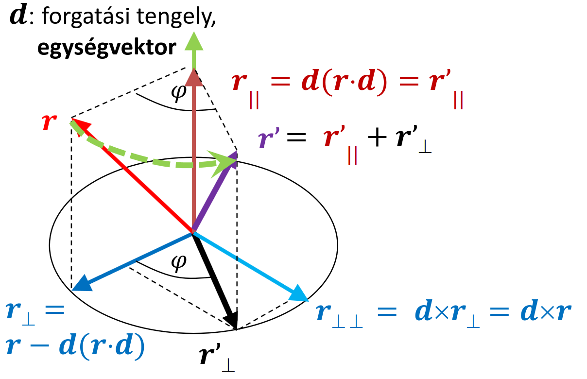

<!-- vektor gameplay vs lore -->

# Vektorháború <!-- vektorbékét! -->

## 2D geometria = vektor algebra
- koordinátákkal számolható, de szerkeszthető is (tenzor)
- pont: $p = [x, y, 1]$
- vektor: $v = [x, y, 0]$
- eltolás: $p' = p + v$ *(Invertálható, van kivonás)*
- eltolás, forgatás, skálázás:
    $[x', y', 1] = [x, y, 1] \begin{bmatrix}
    a & e & 0\\
    b & f & 0\\
    c & d & 0\\
    \end{bmatrix}$

- nincs rendes szorzás
    - skaláris szorzás *(dot product)*
        - $v \cdot a = b \stackrel{def}{\implies} |v||a|\cos\alpha = b$
        - az eredmény egy skalár ($v$-nek $a$-ra vett vetületének hossza)
        - nem asszociatív
        - kommutatív (szimmetrikus)
        - disztibutív
        - nem invertálható

    - vektorális szorzás *(cross product)*
        - $v \times a = b \stackrel{def}{\implies} |v||a|\sin\alpha = |b|$ *(és $b$ merőleges mindkét vektorra + jobbkézszabály)*
        - csak 3D-ben 2 változós!
        - nem asszociatív
        - antikommutatív (ellentétes előjel)
        - disztributív
        - nem invertálható

    - külső szorzat (wedge product)
        - $v_1 \wedge v_2$
        - >ugyan úgy számolod ki, mint a kersztszorzást, de nem ugyan azt jelenti, nem használható ugyan úgy
        - def.: $|v_1 \wedge v_2| = |v_1| |v_2| \sin \alpha$
        - jelentése: irányított terület/térfogat
        
        itt $B$ egy multivektor (azon belül is egy bivektor?)
        - asszociatív
        - antikommutatív
        - disztributív

### Multivektor
- $V = s + v + B$ 
*(térfogat = skalár + vektor + bivektor, de ez csak egy példa, hogy miből állhat egy multivektor)*
- műveletek bivektorokkal
    - skalárral szorzás: triviális
    - összeadás: 
    komponensenként adjuk össze
    <!-- szeretem amikor el van magyarázva -->
    - belső szorzás (skaláris): 
    $= s_1 \cdot s_2 + v_1 \cdot v_2$
    <!-- v1 ultrakil --> 

## 2D geometria = komplex szám
- pont: $z_p = x_p + iy_p = Re^{i\alpha} = R \cos\alpha + iR \sin\alpha$
- eltolás $z_t = x_t + iy_p$-vel:

    $$\boxed{ {z_p}' = z_p + z_t}$$

- irányfüggetlen skálázás $z_s = s$-sel

    $$\boxed{ {z_p}' = z_p \cdot z_s}$$

- forgatva nyújtás $z_r = x_r + iy_r = se^{i\varphi}$-vel

    $$\boxed{ {z_p}' = z_p \cdot z_r = Rs \cdot e^{i(\varphi + \alpha)}}$$

- forgatás = előző, csak egység abszolút értékű komplex számmal ($s = 1$) 
<!-- és forgatás xddddddddd -->

## Geometria 3D-ben
- eltolás (összeadás) és skálázás (skalárral szorzás) tetszőleges dimenzióban általánosítható
- forgatás: lineáris művelet, tehát kell legyen egy $r' = R(r)$-hez tartozó mátrix

$x'i + y'j + z'k = R(x + y + z) = xR(i) + yR(j) + zR(k)$

$[x', y', z'] = [x, y, z]
\begin{bmatrix}
R(i)_x & R(i)_y & R(i)_z \newline
R(j)_x & R(j)_y & R(j)_z \newline
R(k)_x & R(k)_y & R(k)_z \newline
\end{bmatrix}
$

## Rodrigues formula
Origón átmenő $d$ tengely körüli forgatás.


Magyarázat:

- $d$ (zöld): forgatási tengely
- $r$ (piros): forgatni kívánt vektor
- $r_\parallel = r'_\parallel = d(r \cdot d)$ (barna): $d$-vel párhuzamos komponense $r$ és $r'$-nek (egyenlők)
- $r_\perp = r - d(r \cdot d)$ (sötétkék): $r-r_\parallel$, azaz $r$-ből kivonjuk a párhuzamos komponenst, ami marad az már biztosan merőleges
- $r_{\perp\perp} = d \times r_\perp = d \times r$ (világoskék): $d$-re és $r_{(\perp)}$-re merőleges

- $r' = r'_\parallel + r'_\perp$ (lila): $r$ elforgatva, a párhuzamos és merőleges komponensek összege 

    A merőleges komponenst pedig $r_\perp$, $r_{\perp\perp}$ és szögfüggvények segítségével az alábbi módon kaphatjuk meg:

- $r'_\perp = r_\perp \cos\varphi + r_{\perp\perp} \sin\varphi$


## Komplex számok 3D-ben
- $z = x + yi + zj$ *(tippre ez 2 különböző $z$)*
- összeadásnál és skálázásnál beláttuk, hogy dimenziófüggetlen
- forgatás mint szorzás?
    - asszociatív, összeadásra disztributív
    - nem kommutatív: 
    *(más sorrendben forgatunk $\rightarrow$ más eredmény)*
    - invertálható

## Hamilton: kvaternió (4D komplex szám)
- $q = [s, x, y, z] = [s, d] = s + xi + yj + zk$
- összeadás:
    $q_1 + q_2 = [s_1 + s_2, x_1 + x_2, y_1 + y_2, z_1 + z_2]$
- skalárral szorzás:
    $aq = qa = [as, ax, ay, az]$
- abszolút érték
    $|q| = \sqrt{s^2 + x^2 + y^2 + z^2}$

- **szorzás** (fr this time):
    
    $\boxed{[s_1, d_1]\cdot[s_2, d_2] = [s_1s_2 - d_1 \cdot d_2, s_1 \cdot d_2 + s_2 \cdot d_1 + d_1 \times d_2]}$

    $\boxed{i^2 = j^2 = k^2 = ijk = -1}$
    
    $ij = k, ~~ ji = -k$
    
    $jk = i, ~~ kj = -i$
    
    $ki = j, ~~ ik = -j$
    
    - asszociatív
    - nem kommutatív
    - összeadásra disztributív

- van egységelem: $[1, 0, 0, 0]$
- van **inverz**: $q^{-1} = [s, -d]/|q|^2, q^{-1} \cdot q = q \cdot q^{-1} = [1, 0, 0, 0]$

- **forgatás** origón átmenő $d$ tengely körül:
    - $q = [\cos(\alpha/2), d \sin(\alpha/2)]$, $d$ pedig normalizált azaz $|d| = 1$
    - $q \cdot [0, u] \cdot q^{-1} = [0, v]$, $v$ az $u$ elforgatottja a $d$ körül $\alpha$-val 
    > - kvaterniót csak kvaternióval tudunk szorozni, tehát a valós részt 0-nak vesszük és mellé rakjuk $u$-t
    > - kétszer is szorzunk, ezért használunk csak $\alpha/2$-t
    - [egy nagyon jó interaktív videó a kvaterniókról, ami segít elképzelni (3b1b)](https://eater.net/quaternions/video/intro)

## Implementáció
```cpp
struct vec4
{
    float x, y, z, w; // w = s, ijk = xyz megefeleltetés!
    ...
};
vec4 qmul(vec4 q1, vec4 q2)
{   // kvaternió szorzás
    vec3 d1(q1.x, q1.y, q1.z), d2(q2.x, q2.y, q2.z);
    return vec4(d2 * q1.w + d1 * q2.w + cross(d1, d2),
                q1.w * q2.w - dot(d1, d2));
}
vec4 quaternion(float ang, vec3 axis)
{   // konstruálás
    vec3 d = normalize(axis) * sinf(ang / 2);
    return vec4(d.x, d.y, d.z, cosf(ang / 2));
}
vec3 Rotate(vec3 u, vec4 q)
{
    vec4 qinv(-q.x, -q.y, -q.z, q.w); // conjugate
    vec4 qr = qmul(qmul(q, vec4(u.x, u.y, u.z, 0)), qinv);
    return vec3(qr.x, qr.y, qr.z);
}
```

### GPU shaderprogram
```c
uniform vec4 q; // quaternion as uniform variable
in vec3 u;      // Varying input: vertex
vec4 qmul(vec4 q1, vec4 q2)
{
    vec3 d1 = q1.xyz, d2 = q2.xyz;
    return vec4(d2 * q1.w + d1 * q2.w + cross(d1, d2),
                q1.w * q2.w - dot(d1, d2));
}
void main()
{                                  // vertex shader program
    vec4 qinv = vec4(-q.xyz, q.w); // conjugate
    vec3 v = qmul(qmul(q, vec4(u, 0)), qinv).xyz;
    gl_Position = vec4(v, 1);
}
```

# Automatikus deriválás

## Hogyan **NE**
$f'(x) = \cfrac{f(x + \Delta) - f(x)}{\Delta}$

Bajok:

- kivonás miatt értékes jegyeket veszítünk
- túl kicsi $\Delta \rightarrow$ zajos 
- túl nagy $\Delta \rightarrow$ pontatlan

## Clifford algebra
> azért mi mégis csak szeretnénk c++-ban valahogy deriválni

### Hiperszám
$z = x + iy$, ahol

- $i^2 = -1$: komplex szám
- $i^2 = 1$: hiperbolikus szám
- $i^2 = 0$: **duális** szám

### Duális számok ($i^2 = 0$)
- összeadás, kivonás:
    
    $(x_1 + y_1i) \pm (x_2+y_2i) = (x_1 \pm x_2) + (y_1 \pm y_2)i$
    
- szorzás:
    
    $(x_1+y_1i) \cdot (x_2+y_2i) = (x_1x_2) + (x_1y_2+y_1x_2)i +\xcancel{(y_1y_2)i^2}$
    
- hányados:
    
    $
    \cfrac{x_1 + y_1i}{x_2 + y_2i} = 
    \cfrac{(x_1 + y_1i)(x_2 - y_2i)}{(x_2 + y_2i)(x_2 - y_2i)}=
    \cfrac{x_1x_2 + (y_1x_2x_1y_2)i  \xcancel{(y_1y_2)i^2}}{x^2_2 - \xcancel{y^2_2i^2}} =
    \cfrac{x_1}{x_2} + \cfrac{y_1x_2-x_1y_2}{x^2_2}i
    $

Ezek valós tagja a függvény, az imaginárius rész ($\cdot i$) pedig a derviált

### Implementáció
Duális szám osztály
```cpp
struct Dnum
{
    float f, d; // function and derivative values
    Dnum(float f0, float d0 = 0)
    {   // constant’ = 0
        f = f0, d = d0;
    }
    Dnum operator+(Dnum r) { return Dnum(f + r.f, d + r.d); }
    Dnum operator-(Dnum r) { return Dnum(f - r.f, d - r.d); }
    Dnum operator*(Dnum r) { return Dnum(f * r.f, f * r.d + d * r.f); }
    Dnum operator/(Dnum r) { return Dnum(f / r.f, (d * r.f - f * r.d) / r.f / r.f); }
};
```

Alkalmazása
```cpp
// diuális számok nélkül, alapból
float t = value;
float F = t * a / (t * t + b);


// deriválással együtt
Dnum F = Dnum(t,1) * Dnum(a,0) / (Dnum(t,1) * Dnum(t,1) + Dnum(b,0));

// szebben
Dnum t(value, 1);
Dnum F = t * a / (t * t + b);
```

Elemi függvények
```cpp
struct Dnum 
{
    float f, d; // function and derivative values
    Dnum(float f0, float d0 = 0) { f = f0, d = d0; }
    ...
};

Dnum Sin(float t) { return Dnum(sinf(t), cosf(t)); }
Dnum Cos(float t) { return Dnum(cosf(t), -sinf(t)); }
...
```

Összetett függvényekre
*(pl. egymásba ágyazott)*
```cpp
struct Dnum 
{
    float f, d; // function and derivative values
    Dnum(float f0, float d0 = 0) { f = f0, d = d0; }
    ...
};

Dnum Sin(Dnum g) { return Dnum(sinf(g.f), cosf(g.f) * g.d); }
Dnum Cos(Dnum g) { return Dnum(cosf(g.f), -sinf(g.f) * g.d); }
Dnum Tan(Dnum g) { return Sin(g)/Cos(g); }
Dnum Log(Dnum g) { return Dnum(logf(g.f), 1/g.f * g.d); }
Dnum Exp(Dnum g) { return Dnum(expf(g.f), expf(g.f) * g.d); }
Dnum Pow(Dnum g, float n) { return Dnum(powf(g.f, n), n * powf(g.f, n - 1) * g.d); }
```

Többváltozós függvényeknél
```cpp
template <class T>
struct Dnum
{
    float f; // function value
    T d;     // derivatives
    Dnum(float f0, T d0 = T(0)) { f = f0, d = d0; }
    Dnum operator+(Dnum r) { return Dnum(f + r.f, d + r.d); }
    Dnum operator*(Dnum r) { return Dnum(f * r.f, f * r.d + d * r.f); }
    Dnum operator/(Dnum r) { return Dnum(f / r.f, (d * r.f - f * r.d) / r.f / r.f); }
};
template <class T>
Dnum<T> Exp(Dnum<T> g)
{
    return Dnum<T>(expf(g.f), expf(g.f) * g.d);
}

```
Gradiensre példa
```cpp
float x, y, z;
Dnum<vec3> X(x,vec3(1,0,0)), Y(y,vec3(0,1,0)), Z(z,vec3(0,0,1));
Dnum<vec3> F = X*X/a + Y*Y/b + Z*Z/c – 1;
vec3 grad = F.d;
```

Példa:

Egy 2 dimenziós pályán haladunk, és azt szeretnénk, hogy mindig a sebesség irányába nézzünk.

Pálya:

$x(t) = \cfrac{\sin(t)(\sin(t)+3)4}{\tan(\cos(t)+2)}$

$y(t) = \cfrac{(\cos(\sin(t))8+1)12+2}{(sin(t)sin(t))^3+2}$

A sebességvektor, azaz hogy merre nézünk:

$v(t) = (\.x(t), \.y(t))$

Ezt biztos hogy le nem deriválom neked. De nem is kell mert majd ő kiszámolja.
```cpp
void Animate(float tt) 
{
    Dnum t(tt, 1);
    Dnum x = Sin(t)*(Sin(t)+3)*4 / (Tan(Cos(t))+2);
    Dnum y = (Cos(Sin(t)*8+1)*12+2)/(Pow(Sin(t)*Sin(t),3)+2);
    vec2 position(x.f, y.f), velocity(x.d, y.d);
    vec2 heading = normalize(velocity);
    Draw(position, heading);
}
```

# Kvíz 
Bár elvileg az első vizsgán nem lesz kvaterniószámolás de ez egy nagyon erős elvileg.

> 1\. Mi lesz az alábbi kvaternió szorzás eredményének első képzetes része, azaz az i szorzója?

> $q \cdot u \cdot q^{-1}$

> ha 

> $q=[\frac{\sqrt{2}}2, 0, 0, \frac{\sqrt{2}}2] $ és $u=[0, 10, 0, 0]$

*Megoldás:*

Emlékezzünk az alábbi képletekre:

$[s_1, d_1]\cdot[s_2, d_2] = [s_1s_2 - d_1 \cdot d_2, s_1 \cdot d_2 + s_2 \cdot d_1 + d_1 \times d_2]$

$q^{-1} = [s, -d]/|q|^2$

Tehát

$q^{-1} = [\frac{\sqrt{2}}2, 0, 0, - \frac{\sqrt{2}}2]$

$q \cdot u = [0, (5\sqrt2, 0, 0) + (0, 0, 0) + (0, 5\sqrt2, 0)] = [0, 5\sqrt2, 5\sqrt2, 0]$

Még meg kell szorozni $q^{-1}$-zel:

$[0, (0,0,0​​) + (5, 5, 0) (-5, 5, 0)] = [0, 0, 10, 0]$

Azaz $i = 0$.

---
> 2\. Mi lesz az alábbi kvaternió szorzás eredményének második képzetes része, azaz a j szorzója?

> $q \cdot u \cdot q^{-1}$

> ha 

> $q=[\frac{\sqrt{2}}2, 0, 0, \frac{\sqrt{2}}2] $ és $u=[0, 6, 0, 0]$

*Megoldás:*

Hasonlóképpen. Ellenőrzésképp: $j = 6$.

---
> 3\. Adott két kvaternió: 

> $q_1=1+2i +2j + 3k$

> $q_2=1+0i +2j + 2k$

> Mi lesz a $q_1 \cdot q_2$ első imaginárius része, azaz az i szorzója?

*Megoldás:*

Átírhatók $[s, d(i , j, k)]$ alakba, onnantól hasonlóképpen számoljuk.

Ellenőrzésképp: $i = 0$.

---
> 4\. Adott két kvaternió: 

>$q_1=1+5i +3j + 1k$

>$q_2=4+4i +0j + 2k$

>Mi lesz a $q_1 \cdot q_2$ valós része?

*Megoldás:*
Hasonlóképpen. Ellenőrzésképp: $s = -18$.

---
> 5\. A 3D forgatás művelet mely tulajdonságokkal rendelkezik az alábbiak közül?

- [x] Van egységelem, azaz olyan forgatás, amely nem áltoztatja meg az alakzatot.
- [x] Invertálható
- [x] Az összeadással disztributív
- [x] Asszociatív
- [ ] Kommutatív *(nem az, szemléltetésnek a fenti dobókockás kép)*

:3

[Előző](./10.md)

[Következő](./12.md)