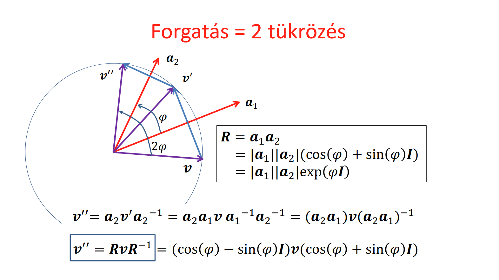

# Vektorháború <!-- vektorbékét! -->

## Vektoralgebra alapjai

Mi a vektor fogalmat jelenleg úgy fogjuk értelmezni, hogy egy hossz és egy távolság. Két pont viszonyát jellemzi; megmondja, hogy az egyik távol van a másiktól, és milyen irányban van. Úgy is fel lehet fogni, mint egy _eltolás_, hiszen megmondja, hogy egy pontot milyen módon kéne eltolni, hogy egy másik pontba kerüljünk. Koordinátákkal számolható, de szerkeszthető is (tenzor).

Szeretnénk műveleteket is értelmezni ezeken a vektorokon, kezdjük például az összeadással. Általánosságban a matematikai tanulmányunk során pár dolgot már megszoktunk az összeadással kapcsolatban (gyűrű axiómák). Egy ilyen tulajdonság például, hogy legyen _zárt_: két szám összege egy szám, két mátrix összege egy mátrix. Hasonlóan, két vektor összegét is szeretnénk, ha egy vektor lenne. Ezen felül még nem bánjuk, ha a műveletünk kommutatív, és asszociatív. Ha a vektorokra úgy gondolunk, mint eltolások, akkor ez a művelet magától értetődő lesz: két eltolás összege az szimplán az, ha elvégezzük a két eltolást egymás után.

Mivel figyeltünk arra, hogy egy "szép" műveletet válasszunk, ezért kipottyant az is, hogy ez az összeadás _invertálható_. Az eltolás inverze a "vissza tolás", tehát egy olyan vektor, mely ugyanolyan hosszú, de ellentétes irányú, mint az eredeti vektorunk.

Általánosságban a vektorokat nem csak eltolni lehet, hanem forgatni, skálázni is. Ezeket összefoglalóan az alábbi alakban lehet felírni:

$$
[x', y', 1] = [x, y, 1]
\begin{bmatrix}
a & e & 0\\
b & f & 0\\
c & d & 1\\
\end{bmatrix}
$$

Na már haladunk, van összeadásunk. Szeretnénk tudni szorozni is, viszont itt problémákba ütközünk. Vizsgáljuk meg az egyes "szorzásokat", amikről eddig hallhattunk a vektorok vonatkoztatásában:

### Skaláris szorzás (dot product)

Vegyünk két $v, a$ vektort. Jelölje ezek skaláris szorzatát $b \in \R$. Ekkor ha $\cdot$ jelöli a skaláris szorzást:

$$
v \cdot a = b \stackrel{\text{def}}{\iff} |v||a|\cos(\alpha) = b
$$

Ezzel több problémánk is van. Először is nem zárt, hiszen az eredmény egy skalár ($v$-nek $a$-ra vett vetületének hossza), és ezáltal nem is lehet asszociatív, hiszen $x \cdot y \cdot z$ esetén ha az elsőt végezzük el előbb, akkor egy $z$-vel párhuzamos vektort kapunk, ha a másodikat, akkor pedig egy $x$-el párhuzamosat.

Nem is invertálható, mert ha megpróbálnánk, akkor nem teljesülne az _egyértelműség_ feltétele (ugyan annak a műveletnek ugyan azokkal az értékekkel nem lehet két különböző eredménye). Nézzük, hogy miért:

$$
v \cdot a = b
$$

inverze az lenne, ha ismerve a $b \in \R$ és $a$ vektort, meg akarnánk állapítani a $v$ vektort:

$$
v = \frac{b}{a}
$$

alakban. Ezzel viszont az a baj, hogy túl sok ismeretlenünk van. Ismerjük a $b$ skalárt és az $a$ vektort méretét és hosszát, viszont ez eredmény vektor hosszát és irányát egyáltalán nem tudjuk. A definíciót tudjuk csak felhasználni, azaz csak egy egyenletünk van ($|v||a|\cos(\alpha)$), de ebből se $|v|$-t, se $\alpha$-t nem ismerjük. Ez geometriailag azt jelenti, hogy több különböző olyan vektor is létezik, amelynek $a$ a merőleges vetülete. Egy műveletnek több eredménye még sem lehet, szóval ez nem igazán egy "rendes" szorzás.

### Vektoriális szorzás (cross product)

Ez a művelet eleve csak háromdimenziós vektorokra van értelmezve, szóval eleve kizárt, hogy általános vektor szorzás lehessen, de azért vizsgáljuk meg. A jele $\times$. Két $a, b$ vektor vektoriális (más szóval kereszt) szorzata azon $c$ vektor, melyre igazak az alábbiak:

- $|c| = |a||b|\sin(\alpha)$,
- $c$ merőleges az $a$ és $b$ által kifeszített síkra,
- $c$ irányát a jobbkéz-szabály alapján határozzuk meg.

Ez a művelet zárt, nem asszociatív, és antikommutatív ($a \times b = - b \times a$). Ez a művelet sem nem invertálható, hasonló okokból mint a skaláris szorzás.

#### Tipp a kiszámítására

Ha feladatokban meg kell határozni két vektor kereszt szorzatát, akkor van egy trükk hozzá, ami bár matematikailag nem igazán precíz, de annál hasznosabb:

$$
a \times b =
\begin{vmatrix}
    \underline{i} & \underline{j} & \underline{k} \\
    a_x & a_y & a_z \\
    b_x & b_y & b_z
\end{vmatrix}
$$

azaz egy olyan mátrix determinánsa, aminek az alsó két sora az $a$ és $b$ vektorok koordinátái, a felső sora pedig $\R^3$ bázisvektorai. Vegyesen kezelni számokat és vektorokat egy mátrixban, és determinánst számolni erre a mátrixra kicsit vadul hangzik, viszont ha mégis kiszámoljuk a determinánst (például a [Sarrus-szabály](https://hu.wikipedia.org/wiki/Sarrus-szabály) felhasználásával), utána pedig $\underline{i}, \underline{j}$ és $\underline{k}$ szerint csoportosítjuk a tagokat, akkor az eredmény vektor első koordinátája az $\underline{i}$ bázisvektor együtthatója lesz, a második a $\underline{j}$, a harmadik pedig a $\underline{k}$:

$$
a \times b = [\overbrace{a_y b_z - b_y a_z}^{\displaystyle c_x}, \overbrace{a_z b_x - b_z a_x}^{\displaystyle c_y}, \overbrace{a_x b_y - b_x a_y}^{\displaystyle c_z}]
$$

### Külső szorzat (wedge product)

A skaláris szorzat két vektorhoz egy alacsonyabb dimenziójú struktúrát rendelt, egy számot. A kereszt szorzat egy ugyan olyan dimenziójú objektumot rendel két vektorhoz. Tudnánk olyan műveletet értelmezni, ami két vektorhoz egy magasabb szintű objektumot rendel hozzá? A válasz az, hogy igen, ez pedig a külső szorzat lesz. A jele $\wedge$.

Ha $\R^2$ beli vektorokat nézünk, akkor $v_1 \wedge v_2$ egy _irányított terület_ lesz. Mit értünk azon, hogy irányított terület? Az eredmény mérete, azaz $|v_1 \wedge v_2|$ megegyezik a $v_1, v_2$ által kifeszített paralelogramma területével, azaz visszaköszön a vektoriális szorzatnál megismert képlet: $|v_1 \wedge v_2| = |v_1||v_2|\sin(\alpha)$. Az, hogy ez a terület "irányított" annyit jelent, hogy számít a körbejárásának sorrendje: $v_1 \wedge v_2 = - v_2 \wedge v_1$. Természetesen $\R^3$ beli vektorok esetén egy irányított térfogatot kapnánk, és ez magasabb dimenziókra is kiterjeszthető.

Az ilyen irányított területeket más szóval _bivektoroknak_ nevezzük. Fontos még kiemelni, hogy a terület alakja egyáltalán nem érdekes, csak a nagysága, és a körüljárás iránya. Asszociatív, antikommutatív és disztributív.

### Szorzás összefoglalás

Láttuk, hogy se a skaláris, se a vektoriális szorzat nem igazán felel meg "igazi szorzásnak" az algebránkban. Az lesz a megoldás, hogy nem a sima vektorokat fogjuk az alap objektumainknak tekinteni, hanem az úgynevezett _multivektorokat_. Ehhez viszont előbb meg kell ismerkednünk a multivektorok algebrájával, a Clifford algebrával.

## Geometriai (Clifford) algebra

Mielőtt rátérünk a konkrét a geometriai algebrára, illetve az itt definiált "igazi szorzásra", előtte kell tartanunk egy kicsi szemléletformáló kitérőt.

### Szemléletformáló kitérő

Az összeadásra és a skálázásra jól működtek a vektoraink, de ha belegondolunk, akkor ez nem meglepő, hiszen szinte bármilyen "nem szám" objektumra ez a két művelet könnyen értelmezhető. Például ha vannak narancsaink meg citromjaink, akkor ezeket is össze tudjuk adni: ha Aladárnak van két narancsa és egy citroma, Bélának meg egy narancsa és két citroma, akkor ha összeülnek, hogy vacsorázzanak, akkor három-három narancsuk és citromjuk lesz összesen. Annak a kijelentésnek is van értelme, hogy "megduplázom a citromjaid számát". Összegezve, ha az algebrai kifejezéseinkben csak összeadni, és skalárral szorozni szeretnénk, akkor egy cseppet sem zavar minket, ha "nem szám" objektumok is vannak a  kifejezésben.

Viszont a szorzás már egy picit szigorúbb művelet: hogyan tudnánk összeszorozni Aladár és Béla uzsonnáit? Az eredményben milyen objektumok lehetnek egyáltalán? Számok, narancsok, citromok, citrancsok, ezek mind teljesen valid gondolatok. Ahhoz, hogy ezt pontosan meg tudjuk mondani, valami kapcsolatot kell teremtenünk az objektumaink és a valós számok között. A vektorok esetén ez a koordinátás alak:

$$
\underline{v} = x \underline{e}_1 + y \underline{e}_2
$$

ahol $x,y \in \R$ számok, $\underline{e}_1$ és $\underline{e}_2$ pedig $R^2$ bázisvektorai. Ez egyféle kapcsolat a valós számok és az objektumaink között. Ezzel a kapcsolattal az volt a baj, hogy nem tudtunk rá elegáns szorzás műveletet definiálni. Próbáljunk meg kiindulni egy másik kapcsolatból, illetve azokból a tulajdonságokból, amiket tudjuk, hogy a műveletünknek birtokolnia kell, és próbáljunk meg ezekből levezetni egy szorzást.

### Geometriai szorzás

Ez a művelet (jelölje $*$) legyen asszociatív, disztributív és invertálható is. Induljunk ki abból a kapcsolatból, hogy bármely $v$ vektorra: $v * v \in \R$, azaz az eredmény legyen egy valós szám. Ebből a kapcsolatból elindulva:

$$
v * v = (x e_1 + y e_2) * (x e_1 + y e_2) = x^2 e_1 * e_1 + y^2 e_2 * e_2 + xy(e_1 * e_2 + e_2 * e_1)
$$

Mivel az $e_1, e_2$ bázisvektorok is vektorok, ezért ő rájuk is igaz, hogy $e_1 * e_1$ és $e_2 * e_2$ valós számok. Viszont mivel ezek bázisvektorok, ezért ennél egyszerűbb alakra már nem igazán hozhatóak, szóval itt muszáj döntést hoznunk: melyik valós számmal legyen egyenlő $e_1 * e_1$ és $e_2 * e_2$? Nem igazán a szám értéke a fontos, hanem inkább az előjele. A lehetséges választásaink az $1, 0, -1$. Mi most $e_1 * e_1 = e_2 * e_2 = 1$-et fogunk választani a geometriai algebránkban, viszont a többi választásra is kitérünk majd. Elöljáróban annyit, hogy a duális számok esetén -- mellyekkel deriválni fogjuk megtanítani a CPU-t -- az $e_1 * e_1 = e_2 * e_2 = 0$-át fogjuk választani, és komplex számok esetén pedig $e_1 * e_1 = 1$ és $e_2 * e_2 = -1$ (ez abból is látszik, hogy a komplex síkon az $x$-tengely menti bázisvektor az $1$, és $1 * 1 = 1$, az $y$-tengely menti bázisvektor pedig az $i$, és $i * i = -1$).

Ha már kikötöttük, hogy $e_1 * e_1 = e_2 * e_2 = 1$, akkor az első két tag az összegünkben valós, már csak a harmadik taggal kell kezdeni valamit. Itt megjelenik a bázisvektorok vegyes szorzata, $e_1 * e_2$. Ha kikötnénk, hogy ezek is legyenek valós számok, akkor lényegében azt mondanánk, hogy bármely két vektor geometriai szorzata valós szám lenne, de ez a művelet már létezik, ez a skaláris szorzás.

Mivel nem igazán tudunk mit kezdeni a vegyes szorzatok eredményével, ezért máshogy oldjuk meg a problémát: nekünk igazából elég lenne az, ha az utolsó tag ($xy(e_1 * e_2 + e_2 * e_1)$) valahogy eltűnne. Ezt elérhetjük úgy, hogy azt mondjuk, hogy $xy(e_1 * e_2 + e_2 * e_1) = 0$. Ekkor a fenti $v * v$ képletben az eredmény tényleg valós lesz, és elkerültük a problémánkat.

Viszont ha azt mondjuk, hogy $xy(e_1 * e_2 + e_2 * e_1) = 0$, akkor az csak akkor lehet igaz, ha $e_1 * e_2 = - e_2 * e_1$, azaz a műveletünk antikommutatív.

Az $e_1 * e_2$ művelet eredményét valahogy muszáj jelölnünk, szóval próbáljuk meg a legáltalánosabb módon, a legkevesebb dolgot feltételezve: $e_1 * e_2$ eredménye legyen $e_{12}$ bivektor, ez a területeket hivatott leírni. Ezek alapján próbáljuk meg meghatározni két tetszőleges vektor szorzatát:

$$
\begin{align*}
v_1 * v_2 &= (x_1 e_1 + y_1 e_2) * (x_2 e_1 + y_2 e_2)
&= x_1 x_2 + y_1 y_2 + (x_1 y_2 - x_2 y_1)e_1 * e_2
\end{align*}
$$

Azt látjuk, hogy két vektor geometriai szorzata egy valós részből ($x_1 x_2 + y_1 y_2$) illetve egy bivektor részből ($(x_1 y_2 - x_2 y_1)e_1 * e_2$) áll, ahol a bivektor pontosan a $v_1$ és $v_2$ által kifeszített paralelogramma területével van megszorozva. Viszont ezek a műveletek ismerősek lehetnek, hiszen a valós rész az pont $v_1 \cdot v_2$, a bivektoros rész pedig pont $v_1 \wedge v_2$, tehát összegezve:

$$
\boxed{
    v_1 * v_2 = v_1 \cdot v_2 + v_1 \wedge v_2
}
$$

### Invertálás

Most, hogy van egy "jól viselkedő" szorzás műveletünk, nézzük meg, hogy ezt hogyan tudjuk invertálni. A gyűrű axiómákhoz visszanyúlva, a szorzás invertálhatósága alatt azt értjük, hogy minden $v$ vektornak létezik egy $v^{-1}$ _inverze_, melyre igaz, hogy $v * v^{-1} = 1$. Mivel ebben a kifejezésben nincsen bivektoros tag, ezért gyanús, hogy valami olyasmi irányba kell elindulnunk, amely során a bivektoros tag nulla.

Vizsgáljuk meg újra a $v * v$ kifejezést. A főképletbe behelyettesítve azt kapjuk, hogy:

$$
v * v = v \cdot v + v \wedge v
$$

viszont $v \wedge v$-ről tudjuk, hogy egy olyan irányított terület, aminek a nagysága a két operandusa által kifeszített paralelogramma területe. Viszont ha a két vektorunk egybevágó, akkor nem feszítenek ki egy paralelogrammát, vagy ha nagyon rá akarjuk erőltetni, akkor egy $0$ területű paralelogrammát feszítenek ki. Ez nekünk pont megfelelő, hiszen ebben a kifejezésben sincsen bivektoros tag.

Láttuk, hogy $v * v = v \cdot v = |v|^2$. Ha azt akarjuk, hogy $v * v^{-1} = 1$ teljesüljön, akkor a $v^{-1} = \frac{v}{v*v}$ választással elértük a célunkat:

$$
v * v^{-1} = v * \frac{v}{v*v} = v * v * \frac{1/|v|^2} = \frac{|v|^2}{|v|^2} = 1
$$

### Belső szorzás

A $\underline{v} vektor és \bm{I}$ bivektor belső szorzatának eredménye egy olyan vektor, amely az $\bm{I}$ bivektor síkjában fekszik, és merőleges a $\underline{v}$ vektor $\bm{I}$ síkjára eső vetületére.

Ez a művelet rendkívül hasznos, mert egyetlen, koordináta-rendszertől független operációban valósítja meg a vetítés és a síkbeli forgatás kombinációját. Hagyományos vektoralgebrában, ugyanehhez több lépésre és mátrixműveletre lenne szükség.


#### 1\. Vetítés a síkra

A kiindulási vektorunk a kék vektor, nevezzük $v$-nek (a piros és a zöld vektor a bivektort alkotó vektorok). Ez a vektor általános esetben nem fekszik a bivektor által meghatározott síkban. A belső szorzat szempontjából a vektornak csak a bivektor síkjára eső része, vagyis a vetülete számít. A fekete vektor a $v$ merőleges vetülete a síkon. Ezt a vektorkomponenst $v_{\parallel}$-nek nevezzük.

A $v$ vektornak van egy síkra merőleges komponense is ($v_{\perp}$), de a belső szorzat ezt a komponenst "figyelmen kívül hagyja". Matematikailag ez azért van, mert a merőleges komponens és a bivektor szorzata egy magasabb fokú objektumot, egy trivektort hozna létre, amit a belső szorzat (ami egy fokszám-csökkentő művelet) definíció szerint nulláz.

#### 2\. Forgatás a síkban

Miután megvan a $v$ vektornak a bivektor síkjában fekvő $v_{\parallel}$ vetülete, a belső szorzat ezen a vetületen egy $90\degree$-os forgatást hajt végre a bivektor síkján belül. Ezt a... másik fekete vektor jelöli... yeah...

A forgatás iránya a bivektor orientációjától (elvégre egy irányított terület) függ.

### 2D geometriai algebra

Nézzük meg a Clifford algebra egy konkrét alkalmazását, arra az esetre, ha két dimenzióval dolgozunk. Láttuk, hogy két vektor geometriai szorzata egy valós számot és egy bivektort eredményez, de ha erre az eredményre tovább ismételgetjük a szorzást, akkor a végén vegyesen lesznek számaink, vektoraink, és bivektoraink. Az ezeket összefogó algebrai objektum, amivel dolgozunk, az a _multivektor_:

$$
\mathbf{V} = s + xe_1 + ye_2 + Be_{12}
$$

ahol $s$ egy szám, $e_1, e_2$ a bázisvektoraink, $e_{12}$ pedig a bivektorunk, azaz egy irányított terület. Az összeadásuk, és a skálázásuk a szokásos módon történik, pont ugyan úgy, mint ahogy a sima vektorok koordinátáival járunk el: összeadni skalárt a skalárral, vektort a vektorral, bivektort a bivektorral, stb...

Nézzük meg, hogy a szorzásra hogyan viselkednek a multivektorok:

- skalár szorzása skalárra, vektorral, illetve bivektorral: ez a szokásos módon történik
- két bivektor szorzata:

$$
e_{12} * e_{12} = e_{1} * e_{2} * e_{1} * e_{2}
$$

a középső két tagot felcserélhetjük, de az antikommutativitás miatt bejön egy $-1$-es szorzó:

$$
e_{1} * e_{2} * e_{1} * e_{2} = -1 * e_{1} * e_{1} * e_{2} * e_{2} = -1 * (1) * (1) = -1
$$

Azt láttuk tehát, hogy ha úgy választjuk meg a multivektorainkat, hogy $\underline{v} = \underline{0}$, akkor a komplex számokat kapjuk meg. Emiatt ezentúl a $e_{12} = \bm{I}$ jelölést fogjuk alkalmazni.

- bivektor és vektorok szorzata (jobbról és balról eltérő):

$$
\underline{v} * \bm{I} = (x e_1 + y e_2) * e_{12} = x * e_1 * e_1 * e_2 + y * e_2 * e_1 * e_2 = e_2 x - e_1 y
$$

azaz elforgattuk a vektorunkat $\pm 90 \degree$-al.

Összegezve, az alábbi szorzótáblát állapítottuk meg:

$$
\mathbf{V} = s + xe_1 + y e_2 + B \bm{I}
$$

esetén:

$$
\def\arraystretch{1.5}
\begin{array}{|c||c|c|c|c|}
\hline
& 1 & e_1 & e_2 & \bm{I} \\[-0.1ex] \hline \hline
1 & 1 & e_1 & e_2 & \bm{I} \\ \hline
e_1 & e_1 & 1 & \bm{I} & e_2 \\ \hline
e_2 & e_2 & -\bm{I} & 1 & -e_1 \\ \hline
\bm{I} & \bm{I} & -e_2 & e_1 & -1 \\ \hline
\end{array}
$$

### Projection és rejection

Hogyan tudjuk ezzel az eszköztárral például egy vektornak egy másik vektorral merőleges, és párhuzamos komponenseit meghatározni?

Vegyük $a$ és $v$ nem egyirányú vektorokat. Keressük $v_{\perp}$ és $v_{\parallel}$ vektorokat, melyek rendre merőlegesek, és párhuzamosak $a$-val, és $v_{\perp} + v_{\parallel} = v$.

Egy kis maszatolás után megkapjuk, hogy:

$$
\begin{align*}
v_{\perp} &= (v \wedge a) * a^{-1} \\
v_{\parallel} &= (v \cdot a) * a^{-1}
\end{align*}
$$

Továbbá mivel vektorok esetén $v * a = v \cdot a + v \wedge a$, ezért ezt átrendezve azt kapjuk, hogy:

$$
\begin{align*}
v \cdot a &= \frac{(v*a + a*v)}{2} \\
v \wedge a &= \frac{(v*a - a*v)}{2}
\end{align*}
$$

De mire is megyünk ezzel? Sok bonyolultabb vektorműveletet, melyekhez eddig mátrixokhoz kellett nyúlnunk, szépen ki tudunk fejezni geometriai szorzatokkal. Nézzünk is pár ilyet:

### Tükrözés

Ha egy $v$ vektort egy másik $a$ vektorra akarunk tükrözni, akkor geometriailag elég lenne $v$-nek az $a$-ra merőleges komponensét negálni. Ezt úgy is elérhetjük, hogy a párhuzamos komponensből kivonjuk a merőleges komponenst. Ezeket a komponenseket most már könnyen ki tudjuk fejezni, tehát ha $v'$-vel jelöljük $v$ tükörképét, akkor:

$$
\begin{align*}
v' &= v_{\parallel} - v_{\perp} = (v \cdot a) * a^{-1} - (v \wedge a) * a^{-1} \\
&= (v \cdot a - v \wedge a) * a^{-1} = (a \cdot v + a \wedge v) * a^{-1} \\
\implies &\boxed{v' = a * v * a^{-1}}
\end{align*}
$$

### Forgatás

A tükrözést felhasználva fogunk forgatni. Tegyük fel, hogy van két $a_1, a_2$ vektorunk, melyek $\varphi$ szöget zárnak be egymással. Ekkor bármely másik $v$ vektort el tudjuk forgatni $2 \varphi$ szöggel, ha először tükrözzük $a_1$-re, utána pedig a keletkező $v'$ vektort tükrözzük $a_2$-re.

??? failure "Ennek az állításnak a levezetése (:warning:KEEP OUT:warning:)"
    Na sziasztok, Levy vagyok, és ez itt egy forgatás levezetős bekezdés, mert ugye ti küldtétek, én végigjátszom!

    

    Itt azt a feltételt, hogy $a_1$ és $a_2$ (melyekről feltesszük, hogy egységvektorok, annak ellenére, hogy az ábrán egyértelműen nem ugyan olyan hosszúak) bezárt szöge $\varphi$, azt úgy tudjuk értelmezni, hogy visszavezetjük a geometriai szorzatot a skalár szorzatos és külső szorzatos definíciójához:

    $$
    \begin{align*}
    R &\coloneqq a_2 * a_1 = a_2 \cdot a_1 + a_2 \wedge a_1 = \cos(\varphi) - \bm{I}*\sin(\varphi) \\
    R^{-1} &\coloneqq a_1 * a_2 = a_1 \cdot a_2 + a_1 \wedge a_2 = \cos(\varphi) + \bm{I}*\sin(\varphi)
    \end{align*}
    $$

    ahol $R$ egy _rotor_. Itt tényleg igaz, hogy $R^{-1}$ az $R$ inverze, hiszen feltettük, hogy $a_1$ és $a_2$ egységvektorok, és egységvektorok esetén $a^{-1} = a$, tehát $(a_2 * a_1)^{-1} = a_1^{-1} * a_2^{-1} = a_1 * a_2$.

    Írjuk fel $v''$-őt, és próbáljuk meg valahogy becsempészni a rotorunkat:

    $$
    \begin{align*}
    v'' &= a_2*v'*a_2^{-1} = a_2*a_1*v*a_1^{-1}*a_2^{-1} \\
    &= (a_2*a_1)*v*(a_1^{-1}*a_2^{-1}) = R * v * R^{-1} \\
    &= (\cos(\varphi) - \bm{I}*\sin(\varphi)) * v * (\cos(\varphi) + \bm{I}*\sin(\varphi))
    \end{align*}
    $$

    Ezután felbontjuk a baloldali zárójelet, kihasználjuk az antikommutativitást, utána pedig minden zárójelet felbontunk, végezetül pedig kihasználjuk, hogy $\bm{I}^2 = -1$:

    $$
    \begin{align*}
    v'' &= (\cos(\varphi) - \bm{I}*\sin(\varphi)) * v * (\cos(\varphi) + \bm{I}*\sin(\varphi)) \\
    &= (v*\cos(\varphi) - (\bm{I}*v)*\sin(\varphi)) * (\cos(\varphi) + \bm{I}*\sin(\varphi)) \\
    &= (v*\cos(\varphi) - (-v*\bm{I})*\sin(\varphi)) * (\cos(\varphi) + \bm{I}*\sin(\varphi)) \\
    &= (v*\cos(\varphi) + (v*\bm{I})*\sin(\varphi)) * (\cos(\varphi) + \bm{I}*\sin(\varphi)) \\
    &= v*\cos^2(\varphi) + 2*v*\bm{I}*\sin(\varphi) * \cos(\varphi) + v*\bm{I}^2 \sin^2(\varphi) \\
    &= v*\cos^2(\varphi) + 2*v*\bm{I}*\sin(\varphi) * \cos(\varphi) - v*\sin^2(\varphi) \\
    \end{align*}
    $$

    Felidézzük, hogy $\cos(2\varphi) = \cos^2{\varphi} - \sin^2{\varphi}$ és $\sin(2\varphi) = 2\sin(\varphi)\cos(\varphi)$:

    $$
    \begin{align*}
    v'' &= v*\cos^2(\varphi) + 2*v*\bm{I}*\sin(\varphi)*\cos(\varphi) - v*\sin^2(\varphi) \\
    &= v*\cos^2(\varphi) - v * \sin^2(\varphi) + 2*v*\bm{I}*\sin(\varphi)*\cos(\varphi) \\
    &= v*[\cos^2(\varphi) - \sin^2(\varphi)] + v*\bm{I}*[2*\sin(\varphi)*\cos(\varphi)] \\
    &= v* \cos(2\varphi) + v * \bm{I}*\sin(2\varphi) \\
    &= v * (\cos(2\varphi) + \bm{I}*\sin(2\varphi))
    \end{align*}
    $$

    azaz $\displaystyle v'' = v * e^{\bm{I}2\varphi}$, tehát $v$-nek a $2\varphi$-vel elforgatott képe. 
    
    <!-- I love it when my KaTeX engine works properly, 
    and I don't have to resort to HTML for simple commands! -->
    <span style="display: flex; justify-content: flex-end;"> $\blacksquare$ </span>

## Komplex számok algebrája

A kétdimenziós geometriát az előzőekben vektorokkal, és pontokkal alapoztuk meg: ezekből és az ezeken végrehajtott műveletekből állt az algebránk. Más utat is járhatunk, komplex számokkal is ki tudjuk fejezni a kétdimenziós geometriát.

Emlékezzünk vissza a Clifford algebránkhoz, amikor azt akartuk eldönteni, hogy mi legyen $e_1 * e_1$ és $e_2 * e_2$ eredménye. Akkor mind a kettőt $1$-nek választottuk, de ha $e_2 * e_2$-t $-1$-nek választottuk volna, az is egy valid algebrát eredményez: a komplex számok algebráját.

### Pontok és műveletek

A geometriánkban egy pontnak egy komplex szám felel meg:

$$
z_p = x_p + y_p \bm{i} = R \cdot e^{\bm{i}\varphi} = R \cdot \cos(\varphi) + \bm{i} \cdot R \cdot \sin(\varphi)
$$

ahol $x_p, y_p$ valós számok, $R$ a pont origótól mért távolsága, $\varphi$ pedig a pontot és az origót összekötő félegyenesnek a $x$-tengellyel bezárt szöge.

Korábban vektorokkal modelleztük az eltolásokat, forgatásokat, stb. Ezeket viszont komplex számokkal is tudjuk: az eltolás komplex számok összeadása, és az, hogy mennyivel toljuk el a pontot, szintén egy komplex szám:

$$
z_p' = z_p + z_t
$$

ahol $z_t$ egy tetszőleges komplex szám. Néha célszerű a komplex számokra nem mint pontokra, hanem mint _helyvektorokra_ gondolni, azaz az origóból a pontba mutató vektorra. Ebben az értelmezésben egy pontot egy másik pont helyvektorával toljuk el, amikor összeadjuk őket.

A skálázás műveletét is tudjuk ábrázolni, pontosabban az úgynevezett izotrop (irányfüggetlen) skálázást:

$$
z_p' = z_p \cdot z_s
$$

ahol $z_s$ egy olyan komplex szám, aminek a képzetes része nulla. Ez a skálázás ugyanolyan mértékben skálázza az $x$- és az $y$-tengelyt is.

Ha a szorzásban választott komplex számunknak nemnulla képzetes része van, akkor a _forgatva nyújtás_ műveletét kapjuk. Ehhez szemléletesebb, ha az $R \cdot e^{\bm{i}\varphi}$ trigonometrikus alakját használjuk a komplex számoknak. Vegyük $z_r = x_r + y_r \bm{i} = s \cdot e^{\bm{i} \alpha}$ tetszőleges komplex számunkat. Ekkor ha a $z_p$ pontunkat ezzel megszorozzuk, egy $s$-el megnyújtott, $\alpha$-val elforgatott pontot kapunk:

$$
z_p' = z_p \cdot z_r = (s R) \cdot e^{\bm{i} \cdot (\alpha + \varphi)}
$$

Ha csak forgatni szeretnénk, akkor elég $s = 1$ választás, azaz $|z_r| = 1$.

Ezekből a szép geometriai tulajdonságokból adódóan a fraktáloknál, illetve a kétdimenziós forgatások modellezésénél gyakran komplex számokat használunk.

### Implementáció

```cpp
struct Complex {
    float x, y;

    Complex(float x0, float y0) { x = x0, y = y0; }

    Complex operator+(Complex r) {
        return Complex(x + r.x, y + r.y);
    }

    Complex operator-(Complex r) { 
        return Complex(x - r.x, y - r.y);
    }

    Complex operator*(Complex r) { 
        return Complex(x * r.x - y * r.y, x * r.y + y * r.x);
    }

    Complex operator/(Complex r) {
        float l = r.x * r.x + r.y * r.y;
        return (*this) * Complex(r.x / l, -r.y / l); // konjugálttal bővítjük a nevezőt
    }   
};

// Második konstruktor, polárkoordinátákból
Complex Polar(float r, float phi) {
    return Complex(r * cosf(phi), r * sinf(phi));
}
```

### Példa

Ha kétdimenziós transzformációkat kell modelleznünk, akkor a komplex számoknál nem igazán találunk jobbat. Az alábbi példa is szemléleti ezt: a specifikációt lényegében szóról szóra kóddá tudjuk fordítani, nagyobb nehézségek nélkül.

<!-- Szirmay pride? -->
> A $p$ pontot a $\textcolor{red}{\text{\((1,-1)\) pivot pont}}$ körül $\textcolor{SpringGreen}{\text{nyújtsuk \(2\)-szeresére és forgassuk el \(t\)-vel}}$, $\textcolor{cyan}{\text{majd toljuk el a \((2, 3)\) vektorral}}$ és végül $\textcolor{Violet}{\text{nyújtsuk az origó körül \(0.8\)-szorosára} \\ \text{és forgassuk \(–t/2\)-radiánnal}}$.

A fenti transzformációt megvalósító kódrészlet:

<pre id="__code_1">
<code>
Complex p, tp;
Complex <span style="color:red">pivot(1,-1)</span>;
tp = (((p <span style="color:red">- pivot</span>) <span style="color:SpringGreen">* Polar(2,t)</span> <span style="color:red">+ pivot</span>) <span style="color:cyan">+ Complex(2,3)</span>) <span style="color:Violet">* Polar(0.8,-t/2)</span>;
<span style="color:red"></span>
</code>
</pre>

## Geometria 3D-ben

Tudunk esetleg találni valami hasonló algebrát a komplex számokhoz, csak három dimenzióban? Nagyon kényelmes lenne, ha 3D-s alakzatok forgatását, eltolását, stb. ugyan úgy tudnánk szorzásokkal és összeadásokkal megvalósítani.

Ha vissza emlékezünk a [szemléletformáló kitérőnkre](#szemléletformáló-kitérő), akkor tudhatjuk, hogy általánosságban az összeadás, és a skalárral szorzás nem igazán törődnek azzal, hogy milyen objektumokon hajtjuk őket végre. Pont ezért, az eltolás (összeadás) és a skálázás (skalárral szorzás) műveleteket tetszőleges dimenziókba általánosíthatjuk, így három dimenzióba is.

A gondot megint a szorzás (forgatás) jelenti. Szeretnénk megtartani azokat a jó tulajdonságokat, amiket elvárunk egy szorzástól, viszont ezért a Clifford algebrában és eléggé sokat küzdtünk. Sőt, mivel most a háromdimenziós forgatást szeretnénk modellezni, ezért a szorzásunknak annak a tulajdonságaival kel, hogy bírjon.


Például ahogy a fenti képen is láthatjuk, a forgatás nem kommutatív.

### Naiv megközelítés

> Hát ha 2D-ben elég volt az, hogy $z = x + y \bm{i}$, akkor 3D-ben legyen $h = x + y \bm{i} + z \bm{j}$, és annyi.

Ötletnek nem rossz, viszont ha ezen az úton indulnánk el, akkor a végén oda jutunk, hogy nem tudunk egy olyan szorzást definiálni, amivel rendesen lehet forgatni.

De akkor mégis hogyan forgassunk három dimenzióban?

### Mátrixok

Mivel a forgatás egy lineáris művelet, ezért kell legyen egy $r' = \bm{R(r)}$ lineáris transzformációhoz tartozó mátrix.

$$
x'\bm{i} + y'\bm{j} + z'\bm{k} = R(x + y + z) = xR(\bm{i}) + yR(\bm{j}) + zR(\bm{k})
$$

$$
[x', y', z'] = [x, y, z]
\begin{bmatrix}
\bm{R(i)}_x & \bm{R(i)}_y & \bm{R(i)}_z \\
\bm{R(j)}_x & \bm{R(j)}_y & \bm{R(j)}_z \\
\bm{R(k)}_x & \bm{R(k)}_y & \bm{R(k)}_z
\end{bmatrix}
$$

Ezzel lehetne forgatni, viszont mátrixokkal dolgozni nem éppen a legkényelmesebb, szóval kutakodjunk tovább.

### Rodriguez formula

Próbáljuk meg a lineáris algebra ismereteinket felhasználva kimaszatolni:

Origón átmenő $d$ tengely körüli forgatás.


Magyarázat:

- $d$ (zöld): forgatási tengely
- $r$ (piros): forgatni kívánt vektor
- $r_\parallel = r'_\parallel = d(r \cdot d)$ (barna): $d$-vel párhuzamos komponense $r$ és $r'$-nek (egyenlők)
- $r_\perp = r - d(r \cdot d)$ (sötétkék): $r-r_\parallel$, azaz $r$-ből kivonjuk a párhuzamos komponenst, ami marad az már biztosan merőleges
- $r_{\perp\perp} = d \times r_\perp = d \times r$ (világoskék): $d$-re és $r_{(\perp)}$-re merőleges

- $r' = r'_\parallel + r'_\perp$ (lila): $r$ elforgatva, a párhuzamos és merőleges komponensek összege

A merőleges komponenst pedig $r_\perp$, $r_{\perp\perp}$ és szögfüggvények segítségével az alábbi módon kaphatjuk meg:

- $r'_\perp = r_\perp \cos\varphi + r_{\perp\perp} \sin\varphi$

Tehát összegezve:

$$
\boxed{
\begin{align*}
r' &= \overbrace{d(r \cdot d)}^{\displaystyle r'_{\parallel}} + \overbrace{(r - d(r \cdot d))\cos(\varphi)}^{\displaystyle r_{\perp}} + \overbrace{d \times r \sin(\varphi)}^{\displaystyle r_{\perp\perp}} \\
&= r \cos(\varphi) + d(r \cdot d)(1 - \cos(\varphi)) + d \times r \sin(\varphi)
\end{align*}
}
$$

A végső képlettel már egy fokkal kényelmesebb dolgozni, mint egy mátrixszal, viszont még mindig nem az igazi. A megoldást az fogja jelenti, hogy egy dimenzióval feljebb lépünk.

### Kvaternió

Egy kvaternió egy négydimenziós komplex szám, ami azt jelenti, hogy a valós része mellett van három képzetes része. Több alakban is szokás ábrázolni:

- mint egy négyes vektort: $q = [s, x, y, z]$
- mint egy valós szám és egy háromdimenziós képzetes vektor párt: $q = [s, \bm{d}]$
- algebrai alak: $q = s + x \bm{i} + y \bm{j} + z \bm{k}$

A kvaterniókon végzett műveletek logikája ugyan az, mint a komplex számokon végzett műveleteké, csak most több képzetes rész van. Ez a gyakorlatban annyit jelent, hogy míg a komplex számoknál elég volt azt az egy "szabályt" megjegyezni, hogy $i^2 = -1$, addig a kvaternióknál több ilyen "szabály" lesz, amit észben kell tartani.

Ezáltal sok műveletet ugyan úgy végzünk el, mint a komplex számok esetén:

- $q_1 + q_2 = [s_1 + s_2, x_1 + x_2, y_1 + y_2, z_1 + z_2]$
- $a \cdot q = q \cdot a = [as, ax, ay, az]$ ahol $a \in \R$
- $|q| = \sqrt{s^2 + x^2 + y^2 + z^2}$

Az a nagy kérdés, hogy a szorzást hogyan definiáljuk, hogy 3D-s forgatást lehessen vele modellezni. Korábban ez nem ment, de itt már lehetséges:

<!-- I LOVE KATEX!! I LOVE BEING ABLE TO DRAW BOXES WITH COLORED EDGES WITHOUT HAVING TO SPECIFY THE BACKGROUND COLOR SO IT DOESN'T BREAK IN LIGHT MODE!! -->

<div style="
  padding: 1px 20px;
  border: 1px solid red;
  background-color: transparent;
  border-radius: 4px;
  display: block;
  width: fit-content;
  margin: 0 auto;
  text-align: center;">
$$i^2 = j^2 = k^2 = ijk = -1$$
</div>

Ez a szorzás asszociatív, de _nem kommutatív_, összeadásra pedig disztributív. A fenti egyenlet átrendezésével megkapható az összes többi eset (pl. $ij = k$, $ki = j$, stb...)

Invertálhatóságot is akarunk, de ahhoz először kell egy (multiplikatív) egység elem: $[1,0,0,0]$. Ha már ez megvan, felírhatjuk egy $q$ kvaternió inverzét, a következő képpen:

$$
q^{-1} = \frac{[s, -d]}{|q|^2}
$$

Ez az inverz baloldali és jobboldali inverz is (nem feledkezünk meg arról, hogy a szorzás nem kommutatív), tehát $q^{-1} \cdot q = q \cdot q^{-1} = [1, 0, 0, 0]$.

#### Szorzás geometriai értelmezése

Ha nagyon sokáig bámulnánk a szorzási szabályokat, akkor észrevehetnénk, hogy azok megegyeznek a vektoriális szorzásban ismert összefüggésekkel. Ha a kvaterniókra $q = [s, \bm{d}]$ alakban gondolunk, akkor:

$$
[s_1, \bm{d}_1] * [s_2, \bm{d}_2] = [\overbrace{s_1 s_2 - \bm{d}_1 \cdot \bm{d}_2}^{\text{valós}}, \overbrace{s_1 \bm{d}_2 + s_2 \bm{d}_1 + \bm{d}_1 \times \bm{d}_2}^{\text{képzetes}}]
$$

#### Forgatás kvaterniókkal

A motivációnk az volt, hogy tudjunk 3D-ben könnyen forgást modellezni. Nézzük meg, hogy kvaterniókkal hogyan lehet.

Egy $\bm{d} \in \R^3$ (egységhosszú) vektorral megadott tengely körüli $\alpha$ szöggel való forgatást az alábbi kvaternió írja le:

$$
q = [\cos(\alpha/2), \bm{d} \cdot \sin(\alpha/2)]
$$

Viszont felmerülhet bennünk a gondolat, hogy hát ez egy négydimenziós vektor, és mi háromdimenziós vektorokat szeretnénk forgatni, de ezeket nem lehet összeszorozni. A forgatandó $\bm{u} \in \R^3$ vektorunkat be kell ágyaznunk egy kvaternióba, még pedig a következő képpen: $p = [0, \bm{u}]$, azaz egy nulla valós részű kvaterniót csinálunk belőle. Ezután pedig már forgathatjuk:

$$
q * p * q^{-1} = q * [0, \bm{u}] * q^{-1} = [0, \bm{v}]
$$

ahol a $\bm{v}$ háromdimenziós vektor az $\bm{u}$ elforgatottja $\bm{d}$ körül $\alpha$-val. Az inverzet jelenleg könnyű előállítani, mivel $q$-t pont úgy állítottuk elő, hogy egységhosszú legyen, és egységhosszú kvaterniók inverze megegyezik a konjugáltukkal:

$$
q^{-1} = [\cos(\alpha/2), - \bm{d} \cdot \sin(\alpha/2)]
$$

??? abstract Bizonyítás
    Ha be tudjuk látni, hogy a $q * p * q^{-1}$ kifejezés ekvivalens a Rodriguez formulával, akkor készen is vagyunk, hiszen az a formula ugyan azt csinálja, mint amit mi most szeretnénk.

    A Rodriguez formula ezt mondja ki:

    $$
    v = u \cos(\alpha) + d(u \cdot d)(1 - \cos(\alpha)) + d \times u \sin(\alpha)
    $$

    Itt az $u$ vektort szeretnénk forgatni, de mivel a forgatás (és a kvaternió szorzás is) disztributív az összeadásra, csinálhatjuk azt, hogy felbontjuk $u$-t egy $d$-re merőleges, és egy $d$-vel párhuzamos komponensre. Ezután ezeket külön-külön elforgatva, a végén pedig összeadva a keletkező két vektort ugyan azt kapjuk, mintha az eredeti $u$-t forgattuk volna el. (Ha ez nem világos, hogy miért igaz, akkor próbáld meg 2D-ben végig gondolni, ott is működik ugyan ez feltéve, hogy egységhosszú vektorokkal dolgozunk.)

    Most pedig külön-külön bebizonyítjuk, hogy $d$-re merőleges, illetve vele párhuzamos vektorok esetén a kvaterniós szorzás ekvivalens a Rodriguez formulával.

    ??? abstract Első eset: $d$ merőleges $u$-ra
        Mivel $d \perp u$, ezért $u \cdot d = 0$, tehát picit egyszerűsödik a Rodriguez formulánk:

        $$
        v = \bm{u} \cos(\alpha) + \bm{d} \times \bm{u} \sin(\alpha)
        $$

        Bontsuk szét a $q * [0, \bm{u}] * q^{-1}$ kifejezést, kezdve a $q * [0, \bm{u}]$ szorzattal:

        $$
        \begin{align*}
        q * [0, \bm{u}] &= [\cos(\alpha/2), \bm{d} \sin(\alpha/2)] * [0, \bm{u}] \\
        &= [0, \bm{u} \cos(\alpha/2) + \bm{d} \times \bm{u} \sin(\alpha/2)] \\
        &= [0, \bm{u}^{*}]
        \end{align*}
        $$

        !!! note Szorzás emlékeztető
            $$
            [s_1, \bm{d}_1] * [s_2, \bm{d}_2] = [\overbrace{s_1 s_2 - \bm{d}_1 \cdot \bm{d}_2}^{\text{valós}}, \overbrace{s_1 \bm{d}_2 + s_2 \bm{d}_1 + \bm{d}_1 \times \bm{d}_2}^{\text{képzetes}}]
            $$

        Itt kihasználtuk azt, hogy mivel (a fenti szorzás emlékeztető jelöléseivel) esetünkben $s_2 = 0$, és $\bm{d}_1 \cdot \bm{d}_2$ is nulla (hiszen $d \perp u$), ezért az eredmény valós része biztosan $0$ lesz. A képzetes tagnál csak annyit tapasztaltunk, hogy mivel $s_2$ nulla, ezért kiesett a $s_2 \bm{d}_1$ tag.

        Vizsgáljuk meg picit az $\bm{u}^{*}$ tagot, és a Rodriguez formulát:

        $$
        \begin{align*}
        \text{Rodriguez:} \quad &v = \bm{u} \cos(\alpha) + \bm{d} \times \bm{u} \sin(\alpha) \\
        \text{Kvaternió:} \quad &\bm{u}^{*} = \bm{u} \cos(\alpha/2) + \bm{d} \times \bm{u} \sin(\alpha/2)
        \end{align*}
        $$

        A kettő pontosan megegyezik, azzal a különbséggel, hogy csak $\alpha / 2$ szöggel forgattunk!

        Nézzük a második szorzást. Hasonlóan érvelve mint a $q * [0, \bm{u}]$ esetben, itt is pár tag kiesik:

        $$
        \begin{align*}
        [0, \bm{u}^{*}] * q^{-1} &= [0, \bm{u}^{*}] * [\cos(\alpha/2), - \bm{d} \sin(\alpha/2)] \\
        &= [0, \bm{u}^{*} \cos(\alpha/2) - \bm{u}^{*} \times \bm{d} \sin(\alpha/2)] \\
        &= [0, \bm{u}^{**}]
        \end{align*}
        $$

        Vizsgáljuk meg itt is az eredmény képzetes részét:

        $$
        \begin{align*}
        \text{Rodriguez:} \quad &v = \bm{u} \cos(\alpha) + \bm{d} \times \bm{u} \sin(\alpha) \\
        \text{Első kvaternió:} \quad &\bm{u}^{*} = \bm{u} \cos(\alpha/2) + \bm{d} \times \bm{u} \sin(\alpha/2) \\
        \text{Második kvaternió:} \quad &\bm{u}^{**} = \bm{u}^{*} \cos(\alpha/2) - \bm{u}^{*} \times \bm{d} \sin(\alpha/2)
        \end{align*}
        $$

        Jelen esetben az a különbség, hogy míg a Rodriguez formulában $ + \bm{d} \times \bm{u}$ van, nekünk most $- \bm{u}^{*} \times \bm{d}$. Viszont mivel a keresztszorzat egy antikommutatív művelet, ezért $- \bm{u}^{*} \times \bm{d} = \bm{d} \times \bm{u}^{*}$!

        Ezt a tulajdonságot kihasználva, már $\bm{u}^{**}$ is a Rodriguez formulával ekvivalens alakba került, tehát ez is egy $\alpha/2$-vel való forgatás.

        Mivel a $q$-val való balról szorzás, és a $q^{-1}$-el való jobbról szorzás is külön-külön egy $\alpha/2$-vel való forgatást eredményezett, így ha ezeket egymás után elvégezzük, akkor tényleg egy $\alpha$-val való forgatást hajtunk végre, tehát $\bm{u}^{**} = v$. <span style="display: flex; justify-content: flex-end;"> $\blacksquare$ </span>

    ??? abstract Második eset: $d$ párhuzamos $u$-val
        Mivel $d \parallel u$, és mind a kettő egységvektor (hiszen $u$-t mi választjuk, $d$-ről pedig a tétel kiköti, hogy egységvektor), ezért $d = u$. Ezentúl $d \times u = 0$ és $d \cdot u = |d| |u| = 1$ is igazak, tehát egyszerűsödik a Rodriguez formulánk:

        $$
        \begin{align*}
        v &= \bm{u} \cos(\alpha) + \bm{d}(\bm{u} \cdot \bm{d})(1 - \cos(\alpha)) \\
        &= \bm{u} \cos(\alpha) + \bm{d}(1 - \cos(\alpha)) \\
        &= \bm{u} \cos(\alpha) + \bm{d} - \bm{d} \cos(\alpha) \\
        &= \cos(\alpha)(\bm{u}-\bm{d}) + \bm{d} \\
        &= \cos(\alpha)(0) + \bm{d} \\
        &= \bm{d} = \bm{u}
        \end{align*}
        $$

        Ebből nekünk a legfontosabb rész az az, hogy $v = u$. Ezzel lényegében azt mondjuk, hogy a kiinduló $u$ vektor a forgatás után ($v$) változatlan marad. Tehát ha be tudjuk látni, hogy a kvaterniókkal való szorzás sem változtat az eredeti vektoron, akkor készen vagyunk.

        Nézzük a baloldali szorzatot:

        $$
        \begin{align*}
        q * [0, \bm{u}] &= [\cos(\alpha/2), \bm{d} \sin(\alpha/2)] * [0, \bm{u}] \\
        &= [- \bm{u} \cdot \bm{d} \sin(\alpha/2), \bm{u} \cos(\alpha/2)] \\
        &= [- \sin(\alpha/2), \bm{u} \cos(\alpha/2)]
        \end{align*}
        $$

        Folytassuk a jobboldali szorzattal:

        $$
        \begin{align*}
        [- \sin&(\alpha/2), \bm{u} \cos(\alpha/2)] * q^{-1} = \\
        &= [- \sin(\alpha/2), \bm{u} \cos(\alpha/2)] * [\cos(\alpha/2), - \bm{d} \sin(\alpha/2)] \\
        &= [- \sin(\alpha/2)\cos(\alpha/2) + \sin(\alpha/2)\cos(\alpha/2), \bm{d} \sin^2(\alpha/2) + \bm{u} \cos^2(\alpha/2)] \\
        &= [0, \bm{d} (\sin^2(\alpha/2) + \cos^2(\alpha/2))] \\ 
        &= [0, \bm{d}] = [0, \bm{u}]
        \end{align*}
        $$

        Tehát a két kvaterniós szorzat után visszakaptuk $[0, u]$-t, tehát ebből is az következik, hogy $v = u$, szóval megfelelünk a Rodriguez formulának. <span style="display: flex; justify-content: flex-end;"> $\blacksquare$ </span>


    Beláttuk, hogy $d$-re merőleges, és azzal párhuzamos vektorokra igaz az állítás. Ezt követően tetszőleges $u$ vektort el tudunk forgatni, ha felbontjuk a $d$-re merőleges és párhuzamos komponenseire, azokat külön elforgatjuk, és az eredményt összeadjuk. <span style="display: flex; justify-content: flex-end;"> $\blacksquare$ </span>

Természetesen ha tetszőleges 3D-s tengely körül tudunk forgatni, akkor bármilyen 3D-s forgatást tudunk modellezni.

Ha valaki inkább vizuális típus, akkor nagyon tudom ajánlani [ezt](https://eater.net/quaternions/video/intro) az angol nyelvű interaktív videót/szimulációt.

#### Kvaternió implementáció

Nézzük meg, hogy kódban hogyan implementáljuk mindezt.

```cpp
struct vec4 {
    // Itt a `w` jelöli a valós részt, tehát 
    // q = w + xi + yj + zk
    float x, y, z, w;

    // további műveletek...
};

// Kvaternió szorzás a geometriai interpretációt felhasználva
vec4 qmul(vec4 q1, vec4 q2) {
    vec3 d1(q1.x, q1.y, q1.z), d2(q2.x, q2.y, q2.z);
    return vec4(d2 * q1.w + d1 * q2.w + cross(d1, d2), q1.w * q2.w - dot(d1, d2));
}

// Konstruálás egy szögből és egy tengelyből, azaz egy 
// 3D-s forgatást leíró mennyiségekből.
vec4 quaternion(float ang, vec3 axis) {
    // `d` egységvektor, kell a `normalize`
    vec3 d = normalize(axis) * sinf(ang / 2); 

    return vec4(d.x, d.y, d.z, cosf(ang / 2));
}

// Egy `u` vektor elforgatása. Ha akarnánk, akkor
// paraméterként a szöget és a tengelyt is átadhatnánk.
vec3 Rotate(vec3 u, vec4 q) {
    vec4 qinv(-q.x, -q.y, -q.z, q.w); // q konjugált
    vec4 qr = qmul(qmul(q, vec4(u.x, u.y, u.z, 0)), qinv);
    return vec3(qr.x, qr.y, qr.z);
}
```

#### GPU shader programozás

Ha a vertex shaderben szeretnénk kvaterniókat használni, ahhoz az alábbi kódrészlet nyújt példát:

```glsl
uniform vec4 q; // quaternion as uniform variable
in vec3 u; // Varying input: vertex

vec4 qmul(vec4 q1, vec4 q2) {
    vec3 d1 = q1.xyz, d2 = q2.xyz;
    return vec4(d2 * q1.w + d1 * q2.w + cross(d1, d2), q1.w * q2.w - dot(d1, d2));
}

void main() {
    vec4 qinv = vec4(-q.xyz, q.w); // conjugate
    vec3 v = qmul(qmul(q, vec4(u, 0)), qinv).xyz;
    gl_Position = vec4(v, 1);
}
```

## Automatikus deriválás

A való világban sokkal többször kell egy mérnöknek deriválnia, mint az gondolnánk. A fizikusok a világ működését differenciálegyenletekkel írják le, tehát elkerülhetetlen, hogy egy mérnök deriváljon, ha a való világot szeretné modellezni (gondoljunk csak háromdimenziós grafikai szimulációkban a felületek normálvektoraira). Ahogy fejlődött a technológia, úgy egyre több számítást delegálunk a számítógépeknek, hiszen nagyságrendekkel gyorsabbak, mint mi emberek. Pontosan ezért felmerülhet az igény, hogy akkor tanítsuk meg a számítógépet is deriválni.

### Inverz feladatok

A deriválás akkor is előjöhet, ha egy úgynevezett _inverz feladatot_ szeretnénk megoldani. Vegyük példának egy tórusz kirajzolását. Ha ismerjük az egyenletét, akkor a képszintézis feladatot elvégezve könnyen meg tudunk jeleníteni egy tóruszt. Viszont ennek a feladatnak az inverzét - egy kirajzolt kép alapján eldönteni, hogy az ott lévő alakzatnak mi az egyenlete - nagyságrendekkel nehezebb elvégezni. A tóruszos példában a gépi látás eszközeihez nyúlhatunk, de általánosságban az az igaz, hogy gyakran csak találgatni tudunk, és a tippjeinket leellenőrizni, ha meg akarjuk oldani az inverz feladatot.

Amikor leellenőrizzük a tippünket, akkor valamekkora _hibát_ állapítunk meg, azaz egy számot, ami leírja, hogy mennyire térünk el az eredeti feladat megoldásától. Ha az összes tippünkhöz hozzárendeljük, hogy mekkora annak a hibája, akkor egy úgynevezett _hiba függvényt_ kapunk. Ennek a függvénynek mi nekünk a globális minimuma kéne, hiszen ott a legalacsonyabb a hiba. Viszont nem csak vaktában akarunk tippelgetni, szeretnénk azt is tudni, hogy milyen irányban és milyen mértékben változtassuk a tippünket, hogy csökkenjen a hiba. Ehhez a hiba függvény deriváltját kell vennünk. Ha ez az érték közel $0$ (és a második derivált is pozitív), akkor tudjuk, hogy közel járunk a minimumhoz, tehát kisebbeket éri meg változtatni, ha viszont nem $0$ közeli, akkor tudjuk, hogy nagyobbakat változtathatunk, hiszen még messze járunk a minimumtól.

### Naiv módszer

Ha egy matematikust kérnénk meg, hogy implementálja a deriválást valamilyen programozási nyelven, akkor valószínűleg ehhez a képlethez nyúlna (numerikus differenciálás):

$$
f'(x) \approx \cfrac{f(x + \Delta) - f(x)}{\Delta}
$$

és ezt alakítaná kóddá, valahogy így:

```cpp
const float Delta = 0.001;

float foo(float x) { // ... }

float foo_Derivative(float x) {
    return (foo(x + Delta) - foo(x)) / Delta;
}
```

Ezzel viszont egy használhatatlan eredményt kapnánk. Nézzük meg, hogy miért:

- ha túl nagy $\Delta$-t választanánk, akkor pontatlan becslést kapunk
- ha túl kicsi $\Delta$-t választanánk, akkor pedig zajos becslést kapunk
  - Ennek az az oka, hogy a számítógép véges számábrázolást használ, tehát egy bizonyos tizedesérték után már pontatlanok a számaink. Viszont amikor két nagyon közeli értékű számot kivonunk, akkor pont azokat a tizedesértékeket veszítjük el, amiket még pontosan tudunk ábrázolni, hiszen a $\Delta$-ánk kicsi, azokon nem változtat. Tehát a végén lényegében kapunk egy nagyon pici számot, ami tele van random számjegyek különbségeivel: lényegében használhatatlan zaj.

Ahhoz, hogy egy használható $\Delta$-t válasszunk, ahhoz már kéne tudni a derivált függvényt, szóval ez a megközelítés nem vezet eredményre. Viszont akkor mégis mit tudunk tenni? A 2D-s és 3D-s forgatás esetében segített, ha visszanyúltunk a Clifford algebra eszközeihez, próbáljuk meg ezt most is.

### Duális számok

Emlékezzünk ismét vissza a Clifford algebránkhoz, amikor azt akartuk eldönteni, hogy mi legyen $e_1 * e_1$ és $e_2 * e_2$ eredménye. Akkor mind a kettőt $1$-nek választottuk, a komplex számok esetén pedig $e_2 * e_2$-t $-1$-nek, viszont mi történne, ha $e_2 * e_2$-t $0$-nek választjuk? Az így kapott algebrát a duális számok algebrájának hívjuk.

Egy duális szám $z = x + y \bm{i}$ alakú, ahol $x, y \in \R$ illetve $i^2 = 0$, viszont $i$ nem feltétlenül egyenlő $0$-val. Nézzük meg az ezeken a számokon végzett aritmetikát:

$$
\begin{align*}
\text{Összeadás:} \quad &(x_1 + y_1 \bm{i}) \pm (x_2+y_2 \bm{i}) = (x_1 \pm x_2) + (y_1 \pm y_2) \bm{i} \\
\text{Szorzás:} \quad &(x_1+y_1 \bm{i}) \cdot (x_2+y_2 \bm{i}) = (x_1x_2) + (x_1y_2+y_1x_2) \bm{i} + \cancel{(y_1y_2) \bm{i}^2} \\
\text{Osztás:} \quad &\frac{x_1 + y_1 \bm{i}}{x_2 + y_2 \bm{i}} = \frac{(x_1 + y_1 \bm{i})(x_2 - y_2 \bm{i})}{(x_2 + y_2 \bm{i})(x_2 - y_2 \bm{i})}= \frac{x_1x_2 + (y_1x_2x_1y_2) \bm{i} - \cancel{(y_1y_2) \bm{i}^2}}{x^2_2 - \cancel{y^2_2 \bm{i}^2}} = \\
&= \frac{x_1}{x_2} + \frac{y_1x_2-x_1y_2}{x_2^2} \bm{i}
\end{align*}
$$

Hasonlítsuk össze a kapott összefüggéseket a függvények deriválási szabályaival:

$$
\def\arraystretch{1.5}
\begin{array}{|c|c|c|}
\hline
& \text{Duális számok képzetes része} & \text{Deriválási szabályok} \\ \hline
\text{Összeadás} & (y_1 \pm y_2) \bm{i} & (f \pm g)' = f' \pm g' \\ \hline
\text{Szorzás} & (x_1y_2+y_1x_2) \bm{i} & (f \cdot g)' = (f \cdot g' + f' \cdot g) \\ \hline
\text{Osztás} & \cfrac{y_1x_2-x_1y_2}{x_2^2} \bm{i} & \cfrac{f' \cdot g - f \cdot g'}{(g')^2} \\[1.75ex] \hline
\end{array}
$$

Pontosan megegyeznek! Tehát ha egy $z = x + y \bm{i}$ duális számba egy $f$ függvény $f(x)$ értékét eltároljuk $x$-ben, utána pedig ezzel a $z$ számmal összeadunk, szorzunk vagy osztunk, akkor az $y$ pontosan meg fog felelni $f'(x)$-el, az összeadások, szorzások és osztások után, tehát $z = f(x) + f'(x) \bm{i}$.

#### Alap implementáció

Nagyon hasonlít egy komplex szám osztályhoz, csak most $i^2 = 0$.

```cpp
struct Dnum {
    float f, d; // function and derivative values

    // Default konstruktorban a deriváltat nullának vesszük.
    // Erre még később visszatérünk.
    Dnum(float f0, float d0 = 0) { // constant derivative = 0
        f = f0, d = d0;
    }

    Dnum operator+(Dnum r) { return Dnum(f + r.f, d + r.d); }
    Dnum operator-(Dnum r) { return Dnum(f - r.f, d - r.d); }
    Dnum operator*(Dnum r) { return Dnum(f * r.f, f * r.d + d * r.f); }
    Dnum operator/(Dnum r) {
        return Dnum(f / r.f, (d * r.f – f * r.d) / r.f / r.f);
    }
};
```

Az így definiált Duális szám osztállyal már egyszerűbb függvényeket tudunk deriválni. Nézzük erre egy példát.

Vegyük az $f(x) = \cfrac{a \cdot x}{x^2 + b}$ függvényt, valamilyen szabadon választott $a, b$ valós számokra.

Ha valami konkrét $x$ értékre vagyunk kíváncsiak, akkor kódban ez így nézne ki:

```cpp
float t = value;
float F = t * a / (t * t + b);
```

Ha ezt naiv módon átírjuk, hogy duális számokat használjon, akkor az alábbi alakot kapjuk:

```cpp
Dnum F = Dnum(t,1) * Dnum(a,0) / (Dnum(t,1) * Dnum(t,1) + Dnum(b,0));
```

Ez már tökéletesen működik, mégis van egy szépséghibája a dolognak: a számítógép nem tudja, hogy mi `t`, `a` vagy `b` szerint akarunk deriválni, tehát a konstruktorban külön meg kell adni, hogy `t` deriváltja $1$, a többié meg nulla. Így pontosan olyan, mintha `t` szerint deriválnánk. Viszont ki tudjuk használni a default konstruktort! Vegyük úgy, hogy ha nem adjuk meg a konstruktornak, hogy mi a derivált értéke, akkor nem aszerint a változó szerint deriválunk, szóval legyen az $0$.

Az így kapott kódrészletben már hozzá sem kell nyúlni az eredeti kifejezéshez, kihasználhatjuk a default konstruktort:

```cpp
Dnum t(value, 1); // Eszerint deriválunk
Dnum F = t * a / (t * t + b);
```

Viszont ez a deriválás jelenleg csak a négy alapműveletre működik, nekünk viszont vannak egyéb deriválandó függvényeink, például $\sin$, $\cos$, $\log$, $\exp$, stb... Ezeknek is felvehetnénk a deriválási szabályaikat külön függvényekbe:

```cpp
Dnum Sin(float t) { return Dnum(sinf(t), cosf(t)); }
Dnum Cos(float t) { return Dnum(cosf(t), -sinf(t)); }
// ...
```

és ezeket utána alkalmazhatnánk kifejezésekben:

```cpp
Dnum t(value, 1);
Dnum F = 3 * t + a * Sin(t);
```

viszont egy dolgot eddig a szőnyeg alá söpörtünk, ami ezt a megközelítést lehetetlenné teszi: az összetett függvények deriváltjait.

#### Teljes implementáció

Az alap `Dnum` osztály nem változik, hiszen az már követi a láncszabályt, viszont az elemi függvényeink így fognak kinézni:

```cpp
Dnum Sin(Dnum g) { return Dnum(sinf(g.f), cosf(g.f) * g.d); }
Dnum Cos(Dnum g) { return Dnum(cosf(g.f), -sinf(g.f) * g.d); }
Dnum Tan(Dnum g) { return Sin(g)/Cos(g); }
Dnum Log(Dnum g) { return Dnum(logf(g.f), 1/g.f * g.d); }
Dnum Exp(Dnum g) { return Dnum(expf(g.f), expf(g.f) * g.d); }
Dnum Pow(Dnum g, float n) {
    return Dnum(powf(g.f, n), n * powf(g.f, n - 1) * g.d);
}
```

Látható, hogy ezeknek a függvényeknek szintén duális számokat kell átadni, mert el kell érniük a `g.d` változót, azaz a belső függvény deriváltját.

#### Többváltozós függvények

Ha felületi gradienst szeretnénk számolni, akkor ahhoz többváltozós függvényeket is kell tudnunk deriválni. Ehhez azt fogjuk csinálni, hogy a duális szám osztályban a deriváltakhoz nem egy értéket tárolunk, hanem változónként egyet, azaz egy tömböt.

```cpp
template<class T> 
struct Dnum {
    float f; // function value
    T d; // derivatives

    Dnum(float f0, T d0 = T(0)) { f = f0, d = d0; }
    Dnum operator+(Dnum r) { return Dnum(f+r.f, d+r.d); }
    Dnum operator*(Dnum r) { return Dnum(f*r.f, f*r.d + d*r.f); }
    Dnum operator/(Dnum r) { return Dnum(f/r.f, (d*r.f–f*r.d)/r.f/r.f); }
};

template<class T>
Dnum<T> Exp(Dnum<T> g) {
    return Dnum<T>(expf(g.f), expf(g.f) * g.d);
}
```

Nézzük egy példát ennek a többváltozós `Dnum` osztály használatára: az $F(x,y,z)$ skalármező gradiensének kiszámítását.

```cpp
float x, y, z;
Dnum<vec3> X(x, vec3(1, 0, 0)), Y(y, vec3(0, 1, 0)), Z(z, vec3(0, 0, 1));
Dnum<vec3> F = X*X/a + Y*Y/b + Z*Z/c – 1;
vec3 grad = F.d;
```

a `Dnum<vec3> X(x, vec3(1, 0, 0))` azt jelenti, hogy konstruálunk egy olyan `Dnum<vec3>` típusú `X` változót, aminek a kezdeti értéke `x`, és ő az első deriválási változó. Hasonlóan `y` és `z` esetén is, csak ők a második illetve harmadik deriválási változók (hiszen például amikor `y` szerint deriválunk, akkor `x` és `z` $0$, tehát a `vec3` második paraméterei `y`-nál $1$, a többi változónál pedig $0$).

#### Összetettebb példa

Egy kétdimenziós pályán haladunk, és azt szeretnénk, hogy mindig a sebesség irányába nézzünk.

A pálya egyenlete:

$$
\begin{align*}
x(t) &= \frac{\sin(t)(\sin(t)+3)4}{\tan(\cos(t)+2)} \\[2ex]
y(t) &= \frac{(\cos(\sin(t))8+1)12+2}{(sin(t)sin(t))^3+2}
\end{align*}
$$

A sebességvektor, azaz hogy merre nézünk:

$$
v(t) = (\dot x(t), \dot y(t))
$$

Ha kézzel akarnánk kiszámolni és legépelni $\dot x$-t és $\dot y$-t, akkor eléggé keserves feladat elé néznénk:

$$
\begin{align*}
\dot x(t) = &\frac{48 \sin^2 (t) \sin^2 (\cos(t) + 2)}{(\cos(2 (\cos(t) + 2)) - 1)^2} + \frac{16 \sin^3 (t) \sin^2 (\cos(t) + 2)}{(\cos(2 (\cos(t) + 2)) - 1)^2} \\[2.5ex]
&- \frac{8 \sin(t) \cos(t) \sin(2 (\cos(t) + 2))}{\cos(2 (\cos(t) + 2)) - 1} - \frac{12 \cos(t) \sin(2 (\cos(t) + 2))}{\cos(2 (\cos(t) + 2)) - 1}
\end{align*}
$$

és ez még csak $\dot x$...

Ezt spóroljuk meg, ha automatikus deriválást használunk. Nézzük ugyan ezt duális számokkal:

```cpp
void Animate(float tt) {
    // Idő szerint deriválunk
    Dnum t(tt, 1);

    // Pályafüggvények
    Dnum x = Sin(t)*(Sin(t)+3)*4 / (Tan(Cos(t))+2);
    Dnum y = (Cos(Sin(t)*8+1)*12+2)/(Pow(Sin(t)*Sin(t),3)+2);

    vec2 position(x.f, y.f), velocity(x.d, y.d);

    vec2 heading = normalize(velocity);

    Draw(position, heading);
}
```

---

# Kvíz

!!! quote ""
    A 2024/2025/II félévben nem voltak ebben a témában kvízek.

!!! question 1\. Mi lesz a $q * u * q^{-1}$ kvaternió szorzás eredményének első képzetes része, azaz az $i$ szorzója, ha $u=[0, 10, 0, 0]$, és $q=[\sqrt{2}/2, (0, 0, \sqrt{2}/2)]$ ?

??? tip Megoldás
    Számítsuk ki $q^{-1}$-et:

    $$
    q^{-1} = [s, -d]/|q|^2 = [\sqrt{2}/2, (0, 0, -\sqrt{2}/2)]
    $$

    Emlékezzünk vissza az alábbi képletekre:

    $$
    [s_1, \bm{d}_1] * [s_2, \bm{d}_2] = [\overbrace{s_1 s_2 - \bm{d}_1 \cdot \bm{d}_2}^{\text{valós}}, \overbrace{s_1 \bm{d}_2 + s_2 \bm{d}_1 + \bm{d}_1 \times \bm{d}_2}^{\text{képzetes}}]
    $$

    Végezzük el a baloldali szorzást:
    
    $$
    \begin{align*}
    q * u &= [\sqrt{2}/2, (0, 0, \sqrt{2}/2)] * [0, (10, 0, 0)] = \\
    &= [0, \sqrt{2}/2 (10, 0, 0) + (0, 0, 0) + (0, 5\sqrt2, 0)] = \\
    &= [0, (5\sqrt2, 5\sqrt2, 0)]
    \end{align*}
    $$
    
    Utána pedig a jobboldalit:
    
    $$
    \begin{align*}
    [0, (5\sqrt2, 5\sqrt2, 0)] * q^{-1} &= [0, (5\sqrt2, 5\sqrt2, 0)] * [\sqrt{2}/2, (0, 0, -\sqrt{2}/2)] \\
    &= [0, (5, 5, 0) + (-5, 5, 0)] = \\
    &= [0, (0, 10, 0)]
    \end{align*}
    $$
    
    Azaz $i = 0$.

---

!!! question 2\. Mi lesz a $q * u * q^{-1}$ kvaternió szorzás eredményének második képzetes része, azaz a $j$ szorzója, ha $q=[\sqrt{2}/2, 0, 0, \sqrt{2}/2]$ és $u=[0, 6, 0, 0]$?

??? tip Megoldás
    Az előzővel teljesen analóg módon. Végeredmény: $j = 6$.

---

!!! question 3\. Adott két kvaternió, $q_1$ és $q_2$. Mi lesz a $q_1 * q_2$ első imaginárius része, azaz az $i$ szorzója?
    $$
    \begin{align*}
    q_1 &= 1+2i +2j + 3k \\
    q_2 &= 1+0i +2j + 2k
    \end{align*}
    $$

??? tip Megoldás
    Átírhatók $[s, d(i , j, k)]$ alakba:

    $$
    \begin{align*}
    q_1 &= 1+2i +2j + 3k = [1, (2,2,3)] \\
    q_2 &= 1+0i +2j + 2k = [1, (0,2,2)]
    \end{align*}
    $$

    Innentől pedig teljesen analóg az előző kettővel.

    Végeredmény: $i = 0$.

---

!!! question 4\. Adott két kvaternió, $q_1$ és $q_2$. Mi lesz a $q_1 * q_2$ valós része?
    $$
    \begin{align*}
    q_1=1+5i +3j + 1k \\
    q_2=4+4i +0j + 2k
    \end{align*}
    $$

??? tip Megoldás
    Az előzővel teljesen analóg módon. Végeredmény: $s = -18$.

---

!!! question 5\. A 3D forgatás művelet mely tulajdonságokkal rendelkezik az alábbiak közül?
    - Van egységelem, azaz olyan forgatás, amely nem változtatja meg az alakzatot.
    - Invertálható
    - Az összeadással disztributív
    - Asszociatív
    - Kommutatív

??? tip Megoldás
    - [x] Van egységelem, azaz olyan forgatás, amely nem változtatja meg az alakzatot.
        - Magyarázat: $[1,0,0,0]$
    - [x] Invertálható
        - Magyarázat: $q^{-1} = [s, -d]/|q|^2$
    - [x] Az összeadással disztributív
        - Magyarázat: Lásd [fentebb](#kvaternió)
    - [x] Asszociatív
        - Magyarázat: Lásd [fentebb](#kvaternió)
    - [ ] Kommutatív
        - Magyarázat: Nem az, szemléltetésnek a [fenti](#geometria-3d-ben) dobókockás kép.

[Előző](10.md)

[Következő](12.md)
