# Fraktálok és káosz

Idáig mindig azzal a feltételezéssel éltünk, hogy a virtuális világunk definiálható metrikus geometriával (tipikusan Euklideszivel), másrészt pedig hogy szimulálható. Nézzük meg, hogy pontosan mit is jelentenek ezek a feltételezések.

## Szimulálható

A virtuális világunk objektumainak állapota és viselkedése van. A viselkedés azt jelenti, hogy a saját és a többi objektum állapota alapján a saját állapotát meg tudja változtatni. Az objektumok állapotának összessége a _rendszer állapota_. Ekkor a rendszer szimulálását elképzelhetjük úgy, mint egy olyan $F$ függvény, ami a rendszer jelenlegi állapotához hozzárendeli a rendszer következő állapotát.

Számítástechnikában _diszkrét időszimulációt_ alkalmazunk, ami azt jelenti, hogy nem folytonosan, hanem $\Delta t$ időlépésenként frissítjük a virtuális világ állapotát. Reményeink szerint ennek ellenére a valósághoz hasonlóan fog működni a rendszerünk.

Az $F$ függvényt és a kezdeti állapotot teljes pontossággal nem ismerjük, viszont abban reménykedünk, hogy a szimulált és valóságos világok állapotai közötti hiba nullához tart. Sajnos nem ez a helyzet. Vannak olyan rendszerek, ahol megpróbálhatjuk bármennyire is pontosítani az $F$ függvényt, bármennyire is pontosabb kezdeti állapotot megadni, ennek ellenére a hiba nem tart nullához. Az ilyen rendszereket nevezzük __kaotikus dinamikus rendszereknek__.

??? example Példák egyszerű kaotikus rendszerekre
    Nem kell nagyon absztrakt dolgokra gondolni ahhoz, hogy kaotikus rendszereket kapjunk. Nézzünk meg (röviden) két kaotikus rendszert, melyeket még egy <s>Corvinusos</s> óvodás is meg tudna érteni.

    ## Háromtest-probléma

    Vegyünk egy sík terepet, melyen elhelyezünk három golyót. A golyóknak van tömegük, és a gravitáció törvényei is jelen vannak a rendszerünkben. Hogyan fog egymásra hatni a három golyó?

    Ez a rendszer kaotikus, hiszen még a mai napig sincs általános megoldása. Más szóval ha adok neked egy kezdeti állapotot, és megkérdezem tőled, hogy "Ezer időegység múlva milyen állapotban lesz a rendszer?" akkor ahhoz, hogy megválaszold muszáj lesz numerikus becslésekkel leszimulálnod a rendszert (és még ekkor is lenne hiba benne, ha a valóságban is leszimulálnánk).

    Az emberiség történelme során egyik legtöbbet kutatott háromtest-probléma a Nap, Föld és Hold mozgása.

    ## Kettős inga

    Talán az egyik leghíresebb kaotikus rendszer a kettős inga. Képzeljük el két, egymáshoz csatolt ingát, az alábbi konfigurációban:

    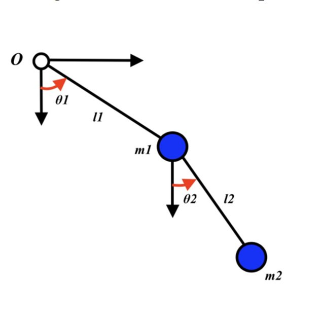

    Fogjuk meg az alsó (vagy felső) golyót, és vigyük el valamilyen tetszőleges kezdeti állapotba, utána pedig engedjük el. A gravitáció hatására a két golyó elkezdenek mozogni, és gyorsan egymás mozgására is hatással lesznek.
    
    Ez a rendszer szintén kaotikus, lehetetlen teljesen pontosan megmondani, hogy egy kezdeti állapotból később milyen állapotok lesznek. Más szóval, ha egy későbbi állapotot látunk, a kaotikus rendszerek kezdeti feltételekre való extrém érzékenysége miatt gyakorlatilag lehetetlen belőle pontosan visszakövetkeztetni az eredeti kezdeti állapotra.

    Ebben a rendszerben megfigyelhető a butterfly effect, azaz a kezdeti állapot _erős hatást gyakorol_ a rendszerre. Ez azt jelenti, hogy ha fogunk két kezdeti állapotot, amikben csak egy nagyon pici eltérés van (például az egyikben $\theta_2 =19.125\degree$, a másikban pedig $\theta_2 =19.126\degree$), akkor bizonyos idő elteltével már [teljesen más állapotban lesz a két rendszer](https://www.youtube.com/watch?v=d0Z8wLLPNE0).

    Fontos kiemelni, hogy ez nem azt jelenti, hogy a kaotikus rendszerek véletlenszerűek lennének. Teljesen determinisztikusak, egyik lépésben sem kell valamilyen random eseményhez nyúlni, mint például radioaktív bomlás. Ennek ellenére a gyakorlatban nem lehet megjósolni tetszőleges rendszerek jövőbeli állapotát.

    A fejezet későbbi felében mélyebben tárgyaljuk a káoszelméletet.

## Metrikusan definiálható

### Virtuális világ

Eddig feltettük, hogy a világot le lehet írni Euklideszi geometriával. Az Euklideszi geometria az axiómáiból épül fel, melyek pontokra, egyenesekre és egyenesekra vonatkoznak, viszont a valóságban ilyenek nincsenek, tehát nem magától értetődő, hogy tényleg alkalmazhatjuk-e a való világra.

Ha ember alkotta objektumokat nézünk, akkor míg távolról lehet, hogy valamilyen komplex alakjuk van, ha elég közel megyünk, akkor közelítőleg csak síkokból, és egyenesekből állnak. Ezt _skálafüggőségnek_ nevezzük, ami tehát az a gondolat, hogy "kicsiben mindenki lineáris".

Mivel az Euklideszi geometria metrikus, itt van értelme a méret fogalmának: 1D-ben a hossz, 2D-ben a felület, 3D-ben a térfogat. Kapcsolatot láthatunk egy alakzat metrikája és a dimenziója között: úgy kell "megmérni" egy objektumot, ahogy azt a dimenziója megszabja (egy kockának nincsen "hossza", hanem az oldalának van).

### Természet

A természet viszont skálafüggetlen, bármennyire is közelíthetünk, akkor is ugyan olyan lesz közelről, mint messziről. Ez azt is jelenti, hogy nem differenciálható, hiszen ez a skálafüggőségből adódik.

Ennek egy másik következménye az, hogy a valóságban egy egység szakasszal, egység négyzettel vagy egység kockával nem tudunk rendesen hosszat, felületet vagy térfogatot mérni. Viszont intuitívan érezzük, hogy hát a természetbeli objektumoknak kell lenni hosszának, felületének és térfogatának, hiszen ha kimegyek az erdőbe, és fogok egy levelet, annak simán megmérhetem a hosszát, vagy egy kavics térfogatát.

Nézzünk egy példát egy természetben előforduló folyamatra, hogy megértsük, mégis mi zajlik itt.

## Koch görbe

Próbáljunk meg hókristályok kialakulását szimulálni. :snowflake: Vizsgáljuk csak az egyik oldalát először a hópihének, a többi szimmetrikusan ugyan úgy fog fejlődni.

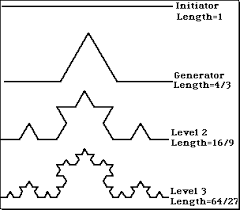

A kezdeti állapotban van egy szakaszunk. Ezután ennek a középső harmada kicserélődik egy egyenlő oldalú háromszög másik két oldalára. Eleinte harmadoltuk a szakaszunkat, és az egyik harmad helyére bejött két ugyan olyan hosszú szakasz, tehát $3$ egységnyi szakaszból lett $4$. Ez azt jelenti, hogy a szakaszunk hossza is $4/3$-addal nőtt.

Ha tovább ismételjük ezt a folyamatot az újonnan kapott $4$ kicsi szakaszra, akkor tovább tudjuk növelni a szakaszaink számát. Ha a végtelenségig ismételnénk a lépéseket, akkor kapnánk meg a _Koch görbét_. Ez tényleg hasonlít egy hópihére, és mivel tudjuk pontosan, hogy hogyan konstruáltuk, vizsgáljuk meg pár tulajdonságát, mint például, hogy hány dimenziós ez az alakzat?

### Tulajdonságok

Mivel minden lépésben $4/3$-addal növeltük a görbe hosszát, és végtelen lépésünk van, ezért a görbe hosszát az alábbi határérték adja meg:

$$
\lim_{n \to \infty} l_0 \left( \frac{4}{3} \right)^{n}
$$

ahol $l_0$ a kezdeti szakasz hossza. Ez a határérték [divergens](https://cdn.discordapp.com/emojis/1394642603701571605.webp?size=240), szóval az alakzatunknak a dimenziója biztos, hogy nagyobb mint $1$, hiszen "végtelen hossza" van.

Ugyanakkor a görbénk végig egyenesekből áll, szóval a területének nullának kell hogy legyen, tehát nem lehet kétdimenziós. Ez azt jelenti, hogy a Koch görbe dimenziójának valahol $0$ és $1$ között kell lennie.

Bár az alakzatunk folytonos (a konstrukcióból adódóan), de sehol sem differenciálható, hiszen "tüskés". Ez abból látszik, hogy bár egy szakasz a belső pontjaiban differenciálható, a két végpontjában nem. A konstrukciónk pedig olyan, hogyan a szakaszok hossza a nullába tart, azaz a határértékben sehol sem lesz differenciálható.

A rendszer _önhasonló_, azaz ha vesszük egy bizonyos részhalmazát, az teljesen egyenértékű az eredeti rendszerrel (olyasmi mint egy rekurzív alakzat).

## Hausdorff dimenzió önhasonló objektumokra

Nézzük meg, hogyan tudjuk általánosítani a dimenzió fogalmát, hogy a Koch görbének is tudjunk dimenziót adni.

Vegyünk egy kiindulási alakzatot. Kicsinyítsük $r$-szeresére, így a mérete $1/r$-szeres lesz. Ezután fedjük le az eredeti tartományt ezzel a kicsinyített alakzattal, jelölje az ehhez szükséges kicsi alakzatok számát $N$. Ha ezt végtelenszer megismételjük, akkor kapunk egy alakzatot, melynek a $D$ dimenziója:

$$
D = \frac{\log{N}}{\log(1/r)}
$$

Ez abból következik, hogy:

$$
N = 1/r^D
$$

Így például a fenti Koch görbe esetén mivel $1/3$ méretűre kicsinyítettük a kiindulási szakaszt, és $4$-szer fedtük le vele a tartományt, ezért $r = 1/3$, $N = 4$, így $D = \frac{\log 4}{\log 3} \approx 1.26$.

<!-- NOTE: valaki hozzá értő jó lenne ha ezt kifejtené, bár nem hinném h valaha előjönne -levy04 -->

??? example Nem önhasonló objektumok
    ## Nem önhasonló objektumok: vonalzó dimenzió
    <!-- avagy a szirmay shadow realm -->

    Önhasonló objektumokra:

    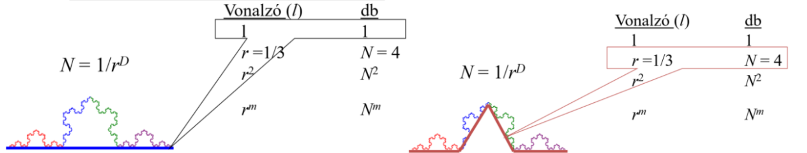

    $$
    D =  \frac{\log(\text{Hossz}(l))}{\log(l)} + 1
    $$

    Tippre $l$ a vonalzó egység hossza, $\text{Hossz}(l)$ a teljes hossz azaz $l \cdot db$.

    Alkalmazása: természetes objektumok elkülönítése és kategorizálása.

    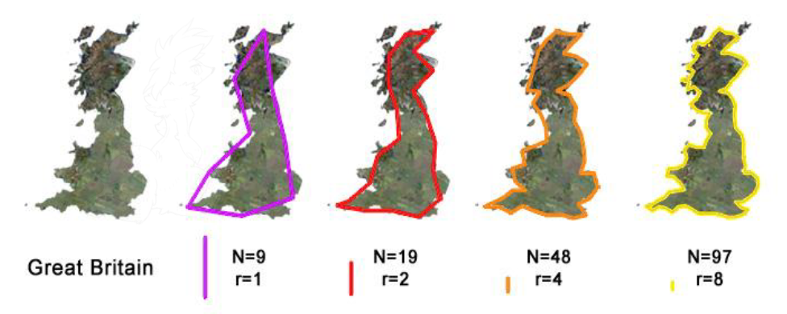

## Lindenmayer rendszerek

A Koch görbe mintájára sok más hasonló alakzatot tudunk kreálni. A Koch görbe a Lindenmayer rendszerekbe tartozik, nézzük, hogy ezek hogyan épülnek fel.

A Lindenmayer rendszerekben úgy adjuk meg az alakzatunkat, lényegében megadjuk azt, hogy egy egyenes szakasszal mit csinál (gondoljunk vissza a Koch görbe első lépésére). Ezt úgy adjuk meg, hogy elképzelünk egy teknőst ([igen, kötelezően teknőst](https://en.wikipedia.org/wiki/Turtle_graphics)) a szakasz egyik végpontjában. Ez a teknős csak két dolgot tud csinálni: előre menni, és tetszőleges szöggel forogni ([Comlogo](https://hu.wikipedia.org/wiki/Comenius_Logo) programozók előnyben). Ezeknek a műveleteknek az egymás után végrehajtásával nagyon sok önhasonló objektum leírható, vegyük példának a már ismert Koch görbét.

### Koch görbe :turtle:

Először nézzük meg a hozzárendelést, azaz az utasítások sorozatát, amit a teknősünk végre fog hajtani:

$$
\text{F} \mapsto \text{F} + 60 \text{F} - 120 \text{F} + 60 \text{F}
$$

Ez azt jelenti, hogy egy előremenetelt ($\text{F}$) helyettesíts azzal, hogy:

- $\text{F}$: előre mész (természetesen kisebb egységet)
- $+ 60$: elfordulsz hatvan fokkal balra
- $\text{F}$ előre mész
- $- 120$: elfordulsz százhúsz fokot jobbra
- $\text{F}$: előre mész
- $+ 60$: elfordulsz hatvan fokot balra
- $\text{F}$: előre mész

Ha összevetjük a fenti ábra első két ábrájával, akkor látjuk, hogy ez pont azt az alakzatot írja le, amit úgy kapunk, ha az egyenes középső harmadát kicseréljük egy egyenlő oldalú háromszög két másik oldalára.

??? example További példák
    A diasoron további példákat lehet találni:

    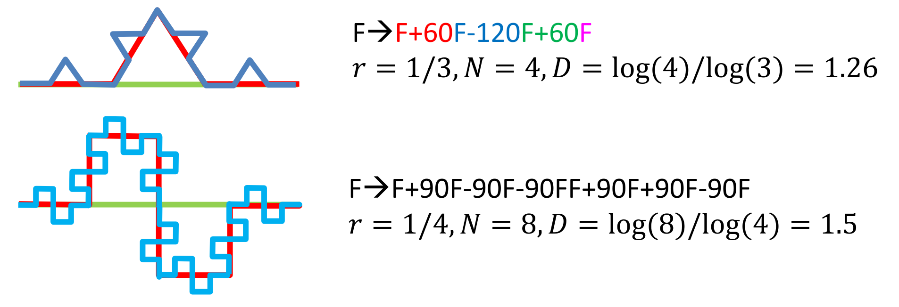

A Lindenmayer rendszerek egy magyar biológusról lettek elnevezve, hiszen arra használta őket, hogy különböző növények növekedését leírja. A módszer tényleg alkalmaz növényszerű önhasonló alakzatok leírására:


??? example Zajos rendszerek
    ## Fraktális zaj

    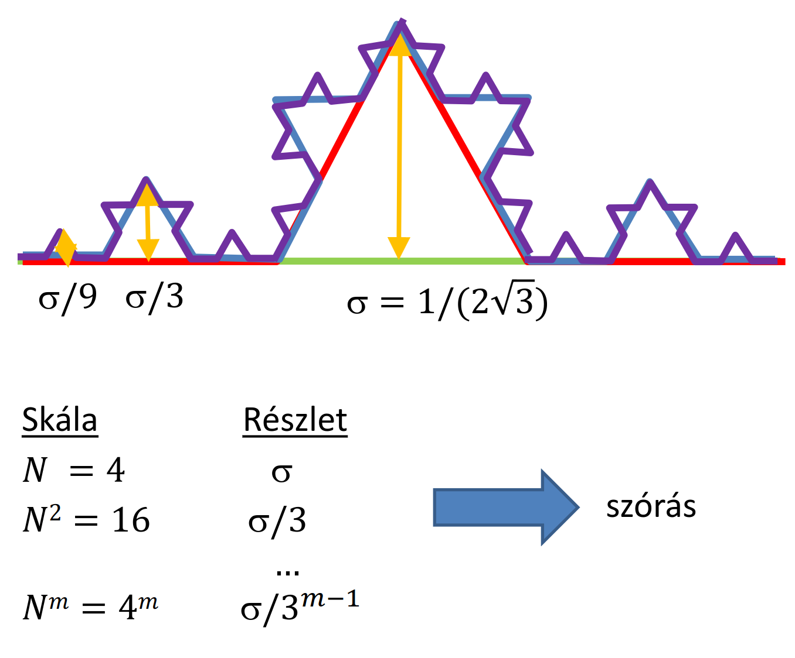

    - perturbációk generálása véletlenszerűen
    - ezek szórását a finomabb szintek felé csökkentsük
    - gyorsan csökken akkor sima görbe
    - lassan csökken akkor rücskösebb görbe

    ## Perlin zaj

    Felhők, hegyek, minecraft világ generálásához.

    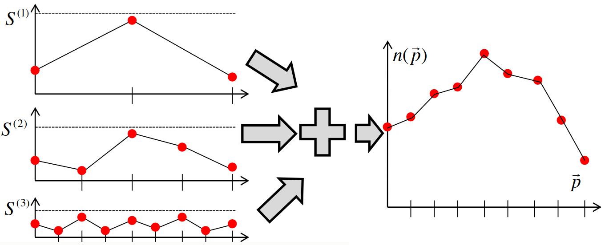

    - több skálán állítjuk elő a jelet
    - egyre kisebb szinteken egyre kisebb értékkészletből, de egyre több mintapontot generálunk
    - ezeket összeadva kapunk egy zajos tartományt

    - ÉK gyorsan csökken akkor sima
    - ÉK lassan csökken akkor rücskös

## Káoszelmélet

A kaotikus viselkedés tipikusan fraktálokat generál, tehát érdemes megvizsgálnunk a káosz fogalmát a fraktálok megértése érdekében.

### Nyulak szigete

Kezdjük a káoszelmélet egyik eredetproblémájával. Biológusok egy szigeten figyelték a nyúl populáció változását. Azt vették észre, hogy látszólag semmilyen rendszert nem követ, ezért felkértek egy matematikust, hogy alkosson meg egy rendszert, amiben már követhetőbb, hogy mi történik.

Vegyünk fel egy koordinátarendszert, ahol az $x$ tengely a jelenlegi évi nyulak számát ($x_n$) jelöli, az $y$ tengely pedig a következő évit ($x_{n+1}$). Ha kevés nyúl van a szigeten, akkor ha az összes szaporodik is, olyan nagyon nagy ugrást nem várhatunk a következő évben, tehát:

- kevés nyúl $\mapsto$ picivel több nyúl

Ez a növekedés eleinte lineáris, viszont elérkezik egy pont, amikor elkezd csökkenni. Hiszen a szigetnek véges erőforrásai vannak, nem tud végtelen sok nyulat eltartani, tehát ha már nagyon sok nyúl van, akkor kevés fog tudni szaporodni, és a következő évben megint kevés nyúl lesz:

- sok nyúl $\mapsto$ kevés nyúl

Ezt a viselkedést, hogy eleinte közel lineárisan növünk, utána pedig egy inflexiós pontot meghaladva közel lineárisan csökkenünk egy parabolával jól lehet jellemezni. A matematikus által megalkotott egyenlet a következő:

$$
x_{n+1​}=C \cdot x_n​ \cdot (x_{\text{max}} - ​x_n​)
$$

ahol $C \in \R$ és $x_{\text{max}}$ a maximális populáció száma. Ha pontosan ennyi nyúl lenne a szigeten, akkor a nyulak kihalnának.

Vizsgáljuk meg a különböző lehetőségeket $C$ értékére.

#### Kicsi erősítési tényező

Ha $C$ kicsi, akkor a parabolánk az $y = x$ egyenes alatt fut:

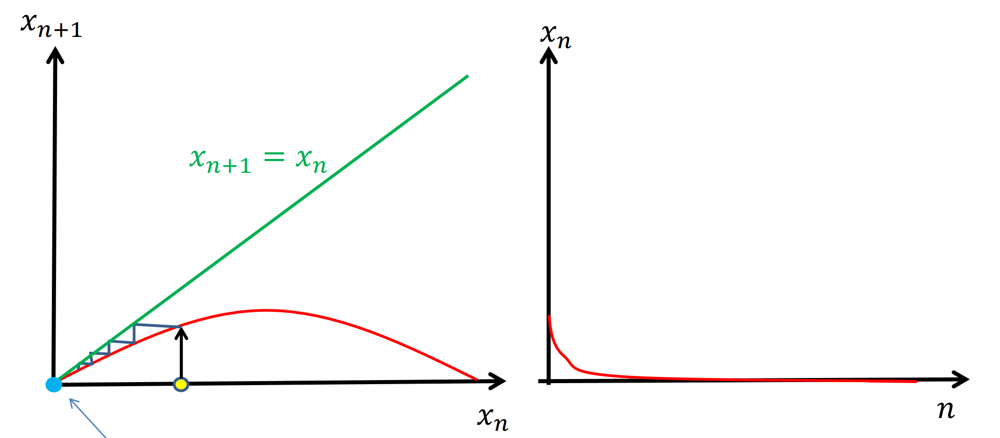

Válasszunk egy populációt az $x$ tengelyen (jelölje ezt a sárga pont) és kövessük végig, hogy mi történik.

Először is behelyettesítjük a pontunkat a parabolikus függvényünkbe, amit úgy is szemléltethetünk, hogy a sárga ponttól függőlegesen felfele megyünk, ameddig el nem metsszük a parabolát. Ezután a parabola jelenlegi értéke a következő évi nyúl populáció, azaz $x_{n+1}$. Mi kíváncsiak vagyunk viszont $x_{n+2}$-re is, tehát ezt az értéket újra be kell helyettesíteni a parabolikus függvényünkbe. Ezt a behelyettesítést grafikusan úgy is szemléltethetjük, hogy elmetsszük vízszintesen az $y = x$ egyenest a parabolánk pontjából, utána pedig újra függőlegesen mozgunk ameddig nem metsszük el újra a parabolát.

Ezt a folyamatot ismételve azt látjuk, hogy "konvergálunk" az origó felé, azaz a populáció évről évre csökken, végül pedig kihal.

Észrevehetjük, hogy az origóban ez a folyamat ugyan azt a pontot eredményezi, mint amiből kiindultunk (azaz az origóhoz az origót rendeli). Az olyan pontokat, melyekre

$$
x^{\ast} = F(x^{\ast})
$$

teljesül egy függvény _fixpontjának_ nevezzük. Ha $C$ kicsi, akkor csak az origó a fixpont.

#### Közepes erősítési tényező

Ha $C$ közepes, akkor a parabolánk egy része az $y = x$ egyenes fölött fog futni. Ez azt is jelenti, hogy a parabola és az egyenes már két pontban fogják metszeni egymást:

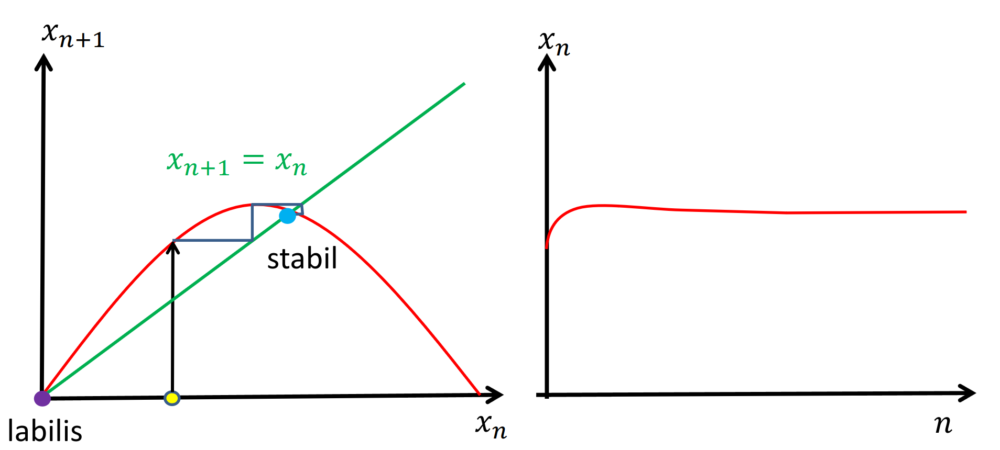

Abból a szempontból lesz "közepes" a $C$ erősítési tényező, hogy a második metszéspontban a parabola meredeksége abszolút értékben kisebb, mint egy. Ez azt jelenti, hogy bár csökken a parabola, de még "nem nagyon", éppen hogy csak picit negatív a meredeksége.

Ha megint eljátsszuk a grafikus iterációt mint az előző esetben, akkor azt vesszük észre, hogy bárhonnan is indítjuk el a szimulációt, mindig ugyan abba a pontba jutunk: a második metszéspontba. Ez a metszéspont is egy fixpont, tehát logikus, hogy ide konvergálunk.

#### Nagy erősítési tényező

Ha a második metszéspontban a meredekség már abszolút értékben nagyobb mint egy, az azt jelenti, hogy a parabolánk szinte mindenhol nagyon meredek. Az iterációt ismét eljátszva, és követve $x_n$ értékét ezt kapjuk:

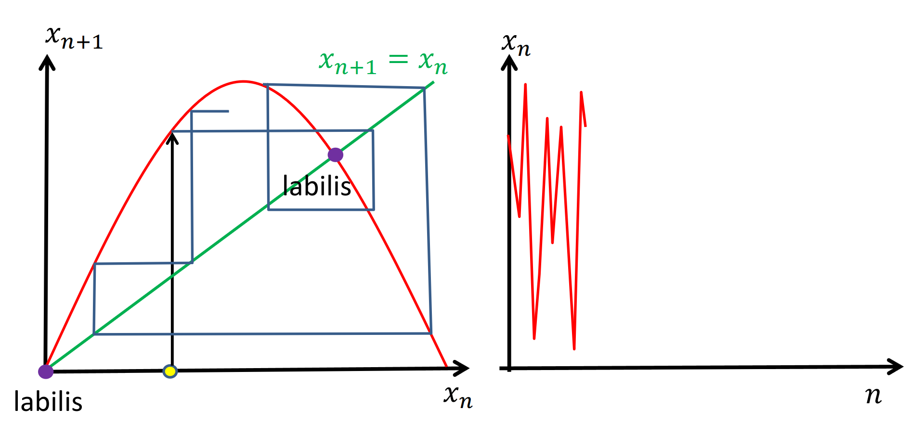

Ekkor azt tapasztaljuk, hogy a nyulak száma évről évre látszólag teljesen véletlenszerűen ugrál, pont úgy, mint ahogy a biológusok ezt tapasztalták. Itt a legtöbb pont nem konvergál egy konkrét értékhez, hanem össze vissza változik.

Fontos, hogy itt a véletlenszerűség tényleg csak látszólagos, hiszen a nyulak számát abszolút pontosan meghatározza a képletünk, melyet bevezettünk.

Ez is egy kaotikus rendszer, hiszen nagyon érzékeny a kezdeti feltételekre: ha csak egy pár nyúl egyeddel is megváltozik a kezdeti $x_0$ feltételünk, amiből kiindulunk, akkor az $n$-edik lépésben megfelelően nagy $n$-re már teljesen más $(x_1)_n$ és $(x_2)_n$ értékeket kapunk.

### Formális vizsgálat

Vizsgáljuk meg a káosz jelenségét kicsit formálisabban, eltekintve a nyulak szigetétől. Azt láttuk, a következő állapot a jelenleginek valamilyen függvénye:

$$
x_{n+1} = F(x_n)
$$

és ennek a függvénynek a többszörös alkalmazásával későbbi állapotokat is megkaphatunk:

$$
\begin{align*}
x_1 &= F(x_0)
x_2 &= F(x_1) = F(F(x_0))
x_3 &= F(x_2) = F(F(F(x_0)))
&\vdots
\end{align*}
$$

Az a kérdés, hogy ez az állapotsorozat, vagy trajektória hogyan viselkedik hosszútávon. Konvergál-e valamilyen $x^{\ast}$ állapotba, vagy a végtelenségig oszcillál látszólag random állapotok között?

A kérdés megválaszolásához a rendszer fixpontjait kell vizsgálnunk. Ha a trajektóriánk konvergens, akkor muszáj, hogy létezzen egy $x^{\ast}$ fixpont, melyre:

$$
x^{\ast} = F(x^{\ast})
$$

viszont ez önmagában nem elég, hiszen láttuk a nyúlsziget esetén is, hogy nagy $C$ esetén nem konvergált a sorozat sehova, de mégis volt két fixpontunk. Vezessünk be egy új fogalmat, mely le tudja írni egy $x^{\ast}$ fixpontról, hogy képes-e oda konvergálni a sorozat.

### Fixpontok stabilitása

Képzeljünk el egy golyót egy dombon, illetve egy völgyben:

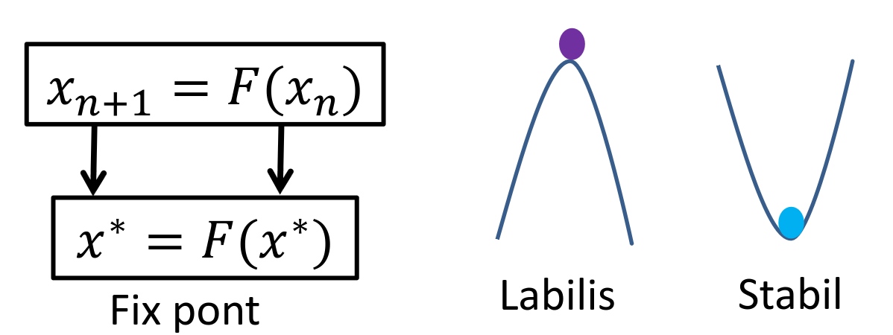

Ekkor a domb tetején, és a völgy alján lévő golyó is "stabil", azaz ha nem éri erőhatás, akkor nem fog elmozdulni. Mégis érezzük a különbséget: ha a domb tetején lévő golyót meglökjük, akkor az egyre csak távolodni fog a rendszer fixpontjától, míg a völgy alján lévő golyót ha meglökjük akkor egy idő után visszatér az eredeti helyzetébe.

A fixpontjainkat is hasonlóan osztályozhatjuk. A stabil fixpontok azok olyan fixpontok, melyeket több kezdőállapotból is el lehet érni, a rendszer oda konvergál. A labilis fixpontok azok olyan fixpontok, melyeket csak egy darab kezdőállapotból lehet elérni, magából a labilis pontból, és a legkisebb zavar esetén is már nem konvergens a rendszer.

Osztályozzuk gyakorlás képpen a nyúlszigetes példánk fixpontjait:

- kicsi $C$ esetén csak egy fixpont volt, az origó, és minden ide konvergált, tehát ez egy stabil fixpont
- közepes $C$ esetén már két fixpontunk volt: az origó, amitől minden távolodott (labilis), és a másik metszéspont, amibe minden konvergált (stabil)
- nagy $C$ esetén két metszéspontunk volt, de az egész rendszer oszcillált, tehát mindkét fixpont labilis volt

Hogyan tudjuk általánosságban (parabola felrajzolása nélkül) eldönteni egy fixpontról, hogy stabil, vagy labilis-e? Ugyan úgy, mint ahogy a mechanikai példánkban eldöntenénk: lökjük meg picit a labdát, és nézzük meg, hogy merre gurul. Mi is ezt tesszük: egy pici $\Delta x_n$ zavarást adunk hozzá a fixponthoz és nézzük meg, hogy idővel ez a zavarás nullához tart-e, vagy sem:

$$
x^{\ast} + \Delta x_{n+1} = F(x^{\ast} + \Delta x_n)
$$

Ha a $\Delta x_{n+1}$ sorozat a nullához tart, akkor előbb utóbb vissza érünk az $x^{\ast}$ fixpontba, tehát $x^{\ast}$ stabil, ellenkező esetben pedig labilis.

A fenti egyenletet közelítve, és átalakítva azt kapjuk, hogy a stabilitás feltétele:

$$
\begin{align*}
\text{Stabil: } &|F'(x^{\ast})| \lt 1 \\
\text{Labilis: } &|F'(x^{\ast})| \gt 1
\end{align*}
$$

A levezetésben feltettük, hogy $F$ egy egyszerű egyváltozós függvény, $x$ pedig egy skalár, ami bár a nyulak szigetén igaz volt, általánosságban nem feltétlenül, hiszen ha például $x$ egy virtuális világ állapota, akkor nagy eséllyel valamilyen vektor.

## Szimulálható...?

Térjünk vissza a téma eleji kérdéshez: szimulálható-e a természet egy virtuális világban? Tételezzük fel, hogy a valódi $\tilde{x}_0$ állapotot csak valamilyen közelítéssel ismerjük, azaz van valamilyen $\Delta x_0$ hibatényező (pl. mérési hiba). Ugyanez feltehető az $F$ függvényről, azaz:

$$
x_0 = \tilde{x}_0 + \Delta x_0 \\
F(x) = \tilde{F}(x) + \Delta F(x)
$$

Ekkor a korábbi képletünket alkalmazva azt kapjuk, hogy:

$$
\overbrace{F(x)}^{\ast_0} \approx \underbrace{\tilde{F}(\tilde{x})}_{\ast_1} + \overbrace{\tilde{F}'(\tilde{x}) \Delta x}^{\ast_2} + \underbrace{\Delta F(\tilde{x})}_{\ast_3}
$$

ahol:

$$
\begin{align*}
\ast_0 \colon& \text{általunk számított állapot} \\
\ast_1 \colon& \text{valóságos állapot} \\
\ast_2 \colon& \text{tökéletlen bemeneti állapot miatti hiba} \\
\ast_3 \colon& \text{jelenlegi számítás hibája}
\end{align*}
$$

Nézzük meg, hogyan viselkedik az állapotsorozatunk:

<!-- God hath mercy upon thee -levy04 -->

$$
\begin{align*}
x_1 &= F(x_0) = \tilde{F}(\tilde{x}_0) + \tilde{F}'(\tilde{x}_0)\Delta x_0 + \Delta F(\tilde{x}_0) \\
x_2 &= F(x_1) = \tilde{F}(\tilde{x}_0) + \tilde{F}'(\tilde{x}_1)\tilde{F}'(\tilde{x}_0)\Delta x_0 + \tilde{F}'(\tilde{x}_1)\Delta F(\tilde{x}_0) + \Delta F(\tilde{x}_1) \\
&\vdots \\
x_n &= F(x_{n-1}) = \tilde{F}(\tilde{F}(\ldots)) \\[-2.9em]
    & \hspace{10.65em} + \overbrace{\tilde{F}'(\tilde{x}_{n-1}) \dots \tilde{F}'(\tilde{x}_1)\tilde{F}'(\tilde{x}_0)\Delta x_0}^{\text{akkumulált hiba}} \\
    & \hspace{10.65em} + \tilde{F}'(\tilde{x}_{n-1}) \dots \tilde{F}'(\tilde{x}_0)\Delta F(\tilde{x}_0) \\
    & \hspace{10.65em} + \tilde{F}'(\tilde{x}_{n-1}) \dots \Delta F(\tilde{x}_1) \\
    & \hspace{10.65em} + \dots \\
    & \hspace{10.65em} + \Delta F(\tilde{x}_{n-1})
\end{align*}
$$

Ha $|F'| \gt 1$, akkor az összes hibatag exponenciálisan nő, tehát még akkor is, ha $\Delta x_0$ és $\Delta F$ tart a nullához, a hiba végtelenbe divergál. Ekkor már a rendszer állapotát sokkal inkább az akkumulált hiba tag határozza meg, mint a valódi állapot: ezt nevezzük káosznak.

Ezáltal kaotikus rendszereket nem tudunk pontosan szimulálni, hiszen ha csak egy pár ezred milliméter mérési hibát is összeszedünk, akkor a szimulációnk teljesen más lesz, mint a valóság.

## Pszeudó véletlenszám generátor

A kaotikus rendszerek bár determinisztikusak, mégis véletlenszerűnek tűnnek. Ha belegondolunk, ugyan így működnek a kódunkban a pszeudó véletlenszám generátorok: adunk egy kezdeti feltételt (`seed`), és a rendszer (látszólag) véletlenszerű értékeket vesz fel, de ha valaki ismeri a kezdeti feltételünket, akkor le tudja szimulálni a rendszer működését, és abban az esetben már egyáltalán nem tűnik véletlenszerűnek.

Nézzünk egy egyszerűsített példát a C véletlenszám generátor implementációjára:

```c
static uint x = 3;

void seed(uint s) { x = s; }

uint rand() {
    x = F(x);
    return x;
}
```

lényegében ez is egy kaotikus rendszer, csak megfelelő $F$ függvényt kell választani. Azt szeretnénk, hogy egyenletes legyen, és hogy $|F'(x)| > 1$ nagy és állandó legyen.

Egy lehetséges $F$ függvény az alábbi (ún. _kongruenciagenerátor_):

$$
F(x) = \{g \cdot x + c\}
$$

Ahol $\{\}$ a törtrész függvényt jelenti. Ekkor $F$ grafikonja az alábbi:

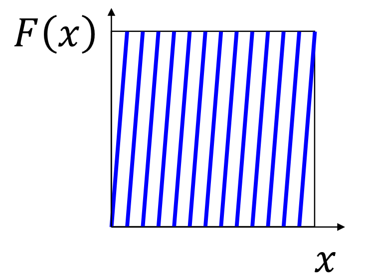

Ez sajnos viszonylag determinisztikus, ezért biztonsági okokból nem használható.

## Kaotikus rendszerek a síkon

Próbáljunk meg a nyulak szigetéhez hasonlóan más kaotikus rendszereket létrehozni, melyeket síkon lehet ábrázolni. Ismét lesz egy $F$ iterált függvényünk, amely által alkotott pontsorozatot ha a síkon ábrázoljuk, akkor valamilyen érdekes alakzatra számítunk. Most a komplex sík egyik pontját, azaz egy $z = x + \bm{i} y$ komplex számot fogunk megadni $F$-nek. Ennek az az előnye, hogy $F$ továbbra is egy egyváltozós függvény, viszont az az egy változó a komplex síkon egy pontnak felel meg.

Nézzünk egy példát arra, hogy mi lehet $F$. Tekintsük a

$$
F \colon z \mapsto z^2
$$

függvényt. Ez minden komplex számot négyzetre emel, és így alkot egy pontsorozatot a komplex síkon.

Érdemes polárkoordinátákban is kifejezni $z$-t, hiszen az geometriai jelentést is hordoz magával.

$$
z = r e^{\bm{i}\theta}
$$

Ezt behelyettesítve $F$-be:

$$
F\colon r e^{\bm{i}\theta} \mapsto r^2 e^{2\bm{i}\theta}
$$

azaz észrevehetjük, hogy ha alkalmazzuk $F$-et $z$-re, akkor az $r$ abszolútérték a négyzetére, a $\theta$ szög pedig a kétszeresére változik:

$$
\begin{align*}
r \mapsto r^2 \\
\theta \mapsto 2\theta
\end{align*}
$$

A szög kétszereződése most annyira nem érdekes, hiszen az $f \colon x \mapsto 2x$ egy lineáris függvény, viszont az abszolútérték változását egy négyzetes függvény írja le, amelyből már származik pár érdekes tulajdonság. Vizsgáljuk meg, hogy $F$ különböző bemenetek esetén milyen pontsorozatokat alkot! Három esetet különítünk el:

### Első eset: $r \lt 1$

Ekkor $r$, azaz $|z|$ kisebb mint $1$. Mivel az $f \colon x \mapsto x^2$ függvényre ezen a tartományon igaz az, hogy $f(x) \lt x$, ezért $f$ ismételt alkalmazásával $r$ értéke egyre csak csökkenni fog, amit geometriailag úgy lehet értelmezni, hogy ha a kezdőpontunk az egységkörön belül van, akkor a pontsorozat az origóba "esik", oda konvergál. A szög duplázódása miatt egy spirális pályát ír le a pontsorozat ahogy az origóba tart.

Mivel az origó az $F$-nek egy stabil fixpontja, ezért logikus, hogy oda konvergál a pontok egy része, viszont nézzük meg a többi esetet.

### Második eset: $r \gt 1$

Hasonlóan érvelve beláthatjuk, hogy mivel az $]1, \infty[$ tartományon $f(x) > x$, ezért a pontjaink sehova sem fognak konvergálni, egyre csak távolabb kerülünk az origótól. Ez a pálya is spirális, de divergens.

### Harmadik eset: $r = 1$

Vizsgáljuk meg a konvergens és divergens tartományok határát. Ha az egységkörön választunk egy pontot, akkor mivel $1 = 1^2$, ezért a pontok sosem hagyják el az egységkört. A három eset egy ábrán (az első eset kék, a második zöld, a harmadik piros):

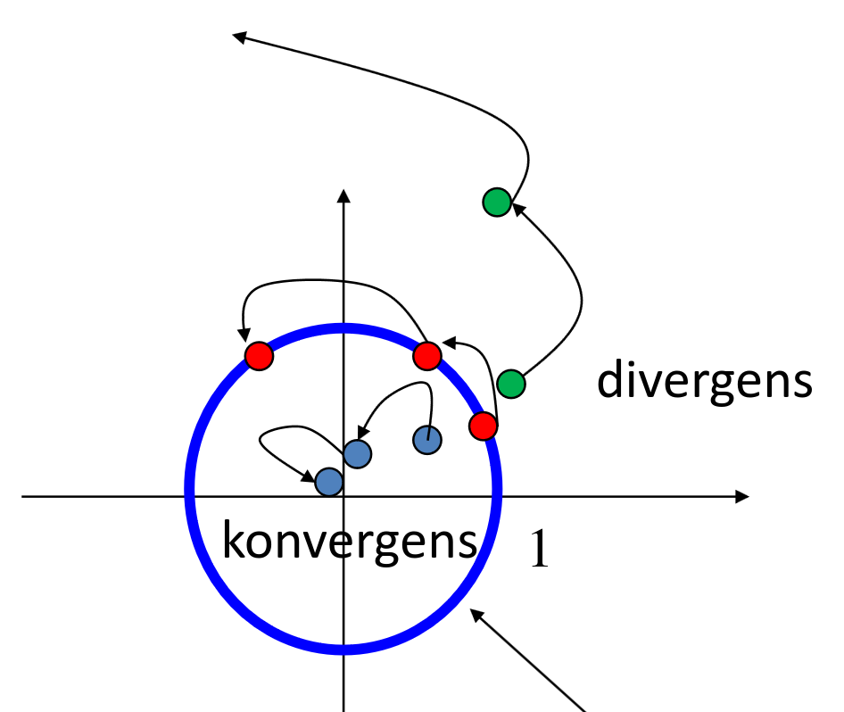

A szög változása miatt egyre nagyobb ugrásokban "keringünk" az origó körül, de se nem közelítjük, se nem távolodunk tőle. Ez azt jelenti, hogy $f$ a kör pontjait állítja elő.

Találkoztunk már hasonlóval. Idézzük fel, hogy egy $x$ fixpont esetén $x = F(x)$. Itt is valami hasonló történik, csak most nem egy fixpontunk van, hanem egy "fixkörünk", hiszen ha a körön választunk egy pontot, az sosem hagyja el a kört, szóval pongyolán megfogalmazva olyan, mintha $\text{kör} = F(\text{kör})$. Vezessünk be erre egy fogalmat!

### Attraktorok

!!! info 12.1. Definíció (Attraktor)
    A $H$ halmazt az $F$ függvény _attraktorának_ nevezzük, ha:

    $$
    H = F(H)
    $$

    azaz $H$ pontjaink képe összességében éppen a $H$ halmazt adja.

    ??? example Precízebb definíció
        Mit is értünk pontosan a $H = F(H)$ jelölés alatt? Elsőre úgy tűnhet, hogy azt, hogy $H$ bármely $x$ elemére igaz, hogy ha alkalmazzuk rajta az $F$ függvényt, akkor $F(x)$ is $H$ beli lesz:

        $$
        \forall x \in H \colon F(x) \in H
        $$

        azaz

        $$
        F(H) \sube H
        $$

        és ez igaz is, viszont csak az egyik irányba! Ha $H$ attraktora $F$-nek, akkor a fenti állítás tényleg igaz, viszont a fenti állításból nem következik, hogy $H$ attraktora $F$-nek. 
        
        Hogy lássuk, hogy miért, tegyük fel, hogy $F$ egy olyan függvény, hogy $H$-nak mindig ugyan abba a pontjába viszi az értékeket, tehát minden $x$-re $F(x)$ ugyan az az érték. Ekkor $H$-nak nem áll elő az összes pontja, tehát nem lehet $F$ attraktora, viszont a fenti állítás mégis igaz rá.

        A korábbi példánkban ez olyan lenne, mintha a $\theta$ szöget egy konstans függvény írta volna le, mondjuk $\theta = \pi$. Ekkor a kör bármely pontjára $F$-et alkalmazva a $z_{0} = e^{\bm{i}\pi}$ pontot kaptuk volna. Viszont nem ezt tapasztaltuk, hanem $F$ ismételt alkalmazásával előbb utóbb megkaptuk a kör összes pontját, azaz minden $x$ ponthoz létezett egy olyan $y$ pont, hogy $y$-ból megkaptuk $x$-et:

        $$
        \forall x \in H \thickspace \exists y \in H \colon x = F(y)
        $$

        azaz

        $$
        H \sube F(H)
        $$

        Az első állítással párosítva ez a két állítás ekvivalens azzal, hogy $H$ attraktora $F$-nek, és pontosan ezt is értjük a $H = F(H)$ jelölés alatt: $F$ csakis kizárólag $H$ pontjait állítja elő ($F(H) \sube H$), viszont az _összes_ pontot $H$-ban előállítja ($H \sube F(H)$). Se többet, se kevesebbet.

        Tehát akkor összegezve:

        $$
        H \text{ attraktora } F \text{-nek} \iff H \sube F(H) \land F(H) \sube H
        $$

        azaz kifejtve:

        $$
        H \text{ attraktora } F \text{-nek} \iff \forall x \in H : \Big[(F(x) \in H) \land (\exists y \in H \colon x = F(y))\Big]
        $$

Így már precízen meg tudjuk fogalmazni azt, hogy mit értünk az alatt, hogy $\text{kör} = F(\text{kör})$. Ha a példánkban $H$-nak az egységkört választjuk, akkor pontosan azt kapjuk, amit az intuíciónk sugallt. Bizonyos értelemben kiterjesztettük a fixpontok fogalmát halmazokra.

Ahogy a fixpontok esetében is voltak stabil és labilis pontok, így az attraktorok közül is lesznek stabilak és labilisak. A példánkbeli attraktor labilis, hiszen ha egy picit elmozdulunk az egységkörről, akkor vagy az origóba konvergálunk, vagy a végtelenbe divergálunk, de vissza az attraktorra semelyik esetbe se kerülünk.

### Inverz iterációs módszer

A labilis attraktorokból hogyan tudnánk stabilakat csinálni? Erre a feladatra ad megoldást az inverz iterációs módszer. Az az ötlet, hogy _ha $H$ halmaz $F$-nek egy labilis attraktora, akkor $F^{-1}$-nek stabil attraktora_, és fordítva. Később belátjuk, hogy miért, de először nézzünk egy példát.

Legyen $F\colon x \mapsto x^2$, $H$ pedig az egységkör. Ekkor fennáll a $H = F(H)$ egyenlet. Alkalmazzuk $F^{-1}$-et mindkét oldalra:

$$
H = F(H) \rightarrow F^{-1}(H) = H
$$

tehát azt kaptuk, hogy ha $H$ attraktora $F$-nek, akkor $F^{-1}$-nek is. Tudjuk, hogy $F$ esetén $z_{n+1} = z_{n}^2$, de mi a helyzet $F^{-1}$-el? Ekkor

$$
z_{n+1} = \pm \sqrt{z_n}
$$

Ez persze nem egy függvény, hanem egy kétértékű leképezés, de mivel teljesül rá az, hogy $F^{-1}(H) = H$, ezért ez nem fog zavarni minket. A fenti egyenletből $r$-t és $\theta$-t kifejezve:

$$
\begin{align*}
r_{n+1} &= \sqrt{n} \\
\theta_{n+1} &= \frac{\theta}{2} + \pi \cdot \{0|1\}
\end{align*}
$$

ahol a $\{0|1\}$ jelölés azt jelenti, hogy $z_{n+1} = + \sqrt{z_n}$ esetben $0$-val, $z_{n+1} = - \sqrt{z_n}$ esetben pedig $1$-el szorozzuk meg $\pi$-t.

Próbáljuk meg egy pontra alkalmazni ezeket a kifejezéseket! Ennek az eredménye az alábbi képen látható.

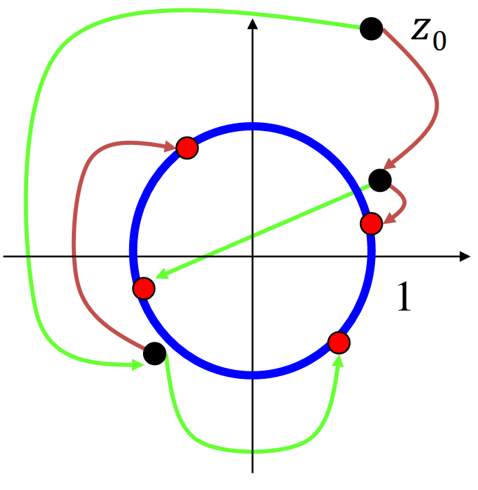

Mivel nem egy függvényünk van, hanem egy kétértékű kifejezésünk, ezért egy pontból kettő lesz, melyek egymás tükörképei az origóra nézve. Az előző példában láttuk, hogy az $f'\colon x \mapsto x^2$ függvény a $]-1, 1[$ tartományon a nullához konvergál, a $]-\infty, -1[ \cup ]1, \infty[$ tartományon pedig a végtelebe divergál, és ez volt az oka annak, hogy az attraktorunk labilis volt: mindkét esetben csak távolodtunk az $1$-től.

Most viszont az $f\colon x \mapsto \sqrt{x}$ függvényünkre már más lesz igaz. A $]0, 1[$ és az $]1, \infty[$ tartományon is az $1$-hez konvergál! A kifejezésünkben lényegében kétszer van ez az $f$ függvény, csak egyszer $+$, máskor meg $-$ előjellel, így lefedik a teljes $]-\infty, \infty[$ intervallumot, ahol végig az egységkörhöz konvergálnak! Így beláthatjuk, hogy az attraktorunk _stabil_.

Ezt precízebben megfogalmazva - megfelelően nagy $n$ esetén

$$
r_n = \sqrt[2^n]{r_0} \approx 1
$$

Ez megfelel annak az állításnak, hogy $F^{-1}$ csak az attraktor pontjait állítja elő. Már csak azt kell belátnunk, hogy az attraktor _összes_ pontját előállítja, melyhez a fázisszöget kell majd vizsgálnunk:

$$
\begin{alignat*}{2}
\theta_n &= \frac{\theta_0}{2^n} &&+ \pi \cdot \{0|1\} . \{0|1\} \{0|1\} \ldots \\
&\approx \underbrace{\cancel{\frac{\theta_0}{2^n}}}_{n \to \infty} &&+ \pi \cdot \{0|1\} . \{n-1 \text{ számjegyű bináris szám}\}
\end{alignat*}
$$

mivel a fázisszög mindig feleződik, ezért a kezdeti $\theta_0$ szögnek a $2^n$-enede jelenik meg. Minden egyes lépésben vagy $0 \cdot \pi$-t vagy $1 \cdot \pi$-t adtunk hozzá, ami után megint osztottunk kettővel, és ismét hozzáadtunk. Értelmezhetjük ezeket az összeadásokat és kettővel való osztásokat is mint egy darab bináris számmal való szorzás. Nézzünk egy példát:

$$
\begin{align*}
\theta_1 &= \frac{\theta_0}{2} + \pi \cdot 1 \\
\theta_2 &= \frac{\theta_1}{2} + \pi \cdot 0 = \frac{\frac{\theta_0}{2} + \pi \cdot 1}{2} + \pi \cdot 0 = \frac{\theta_0}{2^2} + \pi \cdot 0 + \frac{\pi \cdot 1}{2^1} \\
\theta_3 &= \frac{\theta_2}{2} + \pi \cdot 1 = \ldots = \frac{\theta_0}{2^3} + \pi \cdot 1 + \frac{\pi \cdot 0}{2^1} + \frac{\pi \cdot 1}{2^2} \\
&\ldots
\end{align*}
$$

Emeljünk ki $\pi$-t:

$$
\begin{align*}
\theta_3 &= \frac{\theta_0}{2^3} + \pi \cdot 1 + \frac{\pi \cdot 0}{2^1} + \frac{\pi \cdot 1}{2^2} \\
\theta_3 &= \frac{\theta_0}{2^3} + \pi \cdot (1 + 0 \cdot 2^{-1} + 1 \cdot 2^{-2}) \\
&\ldots \\
\theta_n &= \frac{\theta_0}{2^n} + \pi \cdot (1 + 0 \cdot 2^{-1} + 1 \cdot 2^{-2} + \ldots + 1 \cdot 2^{-(n-1)})
\end{align*}
$$

A zárójelben pont egy bináris számot kapunk, ahol a kettedes pont előtt egy, utána pedig $n-1$ számjegy áll.

??? info Számrendszerek segítség
    Emlékezzünk vissza, hogy például tízes számrendszerben egy számot szintén hasonló alakra lehet hozni:

    $$
    74.513_{10} = 7 \cdot 10^{1} + 4 \cdot 10^{0} + 5 \cdot 10^{-1} + 1 \cdot 10^{-2} + 3 \cdot 10^{-3}
    $$

    Hasonlóan működik ez kettes számrendszerben is:

    $$
    101.11_2 = 1 \cdot 2^2 + 0 \cdot 2^1 + 1 \cdot 2^0 + 1 \cdot 2^{-1} + 1 \cdot 2^{-2}
    $$

    A fenti esetben is ugyan ez történik.

Mivel minden lépésben a $+$-os és a $-$-os ágat is végrehajtjuk, ezért az $n.$ lépésben az $n$ bites számunk összes kombinációja meg fog jelenni, tehát a $[0, 2\pi[$ tartományban egyenletesen minden pontot lefedünk. Ezzel beláttuk azt is, hogy a kör összes pontja előáll (legalábbis az $n \to \infty$ esetben, a gyakorlatban meg csak közelítőleg).

Fontos még kiemelni, hogy a káosz egyik tulajdonságát nagyon jól szemlélteti ez a példa, mégpedig a kezdőfeltételek információjának eltűnését. Hiszen nagy $n$ esetén bármely $r_0$-ra $\sqrt[2^n]{r_0} \approx 1$ és bármely $\theta_0$-ra $\theta_0/2^n \approx 0$, tehát ha mondjuk $n = 10^100$, akkor $r_n$-ből és $\theta_n$-ből lehetetlen kitalálni, hogy mi volt $r_0$ és $\theta_0$.

Ezt a folyamatot algoritmikus szemptonból is megközelíthetjük. A $z_0$ kezdeti pontra ha alkalmazzuk a kétértékű leképezésünk, akkor két pontot kapunk, a $+\sqrt{}$ és a $-\sqrt{}$ irányba egyet-egyet. Ezekre ismételten a leképezésünket alkalmazva további pontokat kapunk, egy bináris fa struktúrában.

Az exponenciális növekedés miatt ha ezt meg akarnánk programozni, akkor nagyon hamar elfogyna a gépünk memóriája, tehát felmerülhet a kérdés, hogy ahelyett, hogy szélességi bejárást folytatunk, és a teljes fát ábrázolni akarjuk, nem tudjuk valahogy ezt lecserélni valamilyen mélységi bejárásra?

Ez annak felelne meg, mintha a bináris fa tetejéről kiindulva mindig csak az egyik élen mennénk le, azaz mindig vagy $+\sqrt{}$ vagy $-\sqrt{}$-el képeznénk új pontokat. Ezt a választást úgy kéne meghoznunk, hogy a mélységi bejárás által meglátogatott pontok is elég sűrűn lefedjék az attraktort, ami közel sem triviális. Ha mindig csak $+\sqrt{}$ vagy $-\sqrt{}$ irányba megyünk, akkor a $\theta_n$ fázisszög $0$ és $2\pi \equiv 0$ marad végig, tehát nem fedjük le az attraktort.

Próbáljunk meg mondjuk felváltva választani, ekkor:

$$
\begin{align}
\theta_{2n} \approx 1.010 \ldots \cdot \pi = \frac{4 \pi}{3} \\
\theta_{2n + 1} \approx 0.101 \ldots \cdot \pi = \frac{2 \pi}{3}
\end{align}
$$

Sajnos láthatjuk, hogy még így is csak két különböző pontot sikerült elérnünk, és ez általánosítható: ha egy $n$ hosszú periódussal haladunk, akkor $n$ darab pontot fogunk lefedni csak. Ez azt jelenti, hogy semmilyen periodikus sorozattal nem tudjuk elérni, hogy lefedjük a teljes attraktort.

A megoldást azt fogja jelenteni, hogy _véletlenszerűen_ választunk a leképzés két eredménye közül. Ekkor pozitív valószínűsége van bármely pontnak arra, hogy kiválassza az algoritmusunk. Ezzel tehát megoldottuk a kezdeti problémánkat: nem kell szélességi bejárást csinálni, ami az összes erőforrásunkat megenné, hanem szimplán minden leképezés után csak az egyik ággal dolgozunk tovább, amit véletlenszerűen döntünk el.

### Attraktorok felrajzolása

Mielőtt elkezdünk programokat írni, ki kell találnunk, hogy egyáltalán hogyan tudjuk vizualizálni az attraktorainkat. Az egyik megközelítés az lehet, hogy felismerjük, hogy az attraktor az divergens és konvergens régiókat választ el egymástól. Ha az összes konvergens pontot feketére színezzük, és a divergenseket fehéren hagyjuk, akkor a keletkező fekete alakzatoknak a határavonalai lesznek a függvény attraktorai.

Hogyan tudjuk eldönteni, hogy egy pont divergens-e vagy sem? Tudjuk, hogy például $F \colon z \mapsto z^2$ esetében

$$
z_{n+1}=z_{n}^2
$$

tehát, ha

$$
\lim_{n \to \infty} z_n \lt \infty
$$

akkor nem divergens. Persze amikor programozunk, akkor közelítenünk kell, általában jó nagy $n$-ig elmegyünk, és megnézzük, hogy meghalad-e egy bizonyos távolságot a $|z_n|$.

??? example "Fekete-fehér az unalmas"
    Későbbi diákon, illetve az interneten is sok helyen színekkel ábrázolják a Julia halmazokat.

    Ne jöjjünk zavarba, az alap logika ugyan az, annyi változtatást tehetünk, hogy a divergáló pontoknál megnézzük a küszöböt elérve, hogy milyen távol kerültek az origótól. A "leggyorsabban" divergáló ponthoz ha hozzárendelünk egy sötétkéket, a "leglassabban" konvergálóhoz pedig egy pirosat, és közöttük pedig lineárisan interpolálunk, akkor máris megkaphattuk azokat a szép színes Julia halmazokat amik fel-fel bukkannak az interneten.

### Julia halmaz

Így, hogy minden eszközünk meg van rá, próbáljunk meg felrajzolni pár attraktort! Ahogy korábban is láttuk, az $F \colon z \mapsto z^2$ függvény attraktora az egységkör. Lássuk tehát!

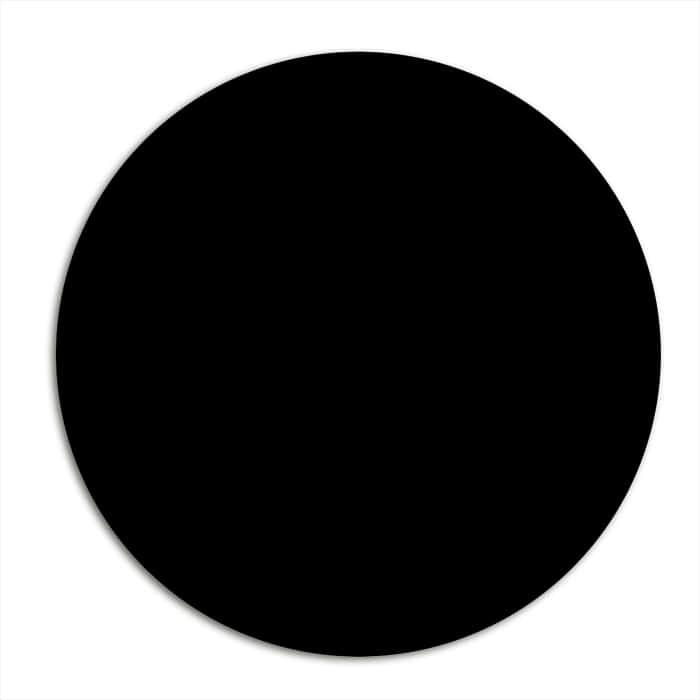

Hát... ennél azért könnyebb algoritmusaink is vannak körök felrajzolására...

Próbáljunk kicsit módosítani $F$-en, hogy érdekesebb alakzatokat kapjunk. Nézzük például az

$$
F': z \mapsto z^2 + c
$$

függvényt, ahol $c \in \cnums$. Ekkor ha variáljuk $c$ értékét, rettenetesen sok érdekes attraktort kapunk:

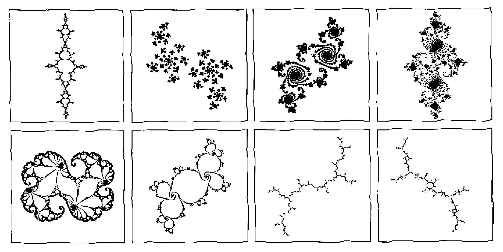

Az $F'$ összes attraktorának halmazát _Julia halmaznak_ nevezik (ejtsd: \[zsúlia\]).

#### Implementáció

Nézzük meg a kitöltött Julia halmaz implementációját. Pszeudokód szinten relatívan egyszerű: a kamerának kiválasztjuk egy pixelét (pontosabban egy olyan tartományt a virtuális világban ami egy pixelnek felel meg), és megnézzük, hogy az a pont divergál-e vagy sem. Ehhez választunk egy jó nagy küszöböt, és alkalmazzuk rá az $F'$ függvényt. A konvergenciájától függően vagy feketére vagy fehérre színezzük, és megyünk tovább (ehhez a megközelítéshez kódot az előadásdiákon találtok).

Érezhető viszont, hogy ez picit lassú. Nagyon sok időt töltünk el olyan pontokkal is, amik már pár iteráció után divergálnak, és ha nagyon hatékonyak akarunk lenni, akkor a divergens pontokkal még csak foglalkoznunk se kéne. Másrészt pedig pixelvezérelt, ami a modern, nagy felbontású képernyők esetében nem hatékony.

Próbáljuk meg implementálni a fentebbi véletlenszerűségre alapuló algoritmust. Csak az attraktor pontjait (a konvergens pontok nélkül) előállíthatjuk az inverz iteráció módszerével is. Ez egy "gyökvezérelt" megközelítés, és sokkal hatékonyabb lesz. Az alapjait már fentebb tárgyaltuk: az attraktor egy pontjából elindítjuk az iterációt és minden lépésben alkalmazzuk $F^{-1}$-et a pontunkra, és véletlenszerűen választunk a $\pm$ előjelek között. Ezt elég nagy küszöbig ismételve, ha az összes pontot amit bejártunk kiszínezünk feketére, akkor megkapjuk az attraktort.

Stabil attraktorok esetén könnyű meghatározni az attraktor egy pontját (elindítunk egy sorozatot az attraktor közeléből, és ami után elértük, azokat a pontokat amikkel csak megközelítettük eldobjuk), viszont labilis attraktorok esetén muszáj az attraktor egy pontját, azaz $F$ vagy $F^{-1}$ egy fixpontját kiválasztanunk.

```cpp
const int DEPTH = 100;

void generate_attractor(Complex c) {
    // z = z^2 + c másodfokú egyenlet valamelyik gyöke
    Complex z = get_starting_value(c);

    for(n = 0; n < DEPTH; n++) {
        if(VisibleInWindow(z)) {
            pixel = WindowViewport(z);
            image[pixel] = black;
        }
        // z = sqrt(z - c)
        z = F_inverse(z, c);

        // randomly choose pos or neg root
        if (get_random_number(0, 1) > 0.5) z = -z; 
    }
}
```

Részletesebb magyarázathoz ajánlom az [előadásvideó ezen részét](https://youtu.be/4-5_UzT6SFQ?si=9OIrHGFQrlBpCLUV&t=2317).

## Mandelbrot halmaz

Mandelbrot arra volt kíváncsi, hogy miért van az, hogy a Julia halmazok néhány $c$-re összefüggőek, bizonyos esetekben viszont meg különálló ponthalmazok. Definiált egy halmazt, ami azon $c$ komplex számokból áll, amelyekre az ahhoz tartozó Julia halmaz összefüggő.

Ha a Mandelbrot halmazt ábrázoljuk a síkon, akkor több dolgot is tapasztalhatunk:

- az alakzat fraktális, tehát bármennyire is ráközelítünk nem egyszerűsödik le, végtelenségig új alakzatok és komplexitások tűnnek fel.
- nem önhasonló, tehát a végtelen komplexitás soha sem ismétlődik

Ha egy pontra "végtelenségig" rá tudnánk közelíteni, akkor a közvetlen környezetében a hozzá tartozó Julia halmaz jelenne meg. A Mandelbrot halmazt az emberiség által ismert legbonyolultabb geometriai alakzatnak tartják.

!!! info Érdekességek
    Egy videó, ami ugyan kicsit szájbarágósan, de élvezhetően elmagyarázza a komplex számokat és a Mandelbrot halmazt: [The Mandelbrot Set (VSauce)](https://youtu.be/MwjsO6aniig?t=71)

    Isten létezésének bizonyítása a Mandelbrot halmazzal (ennek még kevesebb köze van az anyaghoz): [Proving God exists using Math](https://www.youtube.com/watch?v=z0hxb5UVaNE)

    A 3D változata "Mandelbulb" néven ismert.

Hogyan tudnánk mégis ábrázolni? Hát ha pusztán a definícióból indulunk ki, akkor elég nehezen. Szerencsére vannak egyszerűbb módszerek.

### Julia halmazok összefüggése

<!-- 
## ISF

ISF = Iterált Funkciós Rendszer

### Inverz feladat

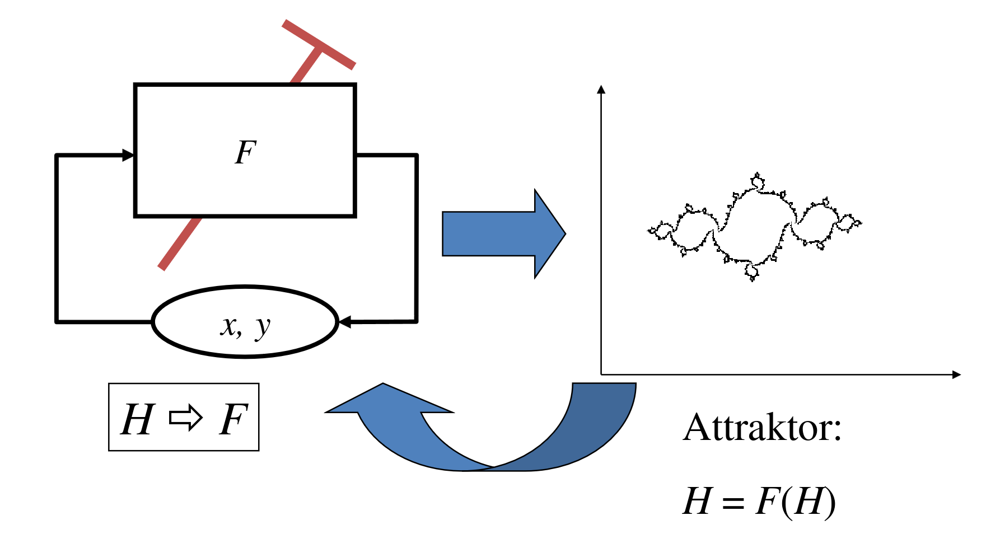

Inverz feladat, tehát $H$ ismert és $F$-et szeretnénk.

$F$ szabadon vezérelt, legyen stabil attraktora:

$H = F(H) = W_1(H) \cup W_2(H) \cup W_3(H) \cup W_4(H)$

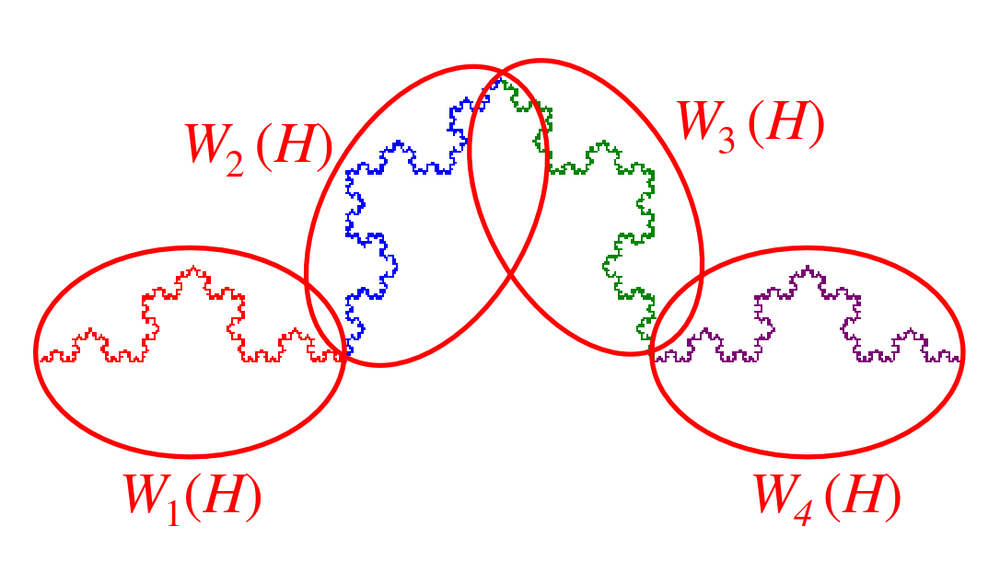

$\boxed{W_k (x,y) = [x,y]\cdot A_k + q}$

Ez egyet pont lineáris transzformációját és eltolását határozza meg.

$F = W_1 \vee W_2 \vee ... \vee W_m$

Nem feltétlenül hasonlósági transzformáció!

Nem csak önhasonló objektumokhoz használjuk.

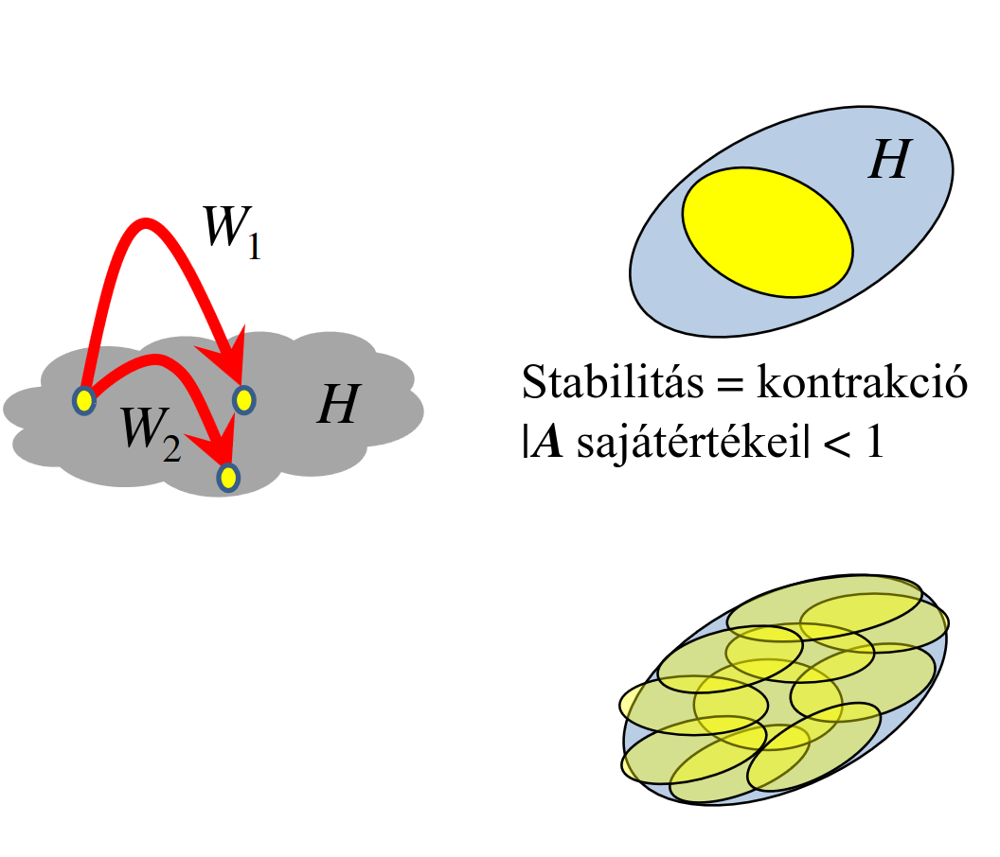

 -->
---

!!! quote ""
    A 2024/2025/II félévben nem voltak ebben a témában kvízek.

# Kvíz

!!! question 1\. Jelölje ki azon komplex számokat, amelyeket a Mandelbrot halmaz tartalmaz.
    - $-1+i$
    - $-1$
    - $1$
    - $0$
    - $i$
    - $-i$

??? tip Megoldás
    "Azon $c$ komplex számok, amelyekre a $z \to z^2 + c$ Julia halmaza összefüggő." azaz ahol $z \to z^2 + c$ nem divergál.

    - [ ] -1+i
        - Magyarázat:
    
    $$
    \begin{align*}
    z_1 &= -1+i \\
    z_2 &= 1 -2i +i^2 + (-1+i) = -1-i \\
    z_3 &= 1 +2i +i^2 + (-1+i) = -1+3i \\
    &\vdots \implies \text{Divergens}
    \end{align*}
    $$

    - [x] -1
        - Magyarázat:

    $$
    \begin{align*}
    z_1 &= -1 \\
    z_2 &= 1 - 1 = 0 \\
    z_3 &= 0 - 1 = -1 \\
    &\vdots \implies \text{Oszcillál}
    \end{align*}
    $$

    a többi példa gyakorlásnak:

    - [ ] 1
    - [x] 0
    - [x] i
    - [x] -i

---

!!! question 2\. Az $F(z)=e^z + c$ függvényt iteráljuk, ahol a kezdeti állapot $z_0=\frac{\ln(2)}{2} + {i}\frac{\pi}{4}$ és $c=-1-i$. Mennyi az első iteráció után az állapot valós része?

??? tip Megoldás
    $$
    \begin{align*}
    z_1 &= e^{\frac{\ln(2)}{2}} \cdot e^{i\frac{\pi}{4}} -1 -i \\
    &= \sqrt2 (\cos(\frac \pi 4​)+ i \sin(\frac \pi 4​)) -1 -i \\
    &= \sqrt2 \cdot \frac{\sqrt 2}2 (1+ i) -1 -i = 0
    \end{align*}
    $$

---

!!! question 3\. Mekkora a Hausdorff dimenziója az alábbi L-rendszer által definiált alakzatnak:
    F $\to$ FFFFFFFFF

??? tip Megoldás
    Elképzeljük magunk előtt a teknőcöt, csak egyenesen megyünk, az eredmény egy $9$ részből álló egyenes szakasz.
    Tehát ha nem ugrik be egyből, hogy ez $1$ dimenziós, akkor itt van levezetve:

    $$
    D = \frac{\log{N}}{\log(1/r)} = \frac{\log 9}{\log{\frac 1 {1/9}}} = 1
    $$

---

!!! question 4\. Mekkora a Hausdorff dimenziója az alábbi L-rendszer által definiált alakzatnak:
    F $\to$ -90F+90F+90FF-90F-90FF+90F+90F

??? tip Megoldás
    Érdemes lerajzolni, szép négyszögjelféleség.
    A szakaszok hossza az egész kiterjedésnek $1/3$-a, és $9$ szakaszunk (ahogy $9$ F betű is) van.

    $$
    D = \frac{\log{N}}{\log(1/r)} = \frac{\log 9}{\log 3} = 2
    $$

---

!!! question 5\. Nagy Britannia partvidékének hosszát megmérve $256$ km-es vonalzóval, a hossz $2048$ km-re adódott. Amikor megismételtük a mérést $128$ km-es vonalzóval, akkor eredményül $2560$ km-t kaptunk. Mekkora a partvidék vonalzó dimenziója?

??? tip Megoldás
    $$
    r = \frac{128}{256}
    $$

    $$
    N = \frac{20}{8}
    $$

    Tehát:

    $$
    D = \frac{\log{N}}{\log(1/r)} = 1.32
    $$

---

!!! question 6\. Tekintsük az alábbi iterált függvényt: $F(x)=2x(1-x)$. Mekkora a függvény legnagyobb fixpontjának az értéke?

??? tip Megoldás
    Az $x = 2x(1-x)$ helyen.

    $$
    \begin{align*}
    x &= 2x - 2x^2 \\
    0 &= 2x^2 - x \\
    x_1 &= 0 \\
    x_2 &= \frac 1 2 \\
    \end{align*}
    $$
    
    Tehát a válasz $0.5$

---

!!! question 7\. Tekintsük az alábbi iterált függvényt: $ F(x)=Cx(1-x)$. Legalább mekkorának kell lennie a $C$ faktornak, hogy az iteráció ne legyen konvergens?

??? tip Megoldás
    A stabil pontok:

    $$
    \begin{align*}
    x &= Cx(1-x) \\
    x_1 &= 0 \\
    x_2 &= \frac{C-1}{C}
    \end{align*}
    $$

    Az $x_0$ pont akkor stabil, ha $|F'(x_0)| < 1$, tehát:

    $$
    \begin{align*}
    F'(x) &= C(1-2x) \\
    F'(x_1) &= C
    \end{align*}
    $$

    tehát $|C| < 1$ és

    $$
    \begin{align*}
    F'(x) &= C(1-2x) \\
    F'(x_2) &= -C + 2
    \end{align*}
    $$
    
    $|-C+2| < 1$ azaz $1 < C < 3$ vagyis a válasz $3$

---

!!! question 8\. Adja meg az alábbi Sierpinski szőnyeg Hausdorff dimenzióját:
    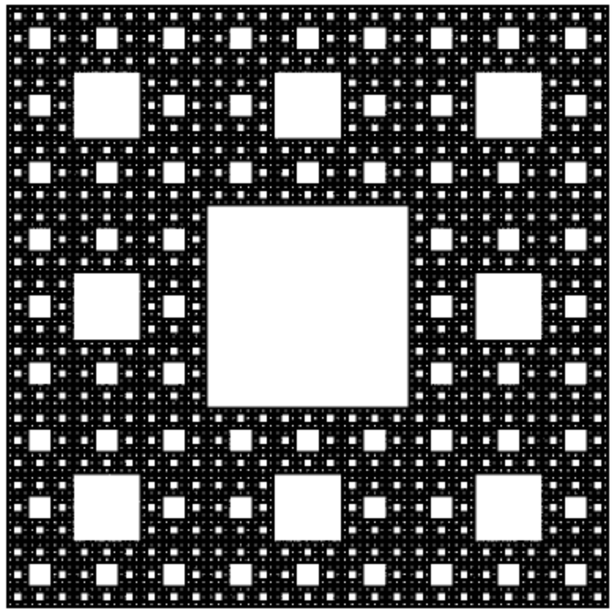

??? tip Megoldás
    $$
    r = \frac{1}{3}
    $$

    $$
    N=8
    $$

    Tehát:

    $$
    D = \frac{\log 8}{\log 3} = 1.9
    $$

---

!!! question 9\. Mekkora a Hausdoff dimenziója az alábbi alakzatnak (két értékes jegyre):
    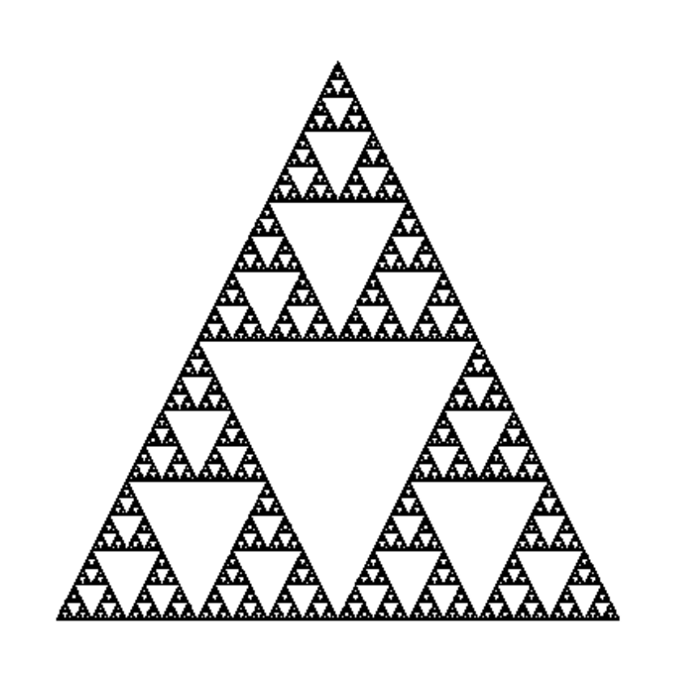

??? tip Megoldás
    $$
    r = \frac{1}{2}
    $$

    $$
    N=3
    $$

    Tehát:

    $$
    D = \frac{\log 3}{\log 2} = 1.58
    $$

[Előző](11.md)
