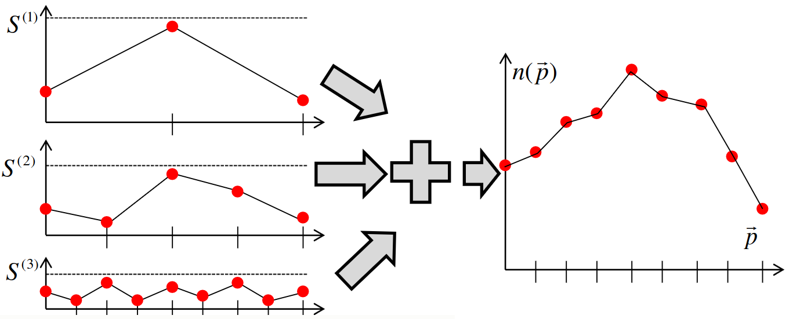
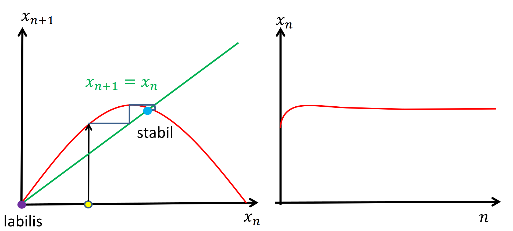
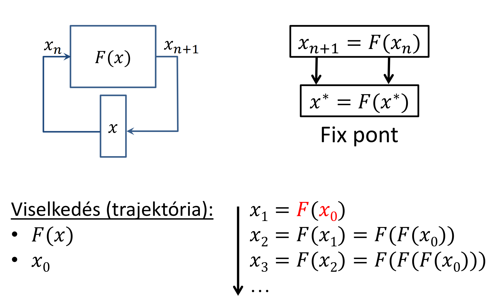

<!-- érints lindenmayer rendszereket -->

# Fraktálok 

> Idáig a virtuális (euklideszi, gömbi, hiperbolikus) világunkat "simának" (tökéletes sík, egyenes) tekintettük, ez kicsiben is tökéletesen differenciálható

> A természetben viszont aligha találkozhatunk ilyen ideális görbékkel, felületekkel, testekkel, belenagyítva minden érdes, tökéletlen, nem lineáris, nem differenciálható.

## Koch görbe


- adott iteráció hossza: $l_n = l_0 \bigg(\cfrac{4}{3}\bigg)^n \to \infin$
- véges tartományban végtelen hosszú $\Rightarrow \text{Dimenzió} > 1$
- területe zérus $\Rightarrow \text{Dimenzió} < 2$
- folytonos
- sehol sem differenciálható (tüskés, sehol sem sima eléggé)
- önhasonló = le lehet fedni a saját kicsinyített változatával

## Hausdorff dimenzió önhasonló objektumokra
- vegyünk egy kiindulási alakzatot
- erre $r$-szeres kicsinyítést alkalmazunk (mérete $\frac 1 r$-szeres lesz)
- majd fedjük le a tartományt $N$ db ilyen kicsivel
- ezt végtelenszer ismételjük
- ha kész vagyunk, akkor a Hausdorff dimenziója $D$, ahol

    $N = 1/r^D \quad \Rightarrow \quad D = \frac{\log{N}}{\log(1/r)}$

- pl. a fenti Koch görbe esetén $1/3$ méretűre kicsinyítettük a kiindulási szakaszt, és $4$-szer fedtük le vele a tartományt, tehát $D = \frac{\log 4}{\log 3} \approx 1.26$

## Nem önhasonló objektumok: vonalzó dimenzió
<!-- avagy a szirmay shadow realm -->

Önhasonló objektumokra


$D =  \cfrac{\log(\text{Hossz}(l))}{\log(l)} + 1$
> (tippre $l$ a vonalzó egység hossza, $\text{Hossz}(l)$ a teljes hossz azaz $l \cdot db$)

Alkalmazása: természetes objektumok elkülönítése és kategorizálása


## Lindenmayer rendszerek
> hogyan állítjuk elő ezeket?


Odaképzeljük az elejére a comlogós teknőcöt, és készítünk egy előre (`F`) függvényt, ami rekurzívan hívja meg saját magát, majd fordulgat stb.
> nyilván valami mélységet beállítasz neki, mert a matematikai végtelen valóságos stackoverflowhoz tud vezetni :innocent:


## Fraktális zaj
<!-- 
<rant>
    ismét el van magyarázva nyilván
    de annyira fusztráló tényleg hogy ott van egy üres dia és akkor fejtsd meg...
    aztán rohansz a jegyzethez ott meg egy 500 oldalas esszé és akkor most nem tudod hogy mégis milyen részletességgel kell
    szóval megnézed raktárban a jegyzetet és rájössz hogy valszeg az előző kolléga sem értette
    AAAAAAAAAAAAAAAAAAAAAAAAAAA
</rant> 
-->


- perturbációk generálása véletlenszerűen
- ezek szórását a finomabb szintek felé csökkentsük
- gyyorsan csökken $\Rightarrow$ sima görbe
- lassan csökken $\Rightarrow$ rücskösebb görbe

## Perlin zaj
> felhők, hegyek, minecraft világ generáláshoz



- több skálán állítjuk elő a jelet
- egyre kisebb szinteken egyre kisebb értékkészletből, de egyre több mintapontot generálunk
- ezeket összeadva kapunk egy zajos tartományt

> ÉK gyorsan csökken $\Rightarrow$ sima
> ÉK lassan csökken $\Rightarrow$ rücskös


# Káosz

## Nyulak szigete
<!-- pyon! -->
> És nem, nem ússzuk meg a Margit-szigettel.
> Itt a populáció modellre kell gondolni.

$x_{n+1​}=Cx_n​(x_{max}​x_n​)$

ahol

- $x_n$​: populáció az n-edik lépésben
- $C$: szaporodási ráta (együttható)
- $x_max$: maximális populáció (amit a környezet elbír)

különbőző $C$ esetek:

- $C$ kicsi: 
- $C$ közepes: 
- $C$ nagy: 


## Iterált függvények, fix pontok


> Volt ilyen analízisből, mindenki tudja és szereti.
> Annyiból áll, hogy $x_{n+1}$-et (a következő elemet) adjuk meg $x_n$ (az előző elem) függvényében.

Fix pont

- azon $x^*$-ok, amit ha odaadunk a függvénynek önmagát kapjuk vissza (fix)
- matematikailag ez annyit tesz, hogy $x^* = F(x^*)$ (képe önmaga)
- fix pont viszont lehet stabil és labilis is: 
- tehát azaz vagyis akkor tekintjük stabilnak, ha $|F'(x^*)| < 1$

## Káosz

- maga a rendszer teljesen determinisztikus (két ugyan arra a bemenetre mindig ugyan azt kapom vissza) de mégsem tudom megjósolni a működést, mert bármilyen kis változtatás a kezdeti állapoton teljesen más eredményt ad vissza
> megint jó példa a minecraft, gondoljunk csak a seedre:
> - kétszer ugyan azzal a seeddel generált világ teljesen ugyan az lesz
> - ha már csak egy számjegyet is változtatok rajta, a két világ közti különbség ég és föld

- kis perturbáció nagyon eltérő viselkedéshez vezet
    - ha a perturbáció a 0-hoz tart akkor se lesz ugyanaz
- autokorrelációs függvény a nullához tart, tehát a kezdőérték nem befolyásolja, hogy később hogy fog működni

- "megjósolhatatlanság"
- teljesítmény sűrűség spektrum nem lehet sávkorlátozott / nem tart zérushoz $\to$ nagy frekvencia lehet *(jelentsen ez akármit is)*


## Pszeudó véletlenszám generátor
```c
static uint x = 3;

void seed(uint s) { x = s; }

uint rand( ) 
{
    x = F(x);
    return x;
}
```
azaz tehát vagyis

$x_{n+1} = F(x_n)$ és

$|F'(x)| > 1$ nagy és állandó

pl. legyen

$F(x) = \{g \cdot x + c\}\quad$ ($\{\}$ a törtrészt jelenti)


> ez viszont viszonlag determinisztikus, biztonsági okokból nem kimondottan a legmegfelelőbb


# Kaotikus rendszerek a síkon


- azt szeretnénk, hogy egy pontsorozatot adjon, ami kirajzol valamit
- pont a 2D síkon
    - komplex szám
    - $x, y$ számpár

> mi legyen $F$?

pl.
$F: z \mapsto z^2$


- komplex szám abszolút értéke szerint 3 csoportra osztható
    - $|z| = 1 $: 1 marad a távolsága az origótól, körülötte forog
    - $|z| < 1 $: csökken a távolsága az origótól, spirális pályán konvergál felé
    - $|z| > 1 $: nő a távolsága az origótól, spirális pályán divergál

- a kör szétválasztja a stabil és instabil tartományokat
- a kör maga egy (ugyan labilis de) attraktor
    - $\approx$ bármely pontjára nézve $F$ függvény eredménye szintén egy pontja lesz
    $F(H) = H$

> azért labilis, mert ha ettől egy picit is eltérünk akkor "elvisz a fenébe"

## Attraktor felrajzolása
- attraktor a divergens (labilis) és konvergens (stabil) határa
    - $\Rightarrow$ kitöltött attraktor = nem divergens pontok *(magyarán ami belül és rajta van)*
    - $z_{n+1} = z_n^2$: ha $|z_\infin| < \infin$ (azaz nem divergens) akkor fekete
- iterálunk a pontokon és megnézzük merre mennek, színezünk
- ha az attraktorhoz konvergálunk $\to$ attraktor stabil
- labilis attraktorhoz soha nem konvergálunk
- pl: $z_{n+1} = z_n^2$ attraktora labilis (nem a körvonalhoz konvergálunk hanem a középpontjához)

## Inverz iterációs módszer


$H=F(H) \Rightarrow H=F^{-1}(H)$

$z_{n+1} = z_n^2 ~~\Rightarrow z_{n+1} = \pm \sqrt{z_n}$

$r_{n+1} = \sqrt{r_n}$

$\varphi_{n+1} = \varphi_n/2 + \pi\{0|1\}$ (azaz $\pi ~\cdot$ vagy $0$ vagy $1$, mert 2 gyök van)

Midőn $n \to \infin$:

$r_{n} = \sqrt[2^n]{r_0} \to 1$

azaz vagyis tehát a körön lesz előbb vagy utóbb de leginkább csak közelíti

- függvény attraktora (ha van neki) megegyezik az inverzével, de stabilitása ellentétes lesz (stabil $\rightleftarrows$ labilis)
- $z^2$-nél távolabb visz (labilis), inverzénél ($\sqrt{z_n}$) közelebb visz (stabil) az iteráció az attraktorhoz

## Többértékű leképzés: bolyongás

- $\varphi_{n+1} = \varphi_n/2 + \pi\{0|1\}$
    azaz 
    - a pozitív gyök esetén $\varphi \to 0$
    - a negatív gyök esetén $\varphi \to 1$
- ha mindig csak egy irányba megyünk az nem lesz jó, véletlenszerűen bolyongunk benne

## Julia halmaz
$F: z \mapsto z^2 + c$
Kölönböző $c$-k esetén:


### Implementáció
> 2 féle megközelítés:

> - "gyökvezérelt": számoljuk a gyököket egy bizonyos mélységig, és az érintett pixeleket átszínezzük
> - pixelvezérelt: minden pixelre a függvény inverzén iterálunk, az alapján színezünk
> *(elég gettó megfogalmazás de nekem ez jött át, kódot nem kaptok \:P)*


## Mandelbrot halmaz
Azon c komplex számok, amelyekre a $z \mapsto z^2 + c$ Julia halmaza összefüggő.

Egy videó, ami ugyan kicsit szájbarágósan de szerintem élvezhetően elmagyarázza a komplex számokat és a Mandelbrot halmazt: [The Mandelbrot Set (Vsauce)](https://youtu.be/MwjsO6aniig?t=71)

Isten létezésének bizonyítása a Mandelbrot halmazzal (ennek mégkevesebb köze van az anyaghoz): [Proving God exists using Math](https://www.youtube.com/watch?v=z0hxb5UVaNE)

A 3D változata Mandelbulb néven ismert.

## ISF

ISF = Iterált Funkciós Rendszer

### Inverz feladat


Inverz feladat, tehát $H$ ismert és $F$-et szeretnénk.

$F$ szabadon vezérelt, legyen stabil attraktora: 

$H = F(H) = W_1(H) \cup W_2(H) \cup W_3(H) \cup W_4(H)$


$\boxed{W_k (x,y) = [x,y]\cdot A_k + q}$

Ez egyet pont lineáris transzformációját és eltolását határozza meg.

$F = W_1 \vee W_2 \vee ... \vee W_m$

Nem feltétlenül hasonlósági transzformáció!

Nem csak önhasonló objektumokhoz használjuk.


# Kvíz

> 1\. Jelölje ki azon komplex számokat, amelyeket a Mandelbrot halmaz tartalmaz.

*Megoldás:*

*"Azon c komplex számok, amelyekre a $z \to z^2 + c$ Julia halmaza összefüggő."* Azaz ahol $z \to z^2 + c$ nem divergál.


- [ ] -1+i 
    $z_1 = -1+i$
    $z_2 = 1 -2i +i^2 + (-1+i) = -1-i$
    $z_3 = 1 +2i +i^2 + (-1+i) = -1+3i$
    $\vdots\quad$ belátjuk hogy elszáll
- [x] -1
    $z_1 = -1$
    $z_2 = 1 - 1 = 0$
    $z_3 = 0 - 1 = -1$
    $\vdots\quad$ innen már oszcillál

a többi példa gyakorlásnak:

- [ ] 1
- [x] 0
- [x] i
- [x] -i


---
> 2\. Az $F(z)=e^z + c$ függvényt iteráljuk, ahol a kezdeti állapot $z_0=\frac{\ln(2)}{2} + {i}\frac{\pi}{4}$ és $c=-1-i$.
Mennyi az első iteráció után az állapot valós része?

*Megoldás:*

$z_1 = e^{\frac{\ln(2)}{2}} \cdot e^{i\frac{\pi}{4}} -1 -i$

$z_1 = \sqrt2 (\cos(\frac \pi 4​)+ i \sin(\frac \pi 4​)) -1 -i$

$z_1 = \sqrt2 \cdot \frac{\sqrt 2}2 (1+ i) -1 -i = 0$

---
> 4\. Mekkora a Hausdorff dimenziója az alábbi L-rendszer által definiált alakzatnak:
F -> FFFFFFFFF

*Megoldás:*

Elképzeljük magunk előtt a teknőcöt, csak egyenesen megyünk, az eredmény egy 9 részből álló egyenes szakasz.
Tehát ha nem ugrik be egyből, hogy ez $1$ dimenziós, akkor itt van levezetve:

$D = \cfrac{\log{N}}{\log(1/r)} = \cfrac{\log 9}{\log{\frac 1 {\frac 1 9}}} = 1$


---
> 5\. Mekkora a Hausdorff dimenziója az alábbi L-rendszer által definiált alakzatnak:
F -> -90F+90F+90FF-90F-90FF+90F+90F

*Megoldás:*
Érdemes lerajzolni, szép négyszögjelféleség. 
A szakaszok hossza az egész kiterjedésnek $\frac 1 3$-a, és $9$ szakaszunk (ahogy 9 F betű is) van.

$D = \cfrac{\log{N}}{\log(1/r)} = \cfrac{\log 9}{\log 3} = 2$

---
> 6\. Nagy Britannia partvidékének hosszát megmérve 256 km-es vonalzóval, a hossz 2048 km-re adódott. Amikor megismételtük a mérést 128 km-es vonalzóval, akkor eredményül 2560 km-t kaptunk. Mekkora a partvidék vonalzó dimenziója?

*Megoldás:*

$r = \frac{128}{256}$

$N = \frac{20}{8}$

$D = \cfrac{\log{N}}{\log(1/r)} = 1.32$

:neptunfej:

---
> 7\. Tekintsük az alábbi iterált függvényt: $ F(x)=2x(1-x) $.
Mekkora a függvény legnagyobb fixpontjának az értéke?

Az $x = 2x(1-x)$ helyen.

$x = 2x - 2x^2$

$0 = 2x^2 - x$

$x_1 = 0$

$x_2 = \frac 1 2$, tehát a válasz $0.5$


---
> 8\. Tekintsük az alábbi iterált függvényt: $ F(x)=Cx(1-x) $.
Legalább mekkorának kell lennie a C faktornak, hogy az iteráció ne legyen konvergens?

A stabil pontok:

$x = Cx(1-x)$

$x_1 = 0$

$x_2 = \frac{C-1}{C}$

$x_0$ pont akkor stabil, ha $|F'(x_0)| < 1$

$F'(x) = C(1-2x)$

$F'(x_1) = C$, tehát $|C| < 1$

és

$F'(x) = C(1-2x)$

$F'(x_2) = -C + 2$, tehát $|-C+2| < 1$ azaz $1 < C < 3$ vagyis a válasz a $3$

---
> 9\. Adja meg az alábbi Sierpinski szőnyeg Hausdorff dimenzióját:


$r = \frac 1 3, N=8$

$D = \cfrac{\log 8}{log 3} = 1.89$

---
> 10\. Mekkora a Hausdoff dimenziója az alábbi alakzatnak (két értékes jegyre):


$r = \frac 1 2, N=3$

$D = \cfrac{\log 3}{log 2} = 1.58$

<!-- fos szar szar fos, never ever again -->

[Előző](./11.md)