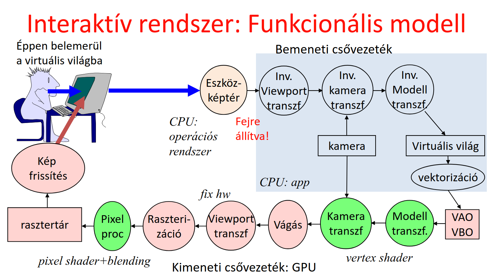
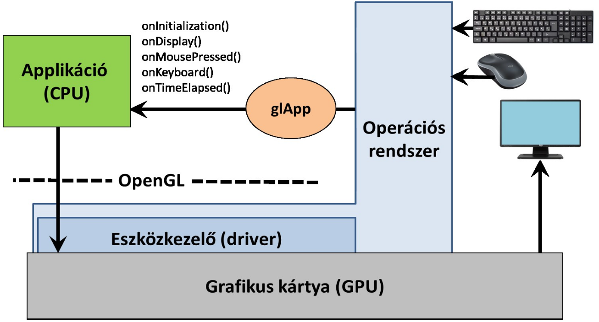
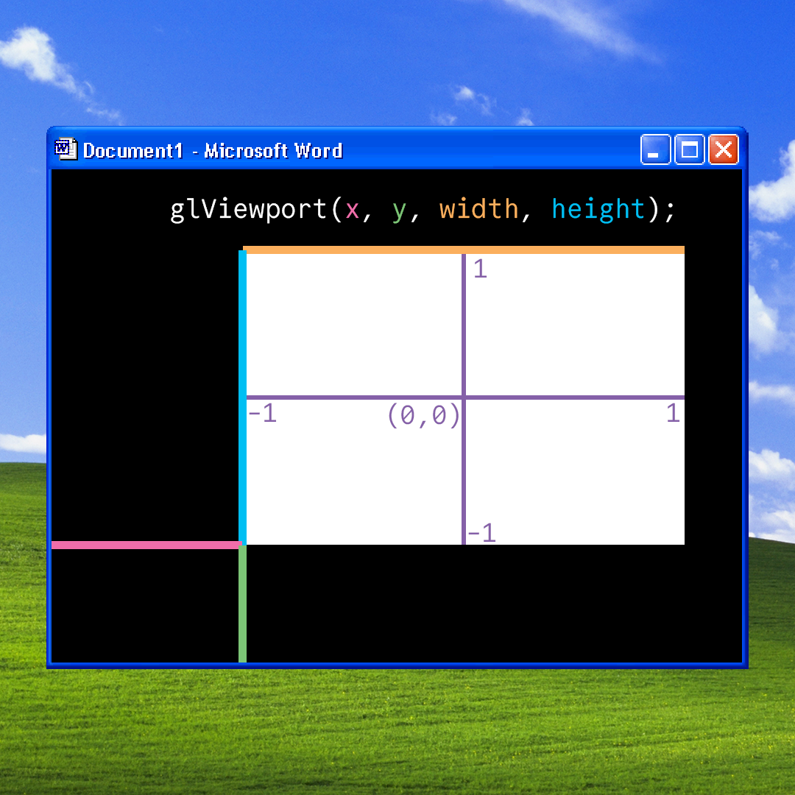
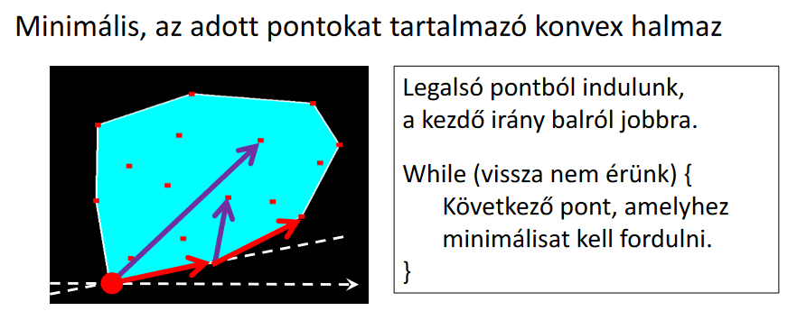
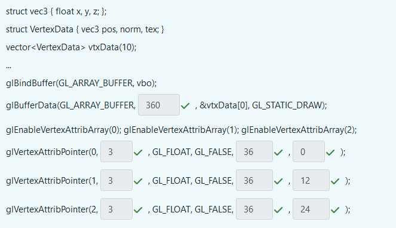

# Grafikus hardver és szoftver

## Funkcionális modell

A felhasználónak mutatunk egy virtuális világot, amit tud módosítani, és ezeket a módosításokat látja is. Az alábbi grafikus csővezetékrendszer mutatja ezt be:



A CPU-ra megírt program (amit mi írunk pl. C++-ban) az a bemeneti csővezetéket irányítja. A GPU műveletei közül ami pirossal van jelölve, azokhoz "fix hardware implementáció" tartozik, azaz mi nem tudunk bele nyúlni. A zölddel jelölt műveletekre viszont nekünk is hatásunk lehet, úgynevezett _vertex_ és _pixel shader_-ek írásával.

A GPU csak pontokat, szakaszokat, és háromszögeket tud elfogadni. Minden ezekkel van közelítve, csak aprólékosan.
A _vektorizáció_ folyamán tetszőleges görbéket hozunk létre ezekből.

## Szoftver architektúra



Az eseménykezeléshez glutot használunk, a lényeg, hogy a main-ben regisztrálunk event handlereket (pl. onDisplay) és az operációs rendszer eseményeire a glut callback-ként hívja a mi függvényünket. Eseményvezérelt programozás lesz.

## OpenGL


Elemezzük a pipelinet:

- VBO (vertex buffer object): ebben tárolunk pontokat és a hozzá tartozó alakzatokat
- VAO (vertex array object): ebben több VBO-t tárolhatunk, a műveletek (transzformációk, vágás) ezen történnek.

Felmerülhet a kérdés, hogy hogyan éri meg a VBO-kat tárolni a VAO-ban? Több megközelítés lehet: csinálhatjuk például azt, hogy az egyik VBO csak a pontok koordinátáit tárolja el, a másik csak a pontok színeit, stb. Ezeket utána külön `AttribArray`-ekbe töltjük fel. Könnyebben kezelhető, hiszen a különböző féle adatok el vannak különítve, de nem túl hatékony. Egy másik lehetőség, hogy egy darab VBO van, és minden pont minden tulajdonsága ebben van. Nehezebb kezelni, hiszen vegyesen vannak az adatok, több programozási energiabefektetést igényel, viszont hatékonyabb.

??? example Bővebben a VBO/VAO-ról...
    [VBO/VAO megértést segítő videó](https://www.youtube.com/watch?v=Rin5Cp-Hhj8)

A `glDrawArrays` függvény juttatja el ezeket a VBO/VAO-kat a GPU-hoz. Ezek floating point regiszterekbe kerülnek. A vertex shader meghatározza a normalizált eszközkoordinátarendszert ($(-1, -1)$ és $(1, 1)$ között). Ezután a `gl_Position` tárolja a normalizált eszközkoordinátákat, az itt lévő regiszterek pedig például színértéket tárolhatnak.

> A `gl_Position`-ben tárolt értékek mindig 4 dimenziósak lesznek és a 3D-s projektív geometriai szabályok szerint lesznek értelmezve.

<!-- ez az állítás nem teljes így 1. mert beadhatok neki vec2/3-at és akkor nagyon jól érzem magam, de valójában akkor is vec4 lesz, 2. persze lehet csinálni másmilyen geometriát is, de a GPU ettől még nem fogja úgy számolni nem feltétlenül úgy fogja számolni -->

Ezt követően fix műveleti egységek mennek végbe (vágás, raszterizáció, stb.). Ezek optimalizált hardware műveletek.

- Vágás: kidobjuk ami "nem látszik".
- Viewport transzformáció: A normalizált eszközkoordinátákból a képernyő koordinátarendszerévé ($(0, 0)$ és pl. $(600, 800)$ között) való transzformálás.
- Raszterizáció: Egy adott sokszög csúcspontjai ismeretében meghatározza az összes olyan pixelt ami benne van a sokszögben, interpolálja a regiszter értékeket (pl. szín).

Ezeket követően már konkrét pixelekkel dolgozik a GPU. A fragment shader a pixelek tényleges színét határozza meg. Végezetül kompozitálás után a pixelek bekerülnek a rasztertárba, ahonnan már egyenesen a képernyőre kerülnek. A kompozitálás azért fontos, hiszen itt dől el, hogy melyik pixelek lennének más pixelek "mögött", az átlátszóság kezeléséhez kiemelten fontos.

### Primitívek

Tételezzük fel, hogy tetszőleges pontunk a VAO-ban (legyenek ezek $x_i$-vel jelölve, ahol $i \in \mathbb{N} $). A `gl_DrawArrays` hogyan fogja őket értelmezni? Tekintsük először a függvény paramétereit:

```cpp
glDrawArrays(primitiveType, startIdx, numOfElements);
```

A `startIdx` és `numOfElements` magáért beszélnek, viszont a `primitiveType`-ról részletesebben szót kell ejteni. Ez a jegyzet 7 darab ilyen primitívet tárgyal, ezek pedig:

- GL_POINTS: külön pontokként jeleníti meg a VAO pontjait
- GL_LINES: kettessével összeköti a megadott pontokat, így például az alábbi _szakaszok_ jönnének létre: $(x_0, x_1), (x_2, x_3), ...$
- GL_LINE_STRIP: az adott pontot mindig a következő ponttal köti össze: $(x_0, x_1), (x_1, x_2), (x_2, x_3), ...$
- GL_LINE_LOOP: ugyan az mint a GL_LINE_STRIP, csak a legutolsó pontot a legelsővel köti össze
- GL_TRIANGLES: minden 3 egymás utáni pont egy háromszög: $(x_0, x_1, x_2), (x_3, x_4, x_5), ...$
- GL_TRIANGLE_STRIP: az utolsó pontot veszi hozzá az előző kettőhöz: $(x_0, x_1, x_2), (x_1, x_2, x_3), (x_2, x_3, x_4) ...$
- GL_TRIANGLE_FAN: az első ponthoz veszi a legutóbbi kettőt: $(x_0, x_1, x_2), (x_0, x_3, x_4), (x_0, x_5, x_6) ...$

### Állapotgép jelleg

Az OpenGL egy állapotgép, azaz nem kell mindig minden függvénynek megadni minden paramétert, hanem ezeket "globálisan" beállítjuk, utána pedig a függvények ezekkel dolgoznak (Például nem kell a pontok méretét megadni a `glDrawArrays`-ben, hanem a `glPointSize` függvénnyel beállítjuk ezt az értéket, utána pedig erre hivatkozik minden függvény.).

## Példa programok

A hivatalos ppt-kben található pár példa program, amelyeken keresztül láthatjuk az imént tárgyaltakat kódban is.
<!-- 
Az alábbi "jegyzetet" az előadáson készítettem, de nem tartottam annyira fontosnak, hogy a konkrét jegyzetbe bele írjam. Mindenesetre kommentként meghagyom, ha valaki gondolja akkor kiegészítheti és bekerülhet a jegyzetbe. - levy04

--

Zöld háromszög program:
feladatnál a `glApp` osztályból származunk le a saját "x_app"-unkat.
shadereket GLSL nyelven programozzuk (C jellegű)

sokszor kell ugyan azt: erre van a framework.h és framework.cpp: ezekbe kiszervezzük a közös dolgokat

példa: viktor vasarely (Vásárhelyi Győző) festményei: sok optikai trükk van bennük.
- betüremkedő gömb: körök mozognak fel le, teljesen 2D. 1 körünk van, azt transzformálgatjuk. a középpont középen kezdődik, először felfele megy, aztán vissza középre (sin hullámzás). eközben nő a kör sugara, változik a színe. az illúzióhoz a középpont is mozog fel le.

- konvex burok, interakció (legkisebb olyan sokszög, ami az összes pontot tartalmazza). a legalsó pontból indulunk, felveszünk egy vízszintes egyenes. a kövi pont az lesz, amihez a legkevesebbet kell elforgatni ezt az egyenest.

- tessaract (4D kocka), animáció.
-->
## Input kezelése

Az operációs rendszernél a koordináta rendszer origója a bal felső sarokban található, az $y$ tengely fejjel lefelé van! A `glViewport` viszont a bal alsó sarkot tekinti origónak, tehát valahogy így néz ki a dolog:



Tehát ha a normalizált eszközkoordinátákat szeretnénk megmondani az ablak koordinátái alapján akkor:
$$
\begin{align*}
x_{\text{ndc}} &= \bigg(\frac{x − x_{\text{offset}}}{\text{viewWidth}}\bigg) \times 2 ​− 1 \newline
y_{\text{ndc}} &= \bigg(\frac{y_{\text{OpenGL}} − y_{\text{offset}}}{\text{viewHeight}}\bigg) \times 2 - 1
\end{align*}
$$

ahol $y_{\text{OpenGL}}$ már az OpenGL szerint értelmezett koordináta! Azaz ha az ablakunk például $1000 \times 1000$ és az `onMouse` eseménykezelő szerint az egér $y$ koordinátája $267$, akkor $y_{\text{OpenGL}} = 1000 - 267 - 1$.

## Adatok feldolgozása

```cpp
glEnableVertexAttribArray(0); // engedélyezi az írást ezekbe a regiszterekbe

// beállítja a regiszter tulajdonságait
glVertexAttribPointer(0, 3, GL_FLOAT, GL_FALSE, 0, NULL); 
// Paraméterek: id, hány darab számot tárol, milyen típusú, isFixedPoint, 
// stride, offset

// adatok feltöltése
glBufferData(GL_ARRAY_BUFFER, size_in_bytes, &startOfArray[0], GL_STATIC_DRAW);
// a mód lehet dinamikus is attól függően állítjuk, hogy gyakran cserélődik-e
// az adat
```

- Uniform változók: olyan változók, amik állíthatók a shader programban. Nem a pontok adatai közé tartoznak (pl. az MVP)
- Mi a megvalósításnál dupla bufferelést használtunk (a háttér buffert rajzoljuk, a előteret mutatjuk a usernek és ezt a kettőt cserélgetjük). Ezt a `glutSwapBuffers();` függvényhívással értük el.

??? example Konvex burok (érdekesség)
    Ezen a programon lett bemutatva az OpenGL használata
    
    (ez nem az optimális algoritmus, de egészen használható)

---

# Kvíz

!!! question 1\. Hány háromszöget próbál kirajzoltatni az alábbi programsor?
    `glDrawArrays(GL_TRIANGLE_FAN, 5, 7);`

??? tip Megoldás
    Öt darabot (Első három pont alkot egy háromszöget, utána minden maradék pont egy újabb háromszöget eredményez.).

    `glDrawArrays(MODE, start, count)` $\Rightarrow$ az 5-ös rész csak azt jelenti, hogy az 5. től kezdve szeretnénk kirajzolni 7 pontnyit.

    A GL_TRIANGLE_FAN az első 2 pontból még nem tud háromszöget rajzolni, úgyhogy csak a 3.-tól kezdve, viszont akkor minden új ponttal rajzol egy darab háromszöget

    Vagyis 7-2 = 5 darabot tud rajzolni

    [*(Másik számokkal szemléltető kép)*](https://i.sstatic.net/G0JGo.png)

---
!!! question 2\. Az `onMouse` eseménykezelő egy eseményt kapott, amelyben az átadott koordináták $(916, 54)$ volt. Mi ennek a pontnak a normalizált eszközkoordinátarendszerbeli $y$ koordinátája, ha az alkalmazásablak felbontása $1000 \times 1000$ az utolsó nézeti beállítás pedig a `glViewport(100, 200, 800, 700)` volt.
    Kis segítség: `glViewport(x, y, width, height)`, és a bal alsó sarokból veszi az offsetet, az egér viszont bal felülről számol.
    
??? tip Megoldás
    **1. Az egér koordinátáinak átalakítása OpenGL ablakkordinátákká:**

    Az ablak felbontása $1000 \times 1000$, ahol az egér $y$ koordinátája $54$ (az ablak felső sarkából számítva).
    OpenGL-ben az $y$ koordináta az ablak alsó sarkából indul, így az átváltás:
    $$ y_{\text{OpenGL}} = 1000 - 54 - 1 = 945$$

    **2. Normalizált koordináták számítása:**

    A fenti képletbe helyettesítve:
    $$ y_{\text{ndc}} = \bigg(\frac{945 - 200}{700}\bigg) \times 2 - 1 \approx 1.1286 $$

---
!!! question 3\. Egészítsük ki egész számokkal az alábbi programot úgy, hogy a 10 elemű `vtxData` tömb teljes egészébe a VBO-ba másolódjon.
    A `pos` adattag a csúcspont árnyaló 0. regiszterébe, a `norm` adattag az 1. regiszterébe, a `tex` adattag a 2. regiszterébe.
    

???+ tip Magyarázat
    Az elején a struktúrát megnézzük, akkor látjuk, hogy:
    1 db `vec3` az 3 float-ból
    1 db `VertexData` az 3 `vec3`-ból áll
    
    A 360 azért annyi, mert byte-okban kell megadni és egy float az 4 byte, vagyis $4 \cdot 3 \cdot 3 \cdot 10$ byte lesz feltöltve

    A 3 azért annyi, mert egy `vec3` valójában 3 floatból áll, a 36 az a `VertexData` mérete, az offset pedig szintén byte-ban az adat pozíciójának offset-je

---
!!! question 4\. Mik igazak a `gl_Position` regiszterre?
    Ha 3D euklideszi geometriában dolgozik a vertex shader, akkor ide a Descartes koordinátákat kell írni kiegészítve a $w=1$-gyel

    Az ebbe pakolt pont koordinátáit a GPU a 3D projektív geometria szabályai szerint értelmezi, azzal a megkötéssel, hogy a nemnegatív $w$ koordinátájú pontokat tartja meg csak a vágás.

??? tip Megoldás
    Első állítás: magyarázat picit korábban volt, de a lényeg annyi, hogy perspektív térábrázolásra van kitalálva a GPU, ezért érdemes úgy használni $\Rightarrow$ `gl_Position = (vp.x, vp.y, vp.z, 1)`) <!--igen tudom, hogy van ennél kompaktabb forma, de nem várom el, hogy mindenki tudja-->
    
    Második állítás: ezt csak későbbi előadáson részleteztük, de érdemes megjegyezni, hogy ami nem látszik az le lesz vágva.

---
!!! question 5\. Az alábbiak közül melyik OpenGL programokkal befolyásolhatjuk a pixel shader program működését?

??? tip Megoldás
    A `glUniform` - ez volt az egyetlen felsorolva, amire igaz volt, a többi az vagy független pl. viewport vagy már fragment shading.

---
!!! question 6\. Válasszuk ki az igaz állításokat. Feltételezzük, hogy a GPU háromszögeket dolgoz fel és a `glDrawArrays(GL_TRIANGLES, 0, 30)` OpenGL hívás hatására.

??? tip Megoldás
    Egy helyes válasz volt:
    - Lehet olyan csúcspontárnyalót írni, amely esetén a GPU nem rajzol ki semmit a vbo tartalmától függetlenül
    ```cpp
    /* magyarázat: */ void main() { gl_Position = vec4(0, 0, 0, 0); }
    ```
    A többi válasz miért helytelen:

    - A GPU csúcspont árnyaló programjában ki tudjuk számítani egy háromszög súlypontját.
    
    Nem tudjuk, egyszerre mindig csak egy csúcsponttal foglalkozunk egy számítási egységen.

    - A csúcspontárnyaló dönthet arról, hogy a pontokat a háromszög csúcspontjaiként vagy háromszög legyezőként (GL_TRIANGLE_FAN) értelmezze.

    Nem, ezt mi állítjuk be. Az OpenGL állapotgép

    - Ha a háromszög súlypontját a pixel árnyalóban számoljuk ki, akkor azt elég egyetlen pixelre, és az eredményt át lehet adni a többi pixel árnyalójának.

    (... no comment)

    - A vágás során a primitív típusa (GL_TRIANGLES) lényegtelen.

    Nem lényegtelen, mert ettől függ mit rajzolunk ki, és különböző alakzatokat különböző módon kell vágni

    - A GPU pixel árnyaló programja eldönti, hogy melyik pixelt színezze ki a kért színre.

    "ElDöNTi" - nem, majd én döntöm el. Az OpenGL egy állapotgép

---
!!! question 7\. Válassza ki a helyes állításokat az OpenGL körrajzoló képességével kapcsolatban.

??? tip Megoldás
    - [x] Az OpenGL nem tud kört rajzolni, mert projektív geometriában nincs távolság, ezért nincs kör sem, helyette kúpszeletek lehetnek, azok viszont túl bonyolultak lennének a vágás és raszterizáció hw. implementációjához.
    - [x] Az OpenGL nem tud kört rajzolni, mert a művelet felesleges, hiszen a kör közelíthető szabályos sokszöggel.

---
!!! question 8\. Jelöljük be az alábbi programra vonatkozó igaz állításokat:
    ```cpp
    #include <windows.h>
    #include <GL/glew.h>
    #include <GL/freeglut.h>

    void onDisplay(), onInitialization();

    int main(int argc, char * argv[]) {
        glutInit(&argc, argv); 
        glutInitContextVersion(3, 3); 

        glutInitWindowSize(600, 600);
        glutInitWindowPosition(100, 100);
        glutInitDisplayMode(GLUT_RGBA|GLUT_DOUBLE);  
        glutCreateWindow(“Hi Graphics");

        glewExperimental = true; 
        glewInit(); 
        glViewport(0, 0, 600, 600);

        onInitialization();
        glutDisplayFunc(onDisplay); 
        glutMainLoop(); 

        return 1;
    }
    ```

??? tip Megoldás
    - [x] Csak Microsoft Windows operációs rendszer alatt fordul le. (Hiszen `#include <windows.h>`)
    - [x] A rajzolás célterülete a teljes alkalmazó ablak. (Hiszen a viewportot teljesen kitöltjük, nincs offset)
    - [x] Egy pixelt 64 biten fog a hardver tárolni a rasztertárban. (Hiszen `glutInitDisplayMode(GLUT_RGBA|GLUT_DOUBLE);` emiatt - 2 buffer, 4 channel, 8 bit / szín $\Rightarrow 2 \cdot 4 \cdot 8 = 64$)*
    - [x] Egyetlen sor törlésével a program Unix alatt is fordíthatóvá válik. (A kérdéses sor a `#include <windows.h>`)
    - [ ] Ha Visual Studiót használunk, akkor semmit sem kell installálni és a Web-ről letölteni, hogy leforduljon.
    - [ ] A nézeti téglalap $100 \times 100$ pixelből áll.
    - [ ] A `glutCreateWindow` után hívhatunk OpenGL függvényeket. (nem, csak akkor hívhatóak, ha inicializáltuk az OpenGL-t, ami az `onInitialization`-ban történik a framework-ben)
    - [ ] Hibás, hogy az `opengl.h` nincs beinklúdolva. (nem hibás, mert ezért van nekünk a glew könyvtár - ez segít eldönteni, hogy az OpenGL melyik verzióját vagyunk képesek használni)
    - [ ] Ez OpenGL 3.0-ás verzióra készül fel. (nem, a glew eldönti)
    - [ ] Ez OpenGL 1.0-ás verzióra készül fel. (nem, a glew eldönti)

---
!!! question 9\. Az alábbi program szándéka szerint egy zöld háromszöget rajzolna ki $\varphi$ radiánnal elforgatva, de nem működik. Mely sorokban van hiba?
    ```cpp
    void onDisplay( ) {
        glClearColor(0, 0, 0, 0);   glClear(GL_COLOR_BUFFER_BIT); 

        int location = glGetUniformLocation(shaderProgram, "color");

        glUniform3f(location, vec3(0.0f, 1.0f, 0.0f));
        
        float MVPtransf[4][4] = { 
                            cos(phi), sin(phi), 0, 0,   
                            -sin(phi), cos(phi), 0, 0,   
                            0, 0, 0, 0,
                            0, 0, 0, 1 
                        };

        location = glGetUniformLocation(shaderProgram, "MVP");
        glUniformMatrix4fv(location, 1, GL_FALSE, &MVPtransf[0][0]);
        
        glBindVertexArray(vao);  
        glDrawArrays(GL_TRIANGLES, 1, 3 );
        glutSwapBuffers( ); 
    }
    ```

??? tip Megoldás
    - `glUniform3f(location, vec3(0.0f, 1.0f, 0.0f)); // hiba: 3 float változót vár paraméternek`

    - `glUniformMatrix4fv(location, 1, GL_FALSE, &MVPtransf[0][0]);   // hiba: 1 dimenziós array-t vár az utolsó paraméternek`

    - `glDrawArrays(GL_TRIANGLES, 1, 3 ); // hiba: nem 1 darab háromszöget, hanem 3 darabot akar kirajzolni`

---
!!! question 10\. Mely könyvtárak szükségesek feltétlenül, azaz nem csupán opcionálisak, az GPU OpenGL könyvtáron keresztüli programozásához?
 
??? tip Megoldás
    OpenGL (nincs további helyes opció)

---
!!! question 11\. Hány csúcspontot fog tartalmazni az alábbi VBO?
    ```cpp
    unsigned int vbo;
    glGenBuffers(1, &vbo); 
    glBindBuffer(GL_ARRAY_BUFFER, vbo);

    double vertices[] = {1,2,3,4,5,6,7,8};
    glBufferData(GL_ARRAY_BUFFER, sizeof(vertices), vertices, GL_STATIC_DRAW);   

    glEnableVertexAttribArray(0);  // AttribArray 0
    glVertexAttribPointer(0, 1, GL_FLOAT, GL_FALSE, 0, NULL);
    ```

??? tip Megoldás
    16, mert nagyon trükkösen `double` arraybe lettek pakolva a pontok, de `float`-ként lesznek feltöltve. Mivel a `double` kétszer annyi helyet használ fel, mint a `float`, ezért 16 float-nyi helyet fognak elfoglalni.


[Előző fejezet](1.md)

[Következő fejezet](3.md)