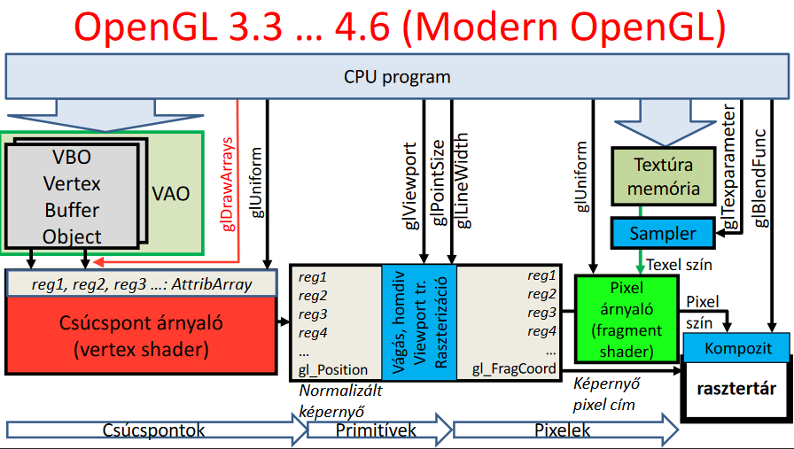
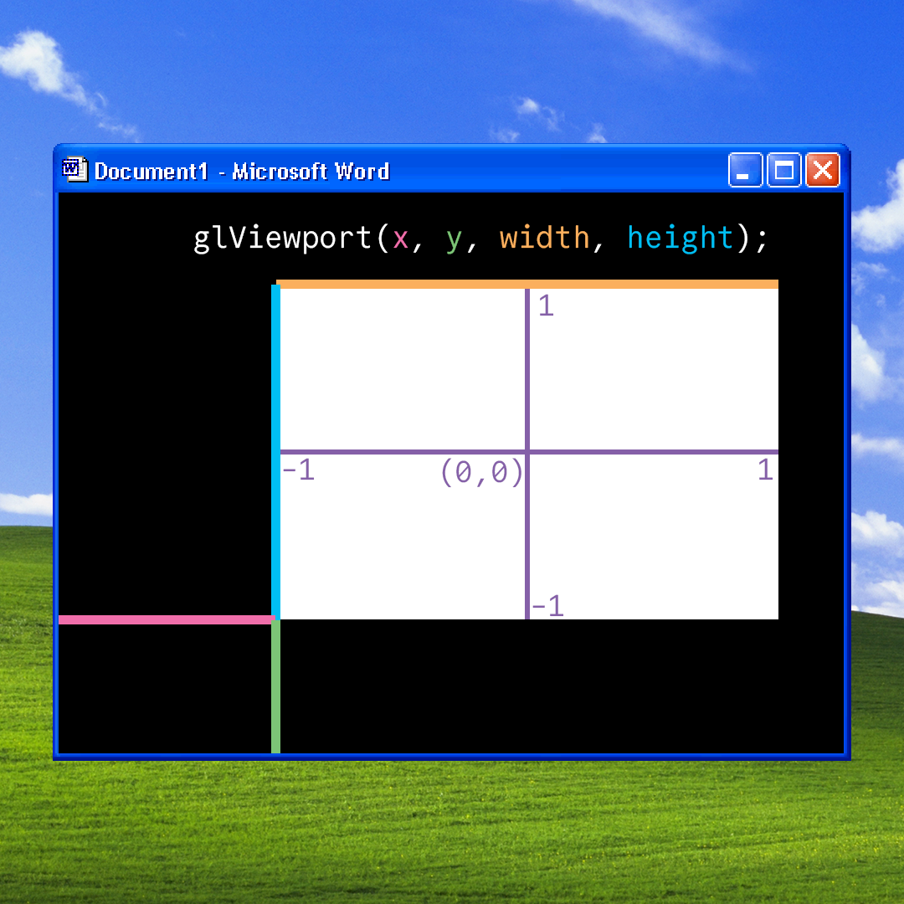

# Grafikus hardver és szoftver

- **Szovtver architektúra:** *(legalábbis amit mi használunk)*

    - Az eseménykezeléshez glutot használunk, a lényeg, hogy a main-ben regisztrálunk event handlereket pl. onDisplay és az OS eseményeire a glut callback-ként hívja a mi függvényünk
- OpenGL:
    
    - VAO: vertex array object - ebben több VBO-t tárolhatunk, a műveletek (transzformációk, vágás) ezen történnek
    - VBO: vertex buffer object - ebben tárolunk pontokat és a hozzá tartozó alakzatokat
    - [VBO/VAO megértést segítő videó](https://www.youtube.com/watch?v=Rin5Cp-Hhj8)
    - Az OpenGL egy állapotgép = amit beállítok úgy marad
    - Kirajzolás:
        - GL_POINTS
        - GL_LINE_STRIP, GL_LINE_LOOP (bezárja a strip-et)
        - GL_TRIANGLES (mindig 3 egymás utáni pont egy háromszog)
        GL_TRIANGLESTRIP *(az utolsó pontot veszi hozzá az előző kettőhöz: (abc), (bcd), (cde)...)*
        GL_TRIANGLE_FAN: *(az első ponthoz veszi a legutóbbi kettőt: (abc), (acd), (ade) ...)*
        ```cpp
        glDrawArrays(MODE, first, count);
        ```
        
- Input kezelés:
    - az operációs rendszernél a koordináta rendszer origója a bal felső sarokban található, az y tegnely fejjel lefelé van!
    - az glViewport viszont a bal alsó sarkot tekinti origónak, tehát valahogy így néz ki a dolog:
    - 
    - tehát ha a normalizált eszközkoordinátákat szeretnénk megmondani az ablak koordinátái alapján akkor
    - $ndcX = \cfrac{2(x − offsetX)}{viewWidth} ​− 1$
    - $ndcY = 1 − \cfrac{2(y − offsetY)}{viewHeight}$

    

- Adatok feldolgozása:
    ```cpp
    glEnableVertexAttribArray(0); // engedélyezi az írást ezekbe a regiszterekbe
    
    // beállítja a regiszter tulajdonságait
    glVertexAttribPointer(0, 3, GL_FLOAT, GL_FALSE, 0, NULL); 
    // Paraméterek: id, hány darab számot tárol, milyen típusú, isFixedPoint, stride, offset

    // adatok feltöltése
    glBufferData(GL_ARRAY_BUFFER, size_in_bytes, &startOfArray[0], GL_STATIC_DRAW);
    // a mód lehet dinamikus is attól függően állítjuk, hogy gyakran cserélődik-e az adat
    ```
    - `gl_Position`: egy kötelező kimeneti regiszter (változó), ebbe várunk össze a rajzoláshoz megfelelő számú csúcspontot (pl. háromszögnél 3 darabot)
        - **Figyelem: ez mindig 4 dimenziós lesz és a 3D-s projektív geometriai szabályok szerint lesz értelmezve** *(mivel a 3. dimenziót egészítjük ki +1-gyel)*
        <!-- ez az állítás nem teljes így 1. mert beadhatok neki vec2/3-at és akkor nagyon jól érzem magam, de valójában akkor is vec4 lesz, 2. persze lehet csinálni másmilyen geometriát is, de a GPU ettől még nem fogja úgy számolni nem feltétlenül úgy fogja számolni -->
    - Uniform változók: olyan változók, amik állíthatók a hader programban. Nem a pontok adatai közé tartoznak (pl. az MVP)
    - Mi a megvalósításnál dupla bufferelést használtunk *(a háttér buffert rajzoljuk, a előteret mutatjuk a usernek és ezt a kettőt cserélgetjük)*. Ezt a `glutSwapBuffers();` függvényhívással értük el.

### Konvex burok (érdekesség)
> Ezen a programon lett bemutatva az OpenGL használata
> 
> (ez nem az optimális algoritmus, de egészen használható)

---

# Kvíz

> 1\. Hány háromszöget próbál kirajzoltatni az alábbi programsor:
> `glDrawArrays(GL_TRIANGLE_FAN, 5, 7);`

- glDrawArrays(MODE, start, count) $\Rightarrow$ az 5-ös rész csak azt jelenti, hogy az 5. től kezdve szeretnénk kirajzolni 7 pontnyit
- A GL_TRIANGLE_FAN az első 2 pontból még nem tud háromszöget rajzolni, úgyhogy csak a 3.-tól kezdve, viszont akkor minden új ponttal rajzol egy darab háromszöget
- Vagyis 7-2 = 5 darabot tud rajzolni

[*(Másik számokkal szemléltető kép)*](https://i.sstatic.net/G0JGo.png)

---
> 2\. Az onMouse eseménykezelő egy eseményt kapott, amelyben az átadott koordináták 884,600 volt. Mi ennek a pontnak a normalizált eszközkoordinátarendszerbeli y koordinátája, ha az alkalmazásablak felbontása 1000x1000 az utolsó nézeti beállítás a glViewport(100, 200, 800, 700) volt.

- Kis segítség: `glViewport(x, y, width, height)`, és a bal alsó sarokból veszi az offsetet, az egér viszont bal felülről számol.
- Képletek és ábra fent, de nem garantálom hogy jók

---
> 3\. Egészítsük ki egész számokkal az alábbi programot úgy, hogy a 10 elemeű vtxData tömb teljes egészéba a vbo-ba másolódjon.
> A pos adattag a csúcspont árnyaló 0. regiszterébe
> A norm adattag az 1. regiszterébe
> A tex adattag a 2. regiszterébe


- Magyrázat:
    - az elején a struktúrát megnézzük, akkor látjuk, hogy:
    1 db vec3 az 3 float-ból
    1 db VertexData az 3 vec3-ból áll
    - 360 azért annyi, mert byte-okban kell megadni és egy float az 4 byte, vagyis $4 \cdot 3 \cdot 3 \cdot 10$ byte lesz feltöltve
    - A 3 azért annyi, mert egy vec3 valójában 3 floatból áll, a 36 az a VertexData mérete, az offset pedig szintén byte-ban az adat pozíciójának offset-je

---
> 4\. Mik igazak a gl_Position regiszterre?

- Ha 3D euklideszi geometriában dolgozik a vertex shader, akkor ide a Descartes koordinátákat kell írni kiegészítve a w=1-gyel
*(Magyarázat picit korábban volt, de a lényeg annyi, hogy perspektív térábrázolásra van kitalálva a GPU, ezért érdemes úgy használni $\Rightarrow$ `gl_Position = (vp.x, vp.y, vp.z, 1)`)*
<!--igen tudom, hogy van ennél kompaktabb forma, de nem várom el, hogy mindenki tudja-->

- Az ebbe pakolt pont koordinátáit a GPU a 3D projektív geometria szabályai szerint értelmezi, azzal a megkötéssel, hogy a nemnegatív w koordinátájú pontokat tartja meg csak a vágás.
*(Ezt csak későbbi előadáson részleteztük, de érdemes megjegyezni, hogy ami nem látszik az le lesz vágva)*

---
> 5\. Az alábbiak közül melyik OpenGL programokkal befolyásolhatjuk a pixel shader program működését

- A glUniform - ez volt az egyetlen felsorolva, amire igaz volt, a többi az vagy független pl. viewport vagy már fragment shading 

---
> 6\. Válasszuk ki az igaz állításokat. Feltételezzük, hogy a GPU háromszögeket dolgoz fel aés a glDrawArrays(GL_TRIANGLES, 0, 30) OpenGL hívás hatására.

- Egy helyes válasz volt:
    - Lehet olyan csúcspontárnyalót írni, amely esetén a GPU nem rajzol ki semmit a vbo tartalmától függetlenül
    ```cpp
    /* magyarázat: */ void main() { gl_Position = vec4(0, 0, 0, 0); }
    ```
- A többi válasz miért helytelen:
    - A GPU csúcspont árnyaló programjában ki tudjuk számítani egy háromszög súlypontját.
    *(Nem tudjuk, egyszerre mindig csak egy csúcsponttal foglalkozunk egy számítási egységen)*
    - A csúcspontárnyaló dönthet arról, hogy a pontokat a háromszög csúcspontjaiként vagy háromszög legyezőként (GL_TRIANGLE_FAN) értelmezze.
    *(Nem, ezt mi állítjuk be. Az OpenGL állapotgép)*
    - Ha a háromszög súlypontját a pixel árnyalóban számoljuk ki, akkor azt elég egyetlen pixelre, és az eredményt át lehet adni a többi pixel árnyalójának.
    *(... no comment)*
    - A vágás során a primitív típusa (GL_TRIANGLES) lényegtelen.
    *(Nem lényegtelen, mert ettől függ mit rajzolunk ki $\Rightarrow$ különböző alakzatokat különböző módon kell vágni)*
    - A GPU pixel árnyaló programja eldönti, hogy melyik pixelt színezze ki a kért színre.
    *(ElDöNTi - nem, majd én döntöm el. Az OpenGL állapotgép)*

---
> 7\. Válassza ki a helyes állításokat az OpenGL körrajzoló képességével kapcsolatban.

- A helyes válaszok:
    - Az OpenGL nem tud kört rajzolni, mert projektív geometriában nincs távolság, ezért nincs kör sem, helyette kúpszeletek lehetnek, azok viszont túl bonyolultak lennének a vágás és raszterizáció hw. implementációjához.
    - Az OpenGL nem tud kört rajzolni, mert a művelet felesleges, hiszen a kör közelíthető szabályos sokszöggel.

---
> 8\. Jelöljük be az alábbi programra vonatkozó igaz állításokat:
```cpp
#include <windows.h>
#include <GL/glew.h>
#include <GL/freeglut.h>

void onDisplay(), onInitialization();

int main(int argc, char * argv[]) {
   glutInit(&argc, argv); 
   glutInitContextVersion(3, 3); 

   glutInitWindowSize(600, 600);
   glutInitWindowPosition(100, 100);
   glutInitDisplayMode(GLUT_RGBA|GLUT_DOUBLE);  
   glutCreateWindow(“Hi Graphics");

   glewExperimental = true; 
   glewInit(); 
   glViewport(0, 0, 600, 600);

   onInitialization();
   glutDisplayFunc(onDisplay); 
   glutMainLoop(); 

   return 1;
}
```

- Helyes állítások: 
    - Csak Microsoft Windows operációs rendszer alatt fordul le. 
    *(`#include <windows.h>`)*
    - A rajzolás célterülete a teljes alkalmazó ablak. 
    *(a viewportot teljesen kitöltjük, nincs offset)*
    - Egy pixelt 64 biten fog a hardver tárolni a rasztertárban. 
    *(`glutInitDisplayMode(GLUT_RGBA|GLUT_DOUBLE);` emiatt - 2 buffer, 4 channel, 8 bit / szín $\Rightarrow 2 \cdot 4 \cdot 8 = 64$)*
    - Egyetlen sor törlésével a program Unix alatt is fordíthatóvá válik. 
    *(`#include <windows.h>`)*

- Hamis állítások
    - Ha Visual Studiót használunk, akkor semmit sem kell installálni és a Web-ről letölteni, hogy leforduljon.
    - A nézeti téglalap 100x100 pixelből áll.
    - A glutCreateWindow után hívhatunk OpenGL függvényeket.
    *(nem, csak akkor hívhatók, ha inicializáltuk az OpenGL-t, ami az onInitialization-ban történik a framework-ben)*
    - Hibás, hogy az opengl.h nincs beinklúdolva.
    *(nem hibás, mert ezért van nekünk a glew könyvtár - ez segít eldönteni, hogy az OpenGL melyik verzióját vagunk képesek használni)*
    - Ez OpenGL 3.0-ás verzióra készül fel.
    *(a glew eldönti)*
    - Ez OpenGL 1.0-ás verzióra készül fel.
    *(a glew eldönti)*

---
> 9\. Az alábbi program szándéka szerint egy zöld háromszöget rajzolna ki phi radiánnal elforgatva, de nem működik. Mely sorokban van hiba?

```cpp
void onDisplay( ) {
    glClearColor(0, 0, 0, 0);   glClear(GL_COLOR_BUFFER_BIT); 

    int location = glGetUniformLocation(shaderProgram, "color");

    glUniform3f(location, vec3(0.0f, 1.0f, 0.0f)); // hiba: 3 float változót vár paraméternek
    
    float MVPtransf[4][4] = { 
                        cos(phi), sin(phi), 0, 0,   
                        -sin(phi), cos(phi), 0, 0,   
                        0, 0, 0, 0,
                        0, 0, 0, 1 
                    };

    location = glGetUniformLocation(shaderProgram, "MVP");
    glUniformMatrix4fv(location, 1, GL_FALSE, &MVPtransf[0][0]);   // hiba: 1 dimenziós array-t vár az utolsó paraméternek
    
    glBindVertexArray(vao);  
    glDrawArrays(GL_TRIANGLES, 1, 3 ); // hiba: nem 1 darab háromszöget, hanem 3 darabot akar kirajzolni
    glutSwapBuffers( ); 
}
```

---
> 10\. Mely könyvtárak szükségesek feltétlenül, azaz nem csupán opcionálisak, az GPU OpenGL könyvtáron keresztüli programozásához.
 
- Válasz: OpenGL *(nincs további helyes opció)*

---
> 11\. Hány csúcspontot fog tartalmazni az alábbi vbo?
```cpp
unsigned int vbo;
glGenBuffers(1, &vbo); 
glBindBuffer(GL_ARRAY_BUFFER, vbo);

double vertices[] = {1,2,3,4,5,6,7,8};
glBufferData(GL_ARRAY_BUFFER, sizeof(vertices), vertices, GL_STATIC_DRAW);   

glEnableVertexAttribArray(0);  // AttribArray 0
glVertexAttribPointer(0, 1, GL_FLOAT, GL_FALSE, 0, NULL);
```

- Válasz: 16
    - Mert nagyon trükkösen double arraybe lettek pakolva a pontok, de float-ként lesznek feltöltve. Mivel a Double kétszer annyi helyet használ fel, mint a float, ezért 16 float-nyi helyet fognak elfoglalni


[Előző](1.md)

[Következő](3.md)