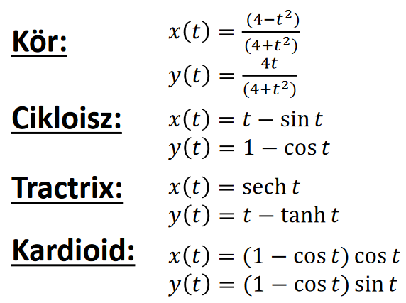

# Pontok és klasszikus görbék

!!! note ""
    Akiket mélyebben érdekel a téma, azoknak a további érdekes videót ajánljuk, az első 21 perce még néhol fedi is a tananyagot: [The Continuity of Splines - Freya Holmér](https://youtu.be/jvPPXbo87ds)

## Koordináták

A motivációnk továbbra is az, hogy próbáljunk absztrakt matematikai fogalmakat számokkal kifejezni, hogy a GPU is megértse. Egy GPU nem tudja mi az a "pont", de ha definiálunk egy koordinátarendszert, akkor már számokkal ki tudjuk fejezni, hogy mi az a "pont", így pedig már tudjuk programozni a GPU-t.

Általában egy koordinátarendszer egy geometriai referencia rendszert jelent, amelyben mérési utasításokat adunk (például: lépj kettő strigulát balra az $x$-tengelyen, és hármat felfele az $y$-tengelyen), és ezekből következtethetők le a pontok. Descartes koordináták esetén két merőleges egyenes a referencia rendszer, de ezt a rendszert megváltoztatva kaphatunk egy új koordinátarendszert. Polárkoordináták esetén például a referencia rendszerünk egy félegyenes, és a mérési utasítások azok, hogy melyik irányba induljunk el ($\phi$) és hogy mennyit sétáljunk a félegyenesen ($r$).

### Baricentrikus koordináták

Baricentrikus koordináták esetén a geometriai referencia rendszer néhány pont, az utasítás pedig az, hogy mindegyik $r_i$ ponthoz rendelünk egy $m_i$ súlyt. Így a rendszer $r$ súlypontja meghatároz egy pontot. Ekkor azt mondjuk, hogy $r$ az $r_1, r_2, ..., r_n$ pontok **kombinációja** (nemnegatív súlyok esetén **konvex kombinációja**):
$$ r = \frac{\sum_i m_i r_i}{\sum_i m_i} = \sum_i \alpha_i r_i $$
ahol konvex kombináció esetén $r$ az a $r_i$ pontok konvex burkán belül van (ahol a konvex burok azon minimális konvex halmaz, amely az összes pontot tartalmazza).

Például egy egyenes az két pont kombinációja, egy sík pedig három pont kombinációja. Konvex kombinációkat használva két pont egy szakaszt határoz meg, három pedig egy háromszöget.

Itt a súlypontot fizikai értelemben is súlypontnak kell tekinteni, $r$ pontban a forgatónyomaték zérus:
$$ \sum_i (r_i - r) \times m_i g = 0 $$
azaz ha ebben a pontban "megtámasztjuk" a rendszert, akkor nyugalomban lesz.

Mire is jó ez nekünk? Arra, hogy görbéket ábrázoljunk:

- Az explicit egyenlet $y = mx+b$ nem jó nekünk, hiszen csak egyeneseket lehet vele rajzolni, kanyargós görbéket nem (ennek az az oka, hogy $f(x) = mx+b$ esetén $f$ egy _injektív_ függvény, azaz egy $x$-hez mindig egy darab $y$ tartozik).
- Az implicit egyenlet $f(x,y) = 0$ már ad lehetőségeket, de még picit komplikált megkonstruálni (azt fogjuk megnézni, hogy hogyan lehet egyszerűbbé tenni).

## Görbék

A legkézenfekvőbb az lenne, ha függvényeket használhatnánk a görbék leírására, de függvényekkel nem tudunk olyan görbéket megadni, ahol egy $x$ értékhez több $y$ is tartozik. Viszont az az ötlet, hogy a pontok koordinátáinak a viszonyát valamilyen egyenletbe foglaljuk, az előnyös lesz, így kapjuk meg a görbék _implicit_ egyenleteit.

Például egy $p$ pontra illeszkedő, $\underline{n}$ normálvektorú egyenes implicit egyenletét le lehet vezetni abból, hogy mi azon $r$ pontokat keressük, amik $p$-t egy $\underline{n}$ vektorra merőleges vektorral eltolva kaphatóak, azaz $(r-p)$ vektor legyen merőleges $\underline{n}$-re, más szóval $\underline{n} \cdot (r-p) = 0$. Koordinátákra bontva, és átrendezve megkapjuk, hogy a korábbi egyenletünk $ax + by + c = 0$ alakra hozható.

Tehát minden egyeneshez tartozik egy lineáris egyenlet (lineáris, mivel $x$ és $y$ első hatványon vannak), de vajon nemlineáris egyenlet is meghatározhat egyenest? A válasz az, hogy igen, például $(ax + by + c)^2 = 0$ is egy egyenes egyenlete, hiszen a gyökök nem változtak (nem került be új pont).

Ha kicsit közelebbről megtekintjük az $\underline{n} \cdot (r-p)$ kifejezést, akkor észrevehetjük, hogy ez igazából $r$ pont távolsága a keresett egyenestől. Amikor ezt a távolságot $0$-nak vesszük, akkor azt mondjuk, hogy azokat a pontokat keressük, amik rajta vannak az egyenesen, azaz magának az egyenesnek a pontjait. Viszont ha az előjelét tekintjük, akkor például meg tudjuk mondani egy adott $r'$ pont az egyenes melyik oldalán van (melyik félsíkban helyezkedik el a pont).

### Kvadratikus görbék

Példák: $r(x,y)$ azon pontok, amik kielégítik az alábbi egyenleteket

- Kör: $(r - c)^2 - R^2 = 0$ ($c$-től $R$ távolságra lévő pontok halmaza)

- Ellipszis: $|r - f_1| + |r - f_2| = C$ (azon $r$ pontok halmaza, amelyeknek $f_1$ és $f_2$ fókuszpontoktól mért távolság összege konstans $C$)

- Hiperbola: $|r - f_1| - |r - f_2| = C$ (azon $r$ pontok, amelyek a $f_1$ és $f_2$ fókuszpontoktól mért távolság különbsége állandó $C$)

- Parabola: $|r - f| = n \cdot (r - p)$ (Azon $r$ pontok halmaza, amelyek az $f$ fókuszponttól mért távolsága megegyezik az $\underline{n}$ normálvektorú és $p$ helyvektorú egyenestől mért távolsággal)

Sok abszolút értéket használtunk a definíciókban, de négyzetre emeléssel ezeket el tudnánk tüntetni.

#### Megadásuk

- Implicit alakban:
$f(x,y) = a_{11} x^2 + a_{22} y^2 + 2a_{12} xy + 2a_{13} xy + 2a_{23}y + a_{33} = 0$

- Mátrix alakban:
$\displaystyle [x,y,1] \begin{bmatrix} a_{11} & a_{12} & a_{13} \\ a_{21} & a_{22} & a_{23} \\ a_{31} & a_{32} & a_{33} \end{bmatrix} \begin{bmatrix} x \\ y \\ 1 \end{bmatrix}$
<!--ebben az a furcsa, hogy a diasoron úgy mutatja be, mintha a karakterisztikus mátrix csak szimmetrikus lehetne... ami nem igazán igaz, de ezt hogy írjam ide?-->
Ezekkel már egész komplex görbéket meg lehet adni. Általában mátrix alakban szoktuk megadni az együtthatókat, ezt kell implementálni programokban is.

### Paraméteres egyenletek

Nem csak kvadratikus görbékkel, de parametrikus egyenletekkel ($r(t)$-t használva) is le lehet írni görbéket, például:

Ez mozgásként fogalmazza meg a görbét, nem pedig feltétel rendszerként, mint az implicit egyenletek esetében. Általánosságban minden dimenzióhoz kell egy mozgás függvény, komponensenként egy.

### Szabadformájú görbék

Ezekhez a görbékhez nem konkrét egyenleteket adunk meg, hanem vezérlő/kontrollpontokat, és azok határozzák meg a görbéket. Az a motivációnk, hogy ezzel a technikával sokkal komplexebb, élethűbb, természetesebb görbéket lehet létrehozni, mint például kvadratikus görbéket használva.

A létrejövő görbéhez fog tartozni egy parametrikus függvény, és ennek a meg kell határozni az alakját (pl. polinom, exponenciális, stb...), és a gyakorlatban a mérnökök általában polinom függvényeket használnak. Ezekkel (Taylor-sorok révén) bármilyen másik függvény tetszőleges közelíthető. Nekünk a feladatunk ennek a polinom függvénynek az együtthatóinak meghatározása a kontrollpontok alapján.

Az általános alakja ezeknek a görbéknek a következő:
$$x(t) = \sum_i a_i \cdot t^i \qquad y(t) = \sum_i b_i \cdot t^i \qquad z(t) = ...$$

A továbbiakban tárgyalt görbék két főbb csoportba esnek: _interpolációk_ és _approximációk_. Az interpolációs görbék azok minden kontrollpontjukon át is mennek, míg az approximációs görbék általában csak a kezdő és végpontokon mennek át, a többi pontot csak "közelítik".

Elvárjuk a görbétől, hogy:

- természetes legyen, azaz $C^2$ folytonos (maga a görbe, és az első két deriváltja is folytonos),
- szép legyen (kis görbületváltozás, indokolatlan hullámzás nélkül),
- független legyen a koordináta rendszertől (ha változik a koordinátarendszer, akkor a görbe maga ne változzon, legfeljebb más számokkal kell majd leírni),
    - Ezt a súlypont analógiával fogjuk biztosítani.
- lokális vezérelhetőség teljesüljön rajta, azaz egy kontrollpont változtatása csak a pont szűk környezetében változtassa meg a görbét.

#### Lagrange interpoláció

A vezérlőpontokhoz rendelünk csomóértékeket, amik azt fogják jelképezni, hogy melyik "időpillanatban" kell "meglátogatni" az adott pontot. Ha van $n$ pontunk, akkor semmi sem akadályoz meg minket abban, h ezekre illesszünk egy $n + 1000$ fokszámú polinomot, viszont érezhető, hogy nekünk a minimális fokszámú polinom lenne előnyös. Ez az $n-1$-ed fokú lesz.

Legyenek $r_1, r_2, ..., r_n$ kontrollpontok, amikhez a $t_1, t_2, ..., t_n$ csomóértékek ("súlyok") tartoznak, és egy $t$ futóváltozónk. Ekkor:
$$r(t) = \sum_i L_i(t) \cdot r_i$$
ahol
$$L_i(t) = \frac{\prod_{j \neq i} (t-t_j)}{\prod_{j \neq i}(t_i - t_j)}$$

Ha $t = t_k$, akkor $L_i(t_k) = 1$, ha $i = k$, különben $0$.

Mivel minden súly hat minden pontra, ezért ha az egyik kontrollpontot odébb rakjuk, az a teljes görbére kihat, tehát _nincs_ lokális vezérelhetőség, vagyis nem alkalmazható bonyolult görbékre.

#### Hermite interpoláció

A Lagrange interpoláció általánosítása (ugyanazokkal a bajokkal küzd). A pontoknál meg kell határozni egy pont sebességét, gyorsulását. (Ezen azt értjük, hogy a rajta áthaladó célmozgás deriváltjait kell megadni.)

Csak azt az esetet vettük, ahol két $p_1, p_2$ pont van és csak a $v_1, v_2$ sebességük van megadva.

Mivel négy feltételt adunk meg ($p_1, v_1, p_2, v_2$), ezért ennyi ismeretlennel kell tudni számolni, tehát harmad fokú polinom lesz:

$$r(t) = a_3 (t - t_i)^3 + a_2 (t - t_i)^2 + a_1 (t - t_i) + a_0$$

Mivel a deriváltra is van feltétel, ezért ezt is használjuk:

$$\dot{r}(t) = 3 a_3 (t - t_i)^2 + 2 a_2 (t - t_i) + a_1$$

Az egyenletekbe helyettesítsük be a megkötéseket (legyen $t_i$ a 0. időpont):

$$\begin{align*}
&r(t_i) = p_i = a_0 \qquad \text{(hiszen itt }t = 0\text{)} \\
&r(t_{i+1}) = p_{i+1} = a_3 (t - t_i)^3 + a_2 (t - t_i)^2 + a_1 (t - t_i)^1 + a_0 \\
&\dot{r}(t_i) = v_{i} = a_1 \\
&\dot{r}(t_{i+1}) = v_{i+1} = 3 a_3 (t - t_i)^2 + 2 a_2 (t - t_i) + a_1
\end{align*}$$

Az egyenletek megoldása:

$$\begin{align*}
&a_0 = p_i \\
&a_1 = v_i \\
&a_2 = \frac{3(p_{i+1} - p_i)}{(t_{i+1} - t_i)^2} - \frac{(v_{i+1} + 2 v_i)}{t_{i+1} - t_i} \\
&a_3 = \frac{2 (p_i - p_{i+1})}{(t_{i+1} - t_i)^3} + \frac{v_{i+1} + v_i}{(t_{i+1} - t_i)^2}
\end{align*}$$

#### Beziér approximáció

Az a cél, hogy a súlyfüggvény ne oszcilláljon, amit eddig például az váltott ki, hogy a súlyok _pozitív és negatív_ értéket is felvehettek. Most $B_i(t) \geq 0$ minden esetben. Nemnegatív súlyfüggvény esetén viszont _konvex kombinációról_ beszélünk, a konvex burok tulajdonság fennáll. Fontos kiemelni, hogy ez már csak egy _approximáció_.

Egy másik kikötés, hogy a súlyok arányosan hassanak a függvényre, azaz
$$\sum_i B_i(t) = 1$$
teljesül.

Ehhez a Bernstein-polinomokat használjuk súlyfüggvényként, amelyek a következő módon kaphatjuk meg:
$$1^n = (t + (1-t))^n \overset{\text{*}}{=} \sum_{i = 0}^n \binom{n}{i} \cdot t^i (1-t)^{n-i}$$
$*$: a binomiális tétel miatt

??? note $\binom{n}{k}$ emlékeztető
    $$\binom{n}{k} = \frac{n^k}{k! (n-k)!}$$

Ezek alapján a $B_i(t)$ súlyfüggvény a következő lesz:

$$B_i(t) = \binom{n}{i} \cdot t^i (1-t)^{n-i}$$

ahol $t \in [0,1]$. Maga az $r(t)$ görbe pedig:

$$r(t) = \sum_{i = 0}^{n} B_i(t) \cdot r_i$$

Egy hátránya a módszernek az, hogy ha sok kontrollpontunk van, akkor az egyik változása elhanyagolható lesz. Ráadásul az éles változásokat is nehéz megjeleníteni, mert túl sok pont hat a görbére.

### Splineok

Az összes eddig tárgyalt módszerrel az az alapvető probléma, hogy közelítőleg annyiad fokú polinommal dolgozunk ahány kontrollpontunk van, és a súlyfüggvények lényegében végig nem nullák. Bonyolult görbékhez viszont sok kontrollpont kell, azaz a megnőtt polinom fokszám miatt vagy oszcillál a görbe, vagy annyira nehezen érhető el bármilyen változtatás, hogy használhatatlan lesz az eredmény.

Ezeknek a megoldásoknak az orvoslására lettek kitalálva a *splineok*. Ilyenkor ugyanis nem növeljük a polinom fokszámát, hanem a kontrollpontokhoz több, alacsonyabb szintű polinomot rendelünk, és ezekből építjük fel a teljes görbét.

#### Catmull-Rom spline

Ez egy interpolációs technika. Minden két egymás követő pont közé egy Hermite interpolációs görbét illesztünk. Az egymás utáni szakaszokon a lezáró és kezdő pontok sebessége megegyezik, így nem fog ugrásszerűen változni a görbe.

Ez a technika csak $C^1$ folytonos, de közelítőleg $C^2$ folytonossá tehetjük, ha a sebességeket megfelelő heurisztikával választjuk ki. Viszont ehhez kell egy függvény arra is, hogy a $v_i$-ket is meghatározzuk. Ehhez a pontnak a 2 szakaszát egyenes vonalú egyenletes mozgásnak fogjuk venni és annak az átlagsebességét fogjuk használni.

$$v_i = \frac{1}{2}\bigg(\frac{r_{i+1} - r_i}{t_{i+1} - t_i} + \frac{r_i - r_{i-1}}{t_i - t_{i-1}}\bigg)$$

Itt a $t$ csomóértékeket mi határozzuk meg (a számolós feladatban az $i.$ ponthoz $i$ értéke tartozott azt hiszem). Fontos megemlíteni, hogy egy gyakran használt paraméterezési mód a Catmull-Rom spline esetén a _uniform_ paraméterezés. Ez azt jelenti, hogy $\forall i$ esetén $t_{i+1} - t_i = 1$. Ebben az esetben a fenti képlet leegyszerűsödik:

$$v_i = \frac{1}{2}(r_{i+1} - r_{i-1})$$

<!-- 

Az alábbi jegyzet a felületekről szól. Ennek a jegyzetnek az eredeti változatában nem voltak benne, de az előadásdiákban igen, szóval készült róla jegyzet. Ha valaki később szeretné, akkor ez alapján kidolgozhatja. -levy04

---

a felületek a 3D-s tér 2D-s részhalmazai. görbéknél megismert technikákat használjuk, csak +1 dimenzió.

explicit forma (magasság mező): egyik koord függvénye a másik kettőnek. ritkán alkalmazható. z = h(x, y)

implicit forma: f(x, y, z) = 0

parametrikus forma: szabadparaméterek fgv-ében fejezzük ki az x,y,z koordinátákat. mivel most egyel nagyobb dimenzióban vagyunk, itt már 2 szabadparaméter fog kelleni (u,v)

itt is vannak implicit kvadratikus felületek (gömb, henger, ellipszoid, hiperboloid, paraboloid), teljesen analóg a görbékkel, csak +1 dimenzió. itt is a kvadratikus alakot szeretjük, sorvektor mátrix oszlopvektor alak

a felrajzoláshoz fog kelleni a normálvektor. ez megegyezik egy adott pontban vett gradiensével az f függvénynek, ahol f(x,y,z) = 0 az implicit alak.

kódrészlet talán

itt is megvan az az analógia, h f(x,y,z)!=0 esetben az előjel függvényében el tudjuk dönteni, h a felületen "belül" v "kívül" helyezkedik el az adott pont

parametrikus felületek: kihúzás. visszavezetjük görbék definíciójára, egyik strat a kihúzás. 

van egy profil/bázis görbe, és egy gerinc görbe. a profil görbe végigmozog a gerinc görbén, és a felület ezek a pontok halmaza. itt a két futóváltozó külön külön paraméterezi a két görbét, itt már van idő analóg

másik strat a forgatás, egy görbe a profil, aztán pedig elforgatjuk a $z$ tengely körül

parametrikus felületeknél is kell normálvektor, itt rögzítjük az egyik paramétert, így görbére redukálunk, és használhatjuk a görbés technikákat: deriváljuk idő szerint. ezt meg kell ismételni a másik paraméter szerint, így egy másik vektort kapva. ezen két vektor keresztszorzatát képezve kapjuk meg magának az érintősíknak a normálvektorát

-->

---

# Kvíz
!!! question 1\. Egy Bézier görbe kontrollpontjai $(4,8), (7,9), (4,4)$
    Mi a Bézier görbe $t=1.0$ paraméterre felvett pontjának x koordinátája?

??? tip Megoldás
    Van-e bármi trükk, hogy elkerüljük a számolást?

    Igen van, hiszen $t = 1$ esetén a görbe utolsó pontjánál járunk, amit a görbe biztosan érint vagyis $r(1) = (4,4) \Rightarrow$ a válasz $4$

    De mégis hogyan kéne kiszámolni?

    $r(t) = \sum_{i = 0}^{n} B_i(t) \cdot r_i \qquad B_i(t) = \binom{n}{i} \cdot t^i (1-t)^{n-i} \\ \qquad$

    1\. $n = 0 \ : \ B_0(1) = \binom{2}{0} \cdot 1^0 (1-1)^{2-0} = \frac{2^0}{0! \cdot (2-0)!} \cdot 1 \cdot 0$

    $\Rightarrow 0 \cdot (4, 8) = (0, 0)$

    2\. $n = 1 \ : \ B_1(1) = \binom{2}{1} \cdot 1^1 (1-1)^{2-1} = \frac\\ \qquad{2^1}{1! \cdot (2-1)!} \cdot 1 \cdot 0$

    $\Rightarrow 0 \cdot (7, 9) = (0, 0)$

    3\. $n = 2 \ : \ B_2(1) = \binom{2}{2} \cdot 1^2 (1-1)^{2-2} = \frac{2^2}{2! \cdot (2-2)!} \cdot 1 \cdot 1$

    $\Rightarrow 1 \cdot (4, 4) = (4, 4)$

    $(0,0) + (0,0) + (4,4) = (4,4) \Rightarrow$ a válasz még mindig $4$

---
!!! question 2\. Adottak egy Lagrange görbe kontrollpontjai és a csomóértékei. Mi a Lagrange görbe $t=0.9$ paraméterre felvett pontjának az $x$ koordinátája?
    $(x, y), \qquad t$
    $(4,5), \qquad 0$
    $(6,4), \qquad 1$
    $(7,10),\quad \ \ 2$
    

??? tip Megoldás
    A képlet: $r(t) = \sum_i L_i(t) \cdot r_i \qquad L_i(t) = \frac{\prod_{j \neq i} (t-t_j)}{\prod_{j \neq i}(t_i - t_j)}$

    Számolás: *(0-tól számozok mert úgy kényelmesebb)*
    
    - $i = 0: L_0(0.9) = \frac{(0.9 - 1) \cdot (0.9 - 2)}{(0 - 1) \cdot (0 - 2)} = \frac{0.11}{2}$
    - $i = 1: L_1(0.9) = \frac{(0.9 - 0) \cdot (0.9 - 2)}{(1 - 0) \cdot (1 - 2)} = \frac{-0.99}{-1}$
    - $i = 2: L_2(0.9) = \frac{(0.9 - 0) \cdot (0.9 - 1)}{(2 - 0) \cdot (2 - 1)} = \frac{-0.09}{2}$

    $\frac{0.11}{2} \cdot (4,5) + \frac{-0.99}{-1} \cdot(6,4) + \frac{-0.09}{2} \cdot (7, 10) = (0.22, 0.275) + (5.94, 3.96) + (-0.315, -0.45) = (5.845, 3.785) \Rightarrow 5.845$

---
!!! question 3\. Egy Catmull-Rom görbe kontrollpontjai és a csomóértékei:
    $(x, y), \qquad t$
    $(4,8), \qquad   0$
    $(7,9), \qquad   1$
    $(4,4), \qquad   2$
    $(7,3), \qquad   3$
    Mi a Catmull-Rom görbe $t=1.5$ paraméterre felvett pontjának az $x$ koordinátája?

??? tip Megoldás
    1. a $1 < t < 2$, vagyis ezek között a pontok között fogjuk vizsgálni

    2. $v_i$-k kiszámítása:
        - $\displaystyle v_i = \frac{1}{2}\bigg(\frac{r_{i+1} - r_i}{t_{i+1} - t_i} + \frac{r_i - r_{i-1}}{t_i - t_{i-1}}\bigg) \\ \quad$
        - $\displaystyle v_1 = \frac{1}{2}(\frac{(4,4) - (7,9)}{2-1} + \frac{(7,9) - (4,8)}{1-0}) =\frac{(0, -4)}{2} \\ \quad$ 
        - $\displaystyle v_2 = \frac{1}{2}(\frac{(7,3) - (4,4)}{3-2} + \frac{(4,4) - (7,9)}{2-1}) = \frac{(0,-6)}{2}$ 

    3. Hermite paraméterei:
        - $a_0 = p_i = (7,9)$
        - $a_1 = v_i = (0, -2) \\ \quad$
        - $\displaystyle a_2 = \frac{3(p_{i+1} - p_i)}{(t_{i+1} - t_i)^2} - \frac{(v_{i+1} + 2 v_i)}{t_{i+1} - t_i} = \\ \frac{3((4,4) - (7,9))}{1} - \frac{(0,-3) + 2 \cdot (0, -2)}{1} = (-9,-8) \\ \quad$
        - $\\ \displaystyle a_3 = \frac{2 (p_i - p_{i+1})}{(t_{i+1} - t_i)^3} + \frac{v_{i+1} + v_i}{(t_{i+1} - t_i)^2} = \\  \frac{2 ((7,9) - (4, 4))}{1} + \frac{(0,-3) + (0,-2)}{1} = (6, 5)$

    4. Maga a függvény:
        - $r(t) = a_3 (t - t_i)^3 + a_2 (t - t_i)^2 + a_1 (t - t_i)^1 + a_0$
        - $r(1.5) = a_3 (1.5 - 1)^3 + a_2 (1.5 - 1)^2 + a_1 (1.5 - 1)^1 + a_0$
        $r(1.5) = (6,5) \cdot 0.125 + (-9,-8) \cdot 0.25 + (0, -2) \cdot 0.5 + (7,9)$
        $r(1.5) = (0.75, 0.625) + (-2.25,-2) + (0, -1) + (7,9)$
        $r(1.5) = (5.5,6.625) \Rightarrow 5.5$ a válasz
        :skull:

---
!!! question 4\. Jelöljük be az igaz állításokat!
    - A Bezier görbe C2 folytonos.
    - A $B_i(t)$ Bezier bázisfüggvényeknek nincs valós gyöke a 0-n és az 1-en kívül.
    - A Bezier görbe interpolálja a kontrollpontjait.
    - Ha n pontunk van, akkor a $B_i(t)$ Bezier bázisfüggvények n-ed fokú polinomok.
    - A $B_i(t)$ Bezier bázisfüggvények a Bernstein polinomok.
    - A Lagrange görbe a Bezier görbe speciális esete.
    - A $B_i(t)$ Bezier bázisfüggvények nemnegatívak.
    - A Bézier görbe a Lagrange görbe speciális esete.
    - A $B_i(t)$ Bezier bázisfüggvények összege 1.

??? tip Megoldás
    - [x] A Bezier görbe C2 folytonos.
    - [x] A $B_i(t)$ Bezier bázisfüggvényeknek nincs valós gyöke a 0-n és az 1-en kívül.
    - [ ] A Bezier görbe interpolálja a kontrollpontjait.
    *(a görbe nem megy át minden kontrollponton)*
    - [ ] Ha n pontunk van, akkor a $B_i(t)$ Bezier bázisfüggvények n-ed fokú polinomok.
    - [x] A $B_i(t)$ Bezier bázisfüggvények a Bernstein polinomok.
    *(0-tól megy, úgyhogy n-1)*
    - [ ] A Lagrange görbe a Bezier görbe speciális esete.
    - [x] A $B_i(t)$ Bezier bázisfüggvények nemnegatívak.
    *(a Lagrange görbének semmilyen ilyen megkötése nincs)*
    - [ ] A Bézier görbe a Lagrange görbe speciális esete.
    *(nem használja a Lagrange képletét)*
    - [x] A $B_i(t)$ Bezier bázisfüggvények összege 1.

---
!!! question 5\. Jelöljük be az igaz állításokat!
    - Három nem egy egyenesbe eső pont kombinációjaként a három pont által definiált sík bármely pontja előállítható. *(igen, súlyozástól függ)*
    - A súlypontra felírt forgatónyomatók mindig zérus, ha a pontjainkat bármilyen erővel is támadjuk.
    - A súlypontot megfogva, a test nem mozdítható el. *(ezen a ponton stabilan áll, de ettől még mozgatható)*
    - A súlyokat használva kombinációs faktorként, pontok konvex kombinációja mindig a súlypontot adja meg. *(ezt képzeld el egy háromszögre, ahol a súlyok konvex kombinációja valóban a súlypontot adja)*
    - Ha $r_i$ pontba $m_i$ súlyt (i=1,2,...) helyezünk, akkor a rendszer súlypontja $\displaystyle\sum_i m_i \cdot r_i$ *(ehhez még le kell osztani az összsúllyal $\displaystyle\sum_i m_i$-vel, hogy igaz legyen)*

??? tip Megoldás
    - [x] Három nem egy egyenesbe eső pont kombinációjaként a három pont által definiált sík bármely pontja előállítható. *(igen, súlyozástól függ)*
    - [ ] A súlypontra felírt forgatónyomatók mindig zérus, ha a pontjainkat bármilyen erővel is támadjuk.
    - [ ] A súlypontot megfogva, a test nem mozdítható el. *(ezen a ponton stabilan áll, de ettől még mozgatható)*
    - [x] A súlyokat használva kombinációs faktorként, pontok konvex kombinációja mindig a súlypontot adja meg. *(ezt képzeld el egy háromszögre, ahol a súlyok konvex kombinációja valóban a súlypontot adja)*
    - [ ] Ha $r_i$ pontba $m_i$ súlyt (i=1,2,...) helyezünk, akkor a rendszer súlypontja $\displaystyle\sum_i m_i \cdot r_i$ *(ehhez még le kell osztani az összsúllyal $\displaystyle\sum_i m_i$-vel, hogy igaz legyen)*

---
!!! question 6\. Jelöljük be az igaz állításokat!
    - A hiperbola megadható kvadratikus implicit függvénnyel.
    - Ahogy az $x=\cos(t)$, $y=\sin(t)$ körmozgást definiál, az $x=\cosh(t)$,$ y=\sinh(t)$ egy hiperbolán való mozgást.
    - Ha van egy olyan függvényünk, amely kifejezi egy pont és egy alakzat távolságát, akkor a függvény az alakzat implicit függvénye.
    - Az egyenes y=m*x+b alakú explicit egyenletével a sík bármely egyenese definiálható.
    - Egy körnek egyetlen parametrikus egyenlete van.
    - A körnek van explicit és parametrikus egyenlete, de implicit egyenlete nincs.
    - A tractrix a körmozgás és a haladó mozgás szuperpozíciója.
    - A  hegy tetejéről az aljáig leggyorsabban egyenespályán csúszhatunk le.
    - Ahogy az $x=\cos(t)$, $y=\sin(t)$  állandó sebességű körmozgást definiál, az $x=\cosh(t)$, $y=\sinh(t)$ egy hiperbolán való állandó sebességű mozgást.
    - Egy implicit függvény az alakzat és egy pont távolságát adja meg.
    - Ha egy alakzatnak az implicit egyenlete nem $a*x+b*y+c=0$ alakú, akkor az alakzat nem lehet egyenes.

??? tip Megoldás
    - [x] A hiperbola megadható kvadratikus implicit függvénnyel.
    - [x] Ahogy az $x=\cos(t)$, $y=\sin(t)$ körmozgást definiál, az $x=\cosh(t)$,$ y=\sinh(t)$ egy hiperbolán való mozgást.
    - [x] Ha van egy olyan függvényünk, amely kifejezi egy pont és egy alakzat távolságát, akkor a függvény az alakzat implicit függvénye.
    - [ ] Az egyenes y=m*x+b alakú explicit egyenletével a sík bármely egyenese definiálható.
    *(az y tengellyel párhuzamos egyenesek nem)*
    - [ ] Egy körnek egyetlen parametrikus egyenlete van.
    *(ugyanazt a köregyenletet végtelen sok módon fel tudod írni)*
    - [ ] A körnek van explicit és parametrikus egyenlete, de implicit egyenlete nincs.
    *(implicit van neki, explicit esetekre bontással van igazából)*
    - [ ] A tractrix a körmozgás és a haladó mozgás szuperpozíciója.
    - [ ] A  hegy tetejéről az aljáig leggyorsabban egyenespályán csúszhatunk le.
    - [ ] Ahogy az $x=\cos(t)$, $y=\sin(t)$  állandó sebességű körmozgást definiál, az $x=\cosh(t)$, $y=\sinh(t)$ egy hiperbolán való állandó sebességű mozgást.
    *(nem állandó sebességű)*
    - [ ] Egy implicit függvény az alakzat és egy pont távolságát adja meg.
    - [ ] Ha egy alakzatnak az implicit egyenlete nem $a*x+b*y+c=0$ alakú, akkor az alakzat nem lehet egyenes.
    *(nagyon egyszerű ellenpélda: ($ax + by + c)^2 = 0$)*

---
!!! question 7\. Jelöljük be az igaz állításokat!
    - Az $L_i(t)$ Lagrange bázisfüggvények összege 1.
    - A Lagrange görbe C2 folytonos.
    - Az $L_i(t)$ Lagrange bázisfüggvényeknek a gyökei a csomóértékek a $t_i$-t kivéve.
    - A Lagrange interpoláció a Hermite interpoláció speciális esete.
    - Az $L_i(t)$ Lagrange bázisfüggvényeknek nincs valós gyöke.
    - Az $L_i(t)$ Lagrange bázisfüggvények nemnegatívak.
    - Az Hermite interpoláció a Lagrange interpoláció speciális esete.
    - Ha n pontunk van, akkor az $L_i(t)$ Lagrange bázisfüggvények n-ed fokú polinomok.
    - A csomóértékek megválasztása nem befolyásolja a Lagrange görbe alakját.

??? tip Megoldás
    - [x] Az $L_i(t)$ Lagrange bázisfüggvények összege 1.
    *(az előadáson volt egy diagram a piros, kék ... színekkel és a lényeg, hogy minden pont hatása összesen 1)*
    - [x] A Lagrange görbe C2 folytonos.
    - [x] Az $L_i(t)$ Lagrange bázisfüggvényeknek a gyökei a csomóértékek a $t_i$-t kivéve.
    - [x] A Lagrange interpoláció a Hermite interpoláció speciális esete.
    - [ ] Az $L_i(t)$ Lagrange bázisfüggvényeknek nincs valós gyöke.
    *(attól még, hogy magas fokú lehet neki)*
    - [ ] Az $L_i(t)$ Lagrange bázisfüggvények nemnegatívak.
    *(de van ilyen is,  a számolós példában is)*
    - [ ] Az Hermite interpoláció a Lagrange interpoláció speciális esete.
    *(pont fordítva, az általánosítása)*
    - [ ] Ha n pontunk van, akkor az $L_i(t)$ Lagrange bázisfüggvények n-ed fokú polinomok.
    *(n-1)*
    - [ ] A csomóértékek megválasztása nem befolyásolja a Lagrange görbe alakját.
    *(de benne vannak a képletben)*

---
!!! question 8\. Jelöljük be az igaz állításokat!
    - A Catmull-Rom görbe bázisfüggvényei nemnegatívak.
    - A Catmull-Rom görbe a kontrollpontok konvex burkán belül fut.
    - A Catmull-Rom görbe harmadfokú polinom a kontrollpontok számától függetlenül.
    - A Catmull-Rom görbe egy pontjára minden kontrollpont hat.
    - A Catmull-Rom görbe bázisfüggvények összege 1.
    - A Catmull-Rom görbe C2 folytonos.
    - A Catmull-Rom görbe Hermite interpolációs görbékből épül fel.
    - A Catmull-Rom spline a Bezier görbe speciális esete.
    - Ha n pontunk van, akkor a Catmull-Rom görbe n-1-ed fokú polinom.

??? tip Megoldás
    - [x] A Catmull-Rom görbe Hermite interpolációs görbékből épül fel. *(csak nézz fel)*
    - [x] A Catmull-Rom görbe bázisfüggvények összege 1. *(igen, mivel a Hermite az általánosítása a Lagrange-nak)*
    - [x] A Catmull-Rom görbe harmadfokú polinom a kontrollpontok számától függetlenül. *(igen, mert Hermite-t használ)*
    - [ ] A Catmull-Rom görbe bázisfüggvényei nemnegatívak. *(de azok, mert Hermit-et használ)*
    - [ ] A Catmull-Rom görbe C2 folytonos. *(a szegmensek ezt így nem korlátozzák be)*
    - [ ] A Catmull-Rom görbe a kontrollpontok konvex burkán belül fut.
    - [ ] A Catmull-Rom görbe egy pontjára minden kontrollpont hat. *(pont úgy lett kialakítva, hogy ne)*
    - [ ] A Catmull-Rom spline a Bezier görbe speciális esete. *(nope)*
    - [ ] Ha n pontunk van, akkor a Catmull-Rom görbe n-1-ed fokú polinom. *(nem, mert szegmensekből áll)*

[Előző](./2.md)

[Következő](./4.md)
