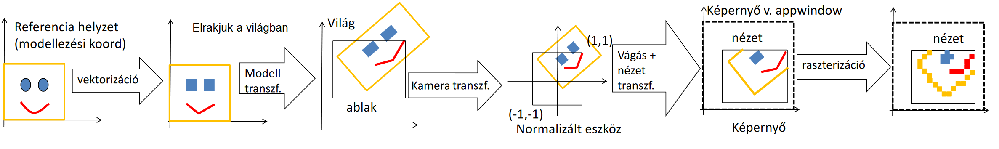
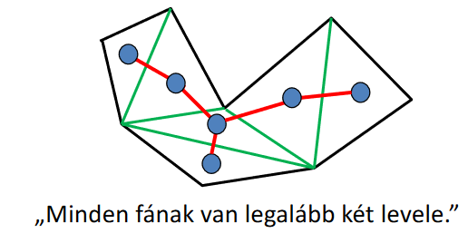
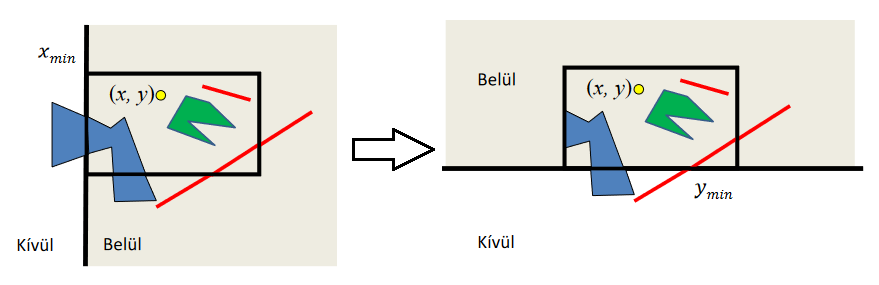
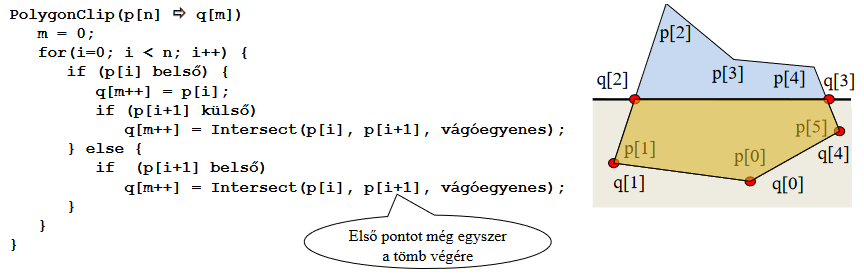
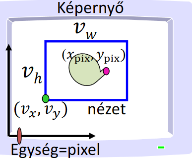

# 2D képszintézis

<!--

-->

> Van egy világ amit reprezentálni akarunk, ez világ koordinátarendszert használ, nekünk a célunk ebből a releváns részt a kamera ablakban megjeleníteni, a viewportba felrajzolni

## Pixel vezérelt 2D képszintézis
Fogunk minden viewport-beli pixelt és visszakeressük, hogy az világkoordinátarendszerben melyik pontot reprezentálja

- Előny, hogy bármilyen transzformációt használhatunk, de hátrány hogy lassú
- Egy másik hátrány, hogy nem minden alakzatnál tudjuk megállapítani, hogy benne vagyunk-e.
    - Megoldás lehet az implicit egyenlet, ahol ha $f(x,y) = 0$, akkor a határon, ha $< 0$ akkor benne, különben pedig kívül vagyunk.
    - Parametrikus görbéknél más a megoldás pl. van az a színezési módszer, ahol az dönti el, hogy páros vagy páratlan számúszor mentünk át az alakzat határán *(de ennek a hátrányairól órán nem beszéltünk)*
    <!--pedig nagyon egyszerű megmutatni, csak képzelj el egy M betűt-->
- Az hogy mi legyen épp az előtérbe legjobb esetben egy listából halászható vissza

## Objektum vezérelt képszintézis 
Alakzatokat mozgatunk a világkoordinátarendszerben, a viewportban a kirajzolás hátulról *(kis prioritásúaktól)* kezdődik, így az van az előtérbe renderelve, ami legelöl van. Ráadásul nem is lassú

Megjelenítés menete:


1. vektorizáció (a modellt kirakjuk - pl. a kis háromszögeket)
<br>**CPU $\Rightarrow$ GPU VAO**
2. a modelltranszformációval elrakjuk valahova a világba
<br>**GPU Vertex shader**
3. a kameratranszformáció eltranszformálja a normalizált eszközkoordinátarendszerbe *(persze mi is csak akkor fogjuk látni, ha a kamera látná)*
<br>**GPU pipeline**
4. ezután a nézet hatása alá kerül és ki lesz vágva, ami felesleges
<br>**GPU pipeline**
5. raszterializáljuk a képet *(pixelenként felrajzoljuk ami látszik)*
<br>**GPU fragment shader + frame buffer**

## Vektorizáció
> Hogyan alakítjuk pontokra, szakaszokra és háromszögekre az alakzatainkat?

- A görbéket $n$ pici szakaszra bontjuk, ahol a szakasz $i.$ pontja $r(t_i)$ érték *(akkor tudjuk pontosan lekövetni a görbét, ha kicsi a különbség)* 
$t_i = t_{\text{start}} + (t_{\text{end}} - t_{\text{start}}) \cdot  i / n$
- A sokszögeket háromszögekre bontjuk:
    - A konvex sokszögeknél van $O(n)$-es algoritmus
    - A konkáv $O(n^3)$
- **Tétel:** minden 4+ csúcsú, egyszerű sokszögnek van diagonálja, azaz mindegyik felbontható diagonálok mentén
    > egyszerű sokszög: ceruza felemelés nélkül megrajzolható és a határainak pontjait nem érinti kétszer
    - Ez a konkáv alakzatokra is igaz
    - ***Bizonyítás:*** *veszünk egy csúcsot és a két szomszédját összekötjük 1 vonallal, ekkor két dolog történhet:*
        1. *az így kapott háromszögben nincs további csúcs $\Rightarrow$ egy diagonált húztunk be*
        2. *ez a háromszög tartalmaz csúcsokat, (mert mondjuk egy konkáv cucc és kívülről még belógnak dolgok a berajzolt él fölött) ekkor az eredetileg kiválasztott csúcshoz legközelebbi belógó csúcsot diagonállal kötjük*
- Konkáv alakzatok felvágása:
    - itt egyenként kell tesztelni a diagonál jelölteket, hogy nem metsz másik éleket és hogy a poligonon belül fut
    - azért ilyen magas a komplexitás, mert: $O(n)$ darab diagonál jelölt csúcspontunk van, amikre $O(n \cdot (n - 3)/2)$ élet kell tesztelni. 
    
- Fülvágó algoritmus:
    - ha van egy olyan $p_i$ pont aminek a szomszédait diagonál köti össze, akkor a fül levágható
    - *(Már csak azt kell belátni ehhez, hogy minden poligonnak van füle)*
    - **2 fül tétel:** minden 4+ csúcsú egyszerű sokszögnek van legalább 2 füle
        - *Bizonyítás:* már beláttuk, hogy minden ilyen alakzat háromszögesíthető. Ekkor ha háromszögekre bontjuk az alakzatot és a területek legyenek gráf csúcsai *(az élek pedig a diagonálok)*
        - Ez a gráf összefüggő, mert az alakzat összefüggő, továbbá nem tartaklmaz kört *(mert ha tartalmazna és elvágnánk egy élét, akkor az összefüggése megmaradna)* $\Rightarrow$ ez egy fa gráf $\Rightarrow$ minden fának van legalább 2 levele $\Rightarrow$ mindig lesz mit levágni
        - 

## Kamera transzformáció
- 2 fontos lépése van:
    1. **View transzformáció:** a kamera középpontját az origóba kell viszatolni
    $x_{cam} = x_{world} - c_x \qquad y_{cam} = y_{world} - c_y$
    *(ahol $c_x, c_y$ a kamera közepe)*
    $\begin{pmatrix}
        1 & 0 & 0 & 0 \\
        0 & 1 & 0 & 0 \\
        0 & 0 & 1 & 0 \\
        -c_x & -c_y & 0 & 1 \\
    \end{pmatrix}$
    2. **Projekció:** a kamera ablakot a normalizált eszköz koordinátarendszerbe kell tenni
    $\begin{pmatrix}
        2 / w_x & 0 & 0 & 0 \\
        0 & 2 / w_y & 0 & 0 \\
        0 & 0 & 1 & 0 \\
        0 & 0 & 0 & 1 \\
    \end{pmatrix}$
- Ezeket megszorozva a modellezési transzformációs mátrixszal a világkoordinátarendszerből az ablak terébe tudunk mozgatni mindent
- Ennek a 3 mátrixnak a szorzata az **MVP** mátrix (Model View Projection) 
- *(a vertex-ek MVP mátrixal történő szorzását a vertex shader-ben kell megírni)*

## Vágás
- Mégis hogyan döntjük el, hogy mi az ami nincs benne a viewportban?
    - Minden pont ami belül van $-1$ és $1$ közötti koordinátákkal rendelkezik $\Rightarrow$ a 4 oldal mentén körbemegyünk és azokat a pontokat kivágjuk, amik nem teljesítik
    
    - ez pontokra egészen jól működik, de a szakaszok meg háromszögek sarkainak kivágása nem túl optimális.
- **Szakasz vágás:**
    - ha $x > x_{\text{max}}$, akkor mit lehet tenni
    1. mivel a szakasz az egy egyenes, aminek van két végpontja, ezért felírható:
    $x(t) = x_1 + (x_2 - x_1) \cdot t$
    2. $x_{\text{max}}$-ot az alábbi $t$ értéknél metszik:
    $\displaystyle t = \frac{(x_{\text{max}} - x_1)}{(x_2 - x_1)}$
    3. akkor a túl lógó pontot helyettesítsük:
    $\displaystyle \left(x_{\text{max}} \ , \ y_1 + (y_2 - y_1) \cdot \frac{(x_{\text{max}} - x_1)}{(x_2 - x_1)} \right)$
- Poligon vágás:

<!--ez inkább érdekességnek tűnt-->

- 3D Vágás homogén koordinátákkal:
    - $X(t) = X_1 \cdot (1 - t) + X_2 \cdot t$
    - Ekkor a cél, hogy:
    $-1 < x = X / w < 1$
    Amit valójában a GPU úgy valósít meg, hogy:
    $-w < X < w$
    - Ha vágni kell, akkor a szakasz vágáshoz hasonlóan csinálja
    *(persze nem csak X, hanem Y és Z koordinátára is)*

### Viewport transzformáció
- Amikor normalizált eszközkoordinátákból képernyő koordinátákba visszük át (pixelekre)


    *(ahol `glViewport(vx, vy, vw, vh)`)*

$x_{pix} = v_w (x_{norm} + 1) / 2 + v_x$

$y_{pix} = v_h (y_{norm} + 1) / 2 + v_y$

## Raszterizáció
- **Pontok kirajzolása**: mivel a pont nem biztos, hogy egy egész helyen van, ezért kerekítjük a koordinátáit és azon a helyen lévő pixelt rajzoljuk ki

- **Szakaszok kirajzolása**:
    - $y = mx+b$ alapon növeljük x-et és az $y$ értéket kerekítve megkapjuk a pixelt, amit ki kell színezni
        - De ez lassú! Minden pont kiszínezéséhez egy szorzást meg egy összeadást kell elvégezni + kerekíteni
    - Megoldás: inkrementális elv, 1-szer kiszámoljuk az m-et és mindig csak hozzáadjuk
    $y(x) = y(x-1) + m$
        - De itt még mindig kerekíteni kell
        - *(csak azt az esetet tárgyaltuk amikor $m > 0$)*
    - Fixpontos inkrementális számítási elv:
        ```cpp
        const int T = 12; // fractional bits

        LineFix (short x1, short y1, short x2, short y2) {
            int m = ((y2 - y1) << T) / (x2 - x1);
            int y = (y1 << T) + (1 << (T - 1)); // +0.5

            for(short x = x1; x <= x2; x++) {
                short Y = y >> T; // trunc
                write(x, Y, color);
                y = y + m;
            }
        }
        ```
    - a lényeg, hogy ugyanúgy inkrementális, csak a bit shifttel végzi el a kerekítést, ami már nagyon gyors
    - Ezt egy [DDA](https://en.wikipedia.org/wiki/Digital_differential_analyzer_(graphics_algorithm)) szakaszkirajzoló hardver végezheti el, amivel még sokkal gyorsabb *(szimplán 3 regiszter, meg 1 összegző)*
- **Háromszög kitöltés**:
    - itt is inkrementális elv és soronként érdemes csinálni és ha egy határt érintünk, akkor kezdődik a háromszög
    - az inkrementális elv a textúrázásnál is fontos lehet, hiszen a csúcsok között ahogy lépegetünk úgy tudjuk interpolálni a megadott textúrát

---

# Kvíz

!!! question 1\. Hány diagonálja van egy szabályos 5-szögnek?

??? tip Megoldás
    Válasz: 5
    Magyarázat: Szabályos sokszögeknél az átlók száma ($\frac{n \cdot (n-3)}{2}$)

---
!!! question 2\. A 2D világba tett kamera középpontja $(168,968)$ a kameraablak szélessége $14$ magassága $7$. Mi lesz az $(221,16)$ világkoordinátarendszerbeli pont megfelelőjének $x$ koordinátája normalizált eszközkoordinátarendszerben?

??? tip Megoldás
    (Nem kell túl gondolni)
    - A kamera középpontja a normalizált eszkkoord. rendszerben: $(0, 0)$
    - Az innen relative $+(7, 3.5)$ világkoordináta lesz a $(0.5, 0.5)$ *(ez az ablak szélességből látszik)*
    - Vagyis a kapott pontunk pozíciója: $\displaystyle \left(\frac{(221 - 168)}{14 / 2}, \frac{(16 - 968)}{7 / 2} \right) = \left(\frac{53}{7}, \frac{-952}{3.5} \right) = (7.5714, -272)$
    *(azért kell /2-vel számítani a képernyőszélességet, mert a normalizált az [-1, 1] intervallumon van, vagyis a szélessége 2 lenne)*

---
!!! question 3\. Nevezzük a szorzást és az osztást összefoglalóan bonyolult műveletnek, az összeadást és kivonást pedig egyszerűnek. 
    Hány bonyolult műveletet hajt végre egy inkrementális háromszögkitöltő algoritmus az 
    $$(279,644), (14,770), (537,748)$$
    csúcsú (pixelkoordinátákban) háromszög kitöltésekor?

??? tip Megoldás
    <!--Ha jól gondolom-->
    - A háromszög 3 oldalán lévő egyenesek meredekségét fogjuk osztással kiszámolni $\Rightarrow$ 3 osztás történik

---
!!! question 4\. A szakasz két végpontjának koordinátái normalizált eszközkoordinátarendszerben: $(-3.7;0.2;-0.5), (4.7;0.2;-0.5)$
    Mi lesz az első pont $x$ koordinátája a vágás után?

??? tip Megoldás
    Válasz: $-1$
    Magyarázat: ha túl megy a határon, akkor le kell vágni. Ilyenkor a vágott rész a határhoz kerül

---
!!! question 5\. Hány diagonálja van az alábbi 5-szögnek?
    

??? tip Megoldás
    Válasz: 0
    Nem tudsz úgy berajzolni, hogy az ne az alakzaton kívül legyen

---
!!! question 6\. DDA algoritmus $16$ bites törtrésszel dolgozik. Mennyivel nő a $y$ regiszter értéke egészként értelmezve a tárolt bináris számot, két egymást követő pixel között, ha a szakasz két végpontja pixel koordinátákban: $(29,21), (86,39)$

??? tip Megoldás
    $$T = 16$$
    $$M = ((y_2 - y_1) << T) / (x_2 - x_1)$$
    Vagyis
    $$M = ((39 - 21) << 16) / (86 - 29) = 18 \cdot 2^{16} / 57 = 20 695$$
    (itt a törtrészt le kell vágni, mert int-re cast-olunk)

---
!!! question 7\. Melyek az alábbiak közül az igaz állítások?

??? tip Megoldás
    - [x] Minden fagráfnak van legalább két levele.
    - [x] Minden több mint három csúcsú egyszerű sokszög felbontható háromszögekre a diagonáljai mentén.
    - [x] Van olyan több mint három csúcsú sokszög, amelynek nincs diagonálja.
    *(kettővel fentebb a példa)*
    - [x] A diagonálok mentén végrehajtott felbontás nem egyértelmű.
    - [x] Minden több mint három csúcsú  egyszerű sokszögnek van  legalább két füle.
    - [ ] A háromszögeket egy gráf csomópontjainak tekintve, a diagonálokat pedig a két oldalukon lévő háromszögeknek megfelelő csomópontok közötti élnek, a keletkező gráf tartalmazhat kört.
    - [ ] Minden több mint három csúcsú sokszögnek van legalább két füle.
    *(nem, ha nem egyszerű)*

---
!!! question 8\. Melyek az alábbiak közül affin transzformációk?

<!-- TODO: finish this question -->

- Az (1, 3) pont körüli forgatás
    *(ez egy eltolás és forgatás)*
- Helyben hagyás
- x tengely mentén végrehajtott skálázás
- Origóra tükrözés
- Nyírás: x'=x; y'= y+ax 
    *(igen, ez is tekinthető annak)*
- Eltolás
- x tengelyre vetítés

---
!!! question 9\. Az alábbi 2D homogén lineáris transzformációs mátrix hány fokos elforgatást valósít meg:

<!-- TODO: finish this question -->

>    0, -1, 0
<br>    1,  0, 0
<br>    0,  0, 1

> Nyilván végtelen sok helyes válasz van, amelyek 360 fok egész számú többszörösében különböznek. A minimális abszolút értékű megoldást várjuk.

$\cos(\varphi) = 0$ és $\sin(\varphi) = -1 \Rightarrow \varphi = -90$

---
!!! question 10\. Hány füle van az alábbi 5-szögnek?
    

??? tip Megoldás
    Válasz: 0
    Magyarázat: Ha nincs diagonálja, akkor füle sincs (mert a fül az amikor egy pont szomszédai összeköthetők diagonállal)

---
!!! question 11\. Nevezzük a szorzást és az osztást összefoglalóan bonyolult műveletnek, az összeadást és kivonást pedig egyszerűnek. Hány bonyolult műveletet hajt végre a GPU a fix műveleti egységben összesen egészen a pixel árnyalóig, egységmátrix MVP és az alábbi kételemű vbo által definiált szakasz feldolgozásakor és alábbi csúcspont árnyalót feltételezve:
    `VBO = (0, 0.1, -0.4, 0.5),  (-0.2, -0.3, 0.2, 0.9)`
    Csúcspont árnyaló program:
    ```cpp
    uniform mat4 MVP;
    layout(location = 0) in vec4 v;
    void main() {
        gl_Position = v * MVP;
    }
    ```

??? tip Megoldás
    Válasz: 7
    Magyarázat:
    - $2 \cdot 4$ a pontok és az MVP szorzása. 
        - MVP egy egységmátrix, meg amúgyis 4 szorzás lenne
        - Viszont ott ahol 0-val szoroznánk, ott tolhatunk egy `return 0`-t vagyis -1 szorzást végzünk el
    - A DDA-hoz tartozó osztás pedig azért nem számít, mert az már a raszterializálásnál a csúcspont árnyalás után történik
    $\Rightarrow 8-1 = 7$

[Előző](./4.md)

[Következő](./6.md)
