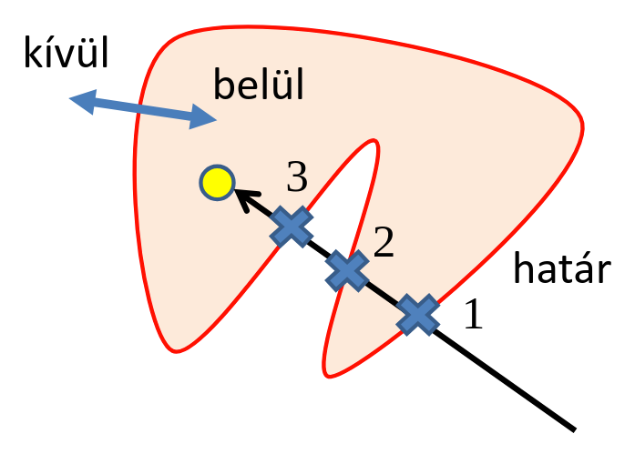
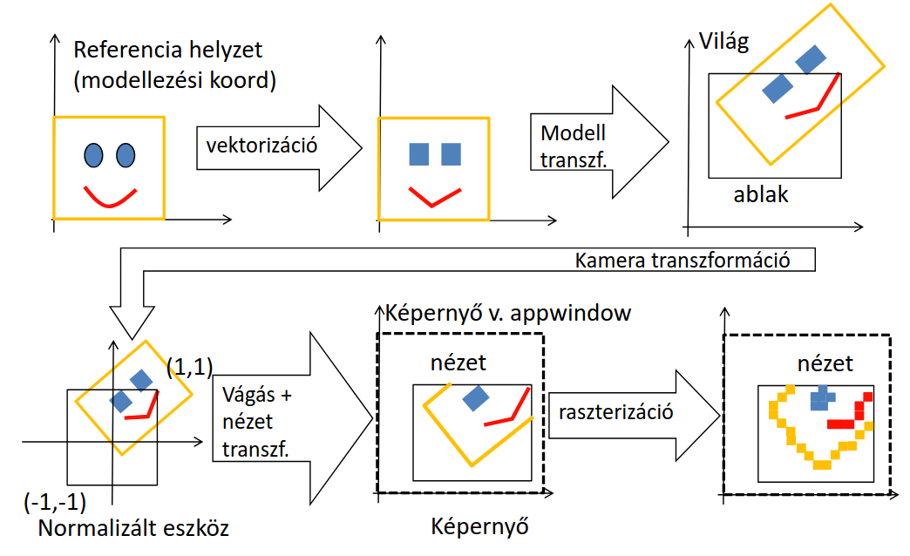
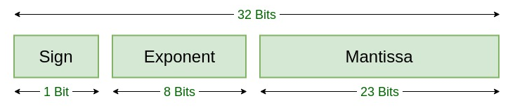
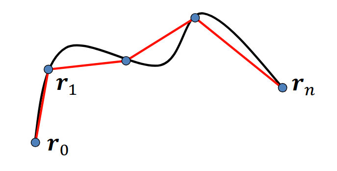
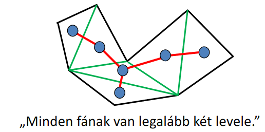
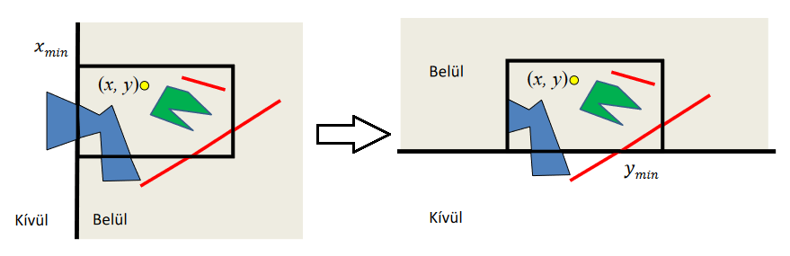

# 2D képszintézis

Feltételezzük, hogy a virtuális világunk a kétdimenziós Euklideszi sík. Hogyan tudjuk ezt a világot megjeleníteni a képernyőn?

Vannak objektumjaink, amiknek tudjuk a helyét a virtuális világban. Szükségünk lesz egy kamerára, ami azt jelöli majd ki, hogy a virtuális világból mennyit látunk (hol vagyunk, merre nézünk, stb). A végső fénykép pixelekből áll, szóval minden pixelről el kell dönteni, hogy milyen színű legyen. Ha minden objektumhoz rendelünk egy színt, aztán pedig ez az objektum feltűnik egy adott pixelen, akkor tudjuk, hogy annak a pixelnek milyen színűnek kell lennie. (Ha több objektum is verseng egy adott pixelért, azaz van overlap, akkor explicit prioritást használunk, azaz konkrétan van egy szám minden objektumhoz, ami megmondja, hogy milyen sorrendben rajzoljuk ki őket)

Hogyan tudunk kapcsolatot teremteni az objektumaink és a képernyő között? Két irányból közelíthetjük meg:

- pixelvezértel (pixel -> objektumok)
- objektumvezérelt (objektumok -> pixel)

Az objektumvezérelt gyakran hatékonyabb, mint a pixelvezérelt, azt fogjuk preferálni.

## Pixelvezérelt képszintézis

Induljunk a pixelek felől. A képernyőn véges számú pixel van, tehát elég annyit csinálnunk, hogy minden egyes pixelben eldöntjük, hogy melyik objektum látszódik benne. Transzformáljuk a pixeleket világkoordinátarendszerbe, és ezután pedig amelyik objektumra landolunk, az van abban a pixelben (figyelembe véve a prioritásukat).

Ez a megközelítés az egyszerűbb, pixelenként egy pontot kell csak transzformálni, utána pedig az objektum prioritása szerint csökkenő sorrendben eldönteni, hogy egy adott primitív tartalmazza-e a transzformált pontunkat.

A hátránya az, hogy nagyon lassú. [Később](8.md/#összegzés) majd látunk egy példát konkrét számokkal, de általánosságban ha nem csak 1-1 képet szeretnénk generálni, hanem másodpercenként sokat, akkor legtöbbször ez a megközelítés alkalmatlan.

### Tartalmazás

Az egyenleteink csak az alakzatok határán lévő pontokat adják meg, viszont nekünk legtöbbször kitöltött alakzatok is kellenek. Ehhez el kell tudni dönteni egy pontról, hogy egy alakzaton belül van-e, azaz tartalmazza-e.

Implicit görbék (például gömbök) esetén adott az $f(x,y)$ implicit egyenletünk. Ha $f(x,y) = 0$ akkor a határpontokat kapjuk, viszont vizsgálhatjuk azt is, hogy nagyobb-e, vagy kisebb-e mint $0$ egy adott pontban az $f(x,y)$. Általánosságban:

$$
\boxed{
\begin{align*}
f(x,y) &\gt 0 \, \text{: kívül} \\
f(x,y) &= 0 \, \text{: határon} \\
f(x,y) &\lt 0 \, \text{: belül}
\end{align*}
}
$$

Parametrikus görbék esetén a függvényünk nem pontokat, hanem $t$ időpillanatokat vár, tehát ezt a trükköt nem egészen alkalmazhatjuk. Ekkor a következőt tehetjük: állítsunk a pontunkra egy olyan félegyenest, ami szeli a parametrikus görbénket. Ezután számoljuk meg, hogy az egyenes hányszor metszi az alakzatot, mielőtt a pontunkba érkezik. Ha páratlan sokszor, akkor a pont az alakzaton belül van, ha páros sokszor, akkor az alakzaton kívül van.

??? tip Magyarázat
    Tekintsük az alábbi ábrát:

    

    Ha a "végtelenből" elindulunk a félegyenesünkön a pontunk felé, akkor természetesen az objektumon kívül vagyunk (hiszen nem lehet végtelen nagy az objektum) és ekkor még egyszer sem metszettük az objektumot, tehát a metszési szám $0$. Amikor először metsszük, akkor mivel eddig kint voltunk, ezért belülre kerülünk, és a metszési szám is megnő egyel, azaz egy páros számról ($0$) egy páratlan szám ($1$) lett. Ha ezután elhagyjuk az objektumot, akkor mivel eddig bent voltunk, ezért most kívülre esünk, és a metszések száma is paritást vált. Ugyan ezzel a logikával haladva a pontunk felé amikor elérjük, el tudjuk dönteni a metszési szám alapján, hogy belül, vagy kívül vagyunk.

#### Implementáció (tartalmazás)

Később majd látunk részletesebb (és hasznosabb) példákat, de a teljesség kedvéért az alábbi minimális, tartalmazás vizsgálásra fókuszált kódrészletet is a jegyzetbe tettük.

??? tip Kódrészlet
    ```cpp
    struct Object { // base class
        vec3 color;
        virtual bool In(vec2 r) = 0; // containment test
    };

    struct Circle : Object {
        vec2 center;
        float R;
        bool In(vec2 r) { return (dot(r-center, r-center) < R*R); }
    };

    struct HalfPlane : Object {
        vec2 r0, n; // position vec, normal vec
        bool In(vec2 r) { return (dot(r–r0, n) < 0); }
    };

    struct GeneralEllipse : Object {
        vec2 f1, f2;
        float C;
        bool In(vec2 r) { return (length(r-f1) + length(r-f2) < C); }
    };

    struct Parabola : Object {
        vec2 f, r0, n; // f=focus, (r0,n)=directrix line, n=unit vec
        bool In(vec2 r) { return (fabs(dot(r-r0, n)) > length(r–f));}
    };

    class Scene { // virtual world
        list<Object *> objs; // objects with decreasing priority
        Object *picked = nullptr; // selected for operation

       public:
        void Add(Object * o) { objs.push_front(o); picked = o; }
        void Pick(int pX, int pY) { // pX, pY: pixel coordinates
            vec2 wPoint = Viewport2Window(pX, pY); // transform to world
            picked = nullptr;
            for(auto o : objs) if (o->In(wPoint)) { picked = o; return; }
        }

        void BringToFront() {
            if (picked) { // move to the front of the priority list
                objs.erase(find(objs.begin(), objs.end(), picked));
                objs.push_front(picked);
            }
        }

        void Render() {
            for(int pX = 0; pX < xmax; pX++) for(int pY = 0; pY < ymax; pY++) {
                vec2 wPoint = Viewport2Window(pX, pY); // wPoint.x = a * pX + b * pY + c
                for(auto o : objs) if (o->In(wPoint)) { image[pY][pX] = o->color; break; }
            }
        }
    };
    ```

## Objektumvezérelt képszintézis

Induljunk az objektumaink felől. Véges számú objektumunk van, szóval ha az összeset transzformáljuk a képernyőkoordinátákba, akkor tudni fogjuk, hogy melyik pixeleket fedik le, azokat mind ki tudjuk színezni az objektum színére. Ha a kirajzolási prioritásuk szerint növekvő sorrendben rajzoljuk ki őket, akkor a "fontosabbak" felül fogják írni az előzőeket. Ez abból a szempontból bonyolultabb lesz, hogy míg a pixelvezérelt megközelítésben csak 1-1 pontot transzformáltunk, most már teljes komplex alakzatokat fogunk, és ezért felmerülnek olyan problémák, amik 1-1 pont esetén nem.

### A pipeline

Vizsgáljuk meg részletesen a megjelenítési csővezetéket (műveletsor) az objektumvezérelt esetben:



A kiindulási állapotban a referencia helyzetbeli objektumunk van. Ezek olyan objektumok, amelyekről a [modellezési fejezetben](3.md) tárgyaltunk, például Beziér-görbék, Catmull-Rom splineok, ellipszisek, stb...

Ezeket az objektumokat transzformálni szeretnénk (végső soron a képernyőkoordinátarendszerbe), viszont beleütközünk a fentebb is említett problémába: pontokat könnyű transzformálni, de általános alakzatokat nem. Senki sem garantálja nekünk, hogy ami a transzformáció előtt egy kör volt, vagy egy háromszög volt, az utána is az lesz, pedig nekünk ez fontos lenne.

Muszáj lesz limitáljuk magunkat olyan transzformációkra, amik szakaszt szakaszba, és háromszöget háromszögbe visznek, tehát ami eredetileg egy háromszög volt, az a transzformáció után is egy háromszög (de nem feltétlenül ugyan akkora például). Az ilyen transzformációk a _homogén lineáris transzformációk_. Ezekkel már megtartjuk a szakaszainkat és a háromszögeinket, de ez hogyan segít nekünk abban, hogy egy kört transzformáljunk? Itt lép be az első művelet, amit végrehajtunk az objektumainkon, a _vektorizáció_. A komplex alakzatainkat mind pontokkal, szakszokkal, és háromszögekkel közelítjük úgy, hogy ez ne legyen nagyon feltűnő a felhasználónak. Mind a három primitívet le lehet írni csak a csúcspontjaikkal, szóval elég, ha ezeket a csúcsokat transzformáljuk, és utána garantáltan szakaszokat, és háromszögeket kapunk csak.

Vizsgáljuk meg most azokat a konkrét transzformációkat, amiket végre fogunk hajtani az objektumunkat közelítő primitívek pontjain:

- modell transzformáció (a referenciahelyzetből elviszi az objektumot az aktuális helyébe a virtuális világban; animáció esetén ez a transzformáció időfüggő)

Tehát lényegében a világon belül elmozgatjuk. A világban megjelenik a kamera is, és az alakzatoknak ezt a kamerát kell követniük a továbbiakban, viszont a további műveletek egyszerűsítése érdekében (hardware támogatottság) még mielőtt a képernyőkoordinátarendszerbe transzformálnánk az objektumot a kamerával, azelőtt beiktatódik egy köztes lépés:

- kamera transzformáció (a világkoordinátarendszerből elviszi az objektumot az eszközkoordinátarendszerbe, itt történik a vágás)

A normalizált eszközkoordinátarendszerben a kamera nem valami tetszőleges helyen van a világban és a mérete nem függ attól, hogy a felhasználó ablaka éppen mekkora, hanem pontosan megfelel a $[-1, -1] \times [1, 1]$ négyzetnek. Ez nekünk azért jó, mert így a vágás művelete (az objektumunknak azon részét, amit nem lát a kamera/kilóg a kamerából, azt levágjuk) sokkal egyszerűbb.

??? example Miért pont $[-1, -1]$ és $[1, 1]$?
    Azon kívül, hogy matematikailag "szép" az a négyzet, aminek minden pontja a $-1$ és $1$ között van, más, gyakorlatiasabb oka is van. Általában lebegőpontos számokkal dolgozunk, tehát a pontjaink koordinátái is lebegőpontos számok. Persze implementáció függő, de a legtöbb architektúra az IEEE 754 floating point standardot használja, ahol egy `float` $32$ biten tárolódik, mégpedig az alábbi értelmezésben:

    

    Ekkor a `float` értékét a következő képpen lehet képezni:

    $$
    \text{Value} = (-1)^{\text{Sign}} \cdot 1.\text{Mantissa} \cdot 2^{\text{Exponent} - 127}
    $$

    ahol az $1.\text{Mantissa}$ azt jelenti, hogy a $\text{Mantissa}$ bitjei elé teszünk egy $1.$-ot. A túlságosan mély elemzést mellőzve nekünk ebből jelenleg annyi a releváns, hogy egy $1$-nél picivel nagyobb számot megszorzunk egy kettő hatvánnyal, mégpedig az $\text{Exponent} - 127$-edikkel. Ezt a kifejezést nevezzük a lebegőpontos szám _karakterisztikájának_. Ha ez a kifejezés negatív, akkor az $1$-nél picivel nagyobb számunkat megszorozzuk egy nagyon kicsi számmal (legnagyobb esetben is $0.5$, de ennél jóval kisebb is lehet), tehát a végén kapott $\text{Value}$ biztosan egy egynél kisebb szám lesz. Természetesen ha az előjelbit $1$, akkor ugyan ez a logika, csak $-1$-el.

    Tehát kaptunk egy nagyon gyors módszert arra, hogy eldöntsük egy pontról, hogy valamelyik koordinátája túllépte-e a $[-1, -1] \times [1, 1]$ négyzet határait: vegyük a koordinátát adó lebegőpontos szám 2-9. bitjeit, és vonjunk ki az általuk alkotott számból $127$-et. Ha az így kapott szám pozitív, akkor a pont koordinátája nagyobb mint egy, ha negatív, akkor kisebb mint egy.

A vágás után már transzformálhatjuk a primitíveinket a képernyőkoordinátarendszerbe, ami pedig a _nézet transzformáció_:

- nézet transzformáció (az eszközkoordinátarendszerből elviszi az objektumot a képernyőkoordinátarendszerbe, a viewport méretét figyelembe véve)

Ezt követően a képernyőkoordinátarendszerben van az objektumunk, viszont még nem mondtuk meg az egyes pixeleknek, hogy milyen színűnek kell lenniük. Ezt is az objektum irányából fogjuk megközelíteni: az objektum primitíveit (pontok, szakaszok, háromszögek) pixelekre képezzük különböző algoritmusok segítségével. Ez a folyamat a _raszterizáció_.

Bár ez a teljes folyamat, nekünk nincsen minden egyes lépésére befolyásunk:

- a virtuális világ menedzsmentjét, és az elemek vektorizációját mi valósítjuk meg a CPU-n a C++ programunkban,
- a már vektorizált primitíveket átmásoljuk a GPU-ra, ahol ezek VAO-kban kerülnek tárolásra,
- a modell transzformációt mi adhatjuk meg a GPU-nak a GLSL nyelven írt vertex shaderben,
- ezt követően pedig a vágás, a nézet transzformáció, illetve a raszterizáció egy fix GPU csővezetéken történik, nem mi írjuk meg közvetlenül,
- a raszterizáció által előállított pixelsorozat a fragment shaderen megy keresztül még mielőtt megjelenítésre kerülne, melyet GLSL nyelven mi adhatunk meg a GPU-nak,
- végezetül pedig a pixelek bekerülnek egy frame bufferbe, ahonnan egyenesen a képernyőn jelennek meg.

A GPU az 3D-s grafikára van felkészítve, és a projekt geometria támogatása érdekében homogén koordinátákkal dolgozik, tehát attól függetlenül, hogy mi csak 2D-s képszintézist szeretnénk, nekünk muszáj lesz a maradék négy koordinátát is kitölteni, legtöbbször $[x, y, 0, 1]$ alakban (azaz a $z$ koordináta mindenhol $0$, és $w$ pedig $1$).

Vizsgáljuk részletesebben az egyes műveleteket.

### Vektorizáció

Hogyan alakítjuk pontokra, szakaszokra és háromszögekre az alakzatainkat? Két féle alakzatunk lehet: görbe (azaz nem fog közre területet) és valamilyen kitöltött poligon (területet fog közre). Vizsgáljuk meg külön-külön, hogy mit tehetünk.

#### Görbék

Ha a görbéinket $n$ pici szakaszra bontjuk, ahol a szakasz $i.$ pontja $r(t_i)$ érték:



Ekkor ha megfelelően sűrűn mintavételezzük a szakaszt, akkor egészen pontosan tudjuk közelíteni a szakaszainkkal:

$$
t_i = t_{\text{start}} + (t_{\text{end}} - t_{\text{start}}) \cdot  i / n
$$

ahol a görbénket $n$ szakaszra bontjuk. Persze ha $n$ túl nagy, akkor nagyon sokat fog dolgozni a szegény GPU, és a végén lehet, hogy emberi szemmel nem is látható a különbség.

Az OpenGL-ben ha a megadott pontjainkat így szeretnénk értelmezni (tehát egy görbének $n$ kicsi szakaszra bontásaként), akkor két primitív közül választhatunk: `GL_LINE_STRIP` (sorban egymás után, lásd fenti ábra) és `GL_LINE_LOOP` (az utolsót az elsővel is).

#### Poligonok

A sokszögünket háromszögekre tudjuk csak bontani, de ez már egy sokkal nehezebb feladat, mint a görbék szakaszokra bontása. A poligonjainkat az úgynevezett _diagonáljaik_ mentén kell felvagdosni, hogy háromszögeket kapjunk.

!!! info 5.1 Definíció (diagonál)
    Olyan szakasz, mely a sokszög két pontját köti össze, és a szakasz teljes egészében a sokszögön belül van.

Ha diagonálok mentén vágjuk fel az alakzatunkat, akkor minden vágás után garantáltan két kisebb csúcsszámú alakzatot kapunk, tehát véges lépés után csak háromszögeink maradnak majd. Gondoljunk bele, hogy ez közel sem garantált, ha random vagdossuk az alakzatunkat, sőt, néha még növelhetjük is a csúcsszámot.

Konvex sokszögek esetén minden nem szomszédos csúcspár egy diagonált alkot, tehát itt hatékony algoritmust ($O(n)$) adhatunk az alakzat háromszögekre bontására. Konkáv sokszögekre ez már nem igaz, tehát itt lényegesen bonyolultabb algoritmust kell majd használnunk ($O(n^3)$).

Felmerülhet a kérdés, hogy mi a garancia arra, hogy minden konkáv sokszögben van annyi diagonál, hogy felbontható legyen háromszögekre. Az alábbi tétel azt mondja ki, hogy minden _egyszerű_ sokszögre ez igaz lesz.

!!! info 5.1 Tétel (Egyszerű sokszögek diagonáljának létezése)
    Minden legalább $4$ csúcsú <u>__egyszerű__</u> sokszögnek van diagonálja, azaz mindegyik felbontható diagonálok mentén.

Egy sokszög pedig akkor _egyszerű_, ha az oldalai nem keresztezik egymást és "megrajzolható a ceruza felemelése nélkül".

??? tip Bizonyítás
    Keressük meg a sokszögünk egy szélső csúcsát, mondjuk az $x$ irányba (tehát a legnagyobb $x$ koordinátájú csúcs). Vegyük a két szomszédját és kössük őket össze. Ekkor két dolog történhet:

    - az így kapott háromszögben nincs további csúcs, azaz egy diagonált húztunk be (tehát létezik diagonál), vagy
    - ez a háromszög tartalmaz csúcsokat (például egy konkáv alakzat esetén kívülről még belógnak élek a berajzolt él fölött)
    
    A második esetben vegyük az összes olyan csúcsot, ami belóg a háromszögünkbe. Ha ezek közül kiválasztjuk a legszélsőt (megint az $x$ koordináta szerint), akkor az azt jelenti, hogy a belógó csúcsok közül ezen túl nincsen más, csak az eredeti csúcs. Mivel nincsen közöttük semmi, ezért diagonált húzhatunk közéjük, tehát ebben az esetben is létezik egy diagonál. <span style="display: flex; justify-content: flex-end;"> $\blacksquare$ </span>

Tehát garantáltan lesz legalább egy diagonál minden egyszerű poligonban, és ementén elvágva kapunk egy háromszöget és egy másik egyszerű poligont, amiben szintén garantáltan van diagonál.

Konkáv alakzatok felvágása esetében több dolgunk van, mint konvex alakzatoknál. Egyenként kell tesztelni a diagonál jelölteket, hogy:

- nem metszik-e másik élet (szakaszok metszése, később látjuk),
- csak a poligonon belül fut-e (hasonlóan mint a pixelvezérelt algoritmusokban a tartalmazás eldöntése).

Azért ilyen magas a komplexitása, mert $O(n)$ darab diagonál jelölt csúcspontunk van, amikre $O(n \cdot (n - 3)/2)$ élet kell tesztelni, ami összesen $O(n^3)$.

Szerencsére viszont minden egyszerű poligonnak azon felül, hogy van diagonálja, van két speciális diagonálja, amelyeket könnyű megtalálni. Ehhez be kell vezessük a _fül_ fogalmát.

!!! info 5.2 Definíció (fül)
    Egy egyszerű sokszögnek egy olyan csúcsa, melynek a két _szomszédos_ csúcsa egy diagonált alkot.

Tehát $p_i$ csúcs akkor fül, ha $p_{i-1}$ és $p_{i+1}$ között diagonál fut. Ekkor a $p_i$ fülhöz tartozó diagonál mindig levágható, már csak azt kell belátni, hogy tényleg mindig létezik fül, és egy algoritmust a könnyű megkeresésére. Kezdjük a létezéséről szóló tétellel.

!!! info 5.2 Tétel (Két fül tétel)
    Minden legalább $4$ csúcsú egyszerű sokszögnek van legalább $2$ füle.

??? tip Bizonyítás
    Vegyük a sokszögünket. Már korábban beláttuk, hogy van benne diagonál, és ezáltal háromszögekre bontható. Bontsuk tehát háromszögekre, utána pedig képezzünk belőle egy gráfot (a duális gráfját), a következő módon:

    - minden háromszög legyen egy csúcs
    - két csúcs között akkor fusson él, ha a hozzájuk tartozó háromszögek szomszédosak (azaz osztoznak az egyik élükön, ez az él a diagonál)

    

    Ez a gráf nem akármilyen gráf, hanem egy fa. Vizsgáljuk a feltételeket:

    - összefüggő, hiszen az alakzat maga is összefüggő, nem lehet olyan háromszög, ami nem kapcsolódik a többihez,
    - körmentes, hiszen ha lenne benne kör, az azt jelentené, hogy ha a sokszöget az egyik diagonálja mentén elvágnánk, akkor ugyan úgy összefüggő maradna, ami viszont lehetetlen, hiszen a diagonálok menti vágás mindig két sokszögre bontja az egyszerű sokszögeket.

    Vizsgáljuk meg a fül fogalmát ebben a gráfos kontextusban. Egy fülhöz tartozó háromszöghöz csak egy diagonál tartozhat, hiszen a két szomszédos csúcs alkotja a diagonált. Ha egy csúcs csak egy él mentén kapcsolódik a fához, akkor az a csúcs a fa levele, tehát egy fülnek egy levél felel meg.

    Viszont fagráfok esetén ismert az a tétel, miszerint minden fának van legalább két levele. Ezt alkalmazva a mi duális gráfunkra azt kapjuk, hogy minden sokszögnek van legalább két füle. <span style="display: flex; justify-content: flex-end;"> $\blacksquare$ </span>

Nézzük tehát az algoritmusunkat, mely már a fülek fogalmát is felhasználja: végigmegyünk minden csúcson és megnézzük, hogy fül-e. Ha fül akkor levágjuk, ha nem, akkor tovább megyünk. Garantáltan fogunk találni előbb utóbb fület. De hogyan tudjuk eldönteni, hogy egy csúcs fül-e? Próbálgatással: összekötjük a két szomszédját, és megvizsgáljuk, hogy egy diagonált kaptunk-e. Ahogy korábban említettük, ez azt jelenti, hogy:

- nem metszik-e másik élet,
- csak a poligonon belül fut-e.

Nézzük meg ezeket részletesebben.

##### Metszés

Ehhez két szakasz metszését kell megvizsgálni, ahol ismerjük a szakaszank végpontjait. Egyik megközelítés lehet, ha felírjuk a két szakasz egyenletét (mint a végpontjaik konvex kombinációja) és aztán megoldjuk az egyenletrendszert. Ennél elegánsabb módszer, ha azt vizsgáljuk, hogy az egyik szakasz két végpontja a másik szakasz két különböző oldalán helyezkedik-e el, utána pedig, hogy a másik szakasz két végpontja az egyik szakasz két különböző oldalán helyezkedik-e el.

!!! example Részletesebben
    [Ebben](https://youtu.be/Mezx8ov5Akw?si=O2Va9nV0mlMxjWl-&t=1095) a videóban részletesebben, ábrákkal el van magyarázva a második megközelítés.

##### Tartalmazás (diagonálok)

A diagonál jelölt egyik pontjából (általában a középpontjából) elindítunk egy félegyenest bármelyik irányba. Ezután vizsgáljuk, hogy a félegyenes hányszor metszi az alakzatot: páros metszésszám esetén a középpont az alakzaton kívül van, páratlan metszésszám esetén pedig belül.

Nekünk persze az kell, hogy a diagonál jelölt teljes egésze a poligonon belül fusson, viszont kombinálva az előző lépéssel beláthatjuk, hogy elég csak egy pontot vizsgálnunk. Ha tudjuk, hogy a diagonál jelölt nem metszi a poligon egyik élét sem (a végpontjain kívül), akkor tudjuk, hogy nem lehet "vegyes" állapotban a diagonál (azaz egyik része bent van, másik része kint), hiszen ahhoz az kéne, hogy legyen legalább egy metszés egy éllel. Tehát ha vagy teljesen kívül, vagy teljesen belül van a diagonál jelölt, akkor tényleg elég csak egy pontot vizsgálni.

#### Implementáció (vektorizálás)

Nézzünk egy példát arra, hogy ha vannak 2D-s objektumaink, akkor azokat hogyan tudjuk vektorizálni. Ha van egy Bézier görbe osztályunk, akkor fel kell bontanunk kicsi szakaszokra. Ehhez elég, ha mintavételezzük a görbe pontjait elég sűrűn:

```cpp

const int nTessVertices = 100;

//...

vector<vec2> GenVertexData() { // vectorization
    vector<vec2> vertices;
    for(int i = 0; i <= nTessVertices; i++) {
        float t = (float)i / nTessVertices;
        vertices.push_back(r(t));
    }
    return vertices;
}
```

Ez a függvény $100$ szakaszra bontja a görbénket, ahol az `r(t)` függvény a görbe egyik pontját adja `t` futóváltozó szerint.

Később majd látunk egy komplettebb példát, a modell és kamera transzformációk után.

## Modell és kamera transzformáció

A vektorizációt követően már csak pontjaink, szakaszaink, és háromszögeink vannak. Ez nekünk azért jó, mert tudunk olyan transzformációkat találni, amik ezeket az alakzatokat "megtartják", azaz háromszöget háromszögbe, szakaszt pedig szakaszba transzformálnak (homogén lineáris transzformációk).

Magukat a transzformációkat elég csak a csúcsokra végrehajtani, nem kell például egy szakasz minden (végtelen sok) pontjára ezt megtenni. Ez nem magától értetődő, direkt azért használunk homogén lineáris transzformációkat, hogy ez a tulajdonság fenn álljon, hiszen míg matematikailag lehet végtelen sok ponttal dolgozni, a GPU-nak ez nehezen menne.

A homogén lineáris transzformációk általános alakja:

$$
\begin{bmatrix}
x_{\text{world}} \\
y_{\text{world}} \\
z_{\text{world}} \\
1
\end{bmatrix}
=
\bm{T}_{4 \times 4} \cdot
\begin{bmatrix}
x_{\text{model}} \\
y_{\text{model}} \\
z_{\text{model}} \\
1
\end{bmatrix}
$$

ahol $\bm{T}_{4 \times 4}$ egy $4 \times 4$-es mátrix. $\bm{T}$ általában egy _affin_ transzformáció, ami azt jelenti, hogy a negyedik sora $[0,0,0,1]$. Ez azt is garantálja, hogy ha két egyenes párhuzamos volt a transzformáció előtt, akkor utána is azok lesznek.

### Modellezési transzformáció

Ez a legelső transzformáció amit végrehajtunk egy objektumon: a virtuális világban beállítjuk a méretét, az orientációját, és elvisszük abba a pontba, ahol kell lennie. A kétdimenziós képszintézis esetén $\bm{T}$-re egy speciális alakot kapunk:

$$
\bm{T}_{4\times 4} =
\begin{bmatrix}
1 & 0 & 0 & p_x \\
0 & 1 & 0 & p_y \\
0 & 0 & \ast & 0 \\
0 & 0 & 0 & 1
\end{bmatrix}
\cdot
\begin{bmatrix}
\cos(\varphi) & -\sin(\varphi) & 0 & 0 \\
\sin(\varphi) & \cos(\varphi) & 0 & 0 \\
0 & 0 & \ast & 0 \\
0 & 0 & 0 & 1
\end{bmatrix}
\cdot
\begin{bmatrix}
s_x & 0 & 0 & 0 \\
0 & s_y & 0 & 0 \\
0 & 0 & \ast & 0 \\
0 & 0 & 0 & 1
\end{bmatrix}
$$

ahol minden egyes mátrix egy külön műveletért felelős:

- jobbról a legelső mátrix a skálázásért felel, ahol a 2D-s objektumunkat $s_x$-el skálázzuk az $x$-tengely mentén, $s_y$-al az $y$-tengely mentén,
- a középső mátrix a forgatásért/orientációért felel, $\varphi$ szöggel forgatjuk el az alakzatot az origó körül,
- jobbról az utolsó mátrix az eltolásért felel, ahol az origóból $(p_x, p_y)$ helyvektorú pontba mozgatjuk az alakzatunkat.

A $\ast$-ok azt szimbolizálják, hogy mivel 2D-s esetben az alakzataink $z$ koordinátája $0$, ezért bármilyen szám kerülhet a $\ast$ helyére, az nem befolyásolja a transzformációt.

### Kamera transzformáció

A kamera transzformáció célja, hogy a virtuális világban valamilyen orientációban elhelyezett objektumunkat áttranszformáljuk a normalizált eszközkoordinátarendszerbe, ahol a kameránk a $[-1, -1] \times [1, 1]$ négyzetnek felel meg. Ezt a transzformációt két lépésre bontjuk:

- View transzformáció: A kamera középpontját visszatoljuk az origóba
- Projection transzformáció: A kameraablakot úgy skálázzuk, hogy a $[-1, -1] \times [1, 1]$ négyzetnek feleljen meg.

Ezt a két transzformációt elvégezve tényleg normalizált eszközkoordinátarendszerben leszünk (rövidítve NDC).

#### View transzformáció

Ha a kameránk a $(c_x, c_y)$ pontban van, akkor mivel visszatoljuk az origóba az alakzatunkat, ezért fogjuk a modellezési transzformációnak az eltolásmátrixát, és szimplán $c_x, c_y$ helyett $-c_x, -c_y$-ba toljuk a pontjainkat:

$$
\begin{align*}
x_{\text{cam}} &= x_{\text{world}} - c_x \\
y_{\text{cam}} &= y_{\text{world}} - c_y
\end{align*}
$$

Ennek az eltolásnak a mátrix alakja:

$$
\begin{bmatrix}
x_{\text{cam}} \\
y_{\text{cam}} \\
z_{\text{cam}} \\
1
\end{bmatrix}
=
\begin{bmatrix}
1 & 0 & 0 & -c_x \\
0 & 1 & 0 & -c_y \\
0 & 0 & 1 & 0 \\
0 & 0 & 0 & 1
\end{bmatrix}
\cdot
\begin{bmatrix}
x_{\text{model}} \\
y_{\text{model}} \\
z_{\text{model}} \\
1
\end{bmatrix}
$$

Itt a transzformáció csak a kamera helyzetét veszi figyelembe, de nekünk ennyi elég is, hiszen ugyan ezzel a transzformációval akarjuk a többi csúcsot is transzformálni, hogy kövessék a kameraablakot.

#### Projection transzformáció

A $[-1, -1] \times [1, 1]$ origóközéppontú négyzet oldalhossza $2$, szóval ha a mi kameránk $w_x$ széles és $w_y$ magas, akkor ha először leosztunk $w_x$-el és $w_y$-al, akkor egy $1 \times 1$-es origóközéppontú négyzetet kapunk, aztán ha megszorozzuk $2$-vel mindkét tengely mentén, akkor a kívánt négyzetet kapjuk. Ez egy $2/w_x$, $2/w_y$-al való skálázást jelent:

$$
\begin{align*}
x_{\text{ndc}} &= x_{\text{cam}} \cdot 2/w_x \\
y_{\text{ndc}} &= y_{\text{cam}} \cdot 2/w_y
\end{align*}
$$

A skálázás mátrixát felhasználva:

$$
\begin{bmatrix}
x_{\text{ndc}} \\
y_{\text{ndc}} \\
z_{\text{ndc}} \\
1
\end{bmatrix}
=
\begin{bmatrix}
2/w_x & 0 & 0 & 0 \\
0 & 2/w_y & 0 & 0 \\
0 & 0 & 1 & 0 \\
0 & 0 & 0 & 1
\end{bmatrix}
\cdot
\begin{bmatrix}
x_{\text{cam}} \\
y_{\text{cam}} \\
z_{\text{cam}} \\
1
\end{bmatrix}
$$

#### Implementáció (kamera)

A kamera transzformáció egyes műveleteit érdemes egy osztályban összefoglalni:

```cpp
class Camera2D {
    vec2 wCenter; // center in world coords
    vec2 wSize; // width and height in world coords
   public:
    // view matrix
    mat4 V() { return translate(vec3(-wCenter.x, -wCenter.y, 0)); }

    // projection matrix
    mat4 P() {
        return scale(vec3(2/wSize.x, 2/wSize.y, 1));
    }

    // inverse view matrix
    mat4 Vinv() { 
        return translate(vec3(wCenter.x, wCenter.y, 0));
    }

    // inverse projection matrix
    mat4 Pinv() { 
        return scale(vec3(wSize.x/2, wSize.y/2, 1));
    }

    void Zoom(float s) { wSize = wSize * s; }
    void Pan(vec2 t) { wCenter = wCenter + t; }
};
```

Itt a `wCenter` és `wSize` azok világkoordinátákban értelmezendők. Mivel sok koordinátarendszeren átmegyünk a transzformációk során, ezért jó programozási gyakorlat, hogy a változók nevében valahogy jelezzük, hogy azokat éppen milyen koordinátarendszerben kell értelmezni.

<!-- NOTE: ötletem sincs, hogy ez a mondat mit jelent, de az előadásvideóban benne volt. nem fejti ki ott sem. -->
Megjelenik a view és projection mátrixok inverze is, ezekre a bemeneti csővezeték ágán lesz szükségünk.

### Összegzés

<!-- NOTE: ide jó lenne több magyarázat az MVP mátrixról -->

Mivel a modell, view és projection transzformációk mind homogén lineáris transzformációk, ezért összevonhatjuk őket mátrixszorzással. Ennek a mátrixnak `MVP` mátrix a neve, és így áll elő:

```cpp
mat4 MVP = P * V * M;
```

Ezt a mátrixot most a CPU-ban fogjuk kiszámolni, viszont a csúcsainkat a vertex shaderben fogjuk transzformálni vele.

## Példa (Bézier görbe)

Nézzünk egy hosszabb példát az eddig tanultakra. Tegyük fel, hogy a virtuális világunkban egy objektumunk van, mondjuk egy Bézier görbe. Próbáljuk meg megjeleníteni a képernyőn ezt az objektumot!

Emlékezzünk vissza, hogy a GPU megjelenítési csővezetékéből nekünk a vektorizációt, modell és kamera transzformációs mátrix előállítását (CPU), illetve a transzformációk végrehajtását a vertex shaderben és fragment shadert (GPU) kell csak megvalósítani. Ezekből már majdnem mindenről szó esett. Fragment shadert bár még nem írtunk, de egy minimális példát mégis létrehozunk majd, ami csak egy uniform változóban kapott színt beállít.

### CPU

Valahogy reprezentálnunk kell az objektumainkat, csináljunk ehhez egy ősosztályt, amiből minden más objektumunk leszármazik:

```cpp
class Object : public Geometry<vec2> {
   protected:
    vec2 scaling = vec2(1, 1), pos = vec2(0, 0);
    float phi = 0; // rotation

   public:
    // implement vectorization, ear clipping, etc.
    virtual vector<vec2> GenVertexData() = 0;

    void update() {
        Vtx() = GenVertexData();
        updateGPU();
    }

    void Draw(GPUProgram* gpuProgram, int type, vec3 color, Camera2D& camera) {
        mat4 M = translate(pos) * rotate(phi, vec3(0, 0, 1)) * scale(scaling);
        mat4 MVP = camera.P() * camera.V() * M;
        gpuProgram->setUniform(MVP, "MVP");
        Draw(gpuProgram, type, color);
    }
};
```

A `Geometry` osztály pontos implementációja most annyira nem érdekes, a `framework.h` része. A számunkra releváns része az, hogy egy `Vtx()` függvénnyel tudjuk megkapni azt a tömböt, amit fel fogunk tölteni a GPU-ra (az `updateGPU()` függvénnyel).

Vizsgáljuk meg, hogy mit csinálnak az egyes függvények:

- `GenVertexData()`: ez a függvény felel a vektorizációért. Mivel ez minden objektumra eltérő, ezért ez egy tisztán virtuális függvény.
- `update()`: ez a függvény feltölti a GPU-ra az objektumot. Ehhez először vektorizál, utána pedig VAO-kba és VBO-kba rakja a pontjainkat.
- `Draw()`: kirajzoljuk az objektumot. Ehhez a már megismert `Camera2D` osztály hívjuk segítségül. A vektorizáció után a modell, view és projection transzformációkat kell elvégezni.
    - először előállítjuk az `M` mátrixot, mégpedig a korábban tanult alakban: eltolás $\ast$ forgatás $\ast$ skálázás
    - ezután a kameránkból kinyert `V` és `P` mátrixokkal előállítjuk az `MVP` mátrixot
    - végezetül pedig feltöltjük a mátrixunkat a GPU-ra mind uniform változót, és meghívjuk a `Geometry` osztály kirajzoló függvényét, ami az OpenGL-es hívásokat ténylegesen megteszi.

Ebből már könnyedén le tudunk származtatni egy Bézier görbe osztályt:

```cpp
const int nTessVertices = 100;

// ...

class BezierCurve : public Object {
    vector<vec2> cps; // control points

    float B(int i, float t) {
        float choose = 1;
        for(int j = 1; j <= i; j++) choose *= (float)(cps.size() - j) / j;
        return choose * pow(t, i) * pow(1 - t, cps.size() - 1 - i);
    }

   public:
    void AddControlPoint(vec2 cp) { cps.push_back(cp); update(); }

    vec2 r(float t) {
        vec2 rt(0, 0);
        for(int i = 0; i < cps.size(); i++) rt += cps[i] * B(i, t);
        return rt;
    }

    vector<vec2> GenVertexData() { // vectorization
        vector<vec2> vertices;
        for(int i = 0; i <= nTessVertices; i++) {
            float t = (float)i / nTessVertices;
            vertices.push_back(r(t));
        }
        return vertices;
    }
};
```

A `GenVertexData` függvénnyel már találkoztunk korábban a vektorizációs fejezet végén, a többi függvény pedig a Bézier görbének matematikai definícióit veti kódba.

Ezzel a megjelenítési csővezetéknek a CPU-n megvalósítandó részét implementáltuk:

- vektorizációt a `GenVertexData` függvény,
- az `MVP` mátrix előállítását pedig a `Draw` függvény végzi.

### GPU

A GPU-n belül a vágás, nézet transzformáció, és a raszterizációról még nem esett szó, de ezek úgyis fix műveletek, a példánk szempontjából lényegtelenek, mert úgysem tudunk beléjük szólni.

Két shadert kell még megírnunk:

- vertex shader, ami elvégzi az MVP transzformációt,
- fragment shader, ami beállítja a pixelek színét

#### Vertex shader

Mivel a `Draw` függvény feltöltötte az MVP mátrixot mint uniform változót, ezért a vertex shaderben arra hivatkozunk, és szimplán minden pontot aszerint transzformálunk (ami után kibővítettük négydimenziós vektorra):

```glsl
uniform mat4 MVP;
layout(location = 0) in vec2 vertexPosition;

void main() {
    gl_Position = MVP * vec4(vertexPosition.x, vertexPosition.y, 0, 1);
}
```

#### Fragment shader

A fragment shader kap egy uniform változón keresztül egy színt (ezt a `Geometry` osztály `Draw` függvénye állítja be, az `Object` osztály amikor meghívja, akkor paraméterként ad egy `vec3 color` változót). A shaderünk ezt a színt minden pixelre beállítja, tehát ha például a `BezierCurve` osztályunkban valahol beállítjuk, hogy piros színe legyen, akkor minden pixel, ami a görbét előállítja, az piros lesz:

```glsl
uniform vec3 color;
out vec4 fragmentColor;

void main() {
    fragmentColor = vec4(color.x, color.y, color.z, 1);
}
```

Ha ezt mind leprogramoznánk, és írnánk hozzá egy minimális főprogramot (`glApp` leszármazott) ami létrehozza az objektumainkat, akkor tényleg megjelenne a görbe a képernyőn.

Vizsgáljuk meg a GPU fix műveleti csővezetékét is, hogy megértsük, hogyan működnek az egyes műveletek.

## Vágás

Nincs erőforrásunk arra, hogy elpazaroljuk olyan pontokra, amik a végén úgysem fognak látszódni. A normalizált eszközkoordinátarendszerben már tudjuk, hogy melyek ezek a pontok, szóval itt érdemes ezeket levágni (korábban is tudtuk, de itt már könnyebb lesz a levágás, [lásd fentebb](5.md/#a-pipeline)). Mivel csak pontok, szakaszok, és háromszögek vannak ebben a stádiumban, ezért elég csak ezekre megvalósítani a vágást.

### Megközelítés

Mivel a négyzetünk a $[-1, -1] \times [1, 1]$ tartományt fedi le, ezért csak azok a pontok lesznek benne, amiknek az $x$- és $y$-koordinátái is $-1$ és $1$ között vannak, ez tehát négy darab összehasonlítás:

$$
\begin{align*}
    -1 &< x < 1 \\
    -1 &< y < 1
\end{align*}
$$

viszont ha direkt módon a négyzetünkre szeretnénk vágni, akkor abba a problémába ütközünk, hogy míg a négyzetünk konvex, a komplementere konkáv, és ez nekünk sok fejfájással járhat. Ezért máshogy fogjuk megközelíteni a problémát: ha a négy egyenlőtlenségből egyszerre csak egyet veszünk, az két félsíkra bontja a síkot, és azok már konvexnek tekinthetők.

Azért nem szeretjük a konkáv alakzatokat, mert nem igaz rájuk az, hogy ha két pont bennük van, akkor az őket összekötő szakasz minden pontja is bennük van. Fennállhat olyan, hogy bár egy szakasz két végpontja nem látszik a kamerán (nincsen benne a normalizált eszközkoordinátarendszerben), de a szakasznak egy része mégis belóg a kamerába. Ahelyett, hogy ezekkel külön foglalkoznánk a fentebb említett megközelítést fogjuk alkalmazni.

Az $x \gt -1$ feltétel egy egyenest határoz meg, mely két félsíkra bontja a síkot. Ezután az egyik félsíkot eldobjuk, és megyünk tovább a következő feltételre, ami két másik félsíkra bontja a teret. Ezt mind a négy feltétellel megismételve sikeresen elvégeztük a vágást.



Ez pontokra egészen jól működik, de a szakaszok meg háromszögek sarkainak kivágása nem túl optimális.

### Szakasz vágása

Ha $x > x_{\text{max}} = 1$, akkor mit lehet tenni? Számítsuk ki, hogy hol metszi a szakasz az $x = 1$ egyenest, és ami ennek a metszéspontnak a jobb oldalán van, azt kidobhatjuk.

Mivel a szakasz az egy egyenes, aminek van két végpontja, ezért felírható azok kombinációjaként:

$$
x(t) = x_1 + (x_2 - x_1) \cdot t
$$

A metszéspont kiszámításához behelyettesítjük $x(t)$ helyére $x_{\text{max}}$-ot, és kifejezzük $t$-t:

$$
t = \frac{(x_{\text{max}} - x_1)}{(x_2 - x_1)}
$$

Ekkor a metszéspont $x$ koordinátája (jelölje $x_i$) az $x_{\text{max}}$, de mi az $y_i$?

$$
\begin{align*}
&y_i = y_1 + (y_2 - y_1) \cdot t \\
&y_i = y_1 + (y_2 - y_1) \cdot \frac{(x_{\text{max}} - x_1)}{(x_2 - x_1)}
\end{align*}
$$

Tehát a szakaszt elég az $(x_i, y_i)$ pontig megtartani.

<!-- NOTE: Ha valakinek van kedve ezt kidolgozni, akkor akár a rendes jegyzet része is lehet. -levy04 -->

??? example Poligon vágás
    A diákon és az [előadás-videóban](https://youtu.be/js8Q716kMUg?si=xv3M1ypu4lVaoWxp&t=1347) részletezve van a poligon vágó algoritmus. Eme jegyzet írói szerint ezt inkább érdekességként vettük, a szorgos hallgatóknak ajánljuk abszolválásra.

### 3D Vágás homogén koordinátákkal

A GPU persze nem kétdimenzióban dolgozik, hanem háromdimenzióban homogén koordinátákkal, tehát valahogy ezeket a vágó algoritmusokat meg kell tudnia valósítani neki is négydimenziós vektorokkal.

A célunk továbbra is, hogy:

$$
\begin{align*}
-1 < &x = X / w < 1 \\
-1 < &y = Y / w < 1 \\
-1 < &z = Z / w < 1
\end{align*}
$$

A GPU ezt átrendezi picit:

$$
\begin{align*}
-w < X < w \\
-w < Y < w \\
-w < Z < w
\end{align*}
$$

Matematikailag külön kéne vizsgálni a $w \gt 0$ és $w \ls 0$ esetet, ami összesen tizenkét darab egyenlőtlenség lenne. A GPU-k viszont csak a $w \gt 0$ esetet vizsgálják viszont, mivel a képszintézis algoritmusaink során mindig feltehető, hogy $w$ nemnegatív (szinte mindig $w=1$-el egészítjük ki a Descartes-koordinátákat, az affin transzformációk során pedig ez a koordináta változatlanul $1$-es marad). A $w \gt 0$ feltétel a gyakorlatban azt jelenti, hogy csak a kamera előtti dolgokat vágjuk, ami egyenesen a kamera mögött van, azt mind kidobjuk.

## Viewport transzformáció

A viewport transzformáció során a normalizált eszközkoordinátákból fizikai képernyő koordinátákba visszük át az alakzatainkat (konkrét pixelek koordinátáinak fognak megfelelni).

Természetesen az alkalmazásunk nem feltétlenül az egész képernyőt használja fel, és még a saját ablakunkon belül is be tudjuk állítani, hogy pontosan mi legyen a "nézet", azaz idegen szóval a viewport, ami az a téglalap, amire kiírjuk a pixeleket. Ezt a `glViewport(vx, vy, vw, vh)`-al tudjuk beállítani, ahol a nézeti téglalapunk bal alsó sarka a $(v_x, v_y)$ pontban van, és $v_w$ széles és $v_h$ magas. Ekkor a pixelek koordinátái:

$$
\begin{align*}
x_{\text{pix}} &= v_w (x_{\text{ndc}} + 1) / 2 + v_x \\
y_{\text{pix}} &= v_h (y_{\text{ndc}} + 1) / 2 + v_y
\end{align*}
$$

Itt csak annyi történik, hogy a normalizált eszközkoordinátás négyzetünket megnyújtjuk $v_w/2$ és $v_h/2$-vel, hogy $2 \times 2$ helyett $v_w \times v_h$ legyen, utána pedig eltoljuk az origóból a $(v_x, v_y)$ pontba. Az NDC koordinátákhoz azért adunk hozzá egyet, hogy ne a $[-1, 1]$ tartományban legyenek, hanem a $[0,2]$-ben, hiszen így nem kell külön előjelekkel foglalkozni, és a viewportot amúgyis a bal alsó sarka szerint kell eltolni.

Bár jelenleg nem használunk $z$ koordinátát, de azt is át kell váltani normalizált eszközkoordinátarendszerből képernyőkoordinátákba:

$$
z_{\text{pix}} = (z_{\text{ndc}} + 1) / 2
$$

## Raszterizáció

Eddig végig primitívekkel, és azok csúcsaival dolgoztunk, viszont a raszterizáció során már pixelekkel fogunk. Ez első ránézésre nem tűnik nagy változásnak, viszont vizsgáljuk meg, hogy eddig hány műveletbe kerülne mondjuk egy háromszöget transzformálni, és vágni.

Egy háromszögnek három csúcsa van, és csúcsonként a transzformációk körülbelül hat szorzás és hat összeadásba, a vágás pedig négy összehasonlításba kerül. Ezt három csúcsra megcsinálni még annyira nem hangzik vészesnek, viszont menjünk tovább a raszterizációra. Egy háromszög hány pixelből áll? Hát ez így egy értelmetlen kérdés, függ a háromszög méretétől, függ a monitor felbontásától, függ az ablak méretétől, stb..., viszont az biztos, hogy messze meghaladja a csúcsokon végzett műveletek számának nagyságrendjét.

Ha valós idejű animációt szeretnénk, akkor (minimum) harmincszor újra kell rajzolnunk a képernyőt másodpercenként. Egy standard, full HD monitornak $1920 \times 1080 = 2\,073\,600$ pixele van (4K monitoroknak _körülbelül_ $8\,847\,360$)

??? example Körülbelül??
    Igen, körülbelül.

    !!! quote Idézet ([Wikipedia](https://en.wikipedia.org/wiki/4K_resolution))
        The term "4K" is generic and refers to any resolution with a horizontal pixel count of approximately 4,000. Several different 4K resolutions have been standardized by various organizations. [...]

Ha másodpercenként harmincszor akarunk kétmillió pixelt kirajzolni, akkor pixelenként $15$ ns jut átlagosan. Érezzük, hogy itt már sokkal nagyobb teljesítményű algoritmusokat kell majd alkotnunk, olyanokat, amiket szinkron sorrendi hálózatokból meg tudunk alkotni.

### Pontok

A pontok végtelen kicsik, de mivel azt még a felhasználó se látná, ezért színezzük ki a legkisebb egységünket, a pixelt. A pont nem biztos, hogy egy egész helyen van, ezért kerekítjük a koordinátáit és azon a helyen lévő pixelt fogjuk a pont színére színezni (meg lehet növelni a "pont méretet", szóval egy pont állhat akár négy vagy 9 pixelből is).

### Szakaszok

Egy szakasz végtelenül vékony, és összefüggő alakzat. Ahhoz, hogy ezt a két jellemzőt megtartsuk amikor pixelekre alakítjuk a szakaszt muszáj lesz pixeloszloponként csak egy (vagy nagyon kevés) pixelt kiszínezni, így vékony marad, de összefüggő is lesz.

Egy naiv megközelítés lehetne az, hogy hát az egyenes egyenlete $y = mx+b$, ez alapján növeljük $x$-et és az $y$ értéket mindig kerekítve megkapjuk a pixelt, amit ki kell színezni. Ez bár működik, de lassú, minden pont kiszínezéséhez egy szorzást meg egy összeadást kell elvégezni és kerekíteni. Ha már csak pár tízezer pixelből állna a szakaszunk, akkor is használhatatlan lenne.

A megoldás az inkrementális elv. Egyszer kiszámoljuk az egyenes $m$ meredekségét és mindig csak hozzáadjuk az előző ponthoz:

$$
\begin{align*}
y(x) &= mx + b \\
y(x+1) &= m(x+1) + b = m + mx + b = m + y(x) \\
\implies y(x) &= y(x-1) + m
\end{align*}
$$

Itt még mindig kerekíteni kell, de megspórulunk sok felesleges szorzást.

A kerekítés gyorsítása érdekében sok hardware megoldás született, az egyik ilyen a fixpontos inkrementális számítási elv:

```cpp
const int T = 12; // fractional bits

LineFix (short x1, short y1, short x2, short y2) {
    int m = ((y2 - y1) << T) / (x2 - x1);
    int y = (y1 << T) + (1 << (T - 1)); // +0.5

    for(short x = x1; x <= x2; x++) {
        short Y = y >> T; // trunc
        write(x, Y, color);
        y = y + m;
    }
}
```

Ez ugyanúgy inkrementális, csak a bit shift-el végzi el a kerekítést, amivel már nagyon gyors. Ha ezt egy [DDA](https://en.wikipedia.org/wiki/Digital_differential_analyzer_(graphics_algorithm)) szakaszkirajzoló hardver végzi el, amivel még sokkal gyorsabb (3 regiszter, meg 1 összegző).

### Háromszögek

A háromszögeknek már van területe is, szóval el kell tudni dönteni sok pontról, hogy tartalmazza-e őket a háromszög. A naiv megközelítés az lenne, ha fognánk a már korábban megismert tartalmazási tesztet (félegyenes elindítása, metszéspontok megállapítása) és ezt minden pixelre egymás függetlenül elvégeznénk. Bár működne, érezzük, hogy kell lennie ennél hatékonyabb módszernek.

A fő felismerésünk az, hogy ha egy tulajdonság igaz egy pixelre, akkor nagy eséllyel a szomszédjaira is, hacsak valamilyen határt át nem lépünk. Csoportosítsuk a pixeleinkát _pásztákba_, azaz hosszú vízszintes sorokba. Ekkor egy pásztán belül az elején sok pixel nem lesz benne a háromszögben, aztán lesz egy határpont, ahol átbillenünk, és hirtelen minden pixel a háromszögön belül van, aztán meg egy második határpont, ami után már egyik pixel sem lesz a háromszögön belül.

Nézzük a konkrét algoritmust: messük el a háromszögünket vízszintes pásztákkal, és számoljuk ki a két metszéspont $x$ koordinátáit (az $y$ ugyan az lenne, hiszen vízszintes az egyenesünk). Ekkor csak eközött a két $x$ koordináta között kell kiszínezni a pixeleket, nem kell semmi extra műveletet elvégezni a pásztára, ha ez a két érték megvan már.

Még tovább optimalizálhatunk: a metszéspontok nem véletlenszerűen helyezkednek el, hiszen azok mindig a háromszög éleink lesznek. Mivel a pásztázásunkat általánosságban vehetjük elég sűrűnek, ezért két egymás utáni pásztának a metszéspontjaiból jó közelítést lehet kapni a háromszög oldalának a meredekségére. Ezután lényegében visszavezettük a problémát a szakasz kirajzolására: a szakasz (háromszög oldala) meredekségét az előző ponthoz (metszésponthoz) hozzáadva könnyen megkaphatjuk a következőt, így sok számítást megspóroltunk.

Annyi eltérés lesz, hogy a szakasszal ellentétben itt nem az $x$ tengelyen mozgunk egyesével (pixeloszlopról pixeloszlopra), hanem az $y$ tengelyen (pásztáról pásztára). Ezért az $y = mx + b$ egyenletünket át kell rendezzük úgy, h $x$ függjön $y$-tól:

$$
x(y + 1) = x(y) + 1/m
$$

azaz ha az egyel feljebbi pásztára lépünk, akkor az előző metszésponthoz hozzá kell adni az oldal meredekségének a reciprokát.

Az inkrementális elv a textúrázásnál is fontos lesz majd, hiszen a csúcsok között ahogy lépegetünk úgy tudjuk interpolálni a megadott textúrát.

---

# Kvíz

!!! question 1\. Hány diagonálja van egy szabályos 5-szögnek?

??? tip Megoldás
    Válasz: 5

    Magyarázat: Szabályos sokszögeknél az átlók száma: $\cfrac{n \cdot (n-3)}{2}$.

---

!!! question 2\. A 2D világba tett kamera középpontja $(168,968)$ a kameraablak szélessége $14$ magassága $7$. Mi lesz az $(221,16)$ világkoordinátarendszerbeli pont megfelelőjének $x$ koordinátája normalizált eszközkoordinátarendszerben?

??? tip Megoldás
    Idézzük fel, hogy:

    $$
    \begin{align*}
    x_{\text{cam}} &= x_{\text{world}} - c_x \\
    y_{\text{cam}} &= y_{\text{world}} - c_y
    \end{align*}
    $$

    illetve

    $$
    \begin{align*}
    x_{\text{ndc}} &= x_{\text{cam}} \cdot 2/w_x \\
    y_{\text{ndc}} &= y_{\text{cam}} \cdot 2/w_y
    \end{align*}
    $$

    Behelyettesítve azt kapjuk, hogy:

    $$
    \begin{align*}
    x_{\text{cam}} &= x_{\text{world}} - c_x = 221 - 168 = 53 \\
    y_{\text{cam}} &= y_{\text{world}} - c_y = 16 - 968 = -952
    \end{align*}
    $$

    utána pedig:

    $$
    \begin{align*}
    x_{\text{ndc}} &= x_{\text{cam}} \cdot 2/w_x = 53 \cdot 2 / 14 = 7.5714 \\
    y_{\text{ndc}} &= y_{\text{cam}} \cdot 2/w_y = -952 \cdot 2 / 7 = -272
    \end{align*}
    $$

    Tehát a kérdésre a válasz $7.5714$

---

!!! question 3\. Nevezzük a szorzást és az osztást összefoglalóan bonyolult műveletnek, az összeadást és kivonást pedig egyszerűnek.
    Hány bonyolult műveletet hajt végre egy inkrementális háromszögkitöltő algoritmus az

    $$
    (279,644), (14,770), (537,748)
    $$

    csúcsú (pixelkoordinátákban) háromszög kitöltésekor?

??? tip Megoldás
    A háromszög három oldalán lévő egyenesek meredekségét fogjuk osztással kiszámolni, azaz $3$ osztás történik.
    <!--Ha jól gondolom-->

---

!!! question 4\. A szakasz két végpontjának koordinátái normalizált eszközkoordinátarendszerben: $(-3.7,0.2,-0.5), (4.7,0.2,-0.5)$
    Mi lesz az első pont $x$ koordinátája a vágás után?

??? tip Megoldás
    Az első pont $x$ koordinátája $-3.7$, ami az $x \gt -1$ feltételt sérti, tehát ha levágjuk, akkor $-1$ lesz az első koordinátája.

---

!!! question 5\. Hány diagonálja van az alábbi 5-szögnek?
    

??? tip Megoldás
    Nem lehet úgy berajzolni, hogy az ne az alakzaton kívül legyen, tehát $0$.

---

!!! question 6\. DDA algoritmus $16$ bites törtrésszel dolgozik. Mennyivel nő a $y$ regiszter értéke egészként értelmezve a tárolt bináris számot, két egymást követő pixel között, ha a szakasz két végpontja pixel koordinátákban: $(29,21), (86,39)$

??? tip Megoldás
    `T = 16`

    `M = ((y_2 - y_1) << T) / (x_2 - x_1)`
    
    Vagyis

    `M = ((39 - 21) << 16) / (86 - 29) = 18 * 2^16 / 57 = 20 695`

    Itt a törtrészt le kell vágni, mert `int`-re castolunk.

---

!!! question 7\. Melyek az alábbiak közül az igaz állítások?
    - Minden fagráfnak van legalább két levele.
    - Minden több mint három csúcsú egyszerű sokszög felbontható háromszögekre a diagonáljai mentén.
    - Van olyan több mint három csúcsú sokszög, amelynek nincs diagonálja.
    - A diagonálok mentén végrehajtott felbontás nem egyértelmű.
    - Minden több mint három csúcsú  egyszerű sokszögnek van  legalább két füle.
    - A háromszögeket egy gráf csomópontjainak tekintve, a diagonálokat pedig a két oldalukon lévő háromszögeknek megfelelő csomópontok közötti élnek, a keletkező gráf tartalmazhat kört.
    - Minden több mint három csúcsú sokszögnek van legalább két füle.

??? tip Megoldás
    - [x] Minden fagráfnak van legalább két levele.
        - Magyarázat: BSz II. tétel
    - [x] Minden több mint három csúcsú egyszerű sokszög felbontható háromszögekre a diagonáljai mentén.
        - Magyarázat: fentebb ismertetett tétel
    - [x] Van olyan több mint három csúcsú sokszög, amelynek nincs diagonálja.
        - Magyarázat: $5.$ kvíz példa alapján
    - [x] A diagonálok mentén végrehajtott felbontás nem egyértelmű.
        - Magyarázat: általában minden egyszerű sokszögben van két fül, és azokat levágva külön-külön felbontásokat kapunk.
    - [x] Minden több mint három csúcsú egyszerű sokszögnek van legalább két füle.
        - Magyarázat: fentebb ismertetett tétel
    - [ ] A háromszögeket egy gráf csomópontjainak tekintve, a diagonálokat pedig a két oldalukon lévő háromszögeknek megfelelő csomópontok közötti élnek, a keletkező gráf tartalmazhat kört.
        - Magyarázat: egy fagráf jön létre, ami körmentes
    - [ ] Minden több mint három csúcsú sokszögnek van legalább két füle.
        - Magyarázat: nem, ha nem egyszerű akkor nincs

---

!!! question 8\. Melyek az alábbiak közül affin transzformációk?
    - Az $(1, 3)$ pont körüli forgatás
    - Helyben hagyás
    - $x$ tengely mentén végrehajtott skálázás
    - Origóra tükrözés
    - Nyírás: $x'=x$; $y'= y+ax$
    - Eltolás
    - $x$ tengelyre vetítés

??? tip Megoldás
    Mindegyik az, az inverzió lenne a kivétel, de az nem szerepelt.

---

!!! question 9\. Az alábbi 2D homogén lineáris transzformációs mátrix hány fokos elforgatást valósít meg:
    $$
    \begin{bmatrix}
    0 & -1 & 0 \\
    -1 & 0 & 0 \\
    0 & 0 & 1
    \end{bmatrix}
    $$

    Nyilván végtelen sok helyes válasz van, amelyek $360$ fok egész számú többszörösében különböznek. A minimális abszolút értékű megoldást várjuk.

??? tip Megoldás
    $\cos(\varphi) = 0$ és $\sin(\varphi) = -1 \implies \varphi = -90$

---

!!! question 10\. Hány füle van az alábbi 5-szögnek?
    

??? tip Megoldás
    Mivel nincs diagonálja, ezért füle sincs (mert a fül az amikor egy pont szomszédai összeköthetők diagonállal).

---

!!! question 11\. Nevezzük a szorzást és az osztást összefoglalóan bonyolult műveletnek, az összeadást és kivonást pedig egyszerűnek. Hány bonyolult műveletet hajt végre a GPU a fix műveleti egységben összesen egészen a pixel árnyalóig, egységmátrix MVP és az alábbi kételemű vbo által definiált szakasz feldolgozásakor és alábbi csúcspont árnyalót feltételezve:
    `VBO = (0, 0.1, -0.4, 0.5),  (-0.2, -0.3, 0.2, 0.9)`

    Csúcspont árnyaló program:

    ```glsl
    uniform mat4 MVP;
    layout(location = 0) in vec4 v;

    void main() {
        gl_Position = v * MVP;
    }
    ```

??? tip Megoldás
    $2 \cdot 4 = 8$ a pontok és az MVP szorzása. MVP egy egységmátrix, meg amúgyis négy szorzás lenne.

    Viszont ott ahol $0$-val szoroznánk, ott tolhatunk egy `return 0`-t vagyis egyel kevesebb szorzást végzünk el.

    A DDA-hoz tartozó osztás pedig azért nem számít, mert az már a raszterializálásnál a csúcspont árnyalás után történik, tehát a válasz $7$.

[Előző](4.md)

[Következő](6.md)
