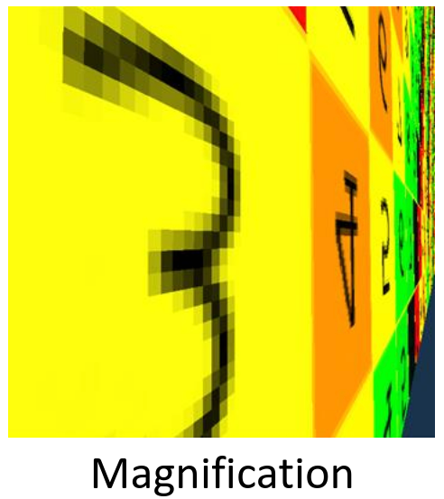
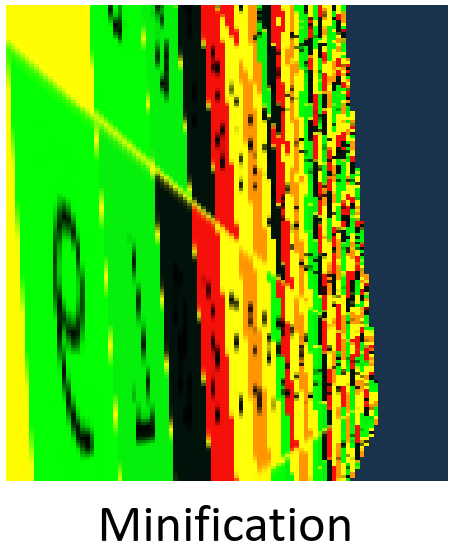
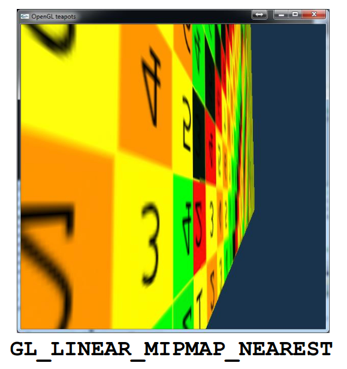
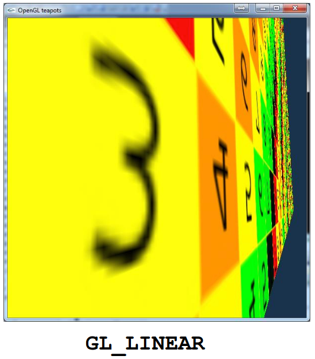

# 2D Textúrázás

## Alapok

Egy kétdimenziós területre vagy egy háromdimenziós felületre szeretnénk egy képet, vagy más szóval tapétát ragasztani. Ez a kép meghatározná a terület vagy felület színét, megjelenését, így akár komplex kinézetű objektumokat és meg tudunk jeleníteni.

Ezt a felületet meg kell feleltetnünk annak a koordináta-rendszernek, amelyben a képet ábrázoljuk. Ezt a koordináta-rendszert _textúra koordináta-rendszernek_ nevezzük, és a $(0,0)$, $(1,1)$ tartományban értelmezzük.

!!! info 6.1 Definíció (Paraméterezés)
    Azt a folyamatot, amikor a felület egyes pontjait leképezzük ebbe az egységnégyzetbe (textúra térbe) _paraméterezésnek_ nevezzük.

Ha a felületünk összes pontja le van képezve ebbe az egységnégyzetbe, és mi "kifestjük" ezt a négyzetet azzal a mintázattal, amit a felületünkre szeretnénk rakni, akkor az eredeti felületünk ki lesz színezve. Ehhez persze szükségünk lesz a paraméterezés _inverzéhez_, azaz ahhoz a transzformációhoz, ami a textúra koordináta-rendszer egyes pontjait megfelelteti a geometriánk felületének egyes pontjaival.

A textúrázáshoz használt kép elemei a _texelek_ (mint ahogy a pixel a "picture element"-ből származik, a texel a "texture element"-ből).

A textúrázást elég csak háromszögekre megvalósítani, hiszen az összes többi bonyolultabb felületet háromszögekből építjük fel. Az a célunk, hogy a textúraterünk háromszögeit valahogy megfeleltessük a modellterünk háromszögeivel. Az egyik ilyen megfeleltetés, amit a leggyakrabban használunk az a _lineáris leképzés_.

## Lineáris leképzés

A fő ötlet az, hogy _"bármely két háromszög között létezik olyan affin transzformáció, ami az egyik háromszöget a másikba viszi át"_ és ez az affin transzformáció Descartes koordinátákban kifejezve egy _lineáris kifejezés_, azaz mind $u$, mind $v$ elsőfokú hatványokként jelennek meg. Más szóval az a megfeleltetést keressük, ami az $(u,v)$ textúra térbeli koordinátákat megfelelteti a modell térbeli $(x,y,z)$ koordinátáknak, és a kapcsolatuk lineáris, azaz:

$$
\begin{alignat*}{2}
x &= a_x u + b_x v + c_x \\
y &= a_y u + b_y v + c_y \\
z &= a_z u + b_z v + c_z
\end{alignat*}
$$

alakúak.

### Együtthatók meghatározása

Itt az $a_x, b_x, \dots$ az kilenc darab ismeretlen, ezeket akarjuk kiszámolni. Ezt úgy tehetjük, hogy mivel a modell térbeli háromszögnek három csúcsa van, és mindegyik megfelel pontosan egy textúra térbeli csúcsnak, és mindegyik modell térbeli csúcs három koordinátából áll, ezért $3 \cdot 3 = 9$ feltételünk van. Itt egy-egy feltételt úgy kell elképzelni, hogy a fenti képletben az $x, y, z, u, v$-k helyére beírjuk azokat a konkrét értékeket, amikkel az a konkrét háromszög rendelkezik, amivel éppen dolgozunk. Ez csúcsonként három, azaz összesen kilenc egyenlet ahol már csak az $a_x, b_x, \dots$ együtthatók az ismeretlenek. Kilenc ismeretlen és kilenc feltétel esetén mindig van egyértelmű megoldása az egyenleteknek, hacsak nem elfajuló háromszögeink vannak.

### Képszintézis

A fentieket felhasználva már van átjárásunk a textúra tér és a modell tér között, viszont nekünk a modell tér és a képernyő koordináta-rendszere között is kell tudnunk transzformálni. A képszintézis a modell háromszögeit áttranszformálja fizikai képernyőkoordinátákba. Ez általánosan egy _homogén lineáris transzformáció_ azaz a pont koordinátákat homogén koordinátáknak tekintve egy mátrix szorzással kapjuk meg a képernyőkoordináta-rendszerbeli pontokat, még pedig homogén koordinátás alakban. A homogén osztást elvégezve már a konkrét fizikai pixelek koordinátáit kapjuk meg. Ha ezt a folyamatot elvégezzük a háromszög mindhárom csúcsára, akkor megkapjuk a kirajzoláshoz szükséges pixeleket.

### Összevonás

A paraméterezés egy affin transzformáció (ami egyben egy homogén lineáris transzformáció is), a képszintézis is egy homogén lineáris transzformáció. Ezeket össze lehet vonni egy transzformációvá, így a textúra térből egyenesen a fizikai képernyő koordinátarendszerbe tudunk váltani. Ez az összevonás is persze egy homogén lineáris transzformáció. Erre főleg a következő lépésben lesz szükségünk, a _raszterizáció_ során.

## Raszterizáció

Ez az a folyamat, amikor a háromszögön belüli pixelekre feltesszük a kérdést, hogy a textúra téren belül melyik texel felel meg neki. Ehhez a pixelt vissza kell transzformálnunk a textúra térbe, mert ezt csak ott tudjuk eldönteni. Mivel ezt minden egyes pixelre a háromszögön belül végre kell hajtani, ezért figyelni kell arra, hogy gyorsak legyünk. Vezessük le az összevont homogén lineáris transzformációt és annak inverzét:

### A textúra térből a képernyőbe

Az összevont homogén lineáris transzformációt a következő alakban fejezhetjük ki:

$$
[X, Y, w] = [u, v, 1] \cdot \mathbf{P}
$$

ahol az $[X,Y,w]$ pixelkoordináták (homogén alakban) az $[u, v, 1]$ textúrakoordinátáknak a homogén lineáris transzformáltjai, mely transzformáció mátrixa $\mathbf{P}$.

A pixelek kitöltése során persze nem homogén alakban kell dolgoznunk, a konkrét pixel koordináták kifejezéséhéz el kell végeznünk a homogén osztást:

$$
(x_{\text{pix}},y_{\text{pix}}) = [X/w, Y/w]
$$

### A képernyő koordinátákból a textúra térbe

Erre a transzformációra van szükségünk a raszterizáció során. Mivel a fentinek az inverze, ezért az alábbi módon vezethető le:

1\. Osszunk le $w$-vel mindkét oldalon

$$
[X/w, Y/w, w/w] = [u/w, v/w, 1/w] \cdot \mathbf{P}
$$

Itt tudunk picit egyszerűsíteni (homogén osztás miatt $x_{\text{pix}} = X/w$):

$$
[x_{\text{pix}},y_{\text{pix}}, 1] = [u/w, v/w, 1/w] \cdot \mathbf{P}
$$

2\. Szorozzuk meg mindkét oldalt jobbról $\mathbf{P}$ inverzével

$$
[x_{\text{pix}},y_{\text{pix}}, 1] \cdot \mathbf{P}^{-1} = [u/w, v/w, 1/w] \cdot \cancel{\mathbf{P} \cdot \mathbf{P}^{-1}}
$$

A lényegi részével végeztünk is, annyit tehetünk még, hogy bevezetjük az $U = u/w, V = v/w, W = 1/w$ jelölést, hogy picit tömörebb legyen a képletünk:

$$
\boxed{
    [x_{\text{pix}},y_{\text{pix}}, 1] \cdot \mathbf{P}^{-1} = [U, V, W]
}
$$

Most már csak hatékonyan ki kéne tudni számolni az $U, V, W$ koordinátákat, és készen lennénk a raszterizációval. A hatékony kiszámolás érdekében a _lineáris interpolációt_ fogjuk igénybe venni.

## Lineáris interpoláció

A raszterizáció során pásztázva meglátogatjuk az összes pixelt a háromszögön belül, és minden pixelre kiszámoljuk a textúra koordinátákat, azok alapján pedig ki tudjuk olvasni, hogy melyik texel kerüljön a pixelünkre.

Az $U$ (homogén koordinátás textúra koordináta) egy mátrixszorzással kapható meg a pixelkoordinátákból, azaz azoknak egy lineáris függvénye:

$$
U(x_{\text{pix}},y_{\text{pix}}) = A_u \cdot x_{\text{pix}} + B_u \cdot y_{\text{pix}} + C_u
$$

A kiszámítása egy pixelre alap esetben két szorzást és két összeadást igényel. Viszont ezt minden pixelre megcsinálni eléggé lassú lenne, ezért az _inkrementális elvet_ fogjuk használni. Ez arra alapul,hogy ha már tudjuk $U(x,y)$-t, akkor $U(x+1, y)$ (a pásztában a következő pixel) kiszámításához fel tudjuk használni az előző pixelt:

$$
\begin{align*}
U(x,y) &= A_u \cdot x + B_u \cdot y + C_u \\
U(x+1, y) &= A_u \cdot (x+1) + B_u \cdot y + C_u \\
&= A_u + A_u \cdot x + B_u \cdot y + C_u \\
&= A_u + U(x,y)
\end{align*}
$$

így egy pásztán belül az első pixel után minden másik kiszámítása csak egy összeadás. Ugyan ez a logika alkalmazható a $V, W$ koordinátákra is. Ehhez van hardware support (interpolációs hardver). Nézzük, hogyan kell $A_u, A_v, \dots$ együtthatókat meghatározni.

## Triangle setup

A fő stratégiánk az interpolációs követelményből adódik (azaz abból, hogy lineáris kifejezéseink vannak). Ismerjük a háromszögünk csúcsainak Descartes koordinátáit, illetve az ezekhez tartozó textúra koordinátákat. Hasonlóan járunk le, mint amikor a lineáris leképezés együtthatóit számoltuk ki: behelyettesítjük ezeket az ismert értékeket a képletekbe, onnan pedig már kifejezhető lesz az $A_u$. Az interpolációs követelmény az alábbi:

$$
U(x,y) = A_u \cdot x + B_u \cdot y + C_u
$$

Mivel a háromszögünknek három csúcsa van, ezért három darab ilyen egyenletünk van:

$$
\begin{align*}
U_1 &= A_u \cdot x_1 + B_u \cdot y_1 + C_u \\
U_2 &= A_u \cdot x_2 + B_u \cdot y_2 + C_u \\
U_3 &= A_u \cdot x_3 + B_u \cdot y_3 + C_u
\end{align*}
$$

Ezekből $A_u$ kifejezhető, az alábbi alakban:

$$
\begin{equation}
A_u = \frac{(U_3 - U_1) \cdot (y_2 - y_1) - (y_3 - y_1) \cdot (U_2 - U_1)}{(X_3 - X_1) \cdot (y_2 - y_1) - (y_3 - y_1) \cdot (X_2 - X_1)}
\end{equation}
$$

### Geometriai megközelítés

Annak, hogy $U$ az $(x,y)$ koordináták lineáris függvénye más következményei is vannak. Ha felveszünk egy olyan háromdimenziós koordinátarendszert, ahol a tengelyek rendre $x,y,U$, akkor ebben a koordinátarendszerben azok az $(x, y, U)$ számhármasok, amik a háromszögeink adatait tartalmazzák egy síkra kerülnek. Ez látható a sík képletéből is:

$$
\begin{alignat*}{2}
\text{Sík egyenlete:} & \quad n_x \cdot x + n_y \cdot y + n_u \cdot U + d = 0 \\
\text{Interpolációs feltétel:} & \quad U(x,y) = A_u \cdot x + B_u \cdot y + C_u \\[1.5ex]
\text{Átrendezett sík egyenlet:} & \quad U = -\frac{n_x}{n_u} \cdot x - \frac{n_y}{n_u} \cdot y - \frac{d}{n_u}
\end{alignat*}
$$

Tehát nekünk $\displaystyle -\frac{n_x}{n_u}$ alakban kell az eredmény, mert az az $A_u$ megfelelője az interpolációs feltételben. A sík normálvektorát megkaphatjuk úgy, ha a síkban két nem párhuzamos vektornak vesszük a keresztszorzatát. Mivel a háromszögünk ebben a síkban van, ezért már három pontot ismerünk a síkból. Ebből a három ponton könnyen tudunk két alkalmas vektort képezni, és ezek keresztszorzata pontosan megegyezik a fenti $(1)$ képlettel.

## Textúra szűrés

Eljutottunk odáig, hogy minden egyes pixelt hatékonyan át tudunk transzformálni a textúra térbe. Viszont [nem triviális](https://cdn.discordapp.com/emojis/1384476146636161065.webp?size=240), hogy ez alapján a transzformált pont alapján melyik texelt válasszuk ki. Ez a kiválasztási folyamat a _textúra szűrés_. E során a pixelek középpontjait transzformáljuk a textúra térbe, és megnézzük, hogy melyik texel középpontjához vannak a legközelebb. Ez a `GL_NEAREST`, más néven _matematikai mintavételezés_. Ez alap esetben jól működik, viszont két olyan eset mégis felmerülhet, amikor nekünk ez nem megfelelő:

**1\. Magnification**



Ha olyan a leképzésünk, hogy például kilenc pixel ugyan ahhoz a texelhez van a legközelebb, akkor a végső képen élesen láthatóak lesznek a pixelek határai. Ez azért van, mert nagyon sok pixel ugyan azt az információt hordozza mint a szomszédai, tehát picit olyan, mint kevesebb, de nagyobb pixeleink lennének.

**2\. Minification**



A magnification fordítottja bizonyos értelemben: két egymás melletti pixel képe a textúra térben nagyon távol vannak egymástól, és nagyon sok texel kimarad közöttük. Az elveszett texelek miatt eléggé zajos lesz a végső kép, mivel két egymás melletti pixel gyakran teljesen más színű (úgynevezett Moiré minta).

Az OpenGL-ben az alábbi módon lehet beállítani, hogy milyen textúra szűrési eljárást szeretnénk használni:

```cpp
// A paraméterek értelmezése a következő:
//     GL_TEXTURE_2D: Kétdimenziós textúrákkal dolgozunk
//     GL_NEAREST: Ezt a szűrési eljárást szeretnénk használni
//     GL_TEXTURE_MAG_FILTER: A megadott szűrési eljárást magnification esetén használja
//     GL_TEXTURE_MIN_FILTER: A megadott szűrési eljárást minification esetén használja
glTexParameteri(GL_TEXTURE_2D, GL_TEXTURE_MAG_FILTER, GL_NEAREST);
glTexParameteri(GL_TEXTURE_2D, GL_TEXTURE_MIN_FILTER, GL_NEAREST);
```

Látható, hogy külön meg lehet adni egy eljárást a magnificationre, és a minificationre.

Akkor járunk sikerrel a textúrázás során, ha mindkét fenti esetet megpróbáljuk elkerülni. Ehhez használhatunk szofisztikáltabb textúra szűrési eljárásokat. Az, hogy hányszor tudunk texeleket választani (mintavételezési frekvencia) az fix, hiszen pixelenként egyszer, és a pixelek száma fix. Viszont a texelek felett több befolyásunk van: ha olyan virtuális texelekkel dolgoznánk, ahol körülbelül egy pixelnek egy texel felelne meg, akkor minden rendben lenne. Nézzük pár ilyen eljárást.

### Mip-map (minification ellen)

Az alapötletünk az, hogy ahelyett, hogy csak a pixelünk középpontját képezzük le sokkal pontosabb lenne, ha a pixel összes pontját leképeznénk a textúra térbe. Ha ezt tennénk, akkor sokkal pontosabban látnánk, hogy az a pixel a textúra térben pontosan hány texelt ölelne át. Ha már ezt tudnánk, akkor onnantól egyszerű lenne a dolgunk: állítsunk elő az eredeti textúrából több változatot úgy, hogy fogjuk az eredetit, és a bal felső négy texelt átlagolva állítsunk elő egy új texelt. Ez után a következő négyet átlagolva még egy újat, stb. A végén egy olyan textúrát kapnánk, aminek a felbontása fele az eredeti képnek (ezt úgy is lehet értelmezni, hogy az eredeti textúra térben minden négy texelt lecserélünk egy "nagyobb" texelre). Ha ezt megismételjük az új textúránkon is, akkor elő tudunk állítani sok ilyen mindig feleződő felbontású textúrát (ahol mindegyikben egyre "nagyobbak" a texelek).

Ezeknek a kisebb textúráknak a neve _LOD_ (level of detail), és általában számozva vannak (tehát az eredeti képünk a LOD0, az első iteráció utáni a LOD1, stb...). Ezek után eléggé lenne megkeresni azt a LOD-ot, ahol a leképzett pixelünk mérete körülbelül megfelel egy texelnek, és visszaadni azt a texelt. Így lényegében az összes olyan texel hozzájárul a pixel színéhez, ami alapból ki lett volna hagyva.

Az az egyetlen probléma, hogy minden pixel minden egyes pontját leképezni a textúra térbe egy eléggé költséges művelet lenne, szóval ehelyett előre definiált négyszögeket használunk. Ezek az előre definiált négyszögek éppen a LODoknak a texelei: ennek a négyszögnek a méretéből ki tudjuk következtetni, hogy melyik LOD szintet kell használni (azt, ahol pont akkora egy texel, mint az a négyszög, legalábbis közelítőleg).

Külön hardware támogatás van ehhez, az OpenGL-ben az alábbi módon lehet beállítani: 

```cpp
// Mip-mapping
glTexParameteri(GL_TEXTURE_2D, GL_TEXTURE_MIN_FILTER, GL_LINEAR_MIPMAP_NEAREST);
// Tri-linear filtering
glTexParameteri(GL_TEXTURE_2D, GL_TEXTURE_MIN_FILTER, GL_LINEAR_MIPMAP_LINEAR);
```



Két fajtája is van, a `GL_LINEAR_MIPMAP_NEAREST` az a fent ismertetett módon működik, a `GL_LINEAR_MIPMAP_LINEAR` pedig egy picit tovább megy: általában a pixel képének mérete a textúra térben nem egyezik meg pontosan egyik LOD texel méretével sem, hanem két LOD közé esik. A `GL_LINEAR_MIPMAP_LINEAR` az mindkét ilyen LOD-ből kiolvassa a texelt, és ezek súlyozott átlagát veszi.

### Bi-linear (magnification ellen)



Itt a fő ötletünk az, hogy megfigyeljük, hogy amikor transzformáljuk a pixelünk középpontját a textúra térbe, akkor ez nagy eséllyel valahova a texelek középpontjai közé esik. A sima matematikai szűrés során a transzformált ponthoz legközelebbi texel középpont alapján választunk texelt, de ennél pontosabb eredményt kapunk, ha a transzformált ponthoz négy legközelebbi texel középpontot mind felhasználjuk: képezzük a négy texel súlyozott átlagát, ahol a súlyok az egyes középpontoktól vett távolságok. A név onnan ered, hogy két lineáris interpolációt hajtunk végre: először a 2x2-es texel rácsnál vízszintesen interpoláljuk a texeleket, utána pedig a keletkező két texelt függőlegesen is interpoláljuk.


Az alábbi módon kapcsolható be:

```cpp
glTexParameteri(GL_TEXTURE_2D, GL_TEXTURE_MAG_FILTER, GL_LINEAR);
```

## Textúrázás a GPU-n

Az elméleti részével készen vagyunk a textúrázásnak, nézzük meg, hogy hogyan tudjuk kódban megvalósítani az itt tárgyaltakat! Az alábbi képen látható a textúrázási csővezeték:


Először átfogóan tárgyaljuk az egész folyamatot, utána az egyes lépéseket részletesebben, kódrészletekkel együtt vizsgáljuk.

### Madártávlatból

Mindenekelőtt a GPU textúra memóriájába kell helyeznünk azt a képet, amely a textúra alapját fogja képezni. Ezt a CPU-ban tesszük meg a `glTexImage2D` függvénnyel. Ezen felül még a CPU-ban szükség lesz arra, hogy amikor a vertex shaderben definiáljuk a geometriát, akkor az egyes csúcspontokhoz adjuk meg azt is, hogy a textúra térben hova képződnek le (azaz milyen $(U,V,W)$ textúrakoordinátákkal rendelkeznek). A megjelenítési pipeline az általunk definiált VAO-k és VBO-k tartalmát először a vertex shaderen zavarja át. A vertex shadernek a textúrakoordinátákat tovább kell adnia a vágás, viewport transzformáció, raszterizálós egység felé. Ezek az egységek ha új pontok keletkeznek a műveletek során (pl. raszterizáció) akkor a csúcsponttulajdonságokat interpolálni fogják, így a textúrakoordinátákat is. A fragment shader pedig már ezeket az interpolált értékeket kapja meg. A textúra kiolvasása egy textúra _mintavevő egységen_ (sampler unit) keresztül történik, ez felelős például a mip-map vagy a bi-lineáris interpolációkért. Ezt a mintavevő egységet is a CPU-ról állítjuk be a `glTexParameter` függvénnyel.

Vizsgáljuk picit részletesebben a fent említett egyes lépéseket.

### 1\. Textúra GPU-ra töltése

```cpp
unsigned int textureId;

void UploadTexture(int width, int height, vector<vec4>& image) {
// Generálunk a textúrához egy azonosítót, amit
// a `textureId` változóban kapunk vissza.
glGenTextures(1, &textureId);

// Bindoljuk is rögtön ezt a textúrát, mert ezzel dolgozunk.
// Lehetnének egy- vagy háromdimenziós textúráink is.
// (mindegyikből egyszerre csak egy lehet aktív)
glBindTexture(GL_TEXTURE_2D, textureId);

// Az utoljára bindolt textúrába átmásoljuk a képünket.
// A függvény paramétereinek magyarázat a kódrészlet alatt találhatod.
glTexImage2D(GL_TEXTURE_2D, 0, GL_RGBA, width, height, 0,
GL_RGBA, GL_FLOAT, &image[0]); //Texture -> GPU

// Az alábbi két parancs a bindolt textúra mintavételezését állítja be.
// Kicsinyítés esetén GL_NEAREST szűrővel dolgozzon, nagyítás esetén pedig
// GL_LINEAR szűrővel.
glTexParameteri(GL_TEXTURE_2D, GL_TEXTURE_MIN_FILTER, GL_NEAREST);
glTexParameteri(GL_TEXTURE_2D, GL_TEXTURE_MAG_FILTER, GL_LINEAR);
}
```

!!! question Nehéz átlátni a kódot?
    Az előző évek videóiban általában sorrol sorra végigmegy a kódon, és elmondja, hogy melyik sor pontosan mit csinál, szóval ha az itteni magyarázatok után esetleg még lennének kérdéses részek, akkor [itt](https://youtu.be/-LiEv6EnBLI?si=567lyAUxps-gb0Tm&t=1499) meg tudod nézni az ehhez a témához kapcsolódó videót.

A `glTexImage2D` függvény (nem hivatalos, de a céljainkra megfelelő) paraméterlistája a következő:

```cpp
glTexImage2D(texture_dim, mip-map_level, texel_format, width, height,
border_size, source_pixel_format, source_type, source_data);
```

ahol:

- `texture_dim`: A textúra dimenzióját adjuk meg, legtöbbször kétdimenziós a textúránk.
- `mip-map_level`: Mip-map-elés esetén az eredeti képen kívül annak a fele akkora, negyed akkora, stb felbontású változatai is szükségesek, és a teljes hierarchiát fel kell tölteni. Ez a paraméter azt adja meg, hogy éppen melyik szinten járunk a feltöltésben. A hierarchia teteje 0.
- `texel_format`: A texelek formátumát adja meg. Általában RGB formátumúak, és átlátszóságot is támogathatnak.
- `width, height`: A feltöltendő kép szélessége és magassága.
- `border_size`: Ez a border méretét adja meg. A borderrel extra texeleket lehet rendelni a kép határához. Ehhez akkor lehet szükség, ha például a bilineáris szűrés esetén a bal felső texelt találjuk el, hiszen ekkor lehet, hogy a "kép fölötti texel" közelebb lenne a pontunkhoz, mint az egy sorral lejjebbi texelek.
- `source_pixel_format, source_type, source_data`: A maradék három paraméter a forráskép formátumáról rendelkezik, rendre azon pixeleinek formátuma (RGBA), az értékek típusa (pl. float), és a kép kezdőcímének értéke.

Még megemlítendő, hogy itt még nincsen beállítva a konkrét Sampler, szóval amikor a `glTexParameteri` függvényeket hívtuk, akkor az azokban megadott információt egyelőre maga a textúra tárolja el magáról, és amikor összeköttetésbe kerül a Samplerrel, akkor fogja ezeket a paramétereket delegálni a Sampler felé.

### 2\. A virtuális világ objektumainak felszerelése textúra koordinátákkal

Több módon is eljárhatunk, például `stride`-ot alkalmazva (ugyan abban a VBO-ban van a Descartes és textúra koordináta, egymás után felváltva) vagy egy VAO-n belül két külön VBO-ban tároljuk az adatainkat: az egyikben a pontok Descartes koordinátái vannak, a másikban pedig az azokhoz tartozó textúrakoordináták. Az alábbi kódrészlet az utóbbit mutatja be:

```cpp
unsigned int vao, vbo[2];
glGenVertexArrays(1, &vao);
glBindVertexArray(vao);

glGenBuffers(2, vbo); // Generate 2 vertex buffer objects

// vertex coordinates: vbo[0] -> Attrib Array 0 -> vertices
glBindBuffer(GL_ARRAY_BUFFER, vbo[0]);
float vtxs[] = {x1, y1, x2, y2 /*, x3, y3, ... */};
glBufferData(GL_ARRAY_BUFFER, sizeof(vtxs),vtxs, GL_STATIC_DRAW);
glEnableVertexAttribArray(0);
glVertexAttribPointer(0, 2, GL_FLOAT, GL_FALSE, 0, NULL);

// vertex coordinates: vbo[1] -> Attrib Array 1 -> uvs
glBindBuffer(GL_ARRAY_BUFFER, vbo[1]);
float uvs[] = {u1, v1, u2, v2 /*, u3, v3, ... */};
glBufferData(GL_ARRAY_BUFFER, sizeof(uvs), uvs, GL_STATIC_DRAW);
glEnableVertexAttribArray(1);
glVertexAttribPointer(1, 2, GL_FLOAT, GL_FALSE, 0, NULL);
```

### 3\. A vertex és fragment shaderek

A megjelenítési csővezeték során a VBO-k tartalma először a vertex shaderen megy keresztül:

```glsl
layout(location = 0) in vec2 vtxPos;
layout(location = 1) in vec2 vtxUV;

out vec2 texcoord;

void main() {
    gl_Position = vec4(vtxPos, 0, 1) * MVP;
    texcoord = vtxUV;
    // ...
}
```

Ezután a raszterizáció és interpoláció után megérkezünk a fragment shaderhez (fontos, hogy ugyan olyan névvel kell hivatkozni a textúrakoordinátákra mint a vertex shaderben):

```glsl
uniform sampler2D samplerUnit;
in vec2 texcoord;
out vec4 fragmentColor;

void main() {
    fragmentColor = texture(samplerUnit, texcoord);
}
```

Itt fontos megemlíteni a `samplerUnit` változót: a fragment shader nem egyenesen a képet látja, hanem a Sampleren keresztül kapja meg a pixelek színeit. A `texture` függvény elvégzi a szűrést a Sampler beállításai alapján, és a megadott textúrakoordinátát kiolvassa.

### 4\. Az aktív textúra, és a Sampler

Még nem kapcsoltuk össze a Samplert az aktív textúránkkal, de ezt rögtön orvosoljuk:

```cpp
unsigned int textureId;

void Draw( ) {
int sampler = 0; // which sampler unit should be used

int location = glGetUniformLocation(shaderProg, "samplerUnit");
glUniform1i(location, sampler);

glActiveTexture(GL_TEXTURE0 + sampler); // = GL_TEXTURE0
glBindTexture(GL_TEXTURE_2D, textureId);

glBindVertexArray(vao);
glDrawArrays(GL_TRIANGLES, 0, nVtx);
}
```

## Kitekintés

A további elmélyüléshez ajánlani tudom [ezt](https://www.youtube.com/watch?v=3mfvZ-mdtZQ) a shaderezésben, illetve textúrázásban segítő külsős videót.

# Kvíz

!!! question 1\. `glTexParameteri(GL_TEXTURE_2D, melyik, milyen)` OpenGL függvényre vonatkozóan válasszuk ki az alábbi állítások közül az igaz állításokat.
    - A milyen=`GL_LINEAR` bi-lineáris interpolációt kapcsol be.
    - A milyen=`GL_LINEAR` esetén a szín az $u,v$ textúrakoordináták lineáris függvénye, azaz $au + bv + c$ alakú.
    - A milyen=`GL_NEAREST`-nél nagyításnál, és kicsinyítésnél is van jobb megoldás.
    - A milyen=`GL_LINEAR` esetén a rajzolás négyszer lassabb, mint a milyen=`GL_NEAREST`-nél.
    - A milyen=`GL_LINEAR_MIPMAP_NEAREST` mindig jó, ha a textúrát a egyetlen `glTexImage2D(GL_TEXTURE_2D, 0, GL_RGBA, width, height, 0, GL_RGBA, GL_FLOAT, &image[0]);` hívással töltöttük fel a textúrát.
    - A milyen=`GL_LINEAR` esetén a textúrázandó képnek csak a 0-as szintjét kell feltölteni.

??? tip Megoldás
    - [x] A milyen=`GL_LINEAR` bi-lineáris interpolációt kapcsol be.
    - [ ] A milyen=`GL_LINEAR` esetén a szín az $u,v$ textúrakoordináták lineáris függvénye, azaz $au + bv + c$ alakú.
    - [x] A milyen=`GL_NEAREST`-nél nagyításnál, és kicsinyítésnél is van jobb megoldás.
        - Magyarázat: Magnification esetén `GL_LINEAR`, minification esetén `GL_LINEAR_MIPMAP_NEAREST`.
    - [ ] A milyen=`GL_LINEAR` esetén a rajzolás négyszer lassabb, mint a milyen=`GL_NEAREST`-nél.
    - [ ] A milyen=`GL_LINEAR_MIPMAP_NEAREST` mindig jó, ha a textúrát a egyetlen `glTexImage2D(GL_TEXTURE_2D, 0, GL_RGBA, width, height, 0, GL_RGBA, GL_FLOAT, &image[0]);` hívással töltöttük fel a textúrát.
        - Magyarázat: Csak minification esetén jó.
    - [x] A milyen=`GL_LINEAR` esetén a textúrázandó képnek csak a 0-as szintjét kell feltölteni.
        - Magyarázat: Feltételezem a mip-map szintre utal a kérdés, aminek csak `GL_LINEAR_MIPMAP_NEAREST` esetében van értelme.

---
!!! question 2\. Jelöljük be az `glTexImage2D(target, 0, GL_RGBA, w, h, 0, GL_RGBA, GL_FLOAT, address);` utasítással kapcsolatos igaz állításokat.
    - A harmadik, `GL_RGBA` paraméter azt fejezi ki, hogy a feltöltendő tömbben egy texelt a három színcsatornán és átlátszósággal adunk meg.
    - A $w$ és $h$ paraméterek csak $2$ hatványok lehetnek.
    - A `glTexImage2D` függvénnyel kell feltölteni akkor is a textúrát, ha mip-map-elést szeretnénk, de többször kell meghívni ezt a függvényt.
    - A `GL_FLOAT` utolsó előtti paraméter az írja elő, hogy a GPU memóriában a texelek lebegőpontos formátumban tárolódjanak.
    - Az address azon CPU memóriaterület kezdőcíme, ahonnan a GPU-ra az adatokat átmásoljuk.
    - Az OpenGL-nek nem lehet unsigned char textúrákat átadni. *(lehet csak elég retro lesz)*
    - A target lehet `GL_TEXTURE_2D`, ami azt jelenti, hogy az utoljára a `GL_TEXTURE_2D`-hez bindolt textúrát töltjük éppen fel.
    - A második, `0` paraméter azt jelenti, hogy a texelek hézagmentesen vannak a textúrában.

??? tip Megoldás
    - [ ] A harmadik, GL_RGBA paraméter azt fejezi ki, hogy a feltöltendő tömbben egy texelt a három színcsatornán és átlátszósággal adunk meg.
        - Magyarázat: Nem a feltöltendő tömbre vonatkozik, hanem a képre amit megadunk neki
    - [ ] A $w$ és $h$ paraméterek csak $2$ hatványok lehetnek.
        - Magyarázat: Ezek a képünk méretei, amikre nincsen ilyen limitáció.
    - [x] A `glTexImage2D` függvénnyel kell feltölteni akkor is a textúrát, ha mip-map-elést szeretnénk, de többször kell meghívni ezt a függvényt.
        - Magyarázat: Mivel a különböző LOD-kat nekünk kell feltölteni, ezért többször meg kell hívni.
    - [ ] A `GL_FLOAT` utolsó előtti paraméter az írja elő, hogy a GPU memóriában a texelek lebegőpontos formátumban tárolódjanak.
        - Magyarázat: Ez a paraméter a feltöltendő képre vonatkozik, nem a texelekre.
    - [x] Az address azon CPU memóriaterület kezdőcíme, ahonnan a GPU-ra az adatokat átmásoljuk.
        - Magyarázat: Lásd [fentebb](#1-textúra-gpu-ra-töltése).
    - [ ] Az OpenGL-nek nem lehet unsigned char textúrákat átadni.
        - Magyarázat: Egy `void *`-ot vár a `glTexImage2D` függvény, szóval bármit oda lehet neki adni.
    - [x] A target lehet `GL_TEXTURE_2D`, ami azt jelenti, hogy az utoljára a `GL_TEXTURE_2D`-hez bindolt textúrát töltjük éppen fel.
        - Magyarázat: Lásd [fentebb](#1-textúra-gpu-ra-töltése).
    - [ ] A második, `0` paraméter azt jelenti, hogy a texelek hézagmentesen vannak a textúrában.
        - Magyarázat: A textúra mip-map szintjét adja meg.

---

!!! question 3\. Tekintsük az alábbi pixel shader programot:
    ```glsl
    uniform sampler2D samplerUnit;
    in vec2 texcoord;
    out vec4 fragmentColor;
    void main() {
        fragmentColor = texture(samplerUnit, texcoord);
    }
    ```
    Jelöljük be az erre vonatkozó igaz állításokat!

    - A `fragmentColor` változó `w` mezője automatikusan `1` értékű lesz.
    - A `samplerUnit` változót értékét a `glGenTextures` függvénnyel kell létrehozni.
    - A `texture(samplerUnit, texcoord)` azon texel színét adja vissza mindig, amelyhez a texcoord a legközelebb van.
    - A program változatlanul használható `glTexParameteri(GL_TEXTURE_2D, GL_TEXTURE_MIN_FILTER, GL_NEAREST);` beállítás és `glTexParameteri(GL_TEXTURE_2D, GL_TEXTURE_MAG_FILTER, GL_LINEAR);` beállításnál is.

??? tip Megoldás
    - [ ] A `fragmentColor` változó `w` mezője automatikusan `1` értékű lesz.
        - Magyarázat: Ez általában az alpha csatorna és külön értéke lehet.
    - [ ] A `samplerUnit` változót értékét a `glGenTextures` függvénnyel kell létrehozni.
        - Magyarázat: Lásd [fentebb](#4-az-aktív-textúra-és-a-sampler).
    - [ ] A `texture(samplerUnit, texcoord)` azon texel színét adja vissza mindig, amelyhez a texcoord a legközelebb van.
        - Magyarázat: Attól függ, hogy milyen paramétereket adtunk meg a Samplernek, lásd [fentebb](#1-textúra-gpu-ra-töltése)
    - [x] A program változatlanul használható `glTexParameteri(GL_TEXTURE_2D, GL_TEXTURE_MIN_FILTER, GL_NEAREST);` beállítás és `glTexParameteri(GL_TEXTURE_2D, GL_TEXTURE_MAG_FILTER, GL_LINEAR);` beállításnál is.
        - Magyarázat: Ezeket a beállításokat a Sampler kezeli, nekünk nem kell a shaderben foglalkozni velük.

---

!!! question 4\. Egy háromszög három csúcsa a modellezési koordinátarendszerben, valamint a textúra térben:
    $$
    \def\arraystretch{1.5}
    \begin{array}{|c|c|c|}
    \hline
    \text{Modell koordináták} & \text{Textúra koordináták} \\ \hline
    (0,0,  -1) & (0,0) \\ \hline
    (0,1,-0.5) & (0,1) \\ \hline
    (1,0,-0.5) & (1,0) \\ \hline
    \end{array}
    $$

    ---

    Az MVP transzformációs mátrix:

    $$
    T =
    \begin{bmatrix}
    1 & 0 & 0 & 0 \\
    0 & 1 & 0 & 0 \\
    0 & 0 & 1 & 1 \\
    0 & 0 & -1 & 0
    \end{bmatrix}
    $$

    ---

    Hogyan függ az $x_{\text{pix}}$, $y_{\text{pix}}$ a textúrakoordinátától, ha `glViewport(0, 0, 1000, 1000)`-t hívtunk?

??? tip Megoldás
    Idézzük fel, hogy

    $$
    \begin{align*}
    x_{\text{modell}} &= a_x \cdot u + b_x \cdot v + c_x \\
    y_{\text{modell}} &= a_y \cdot u + b_y \cdot v + c_y \\
    z_{\text{modell}} &= a_z \cdot u + b_z \cdot v + c_z
    \end{align*}
    $$

    A megadott koordinátákat behelyettesítve:

    1. $(0,0,-1) \rightarrow (0,0)$

    $$
    \begin{align*}
    0 &= a_x \cdot 0 + b_x \cdot 0 + c_x \Rightarrow c_x = 0 \\ 
    0 &= a_y \cdot 0 + b_y \cdot 0 + c_y \Rightarrow c_y = 0 \\
    -1 &= a_z \cdot 0 + b_z \cdot 0 + c_z \Rightarrow c_z = -1
    \end{align*}
    $$

    2. $(0,1,-0.5) \rightarrow (0,1)$

    $$
    \begin{align*}
    0 &= a_x \cdot 0 + b_x \cdot 1 + c_x \Rightarrow b_x = 0 \\ 
    1 &= a_y \cdot 0 + b_y \cdot 1 + c_y \Rightarrow b_y = 1 \\
    -0.5 &= a_z \cdot 0 + b_z \cdot 1 + c_z \Rightarrow b_z = 0.5
    \end{align*}
    $$

    3. $(1,0,-0-5) \rightarrow (1,0)$

    $$
    \begin{align*}
    1 &= a_x \cdot 1 + b_x \cdot 0 + c_x \Rightarrow a_x = 1 \\ 
    0 &= a_y \cdot 1 + b_y \cdot 0 + c_y \Rightarrow a_y = 0 \\
    -0.5 &= a_z \cdot 1 + b_z \cdot 0 + c_z \Rightarrow a_z = 0.5
    \end{align*}
    $$

    Összegezve:

    $$
    \begin{align*}
    x_{\text{modell}} &= u \\
    y_{\text{modell}} &= v \\
    z_{\text{modell}} &= 0.5 \cdot (u + v) - 1
    \end{align*}
    $$

    Tudjuk, hogy

    $$ [X, Y, Z, w] = [x_{\text{modell}}, y_{\text{modell}}, z_{\text{modell}}, 1] \cdot T $$

    illetve 

    $$
    \begin{align*}
    x_{\text{NDC}} &= X/w \\
    y_{\text{NDC}} &= Y/w \\
    \end{align*}
    $$

    Elvégezve a mátrix szorzást és a homogén osztást, azt kapjuk, hogy

    $$
    \begin{align*}
    x_{\text{NDC}} &= \frac{u}{-0.5 \cdot (u + v) + 1} \\[1.5ex]
    y_{\text{NDC}} &= \frac{v}{-0.5 \cdot (u + v) + 1}
    \end{align*}
    $$

    A legutolsó lépés a viewport transzformáció:

    $$
    \begin{align*}
    x_{\text{pixel}} &= v_w \cdot (x_{\text{NDC}} + 1)/2 + v_x \\
    y_{\text{pixel}} &= v_h \cdot (y_{\text{NDC}} + 1)/2 + v_y
    \end{align*}
    $$

    Mivel `glViewport(0, 0, 1000, 1000)`-t hívtunk, ezért $v_x = v_y = 0$ és $v_w = v_h = 1000$.
    
    Behelyettesítve, és a kvíz által kért alakra hozva:

    $$
    \begin{align*}
    x_{\text{pixel}} &= \bigg( \frac{0.5 \cdot u - 0.5 \cdot v + 1}{-0.5 \cdot u -0.5 \cdot v + 1} \bigg) \cdot 500 \\
    y_{\text{pixel}} &= \bigg( \frac{-0.5 \cdot u + 0.5 \cdot v + 1}{-0.5 \cdot u -0.5 \cdot v + 1} \bigg) \cdot 500
    \end{align*}
    $$

[Előző](./5.md)

[Következő](./7.md)
