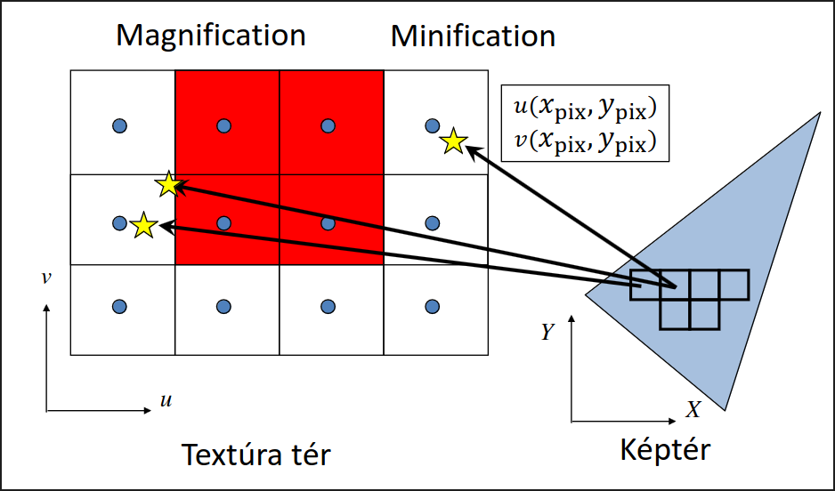
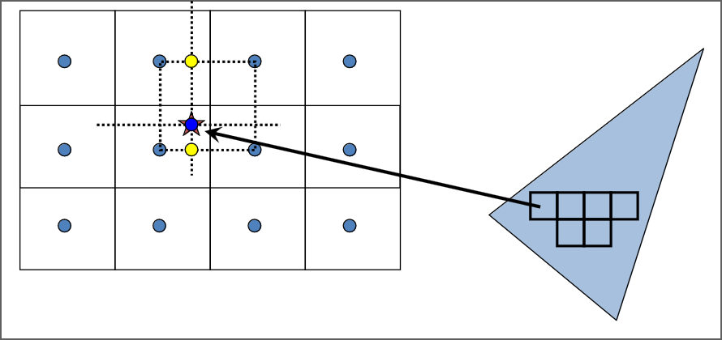
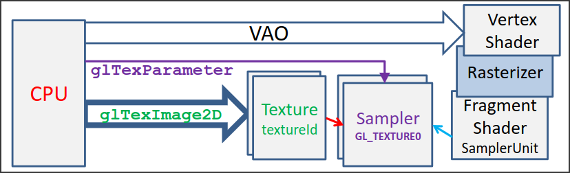

<!--

egy 2D területre v 3D felületre képet/tapétát ragasztunk rá, ami meghatározza a terület/felület színét, megjelenését

a felületet meg kell feleltetni annak a koord. rendsz. amiben a képet ábrázoljuk. ez a textúra koordináta rendszer, (0,0) és (1,1) tartományban.

paraméterezés: a felület/terület leképzése a textúra koordinátarendszerbe

ha megvan a paraméterezés, akkor az egységnégyzetbe "belefesthetjük" azt a mintázatot, amit a felületünkre szeretnénk rakni, utána pedig a paraméterezés _inverzével_ a textúra koordinátarendszer egyes pontjait megfeleltetjük a geometriánk felületének egyes pontjainak, így kiszínezve azt

a textúrázáshoz használt kép elemeit "texel"-eknek nevezzük (pixel -> picture element, texel -> texture element)

a textúrázást elég csak háromszögekre megvalósítani, hiszen az összes többi bonyolultabb felületet háromszögekből építjük fel. az a célunk, hogy a textúra térbeli egységnégyzet háromszögeit valahogy megfeleltessük egy modell tér beli háromszöggel. az egyik ilyen megfeleltetés, ami a leggyakrabban használt a lineáris

lineáris: a fő ötlet az, hogy "bármely két háromszög között létezik olyan affin transzformáció, ami az egyik háromszöget a másikba viszi át", és ez az affin transzformáció descartes koordinátákban kifejezve egy lineáris kifejezés. azt a megfeleltetést keressük, ami az (u,v) textkoordokat megfelelteti a modellkoord (x,y,z)-nek, és a kapcsolatuk lineáris, azaz $x = a_x u + b_x v + c_x$, hasonlóan $y, z$. itt az "a_x, b_x, ..." 9 db ismeretlen. úgy határozhatjuk meg őket, hogy tudjuk, hogy a modell-beli háromszögnek 3 csúcsa van, és mindegyik megfelel pontosan egy textkoord-beli csúcsnak, és mindegyik modellkoord csúcs 3 koordinátából áll, azaz 3*3 = 9 feltételünk van. így mindig van egyértelmű megoldása az egyenleteknek, ha nem elfajuló háromszögeink vannak

képszintézis: a modell háromszögeit áttranszformálja fizikai képernyőkoordokba. ez általánosan egy homogén lineáris transzformáció, azaz a pont koordinátákat homogén koordoknak tekintve egy mátrix szorzással kapjuk meg a képrnyőkoordokban a homogén koordokat, homogén osztás után meg fizikai pixel koordokat. ezt a háromszög három csúcsára elvégezve megkapjuk a pixeleket a kirajzoláshoz

a paraméterezés egy affin transzformáció (ami egyben egy homogén lineáris transzformáció), a képszintézis egy homogén lineáris transzformáció. ezeket össze lehet szépen vonni, a textúratér a fizikai képernyő koord-ok között egy homogén lineáris transzformáció. 

raszterizáció: ez a fizikai pixelkoordokban dolgozik, a háromszögön belüli pixelekre feltesszük a kérdést, hogy a textúratéren belül melyik texel felel meg neki. a pixelt transzformálnunk kell a textúratérbe, mert ott áll rendelkezésre ez az infó. ezt minden pixelre a háromszögön belül meg kell csinálni. a megvalósításhoz ezért jó, ha ez az inverz transzformáció hatékony. [képlet és levezetés here]

lineáris interpoláció: a raszterizáció során [continue from 8:20]

-->

# 2D Textúrázás

> 2D textúrát szeretnénk ráragasztani egy alakzatra, kell egy megfeleltetés hogy adott pixelekhez a textúra melyik texele (textúra pixele) tartozik.


## Textúraszűrés

Adott pixelközéppontra megcsináljuk a lineáris leképezést, megnézzük textúratérben hol lenne $\Rightarrow$ UV koordináta a textúratérben

### Nearest neighbor szűrés
A UV koordináták alapján megkeressük a hozzá legközelebbi texelt, és az lesz a pixel színe.
> Eredmény: éles textúra, látható pixelek



```cpp
// külön állíthatjuk a szűrést kicsinyítés illetve nagyítás esetén
glTexParameteri(GL_TEXTURE_2D,GL_TEXTURE_MAG_FILTER,GL_NEAREST);
glTexParameteri(GL_TEXTURE_2D,GL_TEXTURE_MIN_FILTER,GL_NEAREST);
```

### Mip-map
**Probléma**: Minification esetén a pixel kiterjedése a textúrán egy nagyobb területet fed ezáltal több texelt is lefed. Mi viszont csak a pixel középpontjához leközelebb eső egyetlen texelt vesszük figyelembe. Ez zajos, pontatlan képeket eredményez. 

**Megoldás**: Mip-mapok, előre lekicsinyítjük a textúrát, minifikáció mértéke alapján különböző mip-map szinten keressük a texelt. Mivel a kicsinyített textúrában kisebb az eltérés az egy pixel és az egy texel által fedett terület között, ezért egy pontosabb színt kapunk.

> (A mip-mapokat a GPU generálja, szintenként negyedakkora lesz a textúra, előre kiszámolja 4 pixel átlagszínét)

```cpp
glTexParameteri(GL_TEXTURE_2D, GL_TEXTURE_MIN_FILTER, GL_LINEAR_MIPMAP_NEAREST); // Mip-mapping

glTexParameteri(GL_TEXTURE_2D, GL_TEXTURE_MIN_FILTER, GL_LINEAR_MIPMAP_LINEAR); // Tri-linear filtering
```

### Bilineáris szűrés
A pixelünk UV koordinátája általában nem esik egyértelműen egy texelre. Bilineáris szűrésnél az UV koordinátát közrefogó 4 texelt vesszük figyelembe, és azok színeinek vesszük súlyozott átlagát $\Rightarrow$ színátmenetes lesz pixeles helyett.



> Azért bilinear, mert 2 lineáris szűrést csinálunk, vízszintesen, majd függőlegesen. <sup>Igen, valójában 3 átlagot számolunk, de ez nem ugyan az, mint a lineáris szűrés.</sup>

```cpp
glTexParameteri(GL_TEXTURE_2D, GL_TEXTURE_MIN_FILTER, GL_LINEAR);
glTexParameteri(GL_TEXTURE_2D, GL_TEXTURE_MAG_FILTER, GL_LINEAR);
```

## Textúrázás a GPU-n



### Textúra feltöltése a GPU-ra
```cpp
glGenTextures(1, &textureId);
glBindTexture(GL_TEXTURE_2D, textureId); // binding
glTexImage2D(GL_TEXTURE_2D, 0, GL_RGBA, width, height, 0, GL_RGBA, GL_FLOAT, &image[0]); //Texture -> GPU
glTexParameteri(GL_TEXTURE_2D, GL_TEXTURE_MIN_FILTER, GL_NEAREST);
glTexParameteri(GL_TEXTURE_2D, GL_TEXTURE_MAG_FILTER, GL_LINEAR);
```

### Objektumok felszerelése textúra (UV) koordinátákkal
> Minden csúcsnak eltároljuk a hozzá tartozó UV koordinátáját. *(UV koordináta mondja meg, hogy adott csúcs a textúra mely pontjának felel meg.)* Ezt több féle képpen lehet, pl. stride (ugyan abban a VBO-ban, egymás után felváltva koordináták és uv koordináták) vagy külön VBO-ban (de ugyan abban a VAO-ban).

Utóbbira (külön VBO) példa:
```cpp
glGenVertexArrays(1, &vao);
glBindVertexArray(vao);
glGenBuffers(2, vbo);// Generate 2 vertex buffer objects
// vertex coordinates: vbo[0] -> Attrib Array 0 -> vertices
glBindBuffer(GL_ARRAY_BUFFER, vbo[0]);
float vtxs[] = {x1, y1, x2, y2, …};
glBufferData(GL_ARRAY_BUFFER, sizeof(vtxs),vtxs, GL_STATIC_DRAW);
glEnableVertexAttribArray(0);
glVertexAttribPointer(0, 2, GL_FLOAT, GL_FALSE, 0, NULL);
// vertex coordinates: vbo[1] -> Attrib Array 1 -> uvs
glBindBuffer(GL_ARRAY_BUFFER, vbo[1]);
float uvs[] = {u1, v1, u2, v2, …};
glBufferData(GL_ARRAY_BUFFER, sizeof(uvs), uvs, GL_STATIC_DRAW);
glEnableVertexAttribArray(1);
glVertexAttribPointer(1, 2, GL_FLOAT, GL_FALSE, 0, NULL);
```
### Vertex és pixel shader

<!-- csúcspontárnyaló my beloved -->
Vertex shader:
```cpp
// a két bemeneti regiszterében kapja meg a poziíciót és az UV koordinátát
layout(location = 0) in vec2 vtxPos;
layout(location = 1) in vec2 vtxUV;

// a kimenet egyetlen textúra koordináta
out vec2 texcoord;
void main() {
    gl_Position = vec4(vtxPos, 0, 1) * MVP;
    texcoord = vtxUV;
    ...
}
```

Ennek kimenetét kapja meg a pixel shader:

```cpp
uniform sampler2D samplerUnit;
// a pixelshader bemenete
in vec2 texcoord;
out vec4 fragmentColor;
void main() {
    // a megfelelő sampler és a textúrakoordináta segítségével kiszámolja a megjelenítendő színt
    fragmentColor = texture(samplerUnit, texcoord);
}
```

> Megértést segítő [videó](https://www.youtube.com/watch?v=3mfvZ-mdtZQ)

# Kvíz

!!! question 1\. `glTexParameteri(GL_TEXTURE_2D, melyik, milyen)` OpenGL függvényre vonatkozóan válasszuk ki az alábbi állítások közül az igaz állításokat.
    - A milyen=GL_LINEAR esetén a textúrázandó képnek csak a 0-as szintjét kell feltölteni.
    - A milyen=GL_NEAREST-nél nagyításnál, és kicsinyítésnél is van jobb megoldás. *(mi számít jobbnak...)*
    - A milyen=GL_LINEAR bi-lineáris interpolációt kapcsol be. 
    - A milyen=GL_LINEAR esetén a rajzolás négyszer lassabb, mint a milyen=GL_NEAREST-nél 
    - A milyen=GL_LINEAR_MIPMAP_NEAREST mindig jó, ha a textúrát a egyetlen `glTexImage2D(GL_TEXTURE_2D, 0, GL_RGBA, width, height, 0, GL_RGBA, GL_FLOAT, &image[0]);` hívással töltöttük fel a textúrát.

??? tip Megoldás
    - [x] A milyen=GL_LINEAR esetén a textúrázandó képnek csak a 0-as szintjét kell feltölteni.
    - [x] A milyen=GL_NEAREST-nél nagyításnál, és kicsinyítésnél is van jobb megoldás. *(mi számít jobbnak...)*
    - [x] A milyen=GL_LINEAR bi-lineáris interpolációt kapcsol be. 
    - [ ] A milyen=GL_LINEAR esetén a rajzolás négyszer lassabb, mint a milyen=GL_NEAREST-nél 
    - [ ] A milyen=GL_LINEAR_MIPMAP_NEAREST mindig jó, ha a textúrát a egyetlen `glTexImage2D(GL_TEXTURE_2D, 0, GL_RGBA, width, height, 0, GL_RGBA, GL_FLOAT, &image[0]);` hívással töltöttük fel a textúrát.

---
!!! question 2\. Jelöljük be az `glTexImage2D(target, 0, GL_RGBA, w, h, 0, GL_RGBA, GL_FLOAT, address);` utasítással kapcsolatos igaz állításokat.
    - Az address azon CPU memóriaterület kezdőcíme, ahonnan a GPU-ra az adatokat átmásoljuk.
    - A target lehet GL_TEXTURE_2D, ami azt jelenti, hogy az utoljára a GL_TEXTURE_2D-hez bindolt textúrát töltjük éppen fel. *(mást is fel lehet tölteni pl normalmap)*
    - A glTexImage2D függvénnyel kell feltölteni akkor is a textúrát, ha mip-map-elést szeretnénk, de többször kell meghívni ezt a függvényt. *(miért kéne többször??? nem gpu generál neked mipmapet what?)*
    - A GL_FLOAT utolsó előtti paraméter az írja elő, hogy a GPU memóriában a texelek lebegőpontos formátumban tárolódjanak. *(nem, mert a színeket fogja ilyen típusban tárolni (miért tárolnád floatban na mindegy))*
    - A w és h paraméterek csak 2 hatványok lehetnek. *(nem)*
    - Az OpenGL-nek nem lehet unsigned char textúrákat átadni. *(lehet csak elég retro lesz)*
    - A harmadik, GL_RGBA paraméter azt fejezi ki, hogy a feltöltendő tömbben egy texelt a három színcsatornán és átlátszósággal adunk meg. *(nem a feltöltendő tömbbre vonatkozik hanem a képre amit megadsz neki)*
    - A második, 0 paraméter azt jelenti, hogy a texelek hézagmentesen vannak a textúrában. *(a textúra (mipmap) szintjét jelenti)*

??? tip Megoldás
    - [x] Az address azon CPU memóriaterület kezdőcíme, ahonnan a GPU-ra az adatokat átmásoljuk.
    - [x] A target lehet GL_TEXTURE_2D, ami azt jelenti, hogy az utoljára a GL_TEXTURE_2D-hez bindolt textúrát töltjük éppen fel. *(mást is fel lehet tölteni pl normalmap)*
    - [x] A glTexImage2D függvénnyel kell feltölteni akkor is a textúrát, ha mip-map-elést szeretnénk, de többször kell meghívni ezt a függvényt. *(miért kéne többször??? nem gpu generál neked mipmapet what?)*
    - [ ] A GL_FLOAT utolsó előtti paraméter az írja elő, hogy a GPU memóriában a texelek lebegőpontos formátumban tárolódjanak. *(nem, mert a színeket fogja ilyen típusban tárolni (miért tárolnád floatban na mindegy))*
    - [ ] A w és h paraméterek csak 2 hatványok lehetnek. *(nem)*
    - [ ] Az OpenGL-nek nem lehet unsigned char textúrákat átadni. *(lehet csak elég retro lesz)*
    - [ ] A harmadik, GL_RGBA paraméter azt fejezi ki, hogy a feltöltendő tömbben egy texelt a három színcsatornán és átlátszósággal adunk meg. *(nem a feltöltendő tömbbre vonatkozik hanem a képre amit megadsz neki)*
    - [ ] A második, 0 paraméter azt jelenti, hogy a texelek hézagmentesen vannak a textúrában. *(a textúra (mipmap) szintjét jelenti)*

---
!!! question 3\. Tekintsük az alábbi pixel shader programot:
    ```cpp
    uniform sampler2D samplerUnit;
    in vec2 texcoord;
    out vec4 fragmentColor;
    void main() {
        fragmentColor = texture(samplerUnit, texcoord);
    }
    ```
    - A program változatlanul használható `glTexParameteri(GL_TEXTURE_2D, GL_TEXTURE_MIN_FILTER, GL_NEAREST);` beállítás és `glTexParameteri(GL_TEXTURE_2D, GL_TEXTURE_MAG_FILTER, GL_LINEAR);` beállításnál is.
    - A samplerUnit változót értékét a glGenTextures függvénnyel kell létrehozni.
    - A texture(samplerUnit, texcoord) azon texel színét adja vissza mindig, amelyhez a texcoord a legközelebb van. *(mindig redflag, samplertől függ)*
    - A fragmentColor változó w mezője automatikusan 1 értékű lesz. *(neeem általában ez az alpha csatorna és külön értéke lesz ugyan úgy)*

??? tip Megoldás
    - [x] A program változatlanul használható `glTexParameteri(GL_TEXTURE_2D, GL_TEXTURE_MIN_FILTER, GL_NEAREST);` beállítás és `glTexParameteri(GL_TEXTURE_2D, GL_TEXTURE_MAG_FILTER, GL_LINEAR);` beállításnál is.
    - [ ] A samplerUnit változót értékét a glGenTextures függvénnyel kell létrehozni.
    - [ ] A texture(samplerUnit, texcoord) azon texel színét adja vissza mindig, amelyhez a texcoord a legközelebb van. *(mindig redflag, samplertől függ)*
    - [ ] A fragmentColor változó w mezője automatikusan 1 értékű lesz. *(neeem általában ez az alpha csatorna és külön értéke lesz ugyan úgy)*

!!! question 4\. Egy háromszög három csúcsa a modellezési koordinátarendszerben, valamint a textúra térben:
    Modell koordináták | Textúra koordináták

    ---

    $(0,0,  -1)$ | $(0,0)$
    $(0,1,-0.5)$ | $(0,1)$
    $(1,0,-0.5)$ | $(1,0)$

    ---

    Az MVP transzformációs mátrix:
    $$
    T =
    \begin{bmatrix}
    1 & 0 & 0 & 0 \newline
    0 & 1 & 0 & 0 \newline
    0 & 0 & 1 & 1 \newline
    0 & 0 & -1 & 0 \newline
    \end{bmatrix}
    $$

    ---

    Hogyan függ az $x_{\text{pix}}$, $y_{\text{pix}}$ a textúrakoordinátától, ha `glViewport(0, 0, 1000, 1000)`-t hívtunk?

???+ tip Megoldás
    Idézzük fel, hogy
    $$
    \begin{align*}
    x_{\text{modell}} &= a_x \cdot u + b_x \cdot v + c_x \newline
    y_{\text{modell}} &= a_y \cdot u + b_y \cdot v + c_y \newline
    z_{\text{modell}} &= a_z \cdot u + b_z \cdot v + c_z
    \end{align*}
    $$

    A megadott koordinátákat behelyettesítve:

    1. $(0,0,-1) \rightarrow (0,0)$
    $$
    \begin{align*}
    0 &= a_x \cdot 0 + b_x \cdot 0 + c_x \Rightarrow c_x = 0 \newline 
    0 &= a_y \cdot 0 + b_y \cdot 0 + c_y \Rightarrow c_y = 0 \newline
    -1 &= a_z \cdot 0 + b_z \cdot 0 + c_z \Rightarrow c_z = -1
    \end{align*}
    $$

    2. $(0,1,-0.5) \rightarrow (0,1)$
    $$
    \begin{align*}
    0 &= a_x \cdot 0 + b_x \cdot 1 + c_x \Rightarrow b_x = 0 \newline 
    1 &= a_y \cdot 0 + b_y \cdot 1 + c_y \Rightarrow b_y = 1 \newline
    -0.5 &= a_z \cdot 0 + b_z \cdot 1 + c_z \Rightarrow b_z = 0.5
    \end{align*}
    $$

    3. $(1,0,-0-5) \rightarrow (1,0)$
    $$
    \begin{align*}
    1 &= a_x \cdot 1 + b_x \cdot 0 + c_x \Rightarrow a_x = 1 \newline 
    0 &= a_y \cdot 1 + b_y \cdot 0 + c_y \Rightarrow a_y = 0 \newline
    -0.5 &= a_z \cdot 1 + b_z \cdot 0 + c_z \Rightarrow a_z = 0.5
    \end{align*}
    $$

    Összegezve:

    $$
    \begin{align*}
    x_{\text{modell}} &= u \newline
    y_{\text{modell}} &= v \newline
    z_{\text{modell}} &= 0.5 \cdot (u + v) - 1
    \end{align*}
    $$

    Tudjuk, hogy

    $$ [X, Y, Z, w] = [x_{\text{modell}}, y_{\text{modell}}, z_{\text{modell}}, 1] \cdot T $$

    illetve 

    $$
    \begin{align*}
    x_{\text{NDC}} &= X/w \newline
    y_{\text{NDC}} &= Y/w \newline
    \end{align*}
    $$

    Elvégezve a mátrix szorzást és a homogén osztást, azt kapjuk, hogy

    $$
    \begin{align*}
    x_{\text{NDC}} &= \frac{u}{-0.5 \cdot (u + v) + 1} \newline
    \newline
    y_{\text{NDC}} &= \frac{v}{-0.5 \cdot (u + v) + 1}
    \end{align*}
    $$

    A legutolsó lépés a viewport transzformáció:

    $$
    \begin{align*}
    x_{\text{pixel}} &= v_w \cdot (x_{\text{NDC}} + 1)/2 + v_x \newline
    y_{\text{pixel}} &= v_h \cdot (y_{\text{NDC}} + 1)/2 + v_y
    \end{align*}
    $$

    Mivel  `glViewport(0, 0, 1000, 1000)`-t hívtunk, ezért $v_x = v_y = 0$ és $v_w = v_h = 1000$.
    
    Behelyettesítve, és a kvíz által kért alakra hozva:

    $$
    \begin{align*}
    x_{\text{pixel}} &= \bigg( \frac{0.5 \cdot u - 0.5 \cdot v + 1}{-0.5 \cdot u -0.5 \cdot v + 1} \bigg) \cdot 500 \newline
    y_{\text{pixel}} &= \bigg( \frac{-0.5 \cdot u + 0.5 \cdot v + 1}{-0.5 \cdot u -0.5 \cdot v + 1} \bigg) \cdot 500
    \end{align*}
    $$


[Előző](./5.md)

[Következő](./7.md)
