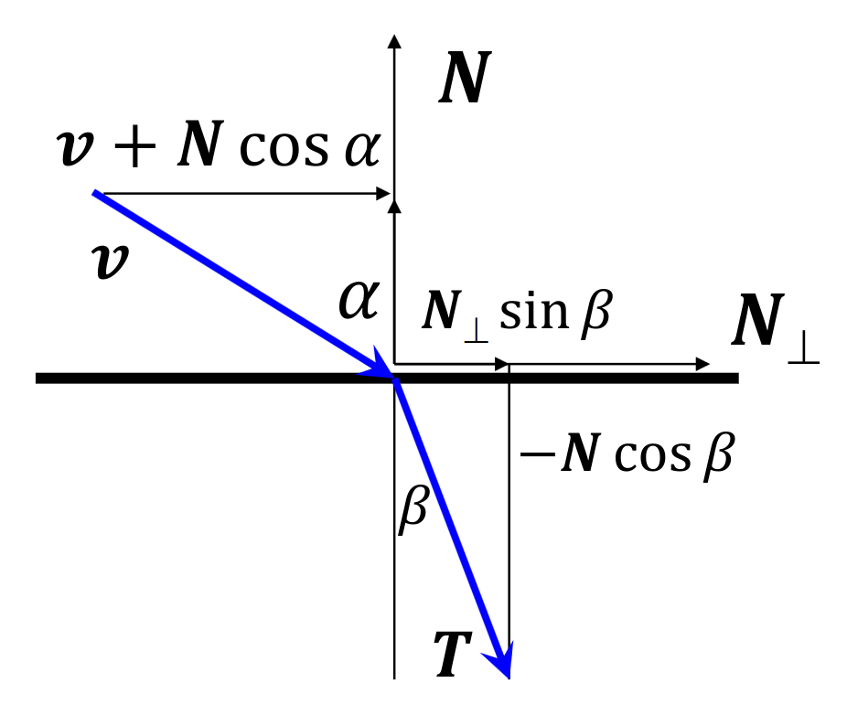

<!-- and yet i fish -->

<!-- 
cél: a valós világ látásának illúzióját keltsük

monitoron a pixelek által kibocsátott spektrumot tudjuk vezérelni. ha a pixelből ugyan olyan foton lépjen ki, mint amennyi a valós világban érné, (irány, erősség, mennyiség, frekvencia, stb), akkor gg

radianciát kell ehhez számolni, ez kell ahhoz, h ne tudjuk megkülönböztetni a két felületet. def... így ha hátrébb visszük a felületet, ugyan annyi foton éro el a szemet, meg orientáció változás esetén is.

fényforrásoknál az absztraktok jók meg a pontszerű pozícionális, ha egy kiterjedt test lenne az bonyi.

lokális csak a fény, rekurzív az egymásról is, globális az meg mindenhonnan is, padló, stb

mi csak 3 hullámhosszon követjük végig, és ezek egymástól függetlenül kezelhetők. foton frekv nrm változik, ha elektron ütközik belé, a tömegkülönbség miatt (orvosi képalkotásnál ez nicnsen mindig így)

sima felület: bemenő fénysugár visszaverődik és/vagy behatol az anyagba. [frenel] azt is meghatározta, hogy milyen arányban verődik vissza a bejövő sugár, ennek a komplementere persze meg behatol. ez egy [0,1] szám, egy valószínűség. F0 az a merőleges eset. a megvilágítás lokális dolog, szóval ezt alkamazzuk akkor is, ha 1 pixel apró környezete egy síknak tekinthető-e (a valódi objektumban ahol lenne az a pixel), azaz optikailag sima anyagok. kappa legtöbbször 0, kivéve fémeknél (kioltási tényező, 1 hullámhosszon mennyit csökken az energia)

programok a megjelenítéshez (optikai sima anyagok)

tükörirány: tudnunk kell ütközés esetén, hogy milyen R visszaverődési irány lesz. a v az N és az R egy síkban van, és vN és NR szögek megegyeznek. feltehető, hogy v és N egységvektorok. először bontsuk fel v-t két komponensre, egy normálirányú, és egy N-re merőleges komponensre. ezeknek a hossza számolható. ekkor a merőleges komponenst hozzáadva a normálirányúhoz megkapjuk R-t. itt külön meg kell csinálni RGB színeire, de ha berakjuk egy vec3-ba, akkor egyszerre megkapjuk az egész spektrumot

itt feltettük, hogy N abba a féltérbe mutat, ahonnan v jön. amikor programozunk, erre a feltételezésre figyelni kell, mert nem mindig magától így van.

törésirány: a technika ugyan az, v-t felbontjuk egy normálirányú és erre merőleges komponensre, és a T tört vektor ezekből kifejezhető. itt kell kicsit tükrözni hogy kapjunk bétát, N_merőleges-t (normalizált v merőleges komponens), meg trig azonosságokat spamelni h csak olyan dolgok legyenek benne amiket mi tudunk. itt ha a gyök alatt negatív van, akkor annak a fizikai jelentősége annyi, h nincsen törés, minden foton visszaverődik

eddig optikailag sima felületeket tárgyaltunk, most rücskös felületeket fogunk
rücskös felület minden irányba szórják a fényt.

vagy viselkedésileg érvényes (black box) modelt csinálunk, vagy struktúrálisan érvényes model. mi most viselkedési érvényes modelt gyártunk, de struktúrálisan érvényes próbálkozásokat is tárgyalunk (sok sok valszám lenne amúgy)

fény-felület kölcsönhatás: bemenő sugársűrűség * arányássági tényező = bemenő * geometriai tényező (cos) * BRDF (anyagfüggő dolog, bidirectional reflection distribution function). ez a felbontás azért jó, mert BRDF-et kifejezhető ebből, és ekkor helmholtz szimmetria törvény fennáll, a fény megfordíthatóságával kapcsolatos (a fényforrást és a kamerát felcserélhetjük, nem változik semmi).

diffúz visszaverődés: ha nagyon rücskös felületeket akarunk szimulálni, ez egyy BRDF model. nézeti irány független minden. a helmholtz miatt a brdf irányfüggetlen (olyan rücskös, h olyan sokat vergődnek a fotonok, h "elfelejtik" az irányukat), azaz hullámhossztól és ponttól függ csak. a köznyelvben a diffúz komponenst nevezzük színnek, a frenel nem erősíti meg a színt ennyire mint ez (lambda, hullámhossz)

lambert féle cosinus törvény törvény: a brdf irányfüggetlen, de a sugársűrűség függ a megvilágítás irányától (a geometriai tag miatt, az nem irányfüggetlen)

spekuláris visszaverődés: nem minden diffúz, vannak nézeti irányfüggő dolgok is. az ilyen felületeket spekuláris visszaverődéssel jellemezhetők (Phong - Blinn model): az anyagnak van egy alap diffúz visszaverődése, és emellett van egy spekuláris "hupli". erre is van képlet, de picit struktúrális modell elemeket emelünk be.

a hupli úgy áll elő, ha a mikrotükrökön/rücskön csak 1x szóródik a fény, utána rögtön a szemünkbe megy. ez akkor áll fenn ,ha a konkrét rücsök felületi normálvektora felezi az L-t és a V-t. (halfway vektor, normalize(L+V)-vel számolható). ez milyen valószínűséggel következik be? a halfwayvektor és normálvektor közötti szög írja ezt le, és ennek az eloszlása a termszéetben egy gauss eloszlás. hát a gyakorlatbaan ez nehéz kiszámolni, szóval jó lesz egy cos függvény transzformáltja is, úgyis kb úgy néz ki mint a gauss görbe. ezt akkor hozzáadjuk a diffúzhoz, és kapunk egy úgy referencia sugársűrűséget. ez a képlet már nem szimmetrikus (sérti a fizikát).

általában minden anyagnak a színét a diffúz adja, a "csillanó folt" meg a phong. itt a "shininess" minél kisebb, annál nagyobb ez a csillanó folt.
-->

# 3D képszintézis

## Színérzékelés

- Monokromatikus = egyetlen hullámhossz kelt színérzetet
- Polikromatikus = több, azokat keverve kapunk egy színérzetet, lineáris

## 3D képszintézis fizikai alapmodellje

> A való világban fényforrásaink vannak, azokból a fénysugarak egy adott út bejárása után a szemünkben képet keltenek. Ezt az illúziót szeretnénk kelteni a képernyőn.

### Radiancia (sugársűrűség)

Egységnyi vetített terület által egységnyi térszögbe sugárzott teljesítmény 
$[Watt/sr/m^2]$

$L(r, v) = \cfrac{\Delta \Phi}{\Delta A ~ \cos \theta ~ \Delta \omega}$

*Magyarázat:*

- $r$ pontban felveszünk egy $\Delta A$ területet
- $V$ irányban felveszünk egy $\Delta \omega$ térszöget
- nézzük meg, hogy a $\Delta A$ felület a $\Delta \omega$ térszögben összesen mekkora teljesítménnyel sugároz $= \Delta \Phi$

- ezt elosztjuk a térszög nagyságával ($\Delta \omega$) és a látható felület nagyságával ($\Delta A ~ \cos \theta$) *(látható nagysága az, hogy $\theta$ szögből mekkorának látom)*

### Fényforrások

Saját fényt emittál (waow)

Absztrakt fényforrások:

- irányféynforrás *(directional light)*: egyetlen irányban párhuzamos fénysugarak, pozíciótol független intenzitás
- pozícionális fényforrás *(point light)*: egyetlen pontból sugároz, intenzitás a távolság négyzetével csökken

> A foton energiája arányos a frekvenciájával. A foton hullámhossza rugalmas ütközésnél nem változik (néha elnyelődhet, de ez energiafüggő).
$m=\frac{E}{c^2}=\frac{hf}{c^2}$

### Fresnel egyenlet
Sima felületeknél (1 pixelben síknak tekintjük) használjuk.
A fény visszaverődhet és/vagy behatolhat az anyagba.

*Magyarázat*

- Fresnel faktor: hányadrésze verődik vissza a fénynek ($F$)
- $n$: törésmutató, sebességarány, $n = \cfrac{\sin \theta^\text{in}}{\sin \theta}$ (dimenziótlan érték)
- $\kappa$: kioltási tényező (*$\approx$ a hullám egy fényhullámnyi hosszon mennyit veszít az amplitúdójából*, dimenziótlan)
    - általában elhanyagolható, fémeknél van jelentősége

$F(\theta^\text{in}) \approx F_0 + (1 - F_0) \cdot (1 - \cos \theta^\text{in})^5$ 
*(de ez csak numerikus approximáció, van rá spicy komplex számos képlet)*

$F_0 = \cfrac{(n-1)^2 + \kappa^2}{(n+1)^2 + \kappa^2}$
*(mennyi részét veri vissza a beérkező fénynek, ha merőlegesen világítjuk meg)*

### Tükörirány

*Magyarázat*

- milyen szögben verődik vissza (duh)

$\cos \alpha = -v \cdot N$
$R = v + 2N \cos \alpha$

### Törésirány

*Magyarázat*

- milyen szögben töri meg a fényt

$N_\perp = \cfrac{v + N \cos \alpha}{\sin \alpha}$
$T = N_\perp \sin \beta - N \cos \beta$

### Rücskös felületek
Az 1 pixelben látható felület rücskös, a beérkező fényt több irányban veri vissza.

*A fényt minden irányba szórja, de az elméleti visszaverődési irányba jobban.*

### Fény-felület kölcsönhatás

<!-- idk hogy kell katex tabot -->
$\overbrace{L(\bold{r}, \bold{V})}^\text{Radiancia} = \overbrace{L^\text{in}(\bold{r}, \bold{L}) \cdot \cos \theta^\text{in}}^\text{Irradiancia} \cdot \overbrace{f_r(\bold{L}, \bold{r}, \bold{V})}^\text{BRDF}$
<!-- lol -->
$\qquad\qquad\qquad\qquad\quad\underbrace{\qquad\qquad\qquad\qquad~}_{\text{L-ből V-be vert arány}}$

$f_r(\bold{L}, \bold{r}, \bold{V}) \stackrel{def}{=} \cfrac{L(\bold{r}, \bold{V})}{L^\text{in}(\bold{r}, \bold{L}) \cdot \cos \theta^\text{in}}$

> Helmholtz tv.: $f_r(\bold{L}, \bold{r}, \bold{V}) = f_r(\bold{V}, \bold{r}, \bold{L})$ *(becsapódás és visszaverődés iránya felcserélhető)*

*Magyarázat (tippre)*
<!-- nyugi én sem értem ám -->
- $\bold{r}$: a pont ahová a fény becsapódik
- $\bold{V}$: az irány amivel a fény visszaverődik
- $\bold{L}$: a beeső fény iránya
- $\theta^\text{in}$: a beesési szög
- $L^\text{in}$: a beeső fény radianciája
- $L$: a visszavert fény radianciája
- $f$ mn. $\text{BRDF}$: az arányossági tényező *(anyagfüggő függvény, mely megadja, hogy adott irányból adott pontba érkező adott irányba mekkora valószínűséggel verődik vissza a foton (asszem))*

### Diffúz visszaverődés
- nagyon rücskös anyagokra jellemző
- nézeti iránytól független

- BRDF a nézeti iránytól független és
- BRDF Helmholtz tv. miatt a megvilágítás irányától is független
$f_r(\bold{L}, \bold{r}, \bold{V}) = k_d(\bold{r}, \lambda)$
- színes
- DE a megvilágítás irányától függ

> Lambert törvény: a sugársűrűség függ a megvilágítási iránytól
> $L^\text{ref} = L^\text{in} ~ k_d ~ \cos^+ \theta^\text{in}$
> $\cos \theta^\text{in} = \bold{N} \cdot \bold{L}$
>
> *($\cos^+$: nemnegatív cos, ha negatívba menne, akkor nullának tekintjük)*

### Spekuláris visszaverődés (Phong - Blinn modell)
Csillogó felületek is minden irányban visszaverik a fényt, de máshogy néznek ki különböző irányokból.

Nem tökéletes minden esetben.

*Magyarázat* `( ._.)`
> \>felbontjuk egy diffúz és csillogós komponensre

> \>???

> \>profit

$L^\text{ref} = L^\text{in} ~ k_d ~ \cos^+ \theta^\text{in} + L^\text{in} ~ k_s ~ (\cos^+ \delta)^\text{shine}\\
\qquad = L^\text{in} ~ (k_d + k_s \cfrac{(\cos^+ \delta)^\text{shine}}{\cos^+ \theta^\text{in}}) ~ \cos^+ \theta^\text{in}$
<!-- real -->

### Fényelnyelő

> Az értelmezést az olvasóra bízzuk (lövésem sincs miez).

- a sugarak egy része elakad
- $\text{hányan ütköztek?} = \text{hányan léptek be} \cdot \text{ütközés valószínűsége}$

# Kvíz

> 1\. Jelöljük be az igaz állításokat.

- [x] A Bezier felület a kontrollpontok konvex burkában van. 
- [x] A Lagrange interpolációs felület kétváltozós súlyfüggvényeinek összege mindig 1. 
- [ ] Parametrikus felület normálvektora a gradiens. *(parametrikus felületnél parciálisan deriválunk)*
- [ ] Minden forgásfelület parametrikus egyenletében szükségképpen van sin és cos.
- [ ] Minden felület megadható explicit egyenlettel.

---
> 2\. Mely állítások igazak az alábbiak közül?

- [x] Egy kiterjedt felületről induló fénysugár sugársűrűsége a sugár mentén állandó. 
- [x] Egy pontszerű fényforrásból induló fénysugár sugársűrűsége a forrástól vett távolság négyzetével csökken.
- [x] A fotontranszport szimulációnál a látható tartományba eső frekvenciájú fotonok elektronokkal rugalmasan ütközve sohasem változtatják meg a frekvenciájukat.
- [x] A törésmutató a két közegbeli fénysebességek arányával egyezik meg.
- [x] A Fresnel függvény értékkészlete a [0,1] tartomány. *(arány)*

- [ ] Csak a 444, 526 és 645 nm hullámhosszú fényből állítható elő bármilyen színérzet additív keveréssel. *(ez az rgb de nem csak eszerint oszthatjuk fel, és ez sem képes lefedni az egész színspektrumot)*
- [ ] Az emberi szem kizárólag a 444, 526 és 645 nm hullámhosszú fényre érzékeny. *(a látható teljes spektrumra érzékeny, csak hullámhosszok különböző mértékben ingerlik a csapokat )*
- [ ] A Fresnel függvény mértékegysége [W/m^2/st] (Watt per négyzetméter per szteradián). *(a Fresnel egy arányt ad meg, a [W/m^2/st] a radiancia mértékegysége)*
- [ ] A fotontranszport szimulációnál a fotonok elektronokkal rugalmasan ütközve sohasem változtatják meg a frekvenciájukat. 

---
> 3\. Egy dielektrikum (nem fém, kioltási tényező közelítőleg zérus) törésmutatója 1.2. Hány százalékát veri vissza a belépő fotonoknak merőleges megvilágításkor?

*Megoldás:*
Egyszerű Fresnel. 
$F_0 = \cfrac{(n-1)^2 + \kappa^2}{(n+1)^2 + \kappa^2}$
$\kappa$ elhanyagolható, $n$ a törésmutató.
Behelyettesítve $\approx 0.826 \%$.

---
> 4\. Az N=(0, 0, 1) normálvektorú felületet a (0,3,4) irányból világítja meg egy 4 W/m^2/st sugársűrűségű irányfényforrás. A felület diffúz visszaverődési tényezője 0.1. Mekkora sugársűrűséget detektál a ponttól az (1,2,3) irányban lévő kamera?

*Megoldás:*
Lambert tv. segítségével.
> $L^\text{ref} = L^\text{in} ~ k_d ~ \cos^+ \theta^\text{in}$
> $\cos \theta^\text{in} = \bold{N} \cdot \bold{L}$

$\bold{L}$ egy irány, tehát normalizálnunk kell.
$\bold{L} = (0, 0.6, 0.8)$

$4 \cdot 0.1 \cdot \bold{N} \cdot \bold{L} = 0.32$
<!-- someone please fact check this --> 

---
> 5\. A fénysugár egy 1/0.1 törésmutatójú közegből érkezik a közeg határára. A határ másik oldalán levegő van. Legalább hány fokos szöget kell bezárnia fénysugár irányának és a levegő felé mutató felületi normálisnak, hogy a fénysugárból semmi se tudjon kilépni a közegből és teljes visszaverődés következzen be.

*Megoldás:*
Snellius-Descartes képlet:
$n = \cfrac{\sin \theta^\text{in}}{\sin \theta} = \frac{1}{0.1} = 10$

Keressük azt a $\theta$ szöget, ahol $\theta^\text{in} \geq 90°$, hogy ne legyen az anyagból kilépő fénysugár. Ennek is a minimumát (legalább) keressük tehát meg kell nézni, hogy hol áll fent az egyenlőség.

$10 = \cfrac{1}{\sin \theta}$
$\theta^\text{in} = \arcsin(\frac{1}{10}) = 5.74°$

<!-- math just aint mathin' here plz help-->

---
> 6\. Az N=(0, 0, 1) normálvektorú felületet a (0,3,4) irányból világítja meg egy 4 W/m^2/st sugársűrűségű irányfényforrás. A felület spekuláris visszaverődési tényezője $\sqrt{2}$, a shininess 3. Mekkora sugársűrűséget detektál a ponttól az (0,4,3) irányban lévő kamera?

*Megoldás:*
Jó diák módjára behelyettesítünk a képletbe.
Mégjobb diák módjára nem felejtjük el normalizálni $L$ és $V$ vektorokat.

$L^\text{in} ~ (k_d + k_s \cfrac{(\cos^+ \delta)^\text{shine}}{\cos^+ \theta^\text{in}}) ~ \cos^+ \theta^\text{in}$
Ahol
$\cos \delta = N \cdot H = N \cdot  \cfrac{L+V}{|L+V|}$
$\cos \delta = (0, 0, 1) \cdot \cfrac{(0,0.6,0.8)+(0,0.8,0.6)}{|(0,0.6,0.8)+(0,0.8,0.6)|} = 0.7071$
és
$\cos \theta = N \cdot L = 0.8$

$4 \cdot (0 + \sqrt{2} \cfrac{0.7071^3}{0.8}) \cdot 0.8 = 2$

---
> 7\. Határozza meg az $f(x,y,z)=x^2/3 + y^2/3 - z^2/3 - K$  implicit felület n=(nx,ny,nz) normálvektorára a nx/ny arányt az (3,3,2) pontban!

*Megoldás:*
Kiszámítható, mint a felületi gradiens.
$\text{grad}f = \bigg(\cfrac{\partial \frac{x^2}{3}}{\partial x}, \cfrac{\partial \frac{y^2}{3}}{\partial y}, -\cfrac{\partial \frac{z^2}{3}}{\partial z}, \bigg) = \bigg(\cfrac{2x}{3}, \cfrac{2y}{3}, -\cfrac{2z}{3} \bigg)$
Ami a $(3,3,2)$ pontban
$n = (2, 2, -\frac{4}{3})$, tehát az arányuk $1$.

[Előző](./6.md)

[Következő](./8.md)