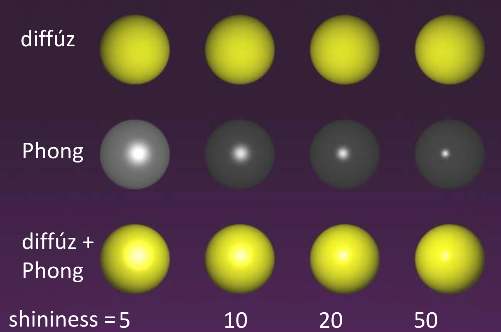

# 3D képszintézis

A célunk az, hogy a valós világ látásának illúzióját keltsük. De hogyan is működik a látásunk? A fény az transzverzális (haladási irányra merőleges rezgő) elektromágneses hullámoknak az összessége, és amikor ezek a fénysugarak eltalálják a szemünket, akkor az agyunkban keletkezik egy illúzió: a szín.

Úgy fogjuk tudni a valós világ látásának illúzióját kelteni, ha elérjük, hogy azok a fénysugarak, amik a monitorról érkeznek a szemünkbe, a lehető legjobban hasonlítsanak azokra, amik a való világból bombázzák a szemünket. Viszont a szemünk csak nagyon kevés információt képes kinyerni ezekből az elektromágneses hullámokból, szóval nekünk elég csak a fény _spektrumát_ reprodukálni.

??? quote További érdekességek
    Bár (szerintem) a tananyagnak szerves részét nem képezi, akit jobban érdekel az, hogy ennek a tudományágnak mik az alapjai, milyen kísérletek voltak, illetve, hogy miért RGB képszintézist alkalmazunk, annak tudom ajánlani [ezt](https://www.youtube.com/watch?v=aYODY4kc0W4) a videót, melyben ezekről szó esik.

## Feladataink

Mi, mint grafikus programozók a pixelek által kibocsátott spektrumot tudjuk vezérelni, ezt kell a lehető legélethűbben reprodukálni (a kibocsátott fotonok iránya, erőssége, mennyisége és frekvenciája közelítőleg legyen ugyan annyi, mint a valóságban). Ehhez muszáj lesz a fizika törvényeihez nyúlnunk, mivel azok írják le a való világ működését.

Felveszünk egy virtuális világot, melyben a felületeket egyenletek írják le, és vannak fényforrások. Felvesszük a felhasználót reprezentáló szemet/kamerát is, illetve egy téglalapot, ami a képernyőt reprezentálja, ugyan úgy pixelekre van bontva. Ezután ha elegendően sok hullámhosszon szimuláljuk a virtuális világunkban a fény terjedését, utána kiszámoljuk a kamerát érő fénysugarak spektrumát, végezetül pedig a kiszámított spektrumunkat úgy konvertáljuk (tone mapping), hogy egy olyan spektrumot kapjunk, amit a monitorunk meg tud jeleníteni (egy pixelben három kis led van, szóval nem tudunk tetszőleges spektrumot megjeleníteni), és ugyan olyan színérzetet kelt, mint az eredeti, akkor elértük a célunkat.

## Radiancia

Egy pixel kicsi, ezért az a térszög amiben látszik szintén kicsi, tehát az a felület, ami a pixel helyén látnánk a való világban szintúgy kicsi. Ha kicsi felületekről beszélünk, akkor nekünk elég lesz egy mennyiség, amivel jellemezzük a fényességüket, hiszen feltehetjük, hogy egy kicsi felület összes pontja hasonló tulajdonságú.

Ez a mennyiség a radiancia (sugársűrűség).

!!! info 7.1 Definíció (radiancia)
    Vegyünk egy kicsi $\Delta A$ differenciális felületelemet (egy kicsi részét egy felületnek) $\bm{r}$ felületi normával. Ennek a fényességét/színét vizsgáljuk egy $\bm{V}$ irányban. Vegyünk fel $\bm{V}$ körül egy $\Delta \omega$ térszöget, és határozzuk meg a $\Delta A$ által, a $\Delta \omega$ térszögbe kibocsátott teljesítményt, legyen ez $\Delta \Phi$. Ezek után az $L$ radiancia a következő:

    $$
    L(\bm{r}, \bm{V}) = \frac{\Delta \Phi}{\Delta A \cos(\theta) \Delta \omega}
    $$

    azaz a sugársűrűség _a kibocsátott teljesítmény, osztva a vetített területtel, és a térszöggel_.

A radiancia mértékegysége $[\text{Watt}/\text{sr}/\text{m}^2]$. Egy mondatban: a radiancia egységnyi vetített terület által egységnyi térszögbe sugárzott teljesítmény.

??? info Radiancia ábra
    

A definícióban a "vetített terület" ($\Delta A \cos\theta$) arra utal, hogy ha nem merőlegesen nézünk egy felületre, akkor kisebbnek látjuk azt, egészen pontosan ha $\theta$ szöggel térünk el a merőlegestől, akkor az arány, amivel kisebbnek látjuk, az $\cos(\theta)$.

Ha két felület radianciája megegyezik, akkor _a két felület távolságától, és orientációjától függetlenül_ azokat ugyan olyan színűnek látja a megfigyelő, más szóval _a sugársűrűség egy sugár mentén állandó_.

??? abstract Bizonyítás
    Proof by [higher authority](https://youtu.be/XdXiAe0G6Gg?si=luFYY0vl-bPdrY1E&t=341). <span style="display: flex; justify-content: flex-end;"> $\blacksquare$ </span>

## Fényforrások

Az különböztető meg a fényforrásokat a többi objektumtól a virtuális világunkban, hogy saját magától is van egy nemnulla sugársűrűsége. Ezek fogják megvilágítani a nem fényforrás felületeket, amik ezen a folyamaton keresztül válnak láthatóvá.

A való világban egy fényforrás egy véges felülettel rendelkezik, azaz egy kiterjed test. Viszont egy ilyen fényforrás minden pontjából bocsájtana ki fotonokat, tehát ha egy felület egy pontján az összes oda beeső fénysugárral számolni akarnánk, akkor integrálnunk kéne a fényforrás felülete mentén.

!!! quote Idézet
    $\text{"Integrálni pedig általában nem szeretünk [...]"}$
    $\hspace{20.5em} \text{- Szirmay-Kalos László}$

Ezért mi _absztrakt_ fényforrásokat fogunk használni. Ezek pontszerűek, nincsen kiterjedésük (ezért nem láthatóak a kamerából közvetlenül) és egy felületi pontot csak egyetlen egy irányból világíthatnak meg. Két fő fajtáját tárgyaljuk:

- Irány fényforrások: egyetlen irányba sugároz, a fénysugarak párhuzamosak, a fénysűrűség minden pontban megegyezik. A való világban a Nap közelítőleg ilyennek tekinthető.
- Pozicionális fényforrások: a fényforrás minden fotonja egyetlen pontból származik, minden irányba terjednek. Az intenzitás a távolság négyzetével csökken. A való világban a lámpák közelítőleg ilyennek tekinthetők.

## Képszintézis

A képszintézis a fény terjedését szimulálja a virtuális világban a fényforrásokból kiindulva. Mi bizonyos értelemben fordítva indulunk el: a kamerából bocsátunk ki sugarakat, és megnézzük, hogy azok felületet érnek-e. Ha igen, akkor a felületnek abban a pontjában kiszámoljuk a kamera irányú radianciát. Legtöbbször valamilyen kompromisszumot kell kötnünk a fényszimulálás pontossága, és a számítás bonyolultsága között. Három fő esetet tárgyalunk:

### Lokális illumináció

Ez a legkevésbé számításigényesebb megközelítés. Ilyenkor a felületünk pontjában a radiancia megállapításához csak azokat a fénysugarakat vesszük figyelembe, amik absztrakt fényforrásokból érkeznek abba a pontba. Mivel más objektumokról visszapattanó, vagy törő fénysugarakat figyelmen kívül hagyunk, lemondunk az átlátszóságról, és a tükröződésről.

### Rekurzív sugárkövetés

Azon felül, hogy a pontba érkező fénysugarakat figyelembe veszi, ez a módszer kiszámítja azt is, hogy a felületünk pontjába az elméleti visszaverődési irányból (ahonnan a kamerába menő sugár egy része visszaverődött volna) és az elméleti törési irányból (ahonnan a kamerába menő sugár egy része tört volna) milyen sugársűrűségek érkeznek, és ezekkel is számol. Így már lehetnek tükröző, illetve átlátszó felületeink. Fontos, hogy ez csak az optikailag sima felületeket veszi számításba.

### Globális illumináció

Itt már nem csak az ideális visszaverődési/törési irányból érkező fénysugarakat vesszük figyelembe, és nem csak az optikailag sima felületekről érkező fényeket, hanem rücskös felületekről, random irányokból érkező potenciális fénysugarakat is.

### Hullámhosszok

Ezeket a számításokat nekünk elméletileg a teljes látható fényspektrumon el kéne végeznünk, azaz az összes lehetséges hullámhosszon, de mi ezt lecsökkenthetjük három hullámhosszra, mivel az emberek a teljes spektrumot három átlapuló tartományban érzékelik.

Az a szerencsénk, hogy az átlapuló tartományokban az egyes hullámhosszok külön kezelhetőek. Ez azért van, mert egy foton (relativisztikus tömege) még az elektron tömegéhez képest is annyira kicsi, hogy amikor egy foton ütközik egy elektronnal, akkor a rugalmas ütközéshez hasonlóan nem veszít az energiájából. Viszont egy foton energiája kapcsolatban van a hullámhosszával is, tehát az sem változhat. Így tehát ha például egy teljesen sötét szobában felkapcsolnánk egy csak piros fényt kibocsátó lámpát, akkor minden foton, ami a szemünkbe érkezne, az a piros egy árnyalata lenne - de sosem lennének például zöld, sárga, vagy kék árnyalatok. (Orvosi képalkotásnál ez nincs így, mert ott nagyobbak a fotonok energiái, tehát nem mindig rugalmas ütközésnek megfelelően viselkednek.)

Tehát ha először csak a piros fényt vizsgáljuk, az nem állít elő pl. kék fényt, tehát nem rontja el a számításainkat.

## Optikailag sima felületek

Az optikailag sima felületek esetén azt feltételezzük, hogy amikor a fénysugár a felület felszínére ér, akkor a felület olyan mint egy sík: két részre osztja a teret, a külső részre ahonnan a fénysugár jön, és ahova majd vissza fog verődni, és egy belső részre, amit valami anyag tölt ki, és amelybe fénysugarunk esetleg behatolhat. Ez a gyakorlatban úgy dönthető el, ha azt mondhatjuk, hogy az alakzatunk $1$ pixelében a felület közelítőleg sík, akkor optikailag sima. Így például egy teáskannát is optikailag sima felületnek tekinthetünk.


Jelölje a felület egy pontjába érkező fénysugár sugársűrűségét $L^{\text{in}}$, a beérkezési szöget pedig $\theta^{\text{in}}$. Mivel a különböző hullámhosszokat külön kezelhetjük, ezért feltételezhetjük, hogy ez egy monokromatikus fény, például tiszta piros.

Ekkor az optika visszaverődési törvényének megfelelően a fénysugár egy része visszaverődik a felületről, a másik része pedig behatol az anyagba. Ez a két komponens összesen ki kell hogy adja az eredeti fény sugársűrűségét az energiamegmaradási törvényből adódóan. Jelöljük a visszavert komponens arányát $F$-el (Fresnel [frɛnɛl] tiszteletére). Ekkor a visszavert fénysugár sugársűrűsége $L^{\text{in}} \cdot F(\theta^{\text{in}})$, és a tört komponensé pedig $L^{\text{in}} \cdot (1 - F(\theta^{\text{in}}))$, hiszen ezek összege ki kell, hogy adja $L^{\text{in}}$-t.

A visszaverődő sugár iránya a felület normálvektorával $\theta^{\text{in}}$ szöget zár be a fénysugár és a felületi norma síkjában. A behatoló fénysugár irányát a Snellius-Descartes törvényből tudjuk meghatározni:

$$
n = \frac{\sin(\theta^{\text{in}})}{\sin(\theta)} \implies \theta = \arcsin\bigg(\frac{\sin(\theta^{\text{in}})}{n}\bigg)
$$

ahol $n$ az anyaghoz tartozó _törésmutató_. Ez egy sebességarány, a fény vákuumbeli sebességének, illetve az anyagbeli sebességének hányadosa.

A Fresnel formulák eléggé számításigényesek, tehát egy numerikus approximációval dolgozunk:

$$
\boxed{F(\theta^{\text{in}}) \approx F_0 + (1 - F_0) \cdot (1 - \cos(\theta^{\text{in}}))^5}
$$

Nézzük meg tényezőnként, hogy mi mit jelent.

Az $F_0$ egy $0$ és $1$ közötti szám, és lényegében annak a valószínűsége, hogy ha egy foton merőlegesen érkezik a felületre, akkor visszaverődik róla. Az alábbi képlettel számítható ki:

$$
F_0 = \frac{(n-1)^2 + \kappa^2}{(n+1)^2 + \kappa^2}
$$

ahol $n$ a fentebb említett törésmutató, $\kappa$ pedig a _kioltási tényező_. Ez azt mutatja meg, hogy mennyire alél el a sugársűrűség az anyagban, amikor egy hullámhossznyi távolságot megtett benne. Mivel a látható fény hullámhossza kb. fél mikrométer, ez a gyakorlatban azt mutatja meg, hogy ha fogunk valamilyen anyagot, mondjuk az emberi bőrt, vagy műanyagot, és csinálnánk belőle egy fél mikrométer vastag lemezt, akkor ha ezen áthatol a fény, mennyire gyengülne le a sugársűrűsége. Hát fél mikrométer annyira kicsi, hogy a legtöbb anyag igazából semmilyen hatással sincsen a sugársűrűségre, tehát $\kappa$ a legtöbb esetben $0$-nak vehető. Ez alól a vezető anyagok, vagyis a fémek családja a kivétel, nálunk sosem elhanyagolható a $\kappa$.

Egy másik dolog, amit általában elhanyagolunk, az az, hogy az $n$ törésmutató és $\kappa$ kioltási tényező függenek a fény hullámhosszától. Fémek esetén ezt szintén nem hanyagolhatjuk el.

??? info Példa (üveg)
    Vegyük az üveget, ami egy nem fémes anyag, tehát $\kappa = 0$. Az üveg törésmutatója $1.5$, szóval:

    $$
    \begin{align*}
    F_0 &= \frac{(1.5 - 1)^2}{(1.5 + 1)^2} \\[2.75ex]
    &= \frac{0.25}{6.25} \approx 4\%
    \end{align*}
    $$

    ami azt jelenti, hogy ha egy üveg felületére merőleges érkezik egy fénysugár, akkor $4\%$ esély van arra, hogy az visszaverődik. Ez logikus, hiszen az üveget leginkább arra használjuk, hogy átengedje a fénysugarakat amik bele érkeznek, szóval előnyös, ha $96\%$-ukat átengedi.

Tehát ha egy konkrét anyagot szeretnénk megjeleníteni a virtuális világban, akkor ki kell keresnünk a hozzá tartozó $n$-t és $\kappa$-t, utána pedig azokkal a Fresnel egyenlet segítségével egész jó közelítésű sugársűrűséget tudunk számolni.

Vizsgáljuk meg a másik tényezőt a Fresnel egyenletben:

$$
(1 - F_0) \cdot (1 - \cos(\theta^{\text{in}}))^5
$$

A kifejezés második tagjában:

$$
(1 - \cos(\theta^{\text{in}}))^5
$$

megjelenik a $\theta^{\text{in}}$ beesési szög, de vajon milyen információt hordoz ez a kifejezés?

Ha $\theta^{\text{in}}$-t $90\degree$ közelire választjuk, akkor (mivel az a merőlegestől mért szög, vesd össze a fenti ábrával) a fénysugarunk szinte párhuzamos a felülettel, de legalábbis nagyon sekélyen érkezik. Ekkor viszont az $(1 - \cos(\theta^{\text{in}}))^5$ tagban a $\cos(\theta^{\text{in}})$ tényező közel $0$ lesz, hiszen $\cos(90\degree) = 0$. Így tovább egyszerűsödik az egyenletünk:

$$
\begin{align*}
F(\theta^{\text{in}}) &\approx F_0 + (1 - F_0) \cdot (1 - \cos(\theta^{\text{in}}))^5 \\
& \approx F_0 + (1 - F_0) \cdot (1 - \cos(90\degree))^5 \\
&= F_0 + (1 - F_0) \cdot (1 - 0)^5 \\
&= F_0 + 1 - F_0 \\
&= 1
\end{align*}
$$

tehát $F(\theta^{\text{in}}) \approx 1$. Ez mit is jelent? $F(\theta^{\text{in}})$ volt az az arány, ami azt dönti el, hogy a fény hányad része verődik vissza, és hányad része hatol be az anyagba. Ha $F(\theta^{\text{in}}) \approx 1$, akkor lényegében a beérkező fénysűrűség teljes egészében visszaverődik. Tehát ez a tényező azt az információt hordozza, hogy ha egy felületre közel párhuzamosan látunk rá, akkor az nem fogad magába sok fényt.

Nézzük meg, hogy az itt tárgyaltakat kódban hogyan tudjuk megvalósítani.

### Visszaverődés

Ismerjük a fény $v$ belépési irányát, illetve a felület $\bm{N}$ normálvektorát, és elő kell állítanunk a fény $\bm{R}$ visszaverődési irányát. Tudjuk, hogy $v, \bm{N}$ és $\bm{R}$ egy síkban vannak, és hogy a $\theta^{\text{in}}$ beérkezési szög (az ábrán $\alpha$) megegyezik a visszaverődési szöggel. Feltehetjük továbbá, hogy $v$ és $\bm{N}$ egységvektorok, kódban könnyű ezeket normalizálni.


Először bontsuk fel $v$-t két komponensre, egy normálirányú ($\bm{N}$-el párhuzamos), és egy $\bm{N}$-re merőleges komponensre. Ekkor ha a $v$ vektorunkat az $\bm{N}$ normálvektorra vetítjük (előtte tükrözzük $-v$-ként, hogy azonos pontból induljanak), megkaphatjuk a normálirányú komponens nagyságát, hiszen egy vektor vetületének hosszát egy másik vektorra a skaláris szorzatuk adja meg.

Ezután, ha a $v$ vektor tövéből elindulunk, és először a $v$ vektort követjük, utána pedig a normálirányú vektort, amelynek a nagysága tehát $\bm{N} \cos(\alpha)$, akkor pont ugyan abba a pontba jutunk, mintha a $v$ vektor tövéből az $\bm{N}$-re merőleges komponensen haladtunk volna. Ez a vektor összeadás definíciója, tehát az $\bm{N}$-re merőleges komponens felírható úgy, mint $v + \bm{N} \cos(\alpha)$.

Ezt követően az $\bm{N}$-re merőleges komponenst hozzá adva a normálirányúhoz megkapjuk $\bm{R}$-t (ezt megint átláthatjuk úgy, hogy ha a beesési pontból először követjük az $\bm{N}$-el párhuzamos komponenst, utána pedig eltoljuk ezt a pontot az $\bm{N}$-re merőleges komponenssel, akkor pont oda jutunk, mintha az $\bm{R}$ vektort követnénk), így tehát:

$$
\boxed{\bm{R} = v + 2 \bm{N} \cos(\alpha)}
$$

ahol $\cos(\alpha) = -v \cdot \bm{N}$.

#### Implementáció (+ Fresnel)

```cpp
vec3 reflect(vec3 V, vec3 N) {
    return V - N * dot(N, V) * 2;
};
```

Itt külön meg kell csinálni az RGB színeire, de ha berakjuk egy `vec3`-ba, akkor egyszerre megkapjuk az egész spektrumot.

Feltettük továbbá, hogy $\bm{N}$ abba a féltérbe mutat, ahonnan $v$ érkezett. Amikor programozunk, ennek a feltételnek a teljesülésére figyelni kell, mert nem mindig teljesül magától.

A visszaverődés után a sugársűrűséget a Fresnel egyenlettel kell súlyozni, szóval azt is valósítsuk meg:

```cpp
vec3 Fresnel(vec3 V, vec3 N) {
    float cosa = -dot(V, N);

    vec3 one(1, 1, 1);
    vec3 F0 = ((n – one)*(n – one) + kappa * kappa) /
              ((n + one)*(n + one) + kappa * kappa);

    return F0 + (one – F0) * pow(1 - cosa, 5);
}
```

Itt is a hullámhosszakat eltérő komponensekbe rakjuk, így párhuzamosan az RGB mindhárom színére ki tudjuk számolni.

### Törés

Az megközelítés ugyan az mint a visszaverődésnél, a bemeneti adataink is ugyan azok, csak most az anyagba behatoló vektort akarjuk meghatározni.


Bontsuk fel $v$-t ismét egy normálirányú és egy erre merőleges komponensre és a $T$ tört vektor ezekből kifejezhető:

$$
\bm{T} = \bm{N}_{\perp} \sin(\beta) - \bm{N} \cos(\beta)
$$

ahol $\bm{N}_{\perp}$ egy $\bm{N}$-re merőleges egységvektor. Ezt a $v$ felbontásaval megkaphatjuk, ha előtte normalizáljuk:

$$
\bm{N}_{\perp} = \frac{v + \bm{N}}}{\sin(\alpha)}
$$

ahol tudjuk, hogy $|v + \bm{N}| = \sin(\alpha)$, hiszen egy derékszögű háromszöget alkot, aminek $v$ az átfogója, és $|v| = 1$ mivel már normalizálva van, tehát $|v + \bm{N}| = \sin(\alpha) / 1$.

Nekünk viszont a fenti $\bm{T}$ egyenletben még van egy ismeretlen tagunk, nevezetesen a $\cos(\beta)$. A trigonometrikus pitagorasz tételt átírva:

$$
\begin{align*}
&\sin^2(\beta) + \cos^2(\beta) = 1 \\
\implies &\cos(\beta) = \sqrt{1 - \sin^2(\beta)}
\end{align*}
$$

ezután pedig a Snellius-Descartes tételt négyzetre emelve, $\sin^2(\beta)$-ra rendezve, és visszahelyettesítve:

$$
\cos(\beta) = \sqrt{1 - \frac{\sin^2(\alpha)}{n^2}}
$$

Visszahelyettesítve mindent az eredeti egyenletbe, ezt a kifejezést kapjuk $\bm{T}$-re:

$$
\boxed{\frac{v}{n} + \bm{N} \bigg( \cos(\alpha/n) - \sqrt{1 - \frac{1 - \cos^2{\alpha}}{n^2}} \bigg)}
$$

Ha a gyök alatt negatív van, akkor annak az a fizikai jelentősége, hogy nincsen törés, azaz minden foton visszaverődik (_teljes belső visszaverődés_).

#### Teljes belső visszaverődés

Ez a jelenség akkor lép föl, amikor egy optikailag sűrűbb közegből érkezünk az elválasztó határra. Például ha egy vízzel teli medence aljáról felnézünk, akkor ezt tapasztalhatjuk:


Ha merőlegesen felfele nézünk, akkor még valamennyi fény átjut (ez az, ami megtörik), viszont ha csökkentjük a beesési szöget, azaz távolabbra nézünk, akkor már a teljes visszaverődés tapasztalható.

#### Implementáció

```cpp
// ns: törésmutató
vec3 refract(vec3 V, vec3 N, float ns) {
    float cosa = -dot(V, N);
    float disc = 1 - (1 – cosa * cosa) / ns / ns; // scalar n

    // Convention: if no refraction, return null vector
    if (disc < 0) return vec3(0, 0, 0);

    return V / ns + N * (cosa / ns - sqrt(disc));
}
```

## Rücskös felületek

Eddig optikailag sima felületeket tárgyaltunk, most nézzük meg, hogy mit tehetünk akkor, ha ezt nem feltételezhetjük a felületünkről. A körülöttünk lévő objektumok döntő része hiszen rücskösek.

Míg az optikailag sima felületek az egy adott irányból érkező fénysugarakat a visszaverődési törvény által meghatározott irányba verik vissza, a rücskös felületek minden lehetséges irányba visszaverik ezeket. Nézzünk rá közelebbről egy ilyen felületre:


A "rücskökre" a felületen úgy tekinthetünk, mint kicsi ideális tükrökre, amik véletlenszerű orientációban vannak. Ezért akkor is ha egy irányból érkezik sok fénysugár, a tükrök véletlenszerű orientációja miatt teljesen véletlenszerű irányba verődnek vissza, annak ellenére, hogy az egyes tükrök esetében mindig az elméleti visszaverődési irányba verődnek vissza.

Két lehetséges úton járhatnánk el ennek a modellezésében:

- Viselkedésileg érvényes (black box) model (A modell kimeneti viselkedésére, helyezi a hangsúlyt)
- Struktúrálisan érvényes model (A modell belső felépítésére, szerkezetére helyezi a hangsúlyt)

Mi most elsősorban egy viselkedésileg érvényes modelt gyártunk, viszont struktúrálisan érvényes próbálkozásokat is tárgyalunk.

### Fény felület kölcsönhatás

Tekintsük az $\bm{L}$ irányból érkező fénysugarat $L^{\text{in}}$ sugársűrűséggel, ami a felületünk egy pontját eltalálja, és utána $\bm{V}$ irányba verődik vissza, ahol a kamerába érkezik.

Általánosságban elmondhatjuk, hogy a $\bm{V}$ irányba kimenő radiancia lineárisan függ a bemenő radianciától: ha kétszer annyi foton érkezik az $\bm{L}$ irányból, akkor átlagosan a $\bm{V}$ irányba is kétszer annyi foton verődik vissza. Azaz valami ilyesmi formában keressük a kimenő radianciát:

$$
L(r, \bm{V}) = L^{\text{in}}(r, \bm{L}) \cdot \Psi
$$

ahol $\Psi$ az arányossági tényezőnk. Még eszünkbe juthat, hogy valószínűleg ennek az arányossági tényezőnek lesz egy geometriai komponense (ami csak a beesési szögtől függ) és egy anyagjellemző komponense, ami a felület fizikai tulajdonságaitól függ. Ezekkel a gondolatokkal az övünk alatt nézzünk rá a teljes képletre:

$$
\boxed{
L(r, \bm{V}) = \overbrace{L^{\text{in}}(r, \bm{L}) \cdot \cos(\theta^{\text{in}})}^{\text{Irradiancia}} \cdot \overbrace{f_r(\bm{L}, r, \bm{V})}^{\text{BRDF}}
}
$$

ahol $\Psi = \cos(\theta^{\text{in}} \cdot f_r(\bm{L}, r, \bm{V})$, azaz ez a tag fejezi ki azt, hogy egy foton milyen eséllyel verődik éppen az $\bm{L}$ irányból a $\bm{V}$ irányba. A $\cos(\theta^{\text{in}}$ tag a geometriai faktor, a $f_r(\bm{L}, r, \bm{V})$ pedig az úgynevezett Bidirectional Reflection Distribution Function (BRDF). Egyik előnye, hogy így szét bontjuk a geometriai és anyagi tényezőket, hogy ha a BRDF-et így definiáljuk:

$$
f_r(\bm{L}, r, \bm{V}) \stackrel{\text{def}}{=} \frac{L(r, \bm{V})}{L^{\text{in}}(r, \bm{L}) \cdot \cos(\theta^{\text{in}})}
$$

akkor sok kellemes tulajdonságát tudjuk élvezni, az egyik például a Helmholtz törvény:

!!! note Helmholtz törvény
    Ha a BRDF-et mérések során megállapítjuk, utána pedig felcseréljük benne a megvilágítási illetve nézeti irányt, akkor a mennyiség nem változik, azaz:

    $$
    f_r(\bm{L}, r, \bm{V}) = f_r(\bm{V}, r, \bm{L})
    $$

Egy másik előnye a geometriai és anyagi tényezők szétbontásának az, hogy a megvilágítás erőssége, azaz az _irradiancia_ az csak a geometriai tényezővel arányos.

Fontos, hogy mivel a BRDF-re nem adtunk olyan kifejezést, amivel ténylegesen tudnánk dolgozni, és legfeljebb csak mérni lehet, ezért ez így még önmagában kevés lesz. A következőben két olyan modellt fogunk nézni, amik már konkrétabban meghatározzák ezt a BRDF tagot.

### Diffúz visszaverődés

Ez a BRDF modell nagyon rücskös felületek szimulálására használatos, például a fehérre meszelt fal, homok, hó, stb... Ezekre az jellemző, hogy a felület színe a nézeti iránytól független. Ez azt jelenti, hogy a radianciának is nézeti iránytól függetlennek kell lennie. Idézzük fel, hogy:

$$
\text{Radiancia} = \text{Irradiancia} \cdot \text{BRDF}
$$

Az irradiancia már eleve irányfüggetlen, hiszen az csak a beérkező fénysugárról tárol információt, arról nem, hogy honnan nézzük. Ezáltal a BRDF-nek is nézeti iránytól függetlennek kell lennie. A Helmholtz törvény alkalmazásával belátható, hogy ha a BRDF a nézeti iránytól független, akkor a fényforrás irányától is függetlennek kell lennie, hiszen ez a kettő szabadon felcserélhető a törvény szerint (azt is mondhatjuk, hogy az anyagunk "annyira rücskös", hogy olyan sokat vergődnek a fotonok, hogy "elfelejtik", hogy eredetileg ők milyen irányból jöttek).

Ezáltal a BRDF csakis a hullámhossztól, és az adott ponttól függhet:

$$
f_r(\bm{L}, r, \bm{V}) = k_d(r, \lambda)
$$

A köznyelvben a diffúz komponenst szokás színnek nevezni, hiszen a Fresnel önmagában nem erősíti meg a színt ennyire mint ez. A Fresnel tag is függ a $\lambda$ hullámhossztól, de nem fémes anyagoknál csak egy nagyon kicsit. Viszont a rücskös felületeknél nagyon sokáig visszaverődik a fény a kicsi tükrökön, míg eljut a szemünkbe, tehát a sok kicsi függés felerősödik.

#### Lambert törvény

Míg a BRDF irányfüggetlen, a kimenő sugársűrűség függ a megvilágítás irányától (a geometriai tag miatt, az nem irányfüggetlen). Jelölje a visszaverődő sugársűrűséget $L^{\text{ref}}$. Ekkor:

$$
L^{\text{ref}} = L^{\text{in}} \cdot \cos^{+}(\theta^{\text{in}}) \cdot k_d
$$

tehát $L^{\text{ref}}$ a $\cos^{+}(\theta^{\text{in}})$ geometriai tag miatt irányfüggő.

!!! note Geometriai tag
    A $\cos^{+}(\theta^{\text{in}})$ geometriai tagban a $\cos^{+}$ azt jelenti, hogy ha a $\cos$ értéke negatív lenne, akkor azt $0$-val cseréljük ki. A negatív geometriai tag azt jelentené, hogy a felület belsejéből/túloldaláról látjuk az adott pontot, ekkora pedig kinullázzuk a radianciát.

### Spekuláris visszaverődés

A rücskös felületek másik családját a spekuláris visszaverődésű felületek alkotják. Nem lehet minden rücskös felület diffúz, hiszen vannak olyan anyagok, ahol a nézeti iránytól is függ a radiancia. Mi a Phong-Blinn modellt fogjuk részletezni.

Az anyagoknak van egy alap diffúz visszaverődése, de ezt nem teljesen egyenletesen oszlatjuk szét, hanem picit az elméleti visszaverődés irányába koncentráljuk a sugarakat. Ehhez már pár struktúrális modellezési elemeket is bevezetünk. Bontsuk fel a visszaverődési profilt két részre: egy diffúz részre, ahol minden egyenletes, illetve egy "spekuláris huplira", ami az elméleti visszaverődési irányban maximális, de aztán attól elfordulva nagyon gyorsan csökken:


A spekuláris hupli úgy áll elő, hogy ha a mikrotükrökön/rücskön csak egyszer szóródik a fény, azaz a foton egy visszaverődés után rögtön a szemünkbe jut. Ez akkor áll fenn, ha a konkrét mikrotükör felületi normálvektora felezi az $\bm{L}$-t és a $\bm{V}$-t (ez az úgynevezett $\bm{H}$ halfway vektor, `normalize(L + V)`-vel számolható). Azt értjük "felezi" alatt, hogy ez a $\bm{H}$ egy síkban van $\bm{L}$-el és $\bm{V}$-vel, és felezi az általuk közrezárt szöget.

A visszaverődés erőssége ebben a spekuláris hupliban attól fog függeni, hogy milyen valószínűséggel következik az be, hogy a mikrotükör normája éppen a halfway vektor.

A halfway vektor és teljes felület normálvektora közötti szög írja ezt le, és ennek az eloszlása a természetben egy Gauss eloszlás. A gyakorlatban ez túl számításigényesnek bizonyult, szóval Phong és Blinn azt javasolták, hogy közelítsük ezt a Gauss eloszlást egy $\cos$ függvénnyel.


A fenti ábrán a kékkel jelölt függvény egy Gauss-eloszlás $m = 0$ és $s = 0.4$ paraméterekkel,a barna függvény pedig $g(x) = \cos^{4}(x)$. Látható, hogy a $[-2, 2]$ tartományban relatíve jó közelítés a $\cos$ függvény transzformáltja, további finomításokkal még pontosabb közelítés kapható. Egészen pontosan a $\cos(\rho) = \bm{N} \cdot \bm{H}$ választással a

$$
L^{\text{in}} \cdot k_s \cdot (\cos^{+}\rho)^{\text{shine}}
$$

kifejezés lesz a spekuláris hupli közelítése. Itt a "shine" minél kisebb, annál nagyobb ez a csillanó folt. Általában minden anyagnak a színét a diffúz visszaverődés adja, a "csillanó foltot" meg a spekuláris visszaverődés.

Ezt a spekuláris huplit hozzáadva a korábbi diffúzhoz kapunk egy úgy referencia sugársűrűséget. Ez a képlet már nem szimmetrikus (sérti a fizikát):

$$
\boxed{
\begin{align*}
L^{\text{ref}} &= L^{\text{in}} \cdot \cos^{+}(\theta^{\text{in}}) \cdot k_d + L^{\text{in}} \cdot k_s \cdot (\cos^{+}\rho)^{\text{shine}} \\[2.75ex]
&= L^{\text{in}} \bigg( k_d + k_s \cdot \frac{(\cos^{+}\rho)^{\text{shine}}}{\cos^{+}(\theta^{\text{in}})} \bigg) \cos^{+}(\theta^{\text{in}})
\end{align*}
}
$$

ebben a kifejezésben a

$$
\bigg( k_d + k_s \cdot \frac{(\cos^{+}\rho)^{\text{shine}}}{\cos^{+}(\theta^{\text{in}})} \bigg)
$$

a BRDF tag. Erre nem teljesül a Helmholtz törvény, tehát technikailag pontatlan, de egész jó eredményeket ad, és relatívan kevésbé bonyolult. Egy egyszerű javítás, ha a $\cos^{+}(\theta^{\text{in}})$ tagot lecseréljük $(\bm{L} + \bm{V})^2$-re:

$$
L^{\text{in}} \bigg( k_d + k_s \cdot \frac{(\cos^{+}\rho)^{\text{shine}}}{(\bm{L} + \bm{V})^2} \bigg) \cos^{+}(\theta^{\text{in}})
$$

A különböző BRDF képletek kitalálása ma is aktívan kutatott terület. Meg kell találni az aranyközépútat a fizikai pontosság, és a hatékony kiszámíthatóság között.

#### Példák



#### Implementáció (diffúz + spekuláris)

```cpp
vec3 shade(vec3 N, vec3 V, vec3 L, vec3 inRad) {
    float cosTheta = dot(N, L); // unit vecs
    if(cosTheta < 0) return vec3(0, 0,  0); // self shadow

    vec3 diffuseRad = inRad * kd * cosTheta; // diffuse

    vec3 H = normalize(V + L);
    float cosDelta = dot(N, H);
    if(cosDelta < 0) return diffuseRad;

    return diffuseRad + inRad * ks * pow(cosDelta, shine);
}
```

---

# Kvíz

!!! question 1\. Mely állítások igazak az alábbiak közül?
    - Egy kiterjedt felületről induló fénysugár sugársűrűsége a sugár mentén állandó.
    - Egy pontszerű fényforrásból induló fénysugár sugársűrűsége a forrástól vett távolság négyzetével csökken.
    - A fotontranszport szimulációnál a látható tartományba eső frekvenciájú fotonok elektronokkal rugalmasan ütközve sohasem változtatják meg a frekvenciájukat.
    - A törésmutató a két közegbeli fénysebességek arányával egyezik meg.
    - A Fresnel függvény értékkészlete a [0,1] tartomány.
    - Csak a $444, 526$ és $645$ nm hullámhosszú fényből állítható elő bármilyen színérzet additív keveréssel.
    - Az emberi szem kizárólag a 444, 526 és 645 nm hullámhosszú fényre érzékeny.
    - A Fresnel függvény mértékegysége [W/m^2/st] (Watt per négyzetméter per szteradián).
    - A fotontranszport szimulációnál a fotonok elektronokkal rugalmasan ütközve sohasem változtatják meg a frekvenciájukat.


??? tip Megoldás
    - [x] Egy kiterjedt felületről induló fénysugár sugársűrűsége a sugár mentén állandó.
    - [x] Egy pontszerű fényforrásból induló fénysugár sugársűrűsége a forrástól vett távolság négyzetével csökken.
    - [x] A fotontranszport szimulációnál a látható tartományba eső frekvenciájú fotonok elektronokkal rugalmasan ütközve sohasem változtatják meg a frekvenciájukat.
        - Magyarázat: mivel a látható tartományba esnek, ezért tudjuk, hogy nem nagy energiájúak, tehát ez igaz.
    - [x] A törésmutató a két közegbeli fénysebességek arányával egyezik meg.
    - [x] A Fresnel függvény értékkészlete a [0,1] tartomány.
        - Magyarázat: Igen, mert egy arány.
    - [ ] Csak a $444, 526$ és $645$ nm hullámhosszú fényből állítható elő bármilyen színérzet additív keveréssel.
        - Magyarázat: ez az RGB, de nem csak eszerint oszthatjuk fel, és ez sem képes lefedni az egész színspektrumot
    - [ ] Az emberi szem kizárólag a 444, 526 és 645 nm hullámhosszú fényre érzékeny.
        - Magyarázat: a látható teljes spektrumra érzékeny, csak hullámhosszok különböző mértékben ingerlik a csapokat.
    - [ ] A Fresnel függvény mértékegysége [W/m^2/st] (Watt per négyzetméter per szteradián).
        - Magyarázat: a Fresnel egy arányt ad meg, a [W/m^2/st] a radiancia mértékegysége
    - [ ] A fotontranszport szimulációnál a fotonok elektronokkal rugalmasan ütközve sohasem változtatják meg a frekvenciájukat.
        - Magyarázat: ha nagy az energiájuk, akkor néha igen.

---

!!! question 2\. Egy dielektrikum (nem fém, kioltási tényező közelítőleg zérus) törésmutatója $1.4$. Hány százalékát veri vissza a belépő fotonoknak merőleges megvilágításkor?

??? tip Megoldás
    Egyszerű Fresnel.

    $$
    F_0 = \frac{(n-1)^2 + \kappa^2}{(n+1)^2 + \kappa^2}
    $$

    $\kappa$ elhanyagolható, $n$ a törésmutató.

    Behelyettesítve $\approx 2.77\%$.

---

!!! question 3\. Az $N=(0, 0, 1)$ normálvektorú felületet a $(0,3,4)$ irányból világítja meg egy $5$ W/m^2/st sugársűrűségű irányfényforrás. A felület diffúz visszaverődési tényezője $0.6$. Mekkora sugársűrűséget detektál a ponttól az $(1,2,3)$ irányban lévő kamera?

??? tip Megoldás
    Lambert tv. segítségével.

    $$
    \bm{L}^{\text{ref}} = \bm{L}^{\text{in}} \cdot k_d \cdot \cos^{+}(\theta^\text{in})
    $$

    ahol $\cos^{+}(\theta^\text{in} = \bm{N} \cdot \bm{L}$

    $\bm{L}$ egy irány, tehát normalizálnunk kell: $\bm{L} = (0, 0.6, 0.8)$

    Behelyettesítve: $5 \cdot 0.6 \cdot \bold{N} \cdot \bold{L} = 2.4$

---

!!! question 4\. A fénysugár egy $1/0.1$ törésmutatójú közegből érkezik a közeg határára. A határ másik oldalán levegő van. Legalább hány fokos szöget kell bezárnia fénysugár irányának és a levegő felé mutató felületi normálisnak, hogy a fénysugárból semmi se tudjon kilépni a közegből és teljes visszaverődés következzen be.

??? tip Megoldás
    Snellius-Descartes képlettel:

    $$
    n = \frac{\sin(\theta^{\text{in}})}{\sin(\theta)} = \frac{1}{0.1} = 10
    $$

    Keressük azt a $\theta$ szöget, ahol $\theta^\text{in} \geq 90\degree$, hogy ne legyen az anyagból kilépő fénysugár.
    
    Ennek is a minimumát (legalább) keressük tehát meg kell nézni, hogy hol áll fent az egyenlőség.

    $$
    10 = \frac{1}{\sin(\theta)}
    $$

    $$
    \theta^\text{in} = \arcsin\bigg(\frac{1}{10}\bigg) = 5.74\degree
    $$

---

!!! question 5\. Az $N=(0, 0, 1)$ normálvektorú felületet a $(0,3,4)$ irányból világítja meg egy $5$ W/m^2/st sugársűrűségű irányfényforrás. A felület spekuláris visszaverődési tényezője $\sqrt{2}$, a shininess $3$. Mekkora sugársűrűséget detektál a ponttól az $(0,4,3)$ irányban lévő kamera?

??? tip Megoldás
    Jó diák módjára behelyettesítünk a képletbe.
    Még jobb diák módjára nem felejtjük el normalizálni $L$ és $V$ vektorokat.

    $$
    L^\text{in} ~ (k_d + k_s \cfrac{(\cos^+ \delta)^\text{shine}}{\cos^+ \theta^\text{in}}) ~ \cos^+ \theta^\text{in}
    $$

    Ahol:

    $$
    \cos \delta = N \cdot H = N \cdot  \cfrac{L+V}{|L+V|}
    $$

    behelyettesítve:

    $$
    \cos \delta = (0, 0, 1) \cdot \cfrac{(0,0.6,0.8)+(0,0.8,0.6)}{|(0,0.6,0.8)+(0,0.8,0.6)|} = 0.7071
    $$

    és

    $$
    \cos \theta = N \cdot L = 0.8
    $$

    tehát

    $$
    5 \cdot (0 + \sqrt{2} \cfrac{0.7071^3}{0.8}) \cdot 0.8 = 2.5
    $$

[Előző](6.md)

[Következő](8.md)
