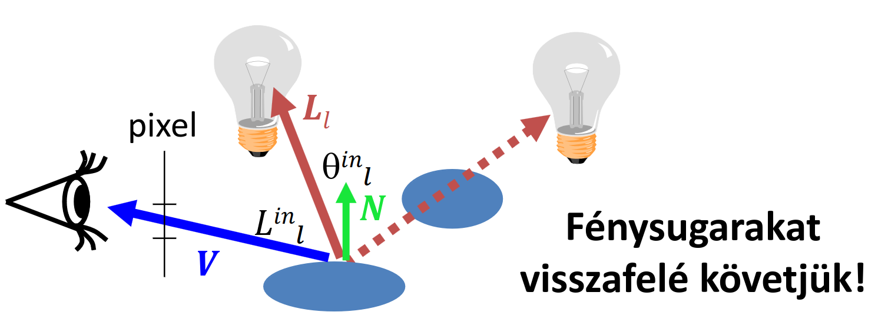
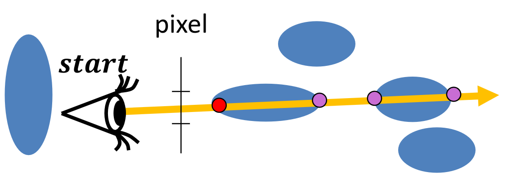
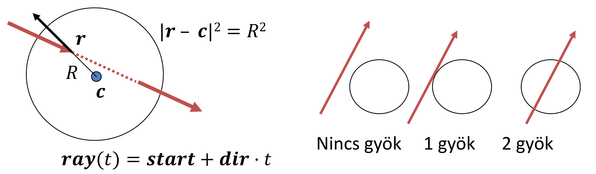
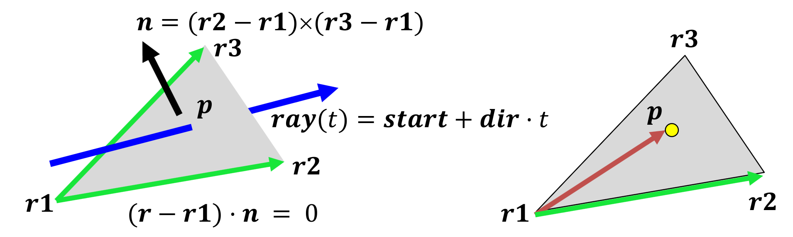
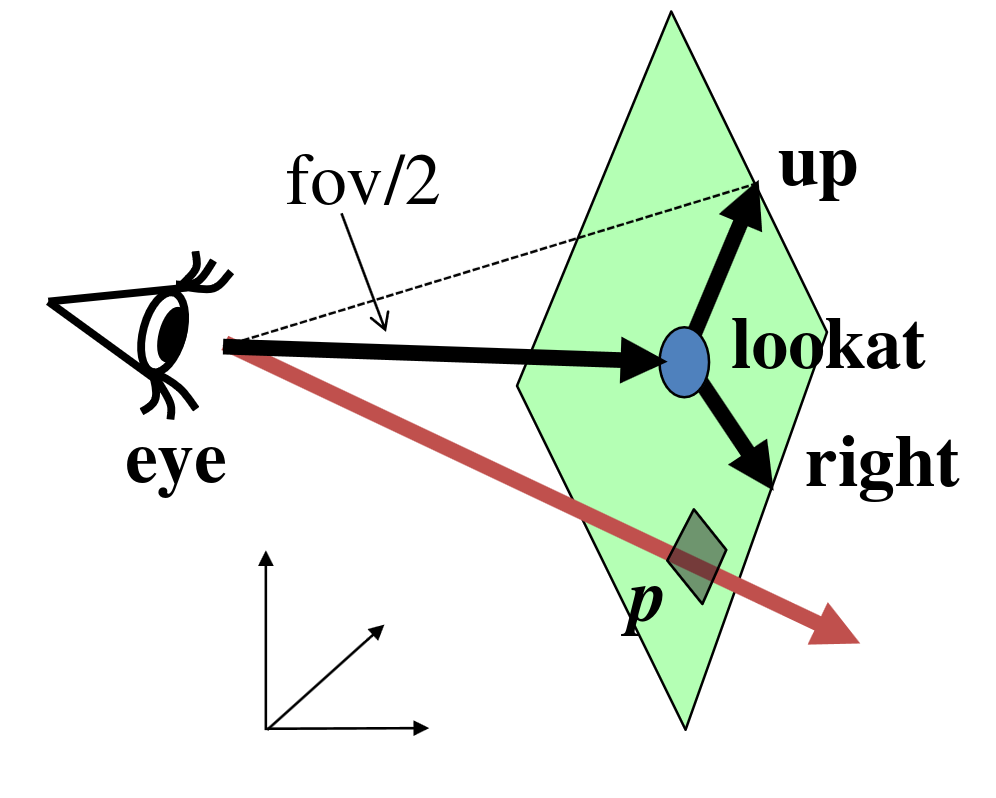
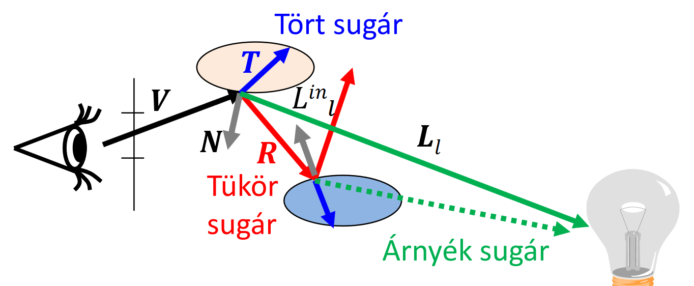

<!-- merengtél már egy olyan világon, ahol minden pontosan olyan, mint a milyénkben, azt leszámítva, hogy nem létezel? -->

<!--

"gatyázásnak vége"

a pixel radianciáját kell jól beállítanunk, h élethű dolgokat lássunk. lokális illumináció, rücskös felületek, absztrakt fényforrásokkal dolgozunk. igazából visszafelé követjük a fogalmat, mert nem a szemünkből jön ki a fény, hanem abba megy be. ha a fényből mennénk, akkor nagyon sok fölösleges számítást csinálnánk, de ha szemből indulunk, akkor sokkal több lesz valid.

lambert cos törvényen alapuló modelen kívül van még más modell is (vastag pont skalár szorzat) H_l halfway vektor.

ki kell számolni a képletet (minden hullámhosszra külön külön, egy vec3/spektrumba bele lehet rakni függetlenül őket). itt a szemből kijövő egyenes (sugár) mentén keressük az objektumokat és azok pontjait, és a normálvektorokból meg ilyenekből összeáll a spektrum

láthatósági feladat -> látott pontban a képletet kiszámolni -> pixelenként eldönteni hogy mi a sugársűrűség

a képlettel az a bibi, hogy a fényforrás direkt megvilágítását nézi csak, szóval minden pont amit közvetlenül nem világít meg fény az fekete lenne. ez nem realisztikus. helyes megoldás az indirekt világítás volna, csak az bonyi, szóval bevezetünk egy ambiens tagot, feltételezzük h a tér minden pontjában minden irányban van egy alapvető konstans "ambiens" világítás. ez picit segít, de pontatlan

<kitérő>
egyszerű ambiens modelt használunk majd, de ennél vannak szofisztikáltabbak. mi feltételezzük h minden pont ugyan olyan anyagú, de lehetne úgy is, h az "égboltra" kiintegráljuk a képletünk, és akkor kapunk egy pontosabb ambiens fény képletet. függeni fog a visszaverődés erőszsége a felületi normális és nőzéirány bezárt szögétől.

lehetne pl környezeti árnyékolást figyelembe venni: egy lyukban sötét van, de egy kiemelkedő részben világos. ehhez csak a pont egy szűk környezetét kell feldolgozni.
</kitérő>

láthatósági feladat: a fény egyenes vonalú pályán halad, szóval aki rajta van az egyenesen, csak annak van esélye látszódni. viszont egy félegyenesre (sugárra) szűkítjük, mert ami mögöttünk van, azt nem látjuk. a legközelebbi objektum látszik valójában ilyenkor, ahol $t$ pozitív és minimális. a programban a bemenet (ray) és a kimenet (hit) is egy-egy osztály. fontos h a `firstIntersect`-ben ellenőrizzük, hogy a felület normálvektora olyan legyen, ami felénk néz (ahonnan eléri a ray a felületet).
döglött ló a szomséd utcában: `intersect` fgv nem triviális. minden objektumra végre kell tudni ezt hajtani, de eltérő minden képletre, szóval minden objektumnak meg kell valósítani az "intersectable" interfacet/le kell származnia belőle.

pl: gömb intersect: levezetés a dián, de berakjuk a "ray" egyenletet az "r" helyére a képletben, alakítgatjuk, kapunk t-ben egy másodfokút, megpróbáljuk megoldani. ha 0 gyök akkor nem metszi, 1 gyök éppen érinti, 2 gyök esetén szeli a gömböt. csak pozitív gyökök kellenek, mert a neg a szem mögött van. a két gyök közül a kisebb abs() értékű kell, az lesz közelebb. kellene a normálvektor is, de gömböknél ez mindig a sugár, szóval itt pont jó minden

általában az implicit felületek (mint pl gömb) esetén a [dián lévő cuccok] a jellemzők.
kvadratikus felületek azért jók, mert a metszéspont számítás másodfokúra vezet vissza. itt a normálvektor ugyan úgy gradienssel számoljuk. (itt kb mindenhol kihasználjuk h Q szimmterikus) (trivia: Q mtx sajátértékeinek előjelei meghatározzák h milyen féle alakzat)

háromszögekre hogyan működik? két módszert tárgyalunk
    - meghatározzuk a hszög síkjának és a sugárnak a metszéspontját. utána ez a metszéspont a hárömszögön belül van-e?
        - első lépéshez egyszerű síkmetszés, ahol a normálvektort vekt. szorz.-al állítjuk elő
        - második lépéshez megnézzük h a pont az összes oldal "jó oldalán van-e"
            - ez úgy zajlik, h vektoriálisan szorozzuk az $r2-r1$, $p-r1$ vektorokat, és megnézzük h merre mutat a vektor
                (mivel vekt szorzásban van sin, és az $r2-r1$, $p-r1$ által bezárt szögek pont úgy alakulnak, h sin görbe)
    
    - baricentrikus koordinátákban 
        - a metszéspontot előállítjuk úgy, 4 skaláregyenlet és 4 ismeretlen => lineáris, megoldjuk, és megvan a metszéspont.
            - ez automatikusan benne lesz, mert a háromszög pontjainak a kombinációjaiból állítottuk elő
        - t előjeléből megállapítjuk h akkor előttünk v mögöttünk van-e

ha már háromszögek megvannak, akkor minden más komplex felület közelíthető ezekkel. ez egyszerűbb programozást és hatékonyabb lefutást eredményez

sugárkövetés: render
minden pixelen végigmegy,és meghatározza a belé érkező sugárat és irányát. itt meghatározzuk a ray alapján a sugársűrűséget, és az alapján beírjuk a színt a rasztertárba

kell egy kamera osztályunk.
 getray: lookat pont, right vec és up vec. ez a három cucc meghatározza az ablak síkját. ekkora ha tekintünk egy fizikai pixelt, akkor a lookat + right vec + up vec lineáris kombinációjaként kifejezhető. (+0.5 azért kell, h a pixeleknek ne a bal alsó sarkát, hanem a közepét vegyük)

trace: megfogjuk a hit-et, utána minden fényforrásra kiszámoljuk h egyáltalán meg tudja-e világítani a pontot. ehhez is a firstintersectet használunk, ehhez felállítunk egy árnyéksugarat (nem pont a felület pontjából, hanem egy picit eltávolodunk tőle, hogy az árnyéksugár t=0-ban és környezetében numerikusan stabil legyen). ha ez az árnyéksugár nem lát senkit (a pont és fény között), akkor a fény rálát a pontra, és kiszámoljuk a radianciát, és hozzáadjuk egy accumulator-ba, amit eleve az ambiens fénnyel inicializáltunk. alias "directLight()" fgv.


eddig rücskök, de ha vannak tükrök, akkor rekurzív sugárkövetés kell. ekkor rücskökre az előző képletet használjuk, de ha viszont sima felület, akkor az elméleti visszaverődés irányából jövő sugársűrűséget számoljuk, és fresnellel megkapjuk h mennyi megy a szemünkbe, ha pedig törő, akkor az 1-fresnel valószínűséggel súlyozzuk.

a tükör irányból érkező és törés irányú fényekek előállításához meg rekurzívan alkalmazzuk ugyan ezt a módszert.

a rekurziót korlátozni kell, ami annyira nem rossz, mert a fersnel úgyis egy valószínűség, szóval ennek a sokadik hatványainál már elhanyagolhatóan pici a hiba

"most is majdnem 90 percet elszófostam egy megoldásról"

amiket tárgyaltunk eléggé lassúak, cpu-n pl 2 sec / frame, gpu-n már kb 10-20 fps (fragment shader), de használhattunk volna jobb algoritmusokat is (objektum vezérelt megközelítés, nem pixelenként csináljuk a dolgokat)

-->

# Sugárkövetés

> A dolog lényege, hogy egy 3D világ illúziójának képét szeretnénk a képernyőnkök látni, ezért kiszámoljuk, hogy bizonyos pixelekre a fény milyen úton jut el.

## Lokális illumináció
Csak absztrakt fényforrásokatat veszünk figyelembe, azokat is csak ha direkt módon világítják meg a testeket.



$L(V) \approx \sum_l {L^\text{in}}_l \cdot f_r(L_l, N, V) \cdot \cos^+ {\theta^\text{in}}_l
\\
\qquad~~ = \sum_l {L^\text{in}}_l \cdot \{ k_d \cdot (L_l \cdot N)^+ + k_s \cdot \big((H_l \cdot N)^+\big)^\text{shine} \}$

## Ambiens tag
> Lokális illuminációnál azok a helyek, amiket semmilyen fény nem világít meg direktben, teljesen feketék lesznek. A való életben ez nem így van (golbális illumináció). Ennek egy olcsó megoldása, hogy mindent kivilágosítunk egy kicsit. Ez az ambiens fény.

Az ambiens tagot minden visszakövetett sugárhoz hozzáadjuk (csak egyszer!).

$L(V) \approx \sum_l {L^\text{in}}_l \cdot f_r(L_l, N, V) \cdot \cos^+ {\theta^\text{in}}_l + \boxed{k_a \cdot L_a}$

## Láthatóság
Adott pixelből elindítjuk a sugarat, meg kell keresnünk a legközelebbi objektumot, amibe a sugarunk beleütközik.


```cpp
Hit firstIntersect(Ray ray) {
    Hit bestHit;
    for(Intersectable * obj : objects) {
        Hit hit = obj->intersect(ray); // hit.t < 0 ha nincs metszés
        if(hit.t > 0 && (bestHit.t < 0 || hit.t < bestHit.t))
            bestHit = hit;
    }
    if (dot(ray.dir, bestHit.normal) > 0) 
        bestHit.normal *= -1; // mindenképpen felénk nézzen a normális
    return bestHit;
}
```

## Metszéspontszámítás
### Gömb


- Felület pontjai azon $r$ pontok, ahol $|r-c|^2 = R^2$
- Metszéspont:
Kiszámoljuk a másodfokú egyenletet, ahol $t$ az ismeretlen.
Ha két gyökünk van, a közelebbit tekintjük.
$|\text{ray}(t) - c|^2 = R^2 \\ \text{Megoldás: . . .}$
- Normálvektor: $N = (\text{ray}(t)-c)/R$


### Implicit felületek
- A felület pontjai azon $r$ pontok, ahol $f(r) = 0$
- Sugár: $\text{ray}(t) = s + d \cdot t$
- Legyen $t^*$ azon paraméter, ahol $\text{ray}(t^*) = r^*$ pontban a sugár metszi a felületet, azaz $f(r^*) = 0$
- Tehát a metszéspont: $r^*$
- Normálvektor: $N = \text{grad}f(r^*)$

### Kvadratikus felületek:
- A felület pontjai: $f(r) = \begin{bmatrix} r & 1 \end{bmatrix} \cdot Q \cdot \begin{bmatrix}r \\ 1\end{bmatrix} = 0$ 
*(Q szimmetrikus)*
- Metszésparaméter és metszéspont: $t^*$ és $r^*$ hasonlóképpen.
- Normálvektor: $N = \text{grad}f(r^*) = Q \cdot \begin{bmatrix} r^* \\ 1 \end{bmatrix}$ *első három koordinátája*


### Háromszögek, poligonok


- Pontjai:

    > Először megkeressük, hogy a háromszög síkját hol metszi, majd ellenőrizzük, hogy az adott pont benne van-e a háromszögben.

    1. Síkmetszés: 

        $(\text{ray}(t) - r1) \cdot n = 0 \qquad (t>0)$

        $$\boxed{t = \cfrac{(r1 - \text{start}) \cdot n}{\text{dir} \cdot n}}$$
    
    2. Belül van-e:

        $((r2  r1) \times (\bold{p}  r1)) \cdot n > 0$

        $((r3  r2) \times (\bold{p}  r2)) \cdot n > 0$

        $((r1  r3) \times (\bold{p}  r3)) \cdot n > 0$

- Normálvektor: $n$ *(vagy shaderrel állítjuk)*

## Render
<!-- igen csak azért is pájton -->
```py
for p in pixels:
    ray = getray(eye, pixel)
    color = trace(ray)
    write_pixel(p, color)
```

### `getray`

<!-- i will cry about it -->
```js
p = lookat + a * right + b * up // a, b in [-1, 1] (normalizált eszköz koordináták)
// ray:
start = eye
dir = p - eye 
```

## Rekurzív sugárkövetés


> Eddig csak a direkt megvilágítást vizsgáltuk, most belevesszük a tükröződést, fénytörést is.

$L(V) = \begin{cases} 
k_a \cdot L_a + \sum_l {L^\text{in}}_l \cdot \{ k_d \cdot (L_l \cdot N)^+ + k_s \cdot \big((H_l \cdot N)^+\big)^\text{shine} \} \\
% yeah
\underbrace{F(V \cdot N)}_{\text{Fresnel}} \cdot \underbrace{L^\text{in}(R)}_{\text{Tükör irányból érkező fény}} + \underbrace{\big(1 - F(V \cdot N)\big)}_{\text{1 - Fresnel}} \cdot \underbrace{L^\text{in}(T)}_{\text{Törési irányból érkező fény}}
\end{cases}$


# Kvíz

> 1\. Az $f(r)=[r, 1] \cdot Q \cdot [r, 1]^T=0$ implicit egyenletű kvadratikus felület és a $ray(t)=s + d \cdot t$ egyenletű sugár metszéspontjához a következő másodfokú egyenletet kell megoldani: $at^2+bt+c=0$.
Mi lesz a $b$?

*Megoldás:*
Széttrancsírozzuk...

$
0 = f(r) = [r, 1] \cdot Q \cdot [r, 1]^T \newline
0 = [s + d \cdot t, 1] \cdot Q \cdot [s + d \cdot t, 1]^T \newline
0 = ([s, 1] + t[d, 0]) \cdot Q \cdot ([s, 1] + t[d, 0])^T \newline
0 = [s,1]Q[s,1]^T + t([s,1]Q[d,0]^T) + t([d,0]Q[s,1]^T) + t^2([d,0]Q[d,0]^T)
$

Ahol 

$b = [s,1]Q[d,0]^T + [d,0]Q[s,1]^T$

És mivel $Q$ szimmetrikus *(nagyon remélem hogy ezért mert tényleg nem értem hogy másképp jön ki xdd)*

$b = 2[s,1]Q[d,0]^T = 2[d,0]Q[s,1]^T$


---
> 2\. Egy kvadratikus felület mátrixa az alábbi:
0, 0, 0, 1
0, 0, 0, 1
0, 0, 0, 1
1, 1, 1, -2
A felületet sugárkövetéssel jelenítjük meg, a szem az origóban van, a sugár irányvektora az (1, 1, 1).
Mennyi a kvadratikus felület normálvektorában az x és z komponensek aránya (n.x/n.z) ott, ahol a sugár először metszi a kvadratikus felületet.

*Megoldás (habár triviális):*
A sugár: $\text{ray}(t) = s + d \cdot t = (0, 0, 0) + (1, 1, 1) \cdot t = (t, t, t)$

A metszéspont:
$
0 = (t, t, t, 1) 
\begin{pmatrix} 
    0 & 0 & 0 & 1 \\
    0 & 0 & 0 & 1 \\
    0 & 0 & 0 & 1 \\
    1 & 1 & 1 & -2 \\
\end{pmatrix}
(t, t, t, 1)^T
\\
...\\
0 = 6t - 2\\
t = 1/3\\
r^* = (\frac 1 3,\frac 1 3,\frac 1 3)
$

Innen a normálvektor csak hab a tortán:
$N = \text{grad}f(r^*) = Q[r^*, 1]^T = (1, 1, 1, -1)$
Tehát az arányuk bosszantóan de kereken $1$.

---
> 3\. A sugár kezdőpontja (0, 0, 0), irányvektora (2,0,0). Hol metszi ez a sugár a (8,0,0) középpontú, 8 sugarú gömböt, pozitív sugárparaméterrel? Válaszként a metszéspont x koordinátáját várjuk.

*Megoldás:*
Elképzeljük leli szemeink előtt hogy a sugarunk a gömböt a $(0, 0, 0)$ és a $(16, 0, 0)$ pontokban metszi. Az első esetben a sugárparaméter $0$ a feladat viszont pozitívat kér, tehát a válasz $16$.

---
> 4\. A sugár irányvektora (9, 0, 0) és egy (1, 1, 1) középpontú gömb (4, 5, 1) pontját találja el. Milyen irányban halad tovább, ha a gömb optikailag sima, törő, és a gömb anyagának relatív törésmutatója 1.0? Válaszként az egység hosszú irányvektor x komponensét várjuk.

*Megoldás:*
$1$.
Mivel a gömb anyagának relatív törésmutatója 1 és a gömb optikailag törő, a törésirány nem változik, tehát a sugár nem hajlik meg. Vagy nem tudom.

---
> 5\. Egy háromszög három csúcsa (8,3,9), (8,3,1), (8,4,2). Hol metszi a (0,0,0) kezdőpontú (1,0,0) irányvektorú sugár a háromszög síkját? A metszéspont x koordinátáját várjuk válaszként.

*Megoldás:*
Ha bárhol is metszük a háromszöget akkor annak $x$ koordinátája biztosan 8, a többit nem kérdezi.
Ha szeretnéd az idődet pazarolni akkor síkmetszés + megnézed benne vagy-e.

---
> 6\. A sugár irányvektora (9, 0, 0) és egy (1, 1, 1) középpontú gömb (4, 5, 1) pontját találja el. Milyen irányban halad tovább, ha a gömb optikailag sima, tükröző? Válaszként az egység hosszú irányvektor x komponensét várjuk.

*Megoldás:*

A gömb sugara: 

$R = |(4, 5, 1) - (1, 1, 1)| = 5$

A gömb normálvektora:

$N = (\text{ray}(t)-c)/R = ((4, 5, 1) - (1, 1, 1))/5 = (0.6, 0.8, 0)$

Már bizonyára a könyökünkön csöpög, hogy

$n = \cfrac{\sin \theta ^\text{in}}{\sin \theta}$

És mint a jógyerekek normalizáltuk a sugárirányt:

$v = (1, 0, 0)$ *(vagy $d$)*

Kiszámoljuk a visszavert sugarat:

$\cos \alpha = -v \cdot N = -0.6$

$R = v + 2N \cos \alpha$ *(az egyszerűség kedvéért ez egy másik $R$, nem a sugár)*

$R = (1, 0, 0) + 2(0.6, 0.8, 0) \cdot (-0.6) = (0.28, -0.96)$

---
> 7\. Az alábbi osztály egy origó középpontú és axes.x, axes.y, axes.z fél főtengelyhosszú ellipszoidot valósít meg, amelyre a sugár metszéspontszámítást implementáltuk.  A vec3-ra az osztást GLSL stílusban, azaz koordinátánként függetlenül valósítottuk meg. Kérjük a hibás sorok sorszámát!

```cpp
class Ellipsoid : public Intersectable {
   vec3 axes;
public:
    Hit intersect(const Ray& ray) {
        Hit hit;

1)      float a = dot(ray.dir/axes, ray.dir/axes);
2)      float b = dot(ray.start/axes, ray.dir/axes) * 2;
3)      float c = dot(ray.start/axes, ray.start/axes) ;
4)      float discr = b * b - 4 * a * c;
5)      if (discr < 0) return hit; else discr = sqrtf(discr);
6)      float t1 = (-b + discr)/2/a, t2 = (-b - discr)/2/a;
7)      if (t1 <= 0) return hit; // t1 >= t2 for sure
8)      hit.t = (t2 > 0) ? t2 : t1;
9)      hit.position = ray.start + ray.dir * hit.t;
10)     hit.normal = (hit.position - center)/radius;
        hit.material = material;
        return hit;
    }
};
```
*Megoldás:*
10\. sor, normálist így **csak** a gömbnél számolhatunk.

---
> 8\. Egy $f(r) = r \cdot r - a \cdot r$ implicit egyenletű felületet, ahol $a = (3, 4, 0)$, az $r = (3, 4, 0) $ pontban talált el egy $(9,7,8)$ kezdőpontú sugár . Mi a felület normálvektorában az $x$ és $y$ komponensek aránya a metszéspontban?

*Egoldás:*
Kisujjból tudunk gradienst számolni már:

$N = \text{grad}f(r) = (2x-3, 2y-4, 2z)$

Ami a $(3, 4, 0)$ pontban:

$N = (3, 4, 0)$

És így nagyon szépen kijön, hogy $0.75$

:cake:

[Előző](./7.md)

[Következő](./9.md)