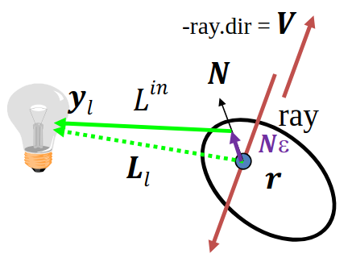
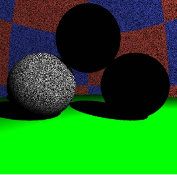
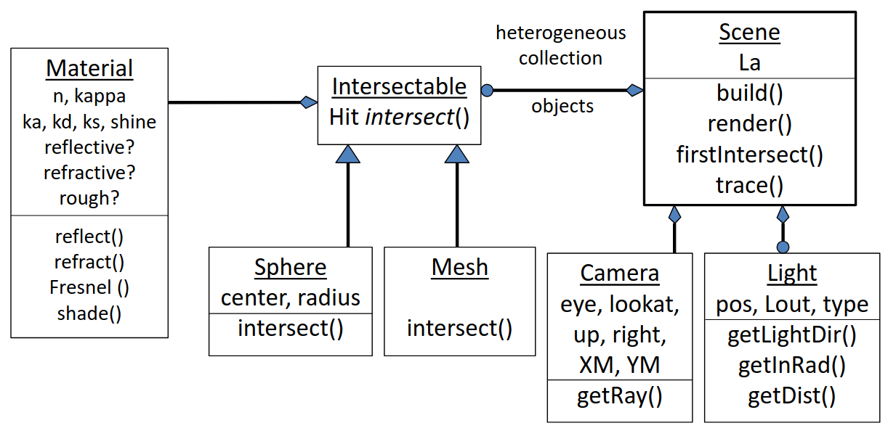

# Sugárkövetés

!!! quote Idézet
    $\text{"A gatyázásnak vége!"}$
    $\hspace{10em} \text{- Szirmay-Kalos László, előadás elején}$

Ahhoz, hogy élethű dolgokat lássunk, a pixelek radianciáját kell jól beállítanunk. Az előző fejezetben tárgyaltuk ehhez kapcsolódóan a lokális illuminációt, rücskös felületek, absztrakt fényforrásokat, stb. Mi viszont most egy pixelvezérelt elvet fogunk követni, és visszafelé fogjuk ezeket a fizikai folyamatokat szimulálni: nem szimulálunk le minden egy fotont, melyek elhagyják az absztrakt fényforrásainkat, hiszen ezeknek a nagy része nem jutna el a kameráig, nagyon sok fölösleges számítást végeznénk. Ehelyett a kamerából fogunk kilőni _sugarakat_, és ezeknek a sugaraknak az útját _követve_ el tudjuk dönteni, hogy azok melyik felületbe ütköznek először. Ezután a felület adott pontjában radianciát számolunk, és utána megyünk a következő pixelre.

## Lokális illumináció

Vizsgáljuk meg, hogy ha már a pixelből kilőtt sugarunk ütközött egy felülettel, akkor hogyan állapítsuk meg a radianciát.

A lokális illumináció esetén csak absztrakt fényforrásokkal dolgozunk. Két féle absztrakt fényforrás van:

- irányforrás esetén az adott pontban a megvilágítás konstans,
- pontforrás esetén a megvilágítás a távolgás négyzetével csökken,

illetve mindkét esetben lehetséges, hogy a pont és a fényforrás között más objektumok is vannak. Ezt úgy fogjuk vizsgálni, hogy további sugarakat lövünk ki a felületünk pontjából a fényforrások felé.


A sugársűrűség képletét az előző fejezetben tárgyaltuk:

$$
L(V) \approx \sum_l L^{\text{in}}_l * f_r(L_l, N, V) \cdot \cos^{+}(\theta^{\text{in}}_l)
$$

ahol az $l$ subscript annyit jelent, hogy csak lokális illuminációval dolgozunk. Ezt a képletet minden fényforrásra kiszámolva (hullámhosszanként külön-külön, azaz `vec3`-akkal dolgozunk majd, RGB) megkapjuk a szemirányú lokális illuminációt.

Mi a Phong-Blinn BRDF modellt alkamaztuk eddig, helyettesítsük be ide:

$$
L(V) \approx \sum_l L^{\text{in}}_l * (k_d \cdot (L_l \bullet N)^{+} + k_s \cdot ((H_l \bullet N)^{+})^{\text{shine}})
$$

ahol $k_d \cdot (L_l \cdot N)^{+}$ a diffúz tag, $k_d$ diffúz visszaverődési tényezővel, és a $k_s \cdot ((H_l \cdot N)^{+})^{\text{shine}}$ pedig a spekuláris tag, ahol a $H_l$ a halfway vektor. További a tanár úr jelölése szerint:

- a $*$ a spektrumok közötti szorzás (azaz `vec3` szorzás, tényezőnként külön-külön)
- a $\cdot$ egy vektor skalárral való szorzása, pl. $3 \cdot \underline{v}$
- a $\bullet$ pedig két vektor skaláris szorzása. Ezzel számolunk sok helyen $\cos$-t, ahol az előző fejezetbeli képletben azok szerepeltek.

### Ambiens világítás

Ha itt meg is állunk, akkor egy eléggé hiányos modellt kapnánk: a fényforrás direkt megvilágítását nézzük csak, szóval minden pont amit közvetlenül nem világít meg fény (vagy nem rücskös anyagú) az fekete lenne. Ez nem realisztikus. A "korrekt" megoldás az indirekt világítás implementálása volna, de az bonyolult, szóval bevezetünk egy _ambiens tagot_. Feltételezzük h a tér minden pontjában minden irányban van egy alapvető konstans "ambiens" világítás. Ez picit segít, mert így minden pontot meg fogja világítani ez az ambiens világítás, szóval nem lesznek teljesen fekete pontok, de fizikailag ez pontatlan:

$$
L(V) \approx \sum_l L^{\text{in}}_l * f_r(L_l, N, V) + \boxed{k_a * L_a}
$$

ahol $k_a$ az ambiens visszaverődési tényező, $L_a$ pedig maga a fényforrás, egy spektrum.

??? example Kitérő: más modellek
    Egyszerű ambiens modelt használunk, de ennél vannak szofisztikáltabbak. Mi feltételezzük, hogy minden pont ugyan olyan anyagú az ambiens világítás szempontjából, de lehetne úgy is, hogy az "égboltra" kiintegráljuk a képletünket, és akkor kapunk egy pontosabb ambiens fény képletet, ahol függeni fog a visszaverődés erőssége a felületi normális és nézőirány bezárt szögétől.

    Lehetne még pl. környezeti árnyékolást figyelembe venni: egy lyukban sötét van, de egy kiemelkedő részben világos. Ehhez csak a pont egy szűk környezetét kell feldolgozni.

### Láthatóság

Vizsgáljuk meg a sugarakat amiket kilövünk: hogyan tudják, amikor ütköztek egy objektummal?

A virtuális világunkban a képernyőt reprezentáló téglalap is pixelekre van osztva, tehát a szemből ezeknek a pixeleknek a középpontjából lövünk sugarakat. A fény egyenes vonalú pályán halad, szóval ha a szemből induló, pixel középponton áthaladó félegyenesen rajta van az objektumunk, akkor van esélye látszódni. Nekünk persze a legközelebbi objektum kell, ami amögött van, azt nem látjuk, hiszen takarja az objektum (most tekintsünk el átlátszóságtól). Adjuk meg a sugár osztályt, és a félegyenes paraméteres egyenletét, ami mentén halad:

$$
\text{ray}(t) = \text{start} + \text{dir} \cdot t, \quad t \gt 0
$$

ahol:

```cpp
struct Ray {
    vec3 start;
    vec3 dir; // irány, egységvektor
    bool out; // átlátszó objektumok esetén belül vagy kívül vagyunk
};

struct Hit {
    float t; // félegyenes paramétere
    vec3 position; // metszéspont helye világkoordinátákban
    vec3 normal; // metszett felület normálja a metszéspontban (árnyaláshoz)
    Material* material; // diffúz, spekuláris, shine, ambiens tag
    Hit() { t = -1; } // ha nem találtunk el semmit, akkor t negatív
};
```


Ha vesszük a sugár egyenletét, a felületeink egyenleteit, és megoldjuk az általuk alkotott egyenletrendszert, akkor kapjuk meg a metszéspontokat. Ezek után nekünk ki kell választani azt a metszéspontot, ami valóban látszik, azaz ahol $t$ pozitív, és minimális:

```cpp
Hit firstIntersect(Ray ray) {
    Hit bestHit;

    for(Intersectable * obj : objects) {
        Hit hit = obj->intersect(ray); // hit.t < 0 ha nincs metszés
        if(hit.t > 0 && (bestHit.t < 0 || hit.t < bestHit.t))
            bestHit = hit;
    }

    if (dot(ray.dir, bestHit.normal) > 0) bestHit.normal *= -1;

    return bestHit;
}
```

azaz minden objektumunknak meg kell valósítania az `Intersectable` interface-t, és azon belül az `intersect()` függvény össze tudja hasonlítani a sugár egyenletét (amit a `ray` változóban kap meg) a saját egyenletével, és visszaad egy `Hit` típust, amelyben már az esetleges metszés adatai benne vannak (több metszéspont esetén mindig a legkisebb $t$-jűt kell vissza adnia). Az `if (dot(ray.dir, bestHit.normal) > 0) bestHit.normal *= -1;` sor azért felel, hogy a felület normálja "kívülre mutasson", azaz abba a féltér, ahonnan a sugarunk érkezett, hiszen ezt korábban mindig feltételeztük.

#### Gömb intersect (példa)

Nézzünk egy példát az `Intersectable` interface `intersect` függvényének megvalósítására gömbök esetén. A gömb implicit egyenlete:

$$
|r-c|^2 = R^2
$$

ahol $c$ a középpont, $R$ a sugár. Az $r$ helyére fog bekerülni a programunkban a `ray`, azaz a félegyenes egyenlete:

$$
\begin{align*}
|r-c|^2 = |\text{ray}(t) - c|^2 &= (\text{ray}(t) - c) \cdot (\text{ray}(t) - c) = R^2 \\
&= (\text{start} + \text{dir} \cdot t - c) \cdot (\text{start} + \text{dir} \cdot t - c) = R^2 \\
&= (\text{dir} \cdot \text{dir}) \cdot t^2 + 2 ((\text{start} - c) \cdot \text{dir}) \cdot t + (\text{start} - c) \cdot (\text{start} - c) - R^2 = 0
\end{align*}
$$

azaz kapunk egy másodfokú egyenletet $t$-ben. A megoldóképlettel meg tudjuk határozni a gyökö(ke)t.


A geometriai értelmezés az, hogy ha nincs gyök, akkor a sugarunk nem metszi a gömböt, ha egy gyök van, akkor éppen érintője a gömbnek, ha pedig kettő, akkor szeli a gömböt. Nekünk csak pozitív gyökök kellenek, és azok közül is csak a legkisebb, ezt pár összehasonlítással a kódban meg tudjuk állapítani.

Végezetül kell ebben a pontban a felület normálvektora is (normalizálva), de gömbök esetén ez egyszerűen a gömb sugara abba a pontba:

$$
N = \frac{(\text{ray}(t) - c)}{R}
$$

##### Implementáció (gömb példa)

```cpp
class Sphere : public Intersectable {
    vec3 center;
    float radius;

   public:
    Hit intersect(const Ray& ray) {
        // default ctor, we assume no hit
        Hit hit;

        vec3 dist = ray.start - center;

        float a = dot(ray.dir, ray.dir);
        float b = dot(dist, ray.dir) * 2;
        float c = dot(dist, dist) - radius * radius;

        float discriminant = b * b - 4 * a * c;

        if (discriminant < 0)
            return hit; // return default ctor hit 
        else 
            discriminant = sqrtf(discriminant);

        // two solutions
        float t1 = (-b + discriminant)/(2 * a);
        float t2 = (-b - discriminant)/(2 * a);

        // because we know that the discriminant is positive, t1 >= t2.
        // if t1 is nonpositive, then we know both t1 and t2 have to be
        // nonpositive so we can return a default ctor hit
        if (t1 <= 0) return hit;

        // if t1 is positive, we choose the smaller positive solution
        hit.t = (t2 > 0) ? t2 : t1;

        // initalize the hit
        hit.position = ray.start + ray.dir * hit.t;
        hit.normal = (hit.position - center)/radius; // Only for sphere!
        hit.material = material;

        return hit;
    }
};
```

Ez a gömbös példa az összes implicit felületre alkalmazható, pár változtatással (az egyenletrendszer megoldása, a felület normáljához gradienst kell számolni). Egy konkrétabb példa a kvadratikus felületek családja:

$$
f(\bm{r}) = [\bm{r}, 1] \cdot \bm{Q} \cdot [\bm{r}, 1]^T = 0
$$

ahol $\bm{r}$ egy három elemű helyvektor, $\bm{Q}$ pedig egy $4 \times 4$-es szimmetrikus mátrix. Ilyen alakban fel lehet írni gömböt, ellipszoidot, paraboloidot, hiperboloidot, stb.

Ekkor a metszéspont számítás mindig egy másodfokú egyenletre vezet vissza, amihez a megoldóképletet tudjuk használni. A felületi gradiens számításához is felhasználhatjuk, hogy $\bm{Q}$ egy szimmetrikus mátrix:

$$
\nabla f(\bm{r}^{*}) = \bm{Q} \cdot [\bm{r}^{*}, 1]^T \text{-nek az első három koordinátája}
$$

ahol $\bm{r}^{*}$ a metszéspont helyvektora.

??? example Trivia
    Itt $\bm{Q}$ mátrix sajátértékeinek az előjelei meghatározzák, hogy milyen féle alakzatot reprezentál.

#### Háromszög intersect

Mivel úgyis minden komplexebb felületet háromszögekkel közelítünk (az egyszerűbb programozás és hatékonyabb lefutás miatt), ezért nézzük meg, hogy háromszögek esetén hogyan kell számolni a metszést. Két módszert tárgyalunk.

##### Descartes koordinátákban

A fő ötletünk az, hogy először meghatározzuk a háromszög síkjának, és a sugarunknak a metszéspontját. Ha ez a háromszögön belül van, akkor jó metszéspont, ha nem, akkor eldobjuk.

Először a háromszög síkja kell. A háromszög három csúcsa adott, tehát ezekből kell definiálnunk a síkot. Ehhez kell nekünk normálvektor, amihez a háromszög oldalai által alkotott vektorokra kell merőleges vektort alkotunk.


Ehhez keresztszorzunk:

$$
n = (r_2 - r_1) \times (r_3 - r_1)
$$

így a síkunk egyenlete:

$$
(r - r_1) \cdot n = 0
$$

Helyettesítsük be a félegyenesünk egyenletét:

$$
(\text{ray}(t) - r_1) \cdot n = 0, \quad t \gt 0
$$

Ezt az egyenletet megoldva $t$-re:

$$
\boxed{t = \frac{(r_1 - \text{start}) \cdot n}{\text{dir} \cdot n}}
$$

ezt a $t$ behelyettesítve a sugár egyenletébe ($\text{ray}(t) = \text{start} + \text{dir} \cdot t$) kapunk egy $p$ pontot.

Most vizsgáljuk meg, hogy a kapott $p$ pontunk az a háromszögön belül van-e. Ehhez az lesz a stratégiánk, hogy megnézzük, hogy a $p$ pont a háromszög oldalegyeneseinek a "jó oldalán" van-e. Alkotunk két pontból egy irányított egyeneset, és megnézzük, hogy a $p$ pont ugyan azon az oldalon van-e mint a harmadik csúcs. Ezt mindhárom oldalegyenesre megismételve megtudhatjuk, hogy $p$ a háromszögön belül van-e (v.ö. a fenti ábrán a jobb háromszöggel).

De hogyan ellenőrizzük azt, hogy $p$ ugyan azon az oldalán van-e egy oldalegyenesnek, mint a harmadik csúcs? Vektoriális szorzást használva. Képezzük az

$$
((r_2 - r_1) \times (p - r_1))
$$

vektoriális szorzatot. Emlékezzünk, hogy

$$
n = ((r_2 - r_1) \times (r_3 - r_1))
$$

azaz ugyan az, csak $p$ helyett $r_3$ van. Tehát ha ez a két vektor ugyan abba az irányba mutatnak, akkor $p$ és $r_3$ az $r_1, r_2$ csúcsok által alkotott egyenesnek ugyan azon az oldalán van. Képezzük tehát skaláris szorzatukat, és vizsgáljuk annak előjelét:

$$
((r_2 - r_1) \times (p - r_1)) \cdot n \gt 0
$$

Ezt a maradék két oldalra is meg kell ismételnünk:

$$
((r_3 - r_2) \times (p - r_2)) \cdot n \gt 0
((r_1 - r_3) \times (p - r_3)) \cdot n \gt 0
$$

Tehát ha mindhárom feltétel teljesül, akkor $p$ a háromszögön belül van, tehát a sugarunk eltalálta a háromszöget.

##### Baricentrikus koordinátákban

Egy háromszög a három csúcsának a konvex kombinációja. Ez alatt azt értjük, hogy ha a háromszög $r_1, r_2, r_3$ csúcsaira elhelyezünk rendre $\alpha, \beta, \gamma$ súlyokat, ahol

$$
\begin{align}
    \alpha + \beta + \gamma &= 1 \\
    \alpha, \beta, \gamma & \ge 0
\end{align}
$$

akkor a háromszög bármely belső pontja felírható:

$$
\bm{p}(\alpha, \beta, \gamma) = \alpha \cdot r_1 + \beta \cdot r_2 + \gamma \cdot r_3
$$

alakban. Behelyettesítve a sugáregyenletünket, az alábbi vektoregyenletet kapjuk:

$$
\text{start} + \text{dir} \cdot t = \alpha \cdot r_1 + \beta \cdot r_2 + \gamma \cdot r_3
$$

Itt koordinátánként van egy-egy skaláregyenletünk, és a fenti $(1)$ <!-- TODO: are there really no references in KaTeX...? --> egyenlettel együtt összesen négy egyenletünk, és négy ismeretlenünk van ($t, \alpha, \beta, \gamma$). Ezt az egyenletrendszert megoldva kapunk egy $t$-t, amiről tudjuk, hogy az általa reprezentált $p$ pont biztos a háromszögön belül lesz, hiszen az

$$
\bm{p}(\alpha, \beta, \gamma) = \alpha \cdot r_1 + \beta \cdot r_2 + \gamma \cdot r_3
$$

egyenlet amibe behelyettesítettünk csak a háromszög belső pontjait képes leírni. Viszont ellenőrizni kell, hogy a kapott $\alpha, \beta, \gamma$ értékekre teljesül-e a $(2)$ <!-- TODO: ugly reference, see above comment --> feltétel.

### Render

Ami után a láthatósági feladatot megoldottuk, nézzük meg azt az algoritmust magát, amivel követjük a sugarainkat. Pszeudokód szintjén így épül fel ez az algoritmus:

```cpp
function Render()
    for each pixel p
        Ray r = getRay( eye -> pixel p )
        color = trace(ray)
        WritePixel(p, color)
    endfor
end
```

azaz minden pixelen végigmegyünk, és meghatározzuk a belé érkező sugárat és annak irányát. Ezután meghatározzuk a `ray` alapján a sugársűrűséget (`trace` függvény), és az alapján beírjuk a színt a rasztertárba.

Ha megadjuk a `getRay` és `trace` függvények implementációját, akkor már meg tudjuk valósítani majd a sugárkövetést.

#### Implementáció (getRay)

Ehhez először is kell egy kamera osztály, amivel tudjuk reprezentálni a felhasználó szemét a virtuális világban, illetve kell egy képernyőnek megfelelő, úgynevezett kameraablak, amivel el tudjuk dönteni, hogy a felhasználó merre néz, és mit lát. Ezt a téglalapot legegyszerűbben úgy adhatjuk meg, hogy megadjuk a közepét mint pontot, és két vektort, ami a szélességét és a magasságát adja meg. A mi esetünkben ezek:

- `lookat` pont: A kameraablak középpontja
- `up` vektor: A `lookat` pontot a kameraablak tetejével összekötő vektor
- `right` vektor: A `lookat` pontot a kameraablak jobb szélével összekötő vektor

Ekkor bármely pixel kifejezhető a `lookat`, `up` és `right` lineáris kombinációjaként: ha jelenleg éppen az $(X, Y)$ koordinátájú pixelnél jár az algoritmusunk, és a monitorunk $(\text{XM}-1, \text{YM}-1)$ felbontású, akkor az jelenlegi pixelhez tartozó $p$ pont a kameraablak síkján:

$$
\begin{align*}
p &= \text{lookat} + \alpha \cdot \text{right} + \beta \cdot \text{up}, \quad \overbrace{\alpha, \beta \in [-1, 1]}^{\text{Normalizált eszköz koordináták}} \\[2ex]
&= \text{lookat} + \bigg(\frac{2(X+0.5)}{\text{XM}-1}\bigg) \cdot \text{right} + \bigg(\frac{2(Y+0.5)}{\text{YM}-1}\bigg) \cdot \text{up}
\end{align*}
$$

ahol a $+0.5$ tagra azért van szükség, hogy a pixeleknek ne a bal alsó sarkát, hanem a közepét vegyük, hiszen azon keresztül lőjük ki a sugarainkat.

Ekkor az `r` sugarunkat így tudjuk inicializálni, ha `eye` a kamera koordinátái, a `p` pedig a fenti módon kiszámított pixelünk középpontja:

```cpp
r.start = eye;
r.dir = p - eye;
```

??? example Vektorok vs. látszószög
    Szemléletesebb és egyszerűbb lenne vektorok helyett egy látszószöggel (Field Of View, fov) dolgozni, és később majd át is térünk arra, de az alapok lefektetéséhez vektorokkal dolgozunk.

#### Implementáció (trace)

A kapott `Ray`-el először is megkeressük a `firstIntersect` függvény használatával a legelső pontot amit metsz, és lekérjük az ottani `Hit`-et. Viszont a `firstIntersect` akkor is visszaad egy `Hit` objektumot ha nincsen találat (csak negatív `t`-vel), tehát ellenőriznünk kell, hogy ténylegesen egy valid metszéspontunk van. Ezután minden (absztrakt) fényforrásra el kell döntenünk, hogy az a fényforrás megvilágítja-e a pontunkat. Ehhez is sugárkövetést használunk (`firstIntersect` függvény). Felállítunk egy _árnyéksugarat_ (nem pont a felület $r$ metszéspontjából, hanem egy kicsi $N_\varepsilon$-al eltávolodunk tőle, hogy az árnyék `t=0`-ban és környezetében is numerikusan stabil legyen). Ha ez az árnyéksugár nem lát senkit (a pont és a fény között nincsen más objektum) akkor a fény rálát a pontra, és kiszámoljuk a radianciát amit az a fény biztosít. Ezt utána egy akkumulátor változóhoz hozzáadjuk, és minden más fényre eljátsszuk ugyan ezt (az akkumulátor változót az ambiens fény értékével inicializáljuk, azaz minden pontban legalább annyi radiancia biztos van). Nézzük meg a fentieket kódban:

- `La`: ambiens fény intenzitása
- `r`: a metszéspont koordinátái
- `N`: a felület normája a metszéspontban
- `ka`, `kd`, `ks`: ambiens, diffúz és spekuláris visszaverődési tényező (anyagbeli tulajdonság)
- `outRad`: a végső kimenő radiancia (akkumulátor változó)
- `N_e`: $N_\varepsilon$, ennyivel mozdulunk el `r`-től a numerikus stabilitás érdekében az `N` normálvektor irányába
- a további változók értelmezéséhez a kód alatti ábra nyújt segítséget

```cpp
vec3 trace(Ray ray) {
    Hit hit = firstIntersect(ray);

    if(hit.t < 0) return La; // nothing

    vec3 r = hit.r;
    vec3 N = hit.N;
    vec3 ka, kd, ks = hit.ka, hit.kd, hit.ks;
    float shine = hit.shine;

    // Az anyaghoz tartozó ambiens fénnyel inicializálunk
    vec3 outRad = ka * La;

    for (auto&& light_source : light_source_store) {
        Ray shadowRay(r + N_e, light_source->direction_to_light_from_r);
        Hit shadowHit = firstIntersect(shadowRay);

        // A `shadowHit.t < 0` feltétel azt állítja, hogy nincs
        // olyan objektum, ami a pontunk és a fény között lenne,
        // a `shadowHit.t > |r - y_l|` pedig azt, hogy ha mégis
        // lenne olyan objektum, akkor ez a metszéspont a fény
        // mögött van-e, hiszen ez nekünk nem baj.
        if(shadowHit.t < 0 || shadowHit.t > |r - light_source->location|)
            outRad += // radianca számolás, lásd alább
    }

    return outRad;
}
```

ahol a radianca számolásához a képlet:

$$
\text{outRad} \mathrel{+}= L^{\text{in}}_l * (k_d \cdot (L_l \bullet N)^{+} + k_s \cdot ((H_l \bullet N)^{+})^{\text{shine}})
$$



??? example Miért is kell az $N_\varepsilon$?
    
    Amikor a `shadowRay`-t elindítjuk, és metszéspontokat keresünk a `firstIntersect` függvénnyel, akkor matematikailag egy metszéspont biztos, hogy mindig lesz: a $t = 0$ esetben (azaz metsszük azt a pontot, ahonnan elindultunk). Ezt általában kidobjuk (`if(shadowHit.t < 0 || shadowHit.t > |r - y_l|)`) viszont a numerikus pontatlanságok miatt néha ez a metszéspont nem kereken $t = 0$-ban van érzékelve, hanem egy nagyon kicsi, de pozitív értékben, mondjuk `t = 12e-10`-ben. Ekkor, bár valódi metszéspont lehet, hogy nincs (vagy ha van is, a `firstIntersect` nem azt adja vissza, mert ez a hamis metszéspont közelebb van) és emiatt a fény rálát a pontra, az `if`-ünknek nem felel meg az adott `shadowHit`, tehát olyan, mintha abba a pontba nem érkezne fény. Egy példa egy ilyen képre, ahol $N_\varepsilon = 0$ jobbra látható.

    A sok kicsi fekete pont azokat a pontokat jelzi, amelyekben numerikus pontatlanságok miatt a sugárkövetőnk azt hiszi, hogy nem érkezik fény.

A programunkban a

```cpp
Ray shadowRay(r + N_e, light_source->direction_to_light_from_r);
Hit shadowHit = firstIntersect(shadowRay);
if(shadowHit.t < 0 || shadowHit.t > |r - light_source->location|)
```

sorok felelnek az árnyékokért. Ha ezeket kivesszük, akkor úgy vesszük, hogy minden fényforrás látható minden pontból, tehát minden pont meg van világítva, nincsenek árnyékok.

A továbbiakban, a

```cpp
vec3 outRad = ka * La;
for (auto&& light_source : light_source_store) {
    Ray shadowRay(r + N_e, light_source->direction_to_light_from_r);
    Hit shadowHit = firstIntersect(shadowRay);
    if(shadowHit.t < 0 || shadowHit.t > |r - light_source->location|)
        outRad += // radianca számolás
}
```

sorokra együttesen úgy fogunk hivatkozni, hogy `DirectLight` függvény.

## Rekurzív sugárkövetés

Idézzük fel a három féle illuminációt:

- Lokális illumináció: csak azokat a fénysugarakat amik absztrakt fényforrásokból érkeznek
- Rekurzív sugárkövetés: az elméleti visszaverődési irányból és az elméleti törési irányból érkező sugarak sugársűrűségét is kiszámolja (csak az optikailag sima felületeket veszi számításba)
- Globális illumináció: nem csak az ideális irányból érkező sugarakat vesszük figyelembe, és nem csak az optikailag sima felületekről érkező fényeket, hanem rücskös felületekről, random irányokból érkező potenciális fénysugarakat is.

Mivel eddig csak lokális illuminációt használtunk, ezért:

- csak rücskös felületeket tudtunk megjeleníteni,
- nem lehettek átlátszó, vagy tükröződő objektumaink.

Szeretnénk kibővíteni a lehetséges objektumtípusainkat, hogy optikailag sima objektumokat is meg tudjunk jeleníteni. Ehhez a rekurzív sugárkövetést kell bevezessük. A rücskös objektumok esetén semmi sem változik, az előző fejezetekben tárgyalt képleteket és kódrészleteket használjuk, viszont optikailag sima objektumok esetén a Fresnel formulákhoz kell visszanyúlnunk.

Emlékezzünk vissza az előző előadásban tárgyaltakra: a Fresnel az az elméleti irányból beérkező fénysugárnak azon aránya, ami visszaverődik. Szóval az lesz a stratégiánk, hogy amikor a kamerából kilőtt sugarunk metszik egy objektumot ami optikailag sima, akkor tudjuk, hogy ehhez a sugárhoz pontosan egy darab másik sugár tartozhat, amiből visszaverődtünk, és egy darab másik, amiből megtörtünk (azaz egy olyan sugár, ami ha egy fényforrásból indulna ki, és a metszéspontra érkezik, akkor pont a kamerába verődne vissza/törne meg). Ha már ismerjük ezeket az irányokat, akkor megnézzük, hogy ezekből az irányokból mennyi radiancia érkezik, utána pedig a Fresnel taggal súlyozzuk ezeket (Fresnel a visszaverődő aránya, $1-$ Fresnel a megtörő aránya).

Nézzük meg az illuminációs képletet először egészében, aztán tagonként menjünk végig azon, hogy mi miért felel:

$$
L(V) =
\begin{cases}
\begin{align*}
\text{Rücskös: }& k_a * L_a + \sum_l {L^\text{in}}_l * \{ k_d \cdot (L_l \bullet N)^{+} + k_s \cdot ((H_l \bullet N)^{+})^\text{shine} \} \\
\text{Sima: }& F(V \bullet N) * L^{\text{in}}(R) + (1 - F(V \bullet N)) * L^{\text{in}}(T)
\end{align*}
\end{cases}
$$

A rücskös esetben ugyan azzal a képlettel dolgozunk mint korábban, szóval azt nem tárgyaljuk. A sima esetben az első tag:

$$
F(V \cdot N) \cdot L^{\text{in}}(R)
$$

a visszaverődésből (R, mint reflect) származó $L^{\text{in}}(R)$ sugársűrűséget súlyozza a $F(V \cdot N)$ Fresnel tényezővel. A második tag:

$$
(1 - F(V \cdot N)) \cdot L^{\text{in}}(T)
$$

pedig hasonlóan a törésből (T, mint törés) származó $L^{\text{in}}(T)$ sugársűrűséget súlyozza az $1 - F(V \cdot N)$ tényezővel, a Fresnel tényező komplementerével (a Fresnelre úgy is lehet gondolni mint egy valószínűség, hogy visszaverődik, tehát ha $P(\text{visszaverődés}) = F(V \cdot N)$, és vagy visszaverődik vagy megtörik, akkor $P(\text{törés}) = 1 - P(\text{visszaverődés}) = 1 - F(V \cdot N)$).


Az előbb tárgyalt képlet és megközelítés jó, viszont ránézésre csak rontottunk a helyzeten: eddig egy darab radianciára voltunk kíváncsiak (a metszéspontból a kamerába), viszont ehhez kettő másikra van szükségünk (a metszéspontba tükör irányból érkező $L^{\text{in}}(R)$-re, és törési irányból érkező $L^{\text{in}}(T)$-re).

A megoldásra a módszer neve is utal: rekurzívan kell alkalmazni a képletet az $L^{\text{in}}(R)$ és $L^{\text{in}}(T)$ megállapítására. A rekurziót persze korlátozni kell, ami nem vezet olyan sok pontatlansághoz, hiszen a Fresnel úgyis egy valószínűségként is felfogható, és egy valószínűség sokadik hatványainál már elhanyagolhatóan pici a hiba.

### Implementáció (recursive trace)

```cpp
vec3 trace(Ray ray, int recursive_depth = 0) {
    // Recursive limit
    if (recursive_depth > MAX_DEPTH) return La;

    Hit hit = firstIntersect(ray);
    
    vec3 r = hit.r;
    vec3 N = hit.N;
    vec3 ka, kd, ks = hit.ka, hit.kd, hit.ks;
    float shine = hit.shine;

    // For Fresnel calculations
    vec3 n = hit.n; // törésmutató
    vec3 kappa = hit.kappa; // kioltási tényező

    if (hit.t < 0) return La; // nothing

    vec3 outRad(0, 0, 0);

    // A rücskös részt a korábbi módszerrel inicializáljuk
    if (hit.material->rough) outRad = DirectLight(hit);

    // Ha optikailag sima, akkor a visszaverődő rész
    if (hit.material->reflective){
        // Ideális tükörirány kiszámítása
        Ray reflectRay(r + N_e, reflect(ray.dir, N), ray.out);

        // Rekurzívan nézzük, hogy a tükörirányból mennyi
        // radiancia érkezik, Fresnel-el súlyozva
        outRad += trace(reflectRay, recursive_depth + 1) * Fresnel(ray.dir, N);
    }

    // Ha optikailag sima, akkor a megtörő rész
    if (hit.material->refractive) {
        // Lásd: kód utáni magyarázat *-al jelölve
        ior = (ray.out) ? n.x : (1 / n.x);

        // Ideális törési irány kiszámítása
        vec3 refractionDir = refract(ray.dir, N, ior);

        // Ha teljes visszaverődés van, akkor a `refract` nullvektort ad vissza
        // tehát ellenőrizni kell, hogy nem nullvektor-e.
        if (length(refractionDir) > 0) {
            Ray refractRay(r - N_e, refractionDir, !ray.out);
            // Rekurzívan nézzük, hogy a törési irányból mennyi
            // radiancia érkezik, (1-Fresnel)-el súlyozva
            outRad += trace(refractRay, recursive_depth + 1) * (vec3(1, 1, 1) – Fresnel(ray.dir, N));
        }
    }

    return outRad;
}
```

*: A törésmutatót úgy szokás megadni, hogy a vákuumból/levegőből érkezünk bele az anyagba, tehát kívülről érkezünk. Viszont most már az anyag belsejében is szimuláljuk a sugarainkat, tehát számon kell tartanunk, hogy kívülről vagy belülről váltunk-e közeget. Ehhez a `ray.out`-ot használjuk fel: ha kívülről érkezünk akkor marad `n.x`, viszont ha belülről, akkor a reciprokát kell vennünk. Továbbá azért csak `n.x`-el (azaz csak a vörös hullámhossznak a törésmutatójával) számolunk, mert már korábban megállapítottuk, hogy a törésmutató hullámhosszfüggősége kicsi, tehát nem fémes anyagok esetén alkalmazhatjuk ezt a közelítést.

## OO dekompozíció

!!! quote Idézet
    $\text{"Oké, de én ehhez hogyan fogok egy osztálydiagramot rajzolni?"}$
    $\hspace{28em} \text{- Senki, soha}$

Örülök, hogy megkérdezted! A beadandókhoz persze mindenki olyan osztálystruktúrát csinál amilyet szeretne, de itt egy hivatalos példa arra, hogy a fentieket hogyan lehetne osztályokba dekompozitálni:



Az osztálydiagramhoz magyarázatot [ebben](https://youtu.be/srjCb-wft4o?si=2LD62gPZcodRmx37&t=3400) a videóban lehet találni.

## Összegzés

<!-- TODO: Might have to remove this quote because of the expletives... -->
!!! quote Idézet
    $\text{"Most is majdnem 90 percet elszófostam egy megoldásról..."}$
    $\hspace{26em} \text{- Szirmay-Kalos László, előadáson}$

A fentebb tárgyalt módszereket ha nagy lelkesen implementáljuk és futtatjuk, akkor azzal szembesülünk, hogy eléggé lassú. Egy kellően bonyolult színtér esetén $1$ frame generálásához akár átlagosan $1$-$2$ másodperc is kellhet ($\sim 0.5$ fps). Ha a GPU-n végezzük el a számításokat (fragment shaderben), akkor ez jelentősen gyorsítható ($\sim 20$ fps), viszont messze van a valósidejű képszintézistől.

A megoldás az lesz, hogy a megközelítésünkön váltunk: ahelyett, hogy az összes pixelen végigmenve (amiből akár milliónyi is lehet) mindegyiknél elvégezzük ezeket a számításokat, ahelyett az objektumainkon fogunk végigmenni (amiből ritkán van milliós nagyságrendű), ez az _objektum vezérelt_ megközelítés lesz.

???+ example Térpartícionáló adatstruktúrák, globális illumináció
    Ez a jegyzet ezekkel a témákkal bővebben nem foglalkozik, viszont a hivatalos előadás fóliákon ezek a témák is megtalálhatóak. Nem hinném, hogy valaha is házi, vagy vizsga anyag lenne ez a két témakör, de a teljesség kedvéért itt is meg vannak említve (röviden).

    ## Térpartícionáló adatstruktúrák

    A programozás sokkal inkább szól az adatstruktúrákról, mint azt először hinnénk. Egy megfelelően választott adatstruktúrával egy $O(n^2)$-es problémából is csinálhatunk akár egy $O(\log(n))$-eset. Adódik a kérdés, hogy ezt a sugárkövetés esetén hogyan tudnánk kihasználni?

    Az objektumainkat a sugárkövetés előtt _előfeldolgozásnak_ vetjük alá, azaz egy olyan adatstruktúrába hozzuk, amivel a sugárkövetés hatékonyabb lehet. Ezután a sugárkövető algoritmusainkat úgy írjuk meg, hogy már ezeken a térpartícionált adatstruktúrákon dolgozzon. Az így nyerhető előnyök például:

    - ha ismert a sugár, akkor a potenciális metszett objektumok száma csökken
    - ha a potenciálisak közül találunk egyet, akkor a többi nem lehet közelebb

    Persze ennek az előfeldolgozásnak is van futásideje, legtöbbször nem ingyen kapjuk, viszont általában összesgében így is megéri nekünk. Nézzük pár adatstruktúrát (csak említés szintjén):

    - befoglaló térfogat ([bounding volume](https://en.wikipedia.org/wiki/Bounding_volume))
    - reguláris térháló (a teret egység négyzetekre/kockákra bontjuk, ezeket tekintjük egységeknek)
    - oktális fa (a teret úgy osztjuk fel négyzetekre, hogy ahol kevesebb objektum van, ott nagyobbak a négyzetek, ahol több, ott sűrűbben helyezkednek el, mindezt egy fa struktúrában)

    ## Globális illumináció

    Ekkor már minden irányból figyelembe vesszük a visszaverődő és tükröződő sugarakat. Általánosan:

    $$
    \text{OutRad} = \text{DirectLight()} + \sum \text{InRad} * \text{Reflection}
    $$
    
    Ehhez integrálni kell:

    $$
    L(r, \omega) = D(r, \omega) + \int_{\Omega} L(y, \omega') \cdot R(\omega, \omega') \, d\omega'
    $$

    Viszont észrevehetjük, hogy az integrandus tartalmazza az $L(y, \omega')$ kifejezést. Ehhez rekurzió fog kelleni:

    $$
    \begin{alignat*}{2}
    &L(r, \omega)    &&= D(r, \omega) + \int_{\Omega} L(y, \omega') \cdot R(\omega, \omega') \, d\omega' \quad \text{ahol:} \\[3ex]
    &L(r, \omega')   &&= D(r, \omega') + \int_{\Omega'} L(y, \omega'') \cdot R(\omega', \omega'') \, d\omega'' \quad \text{ahol:} \\[3ex]
    &L(r, \omega'')  &&= D(r, \omega'') + \int_{\Omega''} L(y, \omega''') \cdot R(\omega'', \omega''') \, d\omega''' \quad \text{ahol:} \\
    &\text{...}
    \end{alignat*}
    $$

    Itt is kell majd egy határt szabnunk: lényegében minden egyes integrációs "mélység" még egy visszaverődés, amit érzékelünk (például ha ötször integrálunk, akkor azokat a sugarakat, amik egy fényforrást elhagyva ötször visszaverődnek különböző objektumokon, majd végül a kamerába érkeznek még tudunk érzékelni, de azokat amik hatszor verődnek vissza, már nem).

    Egy problémánk viszont van: a deriválással ellentétben az integrálás eléggé nehéz. Nem csak, hogy elméleti síkon, de még a számítógépnek is: infinitezimális értékekkel pontosan számolni nem tudunk, ezt már a deriválásnál is láttunk. Itt viszont nem tudjuk elkerülni, muszáj numerikus integrálást alkalmazni. Egy naiv megközelítés:

    $$
    \int_0^1 f(z) \, dz \approx \frac{1}{M} \sum_{i = 1}^{M} f(z_i)
    $$

    ahol $M$ darabra "vágjuk" az $f$ függvényt. Ekkor a hiba:

    $$
    \text{Error} = \frac{\delta f}{2M} \cdot \frac{1}{M} \cdot M = \frac{\delta f}{2M} = O(M^{-1})
    $$

    Magasabb dimenziókban ez a hiba csak jobban romlik. Nem tudnánk esetleg valahogy pontosabban numerikusan integrálni?

    ### Monte Carlo integrálás

    Pár extra félév valószínűségszámítás tanulás után beláthatnánk, hogy az integrál és a várható érték között kapcsolat van:

    $$
    \int f(z) \, dz 
    = \int \frac{f(z)}{p(z)} \cdot p(z) \, dz 
    \stackrel{*}{=} \bm{E} \begin{bmatrix} \cfrac{f(z)}{p(z)} \end{bmatrix}
    \approx \frac{1}{M} \sum_{i = 1}^{M} \frac{f(z_i)}{p(z_i)}
    $$

    *: vegyük észre, hogy itt rendes $=$ jel van, tehát egy integrál lényegében egy várható érték!

    ahol $\bm{E}$ a várható érték. Ekkor a becslő egy valószínűségi változó lesz:

    $$
    \text{Variancia} = \sigma^2 
    = \bm{D}^2 \begin{bmatrix} \cfrac{f(z)}{p(z)} \end{bmatrix} \cdot \frac{1}{M}
    $$

    Ekkor a hiba $99.7\%$ eséllyel kisebb lesz, mint $3 \sigma$.

    Ha mélyebben érdekel a téma, illetve kódrészleteket is szeretnél, akkor a hivatalos előadásfóliát tudom javasolni.

# Kvíz

!!! question 1\. Az $f(r)=[r, 1] \cdot \bm{Q} \cdot [r, 1]^T=0$ implicit egyenletű kvadratikus felület és a $\text{ray}(t)=s + d \cdot t$ egyenletű sugár metszéspontjához a következő másodfokú egyenletet kell megoldani: $at^2+bt+c=0$.
    Mi lesz a $b$?

??? tip Megoldás
    Idézzük fel:

    $$
    \begin{align*}
    0 &= f(r) = [r, 1] \cdot Q \cdot [r, 1]^T \\
    0 &= [s + d \cdot t, 1] \cdot Q \cdot [s + d \cdot t, 1]^T \\
    0 &= ([s, 1] + t[d, 0]) \cdot Q \cdot ([s, 1] + t[d, 0])^T \\
    0 &= [s,1]Q[s,1]^T + t([s,1]Q[d,0]^T) + t([d,0]Q[s,1]^T) + t^2([d,0]Q[d,0]^T)
    \end{align*}
    $$

    Ahol:

    $$
    b = [s,1] \cdot \bm{Q} \cdot [d,0]^T + [d,0] \cdot \bm{Q} \cdot [s,1]^T
    $$

    Vizsgáljuk meg jobban itt a két tagot. Mátrixok és vektorok szorzásánál a transzponálásnak egyik tulajdonsága:

    $$
    (A \cdot B \cdot C)^T = C^T \cdot B^T \cdot A^T
    $$

    Ha ezt a második tagra alkalmazzuk:

    $$
    ([d,0] \cdot \bm{Q} \cdot [s,1]^T)^T = ([s,1]^T)^T \cdot \bm{Q}^T \cdot [d,0]^T
    $$

    Tudjuk, hogy:
    
    - $([s,1]^T)^T = [s,1]$
    - $\bm{Q}$ szimmetrikus, azaz $\bm{Q}^T = \bm{Q}$

    Tehát azt kapjuk, hogy ha transzponálnánk a második tagot, akkor pontosan az első tagot kapnánk. 

    Itt jön a dolog kulcsa: a második tag egy _skalár_. Ezt a dimenziókból láthatjuk:

    $$
    (1 \times 4) \cdot (4 \times 4) \cdot (4 \times 1) = 1 \times 1
    $$

    Skalárokról viszont tudjuk, hogy megegyeznek a saját maguk transzponáltjaival. Tehát ha vesszük a második tag transzponáltját, akkor annak az értéke nem változik:

    $$
    \begin{align*}
    b &= [s,1] \cdot \bm{Q} \cdot [d,0]^T + [d,0] \cdot \bm{Q} \cdot [s,1]^T \\
    b &= [s,1] \cdot \bm{Q} \cdot [d,0]^T + ([d,0] \cdot \bm{Q} \cdot [s,1]^T)^T \\
    b &= [s,1] \cdot \bm{Q} \cdot [d,0]^T + [s,1] \cdot \bm{Q} \cdot [d,0]^T \\
    b &= 2 \, [s,1] \cdot \bm{Q} \cdot [d,0]^T
    \end{align*}
    $$

---

!!! question 2\. Egy kvadratikus felület mátrixa alább látható. A felületet sugárkövetéssel jelenítjük meg, a szem az origóban van, a sugár irányvektora az $(1, 1, 1)$. Mennyi a kvadratikus felület normálvektorában az $x$ és $z$ komponensek aránya ($n.x/n.z$) ott, ahol a sugár először metszi a kvadratikus felületet?
    $$
    \bm{Q} =
    \begin{bmatrix}
        0 & 0 & 0 & 1 \\
        0 & 0 & 0 & 1 \\
        0 & 0 & 0 & 1 \\
        1 & 1 & 1 & -2
    \end{bmatrix}
    $$

??? tip Megoldás
    A sugár:

    $$
    \text{ray}(t) = s + d \cdot t = (0, 0, 0) + (1, 1, 1) \cdot t = (t, t, t)
    $$

    A metszéspont:

    $$
    0 = (t, t, t, 1) \cdot
    \begin{bmatrix}
    0 & 0 & 0 & 1 \\
    0 & 0 & 0 & 1 \\
    0 & 0 & 0 & 1 \\
    1 & 1 & 1 & -2
    \end{bmatrix} \cdot
    (t, t, t, 1)^T
    $$

    A mátrix szorzást elvégezve:
    
    $$
    0 = 6t - 2
    t = 1/3
    r^* = (\frac{1}{3}, \frac{1}{3}, \frac{1}{3})
    $$

    Innen a normálvektor csak hab a tortán:

    $$
    N = \text{grad}f(r^*) = Q[r^*, 1]^T = (1, 1, 1, -1)
    $$

    Tehát a keresett arány $1$.

---

!!! question 3\. A sugár kezdőpontja $(0, 0, 0)$, irányvektora $(10,0,0)$. Hol metszi ez a sugár a $(2,0,0)$ középpontú, $2$ sugarú gömböt, pozitív sugárparaméterrel? Válaszként a metszéspont $x$ koordinátáját várjuk.

??? tip Megoldás
    Elképzeljük lelki szemeink előtt ahogy a sugarunk a gömböt a $(0, 0, 0)$ és a $(4, 0, 0)$ pontokban metszi. Az első esetben a sugárparaméter $0$ a feladat viszont pozitívat kér, tehát a válasz $4$.

---

!!! question 4\. A sugár irányvektora $(9, 0, 0)$ és egy $(1, 1, 1)$ középpontú gömb $(4, 5, 1)$ pontját találja el. Milyen irányban halad tovább, ha a gömb optikailag sima, törő, és a gömb anyagának relatív törésmutatója $1.0$? Válaszként az egység hosszú irányvektor $x$ komponensét várjuk.

??? tip Megoldás
    $1$, mivel a gömb anyagának relatív törésmutatója $1$ és a gömb optikailag törő, a törésirány nem változik, tehát a sugár nem hajlik meg. Vagy nem tudom. Én csak ide feljárok.

---

!!! question 5\. Egy háromszög három csúcsa $(8,3,9), (8,3,1), (8,4,2)$. Hol metszi a $(0,0,0)$ kezdőpontú $(1,0,0)$ irányvektorú sugár a háromszög síkját? A metszéspont $x$ koordinátáját várjuk válaszként.

??? tip Megoldás
    Ha bárhol is metsszük a háromszöget akkor annak $x$ koordinátája biztosan $8$, hiszen a háromszög három csúcsa az $x = 8$ síkon van, tehát minden pontjának is azon kell lennie. Ha szeretnéd gyakorolni a háromszögmetsző algoritmust akkor a vesd össze a megoldásod a fenti általános levezetéssel.

---

!!! question 6\. A sugár irányvektora $(9, 0, 0)$ és egy $(1, 1, 1)$ középpontú gömb $(4, 5, 1)$ pontját találja el. Milyen irányban halad tovább, ha a gömb optikailag sima, tükröző? Válaszként az egység hosszú irányvektor x komponensét várjuk.

??? tip Megoldás
    A gömb sugara:

    $$
    R = |(4, 5, 1) - (1, 1, 1)| = 5
    $$

    A gömb normálvektora:

    $$
    N = (\text{ray}(t)-c)/R = ((4, 5, 1) - (1, 1, 1))/5 = (0.6, 0.8, 0)
    $$

    Már bizonyára a könyökünkön csöpög, hogy

    $$
    n = \frac{\sin(\theta^\text{in})}{\sin(\theta)}
    $$

    és mint a jódiák normalizáltuk a sugárirányt:

    $$
    v = (1, 0, 0)
    $$

    Kiszámoljuk a visszavert sugarat:

    $$
    \cos(\alpha) = -v \cdot N = -0.6
    $$

    $$
    R = v + 2N \cos(\alpha) \quad \text{(az egyszerűség kedvéért ez egy másik } R \text{, nem a sugár)}
    $$

    $$
    R = (1, 0, 0) + 2(0.6, 0.8, 0) \cdot (-0.6) = (0.28, -0.96)
    $$

    Tehát a válasz $0.28$.

---

!!! question 7\. Az alábbi osztály egy origó középpontú és `axes.x`, `axes.y`, `axes.z` fél főtengelyhosszú ellipszoidot valósít meg, amelyre a sugár metszéspontszámítást implementáltuk. A `vec3`-ra az osztást GLSL stílusban, azaz koordinátánként függetlenül valósítottuk meg. Kérjük a hibás sorok sorszámát!

```cpp
class Ellipsoid : public Intersectable {
   vec3 axes;
public:
    Hit intersect(const Ray& ray) {
        Hit hit;

1)      float a = dot(ray.dir/axes, ray.dir/axes);
2)      float b = dot(ray.start/axes, ray.dir/axes) * 2;
3)      float c = dot(ray.start/axes, ray.start/axes) ;
4)      float discr = b * b - 4 * a * c;
5)      if (discr < 0) return hit; else discr = sqrtf(discr);
6)      float t1 = (-b + discr)/2/a, t2 = (-b - discr)/2/a;
7)      if (t1 <= 0) return hit; // t1 >= t2 for sure
8)      hit.t = (t2 > 0) ? t2 : t1;
9)      hit.position = ray.start + ray.dir * hit.t;
10)     hit.normal = (hit.position - center)/radius;
        hit.material = material;
        return hit;
    }
};
```

??? tip Megoldás
    Csak a $10$\. sor, a felületi normált így **csak** a gömbnél számolhatunk.

---

!!! question 8\. Egy $f(r) = r \cdot r - a \cdot r$ implicit egyenletű felületet, ahol $a = (3, 4, 0)$, az $r = (3, 4, 0) $ pontban talált el egy $(9,7,8)$ kezdőpontú sugár. Mi a felület normálvektorában az $x$ és $y$ komponensek aránya a metszéspontban?

??? tip Megoldás
    Kisujjból tudunk gradienst számolni már:

    $$
    N = \text{grad}f(r) = (2x-3, 2y-4, 2z)
    $$

    Ami a $(3, 4, 0)$ pontban:

    $$
    N = (3, 4, 0)
    $$

    És így nagyon szépen kijön, hogy $0.75$.

[Előző](7.md)

[Következő](9.md)
