<!-- na de menjünk medvét vadászni -->

<!--

a sugárkövetés pixelvezérelt algoritmus, pixelen vezetett sugár kit talál el, stb

most objektum vezérelt algoritmusról lesz szó, ahol az objektumokon (háromszög) megyünk végig, meghatározzuk a vetületet, és az azon belüli pixeleket nézzük

a célunk a sebesség, ennek alárendeljük a módszer általánosságát és egyszerűségét. nem fog névjegyen elférni. most csak lokális illumi, nem lesznek visszaverő fények, árnyékok, mindent rücskösnek veszünk.

miért leszünk gyorsabbak? nem kell minden pixelre újra megoldani a feladatokat, hanem nagyobbak az egységeink (triangle). tudunk "vágni", azaz a nem látható objektumoknak az összes pixeljét kidobjuk, nem kell pixelenként eldönteni, h "te most látszol?" 1000x. és emellett mindent a megfelelő koordinátarendszerben tudunk csinálni (ahol egyszerű megcsinálni amit éppen akarunk) (homogén lineáris transzformáció spam, mert háromszöget és egyenest nem bántja)

tesszelláció: felületek háromszögekkel való közelítése

3D inkrementális képszintézis pipeline: modell a ref helyzetben
    |> tesszelláció
    |> világkoordináta transzformáció
    |> T_view kamerakoordináta rendszer
    |> T_persp a normalizált eszközkoordináta (ahol minden párhuzamos egymással és a z tengellyel) (vágás) (itt nem affin transz)
    |> képernykoordinátarendszerbe át, ahol a sugár xy-ja a pixel xy-ja, és a takarás és vetítés itt triviális, mert minden sugár $z$ tengelyirányú, szóval csak összehasonlítjuk a koordinátákat, 2 komparálás. ráadásul mivel itt mozognak a dolgok, ezért úgyis változik folyton a T modell transz mátrix, szóval csak összeszorozzuk azzal a mtx-al ezt, és akkor kb ingyen van ez a transzformáció.
    |> vetítjük a viewportra, 2D-s terület kitöltő algoritmus
    |> gg

tesszelláció: parametrikus felületek tárgyalunk. ekkor a "paraméter térben" [0, u] x [0, v] téglalapban "szomszédos", vagyis egymás utáni pontok (nem feltétlenül a legközelebbi!!). itt nagyon látszanak a triangle határok, mert a normálvektoraik között túl nagyok az ugrások. ezt leplezhetjük azzal, h amikor kijelöljük a háromszög pontjait a paraméter térben, és behelyettesítjük a paraméteres egyenletbe, akkor azt is meghatározzuk, h magának a felületnek azokban a pontokban mi volt a normálvektora (parc diff-ek vekt szorzata) és eltároljuk a csúcspontokkal. aztán amikor ki kell rajzolni a triangle egy pontját, akkor a háromszög normálja helyett az adott pontban interpoláljuk a háromszög csúcsaiban tárolt normákat, és így kb jól is néz ki

transzformációk: az egyes transzformációkat egy mtxba toljuk, aztán a gpu-n ezzel transzformáljuk a pontokat (dián a T_Model jobbról szorozva az inverznek kéne lennie). ez az MVP mtx transzf. ebből a proj a vágás ami nem affin. scale |> forgatás |> eltolás. most az elforgatást általánosítani fogjuk, nem csak tengely körül lehet. van a rodriguez formula, ami tetszőleges irány körüli forgatás. a rodriguezből mtx-ot is kell majd csinálnunk, (ha affin transz akkor a negyedik SOR 0001), oszloponként ki lehet tölteni ha egységvektorokat berakunk a formulába.

a kamera modellnél eddig a szem (pont) volt a kamera, de hasznos lehet a valós kamera modell, ahol kiterjedt téglalapra vetítünk. feltesszük h a lyuk infinitesimal. a kettő ekvi ha a szem a lyukban van btw. az optikai tengely merőleges az ablakra/képernyő síkjára. kamerának kell hely (vektor), a lookat pont (vektor) és a fel és jobb vektorok a képernyő síkjában (még két vektor) HELYETT a fov (mekkora szögben látszik a függőleges az ablakban) és aspektus arány (16:9 pl). ez azért jobb, mert a végén úgyis fénykép lesz, annak eleve van aspektus aránya, ha már az ablaknál is ezt használjuk, akkor nem lesz torzítás a végén amikor váltani kéne. beveztünk egy első és egy hátsó vágó síkot, h a szemhez nagyon közeli és távoli dolgok ne befolyásoljanak, (numerikus stabilitás, nagyon kicsi/nagy számokkal nem jó osztani, inkább ott se legyenek), és csak azt tartjuk meg ami köztük van.

normalizálás utáni perspektív transzf:
2D egyenes explicit egyenletéből indulunk ki: ebből két eset kell nekünk: origón átmenő egyenesek családja (ez az amikor a kamera az origóban van) és a vízszintes egyenesek (ez a transzformáció utáni állapot, kamera ideális pontban). a transzf előtt minden egyenes az első esetbe tartozik. itt $z$ lesz a független változónk mert miért ne, így jön ki, szóval x és y z-ből lesz kifejezve. (-m_x * z és -m_y * z lesz x és y). ebből kéne csinálni norm.eszk.koord-ben vízszintest. itt az x és y koordináta az előző eset meredekségei lesznek pont.
ehhez a képlet nem lehet lineáris, mert ha az lenne, akkor affin transzf lenne, viszont az nem képes bármilyen véges távolságú pontot a végtelenbe elvinni. keresgélhetnénk "nemlineáris" képletet, de 1) sok van 2) ha találnánk is, akkor mi van ha nem egyenesből egyenesbe képez? ezért "homogén lineáris" transzformációk között keresünk, mert ezek az ideális pontokat is jól kezelik, és egyenesből egyenes marad.
homogén koordinátákra fogalmazunk meg feltételt, mert úgyis MTX szorzunk. ezután kilogikázható a mtx ha felírjuk h milyen alakot akarunk elérni.

z-fighting: kitérő
z* koordinátákat hasonlítunk, szóval pl ha felveszünk két pontot, és az egyik z*-ja kisebb mint a másiké, akkor az fog látszani. viszont ha ez a két pont a hátsó vágósík környezetében van, akkor az 1/z tag miatt már nagyon pici eltérés lesz a z* értékük között, szóval numerikus hibák miatt már nehéz/nem lehet megkülönböztetni őket, szóval nem tudjuk melyik van előrébb. ezt úgy kerüljük el, hogy fp/bp nem lehet kicsi. általánosságban az első objektumra rátoljuk a fp-t, és a hátsót meg minél hamarabb megállítjuk.

perspektív transzf:
megvan a T_Proj, ami kamera koordináta rendszerből átvisz normalizáltba. ez nem egy affin transzformáció, tehát nem garantálja h a negyedik koordináta 1 marad, általánosságban $w = -z_c$. ráadásul homogén koordinátákban kapjuk az eredményt, szóval kell homogén osztás (ő felelős a perspektív torzításért, aki távol van kisebbnek látszik).

3D vágás homogén koordinátákban (GPU):
homogén koordinátákban érkezünk meg, szóval projektív geometráiban kell megcsinálnunk a vágást, szóval a megjött szakaszhoz egy projektív értelmezés kell. nagy a kísértés h homogén osztást használjunk, de ez rossz eredményt adhat projektív geometriában. (ha a szakasz az ideális ponton keresztül megy, "komplementer szakasz" euklideszi geometirában, ilyen nincs, ezért ha homogén osztással átváltanánk, akkor nem műküdne). ha projektív geometria szerinti módon csináljuk (konvex kombináció, interpoláció), akkor benne van az ideális pont lekezelése is (paraméteresen elmegyünk az egyik pontból a másik pontba, interpolálunk, és így át tudunk interpolálni az ideális ponton keresztül is). ezzel az a baj h nem lineáris egyenletrendszer. de ha feltételezzük h w > 0 (mert csak a szem előtt látunk dolgokat, $w = -z_c$), akkor felszorozva vele már kellemes alakot kapunk 

takarás:
(x,y,z) pont az (x,y) pixelben látszik. vannak objektumtér algoritmusok (jövök egy trianglellel a koordinátarendszerbe, és eldöntöm h teljesen/részben/nem látszik, és azt tartom meg ami látszik, és akkor az eredmény geometriailag prexíz lesz), és vannak képtér algoritmusok (a viewport felbontása véges, tehát egyessével megkérdezzük a pixeleket, h ki látszik a középpontjukban). első folytonos, második kvantált vagy mi a fene valami véges cucc nevű szar

hátsólab eldobás: (fél algoritmus)
jól megyszabadít a garantáltan nem látható háromszögektől. valódi 3D testek esetén működik. minden lapnak/háromszögnek két oldala van, az egyik amit lehet látni, a másik pedig amivel "oda van ragasztva a testhez", azt soha nem lehet látni, mert a test eltakarja. ez azt jelenti, h ha feldolgozzuk függetlenül a háromszögeket, és minden olyan háromszögre, aminek a ragacsos oldalát látnánk, az tuti nem látszik, azt eldobjuk. le kell kódolni h melyik az elülső oldal. a háromszögek csúcsainak bejárása megadja ezt, mert ha ebben a sorrendben keresztszorzunk akkor a kapott vektor iránya mutatja h melyik a külső lap. (z komponens előjele meghatározza h felénk v nem felénk mutat, mert mi z tengelyen nézünk). ez az egyértelműen nem látható háromszögeket elintézi.

Zbuffer alg: (kép precíziós, teljesértékű alg)
sugárkövetés is képvezérelt volt, minden pixelhez végignézte az összes objektumot, és a legközelebbit tartotta meg. most objektum vezérelt algorimtusos szemléletben vagyunk, ...????, minden pixelhez egy tömb tartozik. minimumot keresünk (closest point), és jönnek a háromszögek: vetítjük az elsőt a képernyőre, ki is töltjük, a pixelekre meghatározzuk a Z koordinátákat is. összehasonlítjuk a bufferben lévő értékekkel, és a kisebbet tartjuk meg. jön a második, azt is vetítjük, kitöltés során pedig a pixelenként meghatározzuk a z értéket, és ha kisebb mint ami eddig volt, akkor ezt rajzoljuk ki előrébb. ezt minden háromszögre megismételjük.
részletek: ha egy adott pixelben vagyok, akkor meg kell határozni a háromszög Z értékét/koordinátáját. z lineárisan függ az x és y-tól, ehhez kellenek az együtthatók. inkrementális elv itt is bevethető, szóval nem kell mindig kiértékelni a lineáris függést, hanem csak az együtthatókat hozzáadni az előző pixel értékéhez, szóval annyira nem drága. az együtthatókhoz a sík egyenletéhez kell nyúlni, a normálvektorból kifejezhető

árnyalás lokális illumináció árnyék nélkül:
a fizikáját a dolognak ismerjük: sugársűrűséget kell kiszámolni, mert a szem ez alapján nem fog tudni különbséget tenni a valóságtól. itt pixelenként nagyon sok bonyolult művelet jut, tehát 2 kompromisszum szint van: 
    - gouraud árnyalás (per-vertex shading, tehát csak a csúcspontokra számoljuk ki a képleteket, belül pedig interpolálunk)
    - phong árnyalás (per-pixel shading, tehát mivel a képletben vannak vektorok, ezeket interpoláljuk, és a belső pontokra interpoláljuk)

gouraud árnyalás:
világkoordináta rendszerben találkozik a fénnyel a háromszög. itt kiszámoljuk az irányokat a vektorok alapján, és behelyettesítjük a képletbe, és három pontra megkapjuk az azokban lévő színeket/árnyalást. ezután tovább transzformáljuk képernyőkoordba, és amikor pixelenként kitöltjük a háromszög belsejét, akkor lineárisan interpolálunk a színre. (hasonlóan mint a Z interpoláció). itt persze a vertex shader számol.
bajok: a spekuláris folt gusztustalan, anyagtulajdonság konstans, nincs árnyék.
azért szar mert (homogén, de ezt még nem tudjuk) lineárisan interpoláltam egy erősen nem lineáris függvényt. eltűnik a spekuláris hupli.

phong árnyalás:
hát akkor ne közelítsük lineárisan a cos-t. itt most csak azokat interpoláljuk, amik tényleg nem változnak durván, hanem simán. ez sima felületek esetén általában normálvektorok. itt a világkoordban előállítjuk a csúcsokban az irányokat/vektorokat, ezeket meg elvisszük a viewpont transzf-on keresztül is. hátizsákban visszük magunkkal az irányokat (nézeti, fény, normál [azaz Normal, View, Light, ezt jelentik az N,V,L cuccok]). a tulajdonságokat itt még nem bántjuk, ezeket nem lehet transzformálni, mert nem szögtartóak a transzformációk. itt aztán a belső pixelekben megkapjuk az interpolált normálvektort, és ki tudjuk számolni az illuminációs képletet. persze normalizáljuk a vektorokat, mert az interpoláció miatt nem biztos, h egységvektorok maradtak. (ez a legszámításigényesebb lépés btw).

2D textúrázás:
a textúra -> model transzformációt mindig meg lehet lineárisan csinálni, mert 9 kényszerünk van, és 9 ismeretlenünk van, azaz ez egy 9 ismeretlenes lineáris egyenletrendszer. most annyi más, hogy a model -> képernyő transzhoz egy homogén lineáris kell. ez 2D-ben nem volt baj, mert ott 2 affin volt, de msot a második az egy homogén lineáris. az affin is egy homogén lineráis (subset), szóval most akkor 2 affin helyett 2 homogén lineárisat konkatenálunk a textúra -> kép esetén. nekünk viszont a kép -> textúra kellene. visszafelé sem nehéz, csak osztunk w-vel meg inverz P-vel szorzunk jobbról, azaz ez is egy homogén lineáris transzf. ha lineárisan próbálnánk, akkor az nagyon torzítana.

Lineáris interpoláció:
a hardware ezt hogyan csinálja? hát ig ott van diákon

Kompozitálás és átlászóság:
raszertárba érkeznek a színek. mielőtt oda érkeznének, a kiszámolt új szín, és a rasztertárban már meglévő szín között képezzen súlyozott átlagot (általunk beállított fgv-el). pl szorozd meg az új színt az alpha értékével, a régi színt pedig az új szín 1-alpha értékével. utána ezeket összevonjuk. átlátszatlanság így jól működik.
viszont itt számít az, h legelőször mi van a rasztertárban. eddig azt hittük h tökmind1 milyen sorrendbe küldjük a háromszögeket, de most már számít a sorrendjük is

-->

# Inkrementális 3D képszintézis

> Eddig úgymond pixelvezérelt 3D képszintézissel foglalkoztunk, ez viszont meglehetősen lassú és erőforrásigyényes folyamat.

> $\sim \text{Pixelszám} \times \text{Objektumszám} \times (\text{Fényforrásszám} + 1)$

> Most egy objektumvezérelt irányból fogjuk megközelíteni a dolgot, ennek sokkal egyszerűbb a hardveres implementációja, támogathatósága.

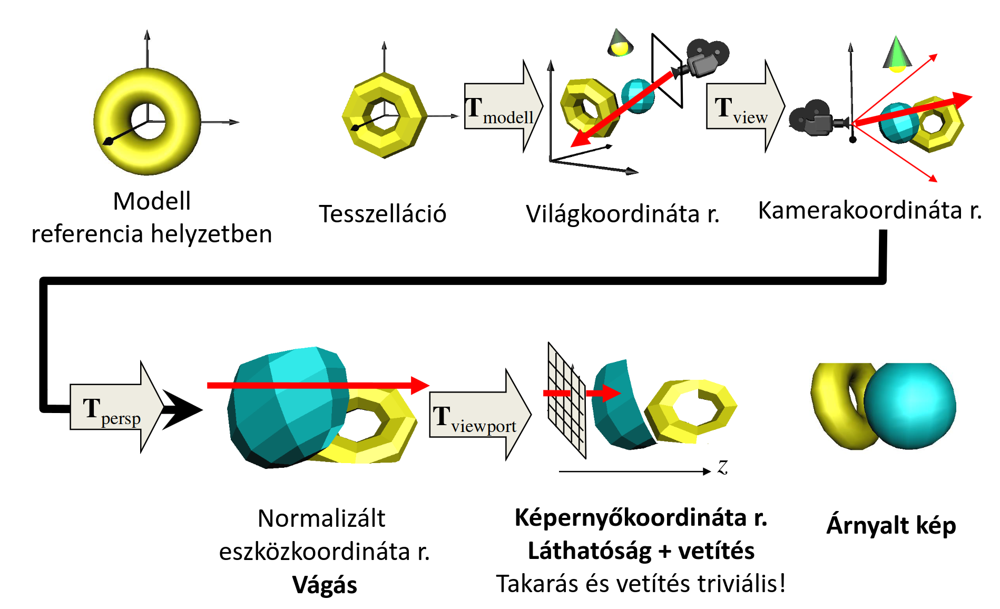

## Tesszeláció

= felületek háromszögekre bontása

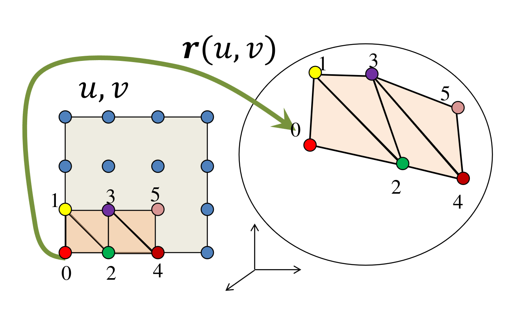

Magyarázat:

- felület parametrikus egyenletét használjuk
- paramétertér az egységnégyzet, innen behelyettesíthetünk bármilyen $u, v$ párost a felület egyenletébe
- kapott pontokat kössük össze háromszögekkel (értelemszerűen úgy, hogy azok a paramétertérben szomszédosak)

$r_{n, m} = r(u_n, v_m)$

Továbbá szükségünk lesz valamilyen normálvektorra is:

- csúcsonként kiszámoljuk a normálvektort
    > az eredmény egy retro/low-poly hatás, jól elkülönülnek a háromszögek, még sima felületeknél is.
    > ha azt szeretnénk, hogy sima legyen:
- a normálvektorokat később interpoláljuk 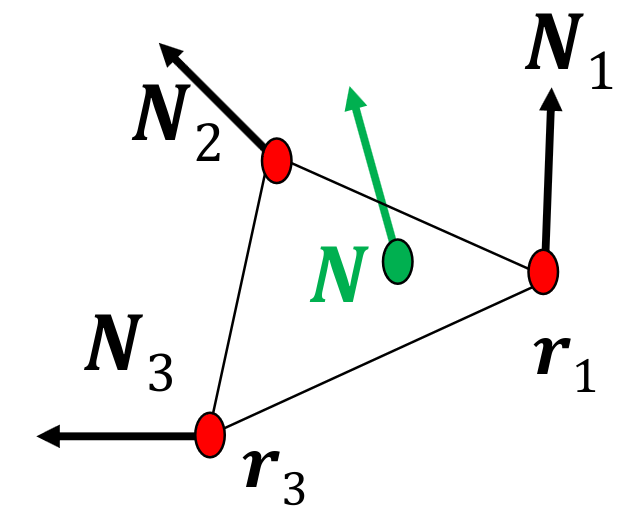

Emléketzető paraméteres felületek normálvektorának kiszámításához *(parciálisan deriváltakat keresztszorozzuk)*:

$N = \cfrac{\partial r(u, v)}{\partial u} \times \cfrac{\partial r(u, v)}{\partial v}$

## Implementáció


```cpp
class Geometry
{
protected:
    unsigned int vao, vbo;

public:
    Geometry()
    {
        glGenVertexArrays(1, &vao);
        glBindVertexArray(vao);
        glGenBuffers(1, &vbo);
    }
    virtual void Draw() = 0;
    ~Geometry()
    {
        glDeleteBuffers(1, &vbo);
        glDeleteVertexArrays(1, &vao);
    }
};
```

```cpp
class ParamSurface : public Geometry
{
    unsigned int nVtxStrip, nStrips;
    struct VertexData
    {
        vec3 pos, norm;
        vec2 tex;
    };
    virtual VertexData GenVertexData(float u, float v) = 0;

public:
    void Create(int N, int M);
    void Draw()
    {
        glBindVertexArray(vao);
        for (int i = 0; i < nStrips; i++)
            glDrawArrays(GL_TRIANGLE_STRIP, i * nVtxStrip, nVtxStrip);
    }
};
```

```cpp
void ParamSurface::Create(int N, int M)
{
    nVtxStrip = (M + 1) * 2;
    nStrips = N;
    vector<VertexData> vtxData; // CPU-n
    for (int i = 0; i < N; i++) for (int j = 0; j <= M; j++)
    {
        vtxData.push_back(GenVertexData((float)j / M, (float)i / N));
        vtxData.push_back(GenVertexData((float)j / M, (float)(i + 1) / N));
                                              // u          // v
    }
    glBindVertexArray(vao);
    glBindBuffer(GL_ARRAY_BUFFER, vbo);
    glBufferData(GL_ARRAY_BUFFER, vtxData.size() * sizeof(VertexData),
                 &vtxData[0], GL_STATIC_DRAW);
    glEnableVertexAttribArray(0); // AttArr 0 = POSITION
    glEnableVertexAttribArray(1); // AttArr 1 = NORMAL
    glEnableVertexAttribArray(2); // AttArr 2 = UV
    glVertexAttribPointer(0, 3, GL_FLOAT, GL_FALSE, sizeof(VertexData), (void *)offsetof(VertexData, pos));
    glVertexAttribPointer(1, 3, GL_FLOAT, GL_FALSE, sizeof(VertexData), (void *)offsetof(VertexData, norm));
    glVertexAttribPointer(2, 2, GL_FLOAT, GL_FALSE, sizeof(VertexData), (void *)offsetof(VertexData, tex));
}
```
Ez utóbbihoz egy kis magyarázat:

- az első funky for ciklus lehet egy kicsit érdekesebb, mi is történik itt?
    - kigeneráljuk a paramétertér adott sorának és adott oszlopának térbeli pozícióját
    - majd ugyan így a következő sorét
    > miért jó ez?
    > ha sorban haladnánk, abból egymás utáni pontokat kapunk, ezeket nem lenne értelme háromszögként értelmezni
    > ehelyett egy cikk-cakkos *"legyező"* mintát követünk
    > ezt `GL_TRIANGLE_STRIP`-ként *(legyező)* kezelve egyszerűen ki tudjuk rajzolni
    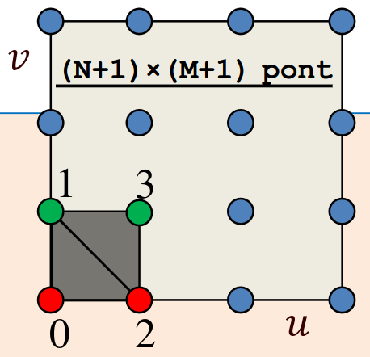  
- figyeljük meg hogy a csúcspontok generálásakor egy `VertexData` objektumot kapunk vissza, ez tartalmazza a pozíciót, a normálist, és a textúra (UV) koordinátákat is
- ki hogy szereti, stride vagy több VBO, Szirmay több VBO-val szereti
- szét is szedjük 3 külön VBO-ba, a vertexdata megfelelő értékeivel feltöltve

## Transzformációk

(**M** odel) Modellezési transzformáció:

$$
[r, 1] \bold{T}_\text{Model} = [r_\text{world}, 1] \\
\bold{T}_\text{Model}^{-1}[N, 0]^T = [N_\text{world}, d]^T
$$

(**V** iew) Kamera transzformáció:

$$
[r_\text{world}, 1] \bold{T}_\text{View} = [r_\text{camera}, 1]
$$ 

(**P** rojection) Perspektív transzformáció:

$$
[r_\text{camera}, 1] \bold{T}_\text{Proj} = [r_\text{ndc}w, w]
$$

**MVP** transzformáció:

> a fenti hármat kiszámolhatjuk egyben is, nem kell csúcspontonként háromszor mátrixszorozni

$$
\bold{T}_\text{MVP} = \bold{T}_\text{Model} \bold{T}_\text{View} \bold{T}_\text{Proj}
$$

### Modellezési (Model) transzformáció
- a pontjaink referenciahelyzetben vannak meg
- Descartes koordinátákat át kell váltanunk homogén koordinátákba
- kell egy mátrix ami
    1. skálázza
    2. elforgatja
    3. eltolja
    
    az alakzatot

1. skálázás
    $s_x, s_y, s_z$-vel való átméretezés
    $$
    \begin{bmatrix}
    s_x & 0 & 0 & 0 \newline
    0 & s_y & 0 & 0 \newline
    0 & 0 & s_z & 0 \newline
    0 & 0 & 0 & 1 \newline
    \end{bmatrix}
    $$

2. orientáció
    $d$ egységvektor körül $\varphi$ szöggel való forgatás *(tehát $d$ lesz a forgás tengelye)*
    $$
    \begin{bmatrix}
    i_x & i_y & i_z & 0\newline
    j_x & j_y & j_z & 0\newline
    k_x & k_y & k_z & 0\newline
    0 & 0 & 0 & 1\newline
    \end{bmatrix}
    $$
    $i, j, k$ vektorokat úgy kapjuk meg, hogy a hozzájuk tartozó bázisvektorokra alkalmazzuk az alábbi képletet:

    $$r' = r \cos(\varphi) + d(r \cdot d) (1 - \cos(\varphi)) + (d \times r) \sin(\varphi)$$

3. pozíció
    $v_x, v_y, v_z$-vel való eltolás
    $$
    \begin{bmatrix}
    1 & 0 & 0 & 0\newline
    0 & 1 & 0 & 0\newline
    0 & 0 & 1 & 0\newline
    v_x & v_y & v_z & 1\newline
    \end{bmatrix}
    $$

- tehát a modellezési transzformáció mátrixunk a
    $$
    \bold{T}_\text{M} = 
    \begin{bmatrix}
    s_x & 0 & 0 & 0\newline
    0 & s_y & 0 & 0\newline
    0 & 0 & s_z & 0\newline
    0 & 0 & 0 & 1\newline
    \end{bmatrix}
    \begin{bmatrix}
    i_x & i_y & i_z & 0\newline
    j_x & j_y & j_z & 0\newline
    k_x & k_y & k_z & 0\newline
    0 & 0 & 0 & 1\newline
    \end{bmatrix}
    \begin{bmatrix}
    1 & 0 & 0 & 0\newline
    0 & 1 & 0 & 0\newline
    0 & 0 & 1 & 0\newline
    v_x & v_y & v_z & 1\newline
    \end{bmatrix}
    $$
    $4 \times 4$-es mátrix lesz

- normálvektorhoz a mátrix inverzével szorozzuk a normál vektor transzponáltját 

### Kamera (View) transzformáció

> eltolás, elforgatás, annak érdekében, úgy, hogy a kameránk legyen az origó(ban) és a $-z$ irányba nézzen (affin)

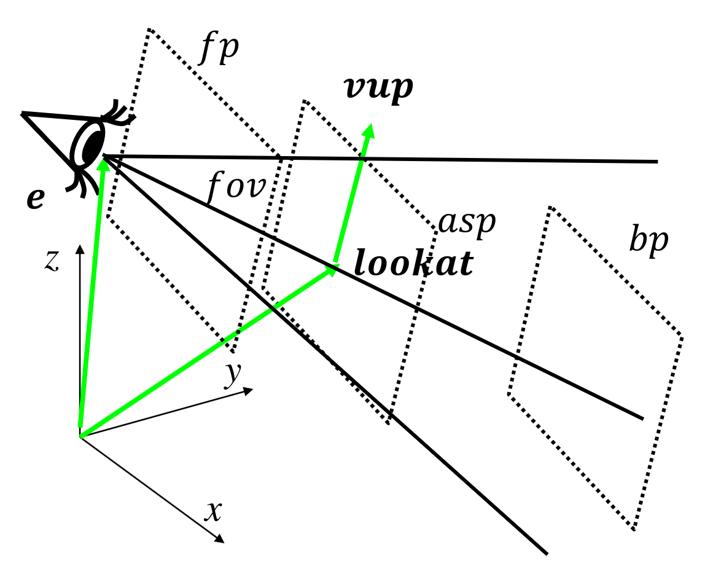

- ${e}$: eye - szem pozíciója
- $\text{lookat}$: ide nézünk, a nézetünk/képernyő téglalap középpontja
- $\text{vup}$: a függőlegesen felfelének tekintett irány
- $\text{fov}$: field of view = látószög
- $\text{asp}$: aspect = képarány (vízszintes $\ratio$ függőleges)
- $\text{fp, bp}$: front plane, back plane = első és hátsó vágósík, ami ezeken kívül esik azokat figyelmen kívül hagyjuk

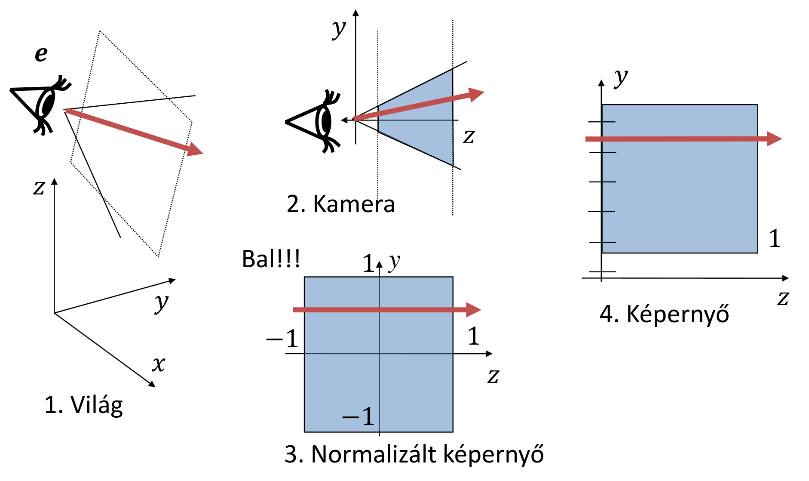
> *van egy ilyen ábra is hurrá, nem teljesen sikerült értelmezni de:*

a különböző terek, koordináta rendszerek, sorban

E modell szerinti kamera (view) transzformációs mátrix tehát:

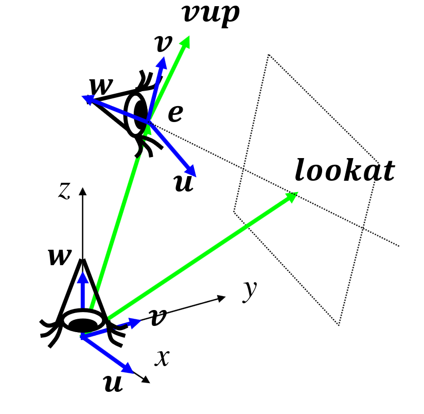

$w = (e - \text{lookat})/|e-\text{lookat}|$ *(leosztunk a hosszával avagy normalizáljuk)*

$u = (\text{vup} \times w)/|\text{vup} \times w|$ *(úgyszintén)* 

$v = w \times u$

$$
\bold{T}_V =
\begin{bmatrix}
1 & 0 & 0 & 0\newline
0 & 1 & 0 & 0\newline
0 & 0 & 1 & 0\newline
-e_x & -e_y & -e_z & 1\newline
\end{bmatrix}
\begin{bmatrix}
u_x & u_y & u_z & 0\newline
v_x & v_y & v_z & 0\newline
w_x & w_y & w_z & 0\newline
0 & 0 & 0 & 1\newline
\end{bmatrix}^{-1}
$$
> invertálás: a mátrixunk egy ortonormál mátrix (ahol a sorok egységvektorok és egymásra merőlegesek)
> ilyen mátrix inverze a saját transzponáltja

### Perspektív (Projection) transzformáció:

Látószög normalizálás:
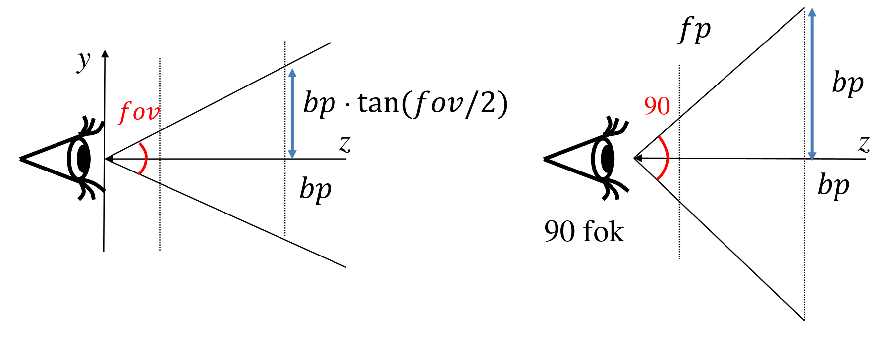
$$
\begin{bmatrix}
\cfrac 1 {\tan(\frac {\text{fov}} 2 ) \cdot \text{asp}} & 0 & 0 & 0\newline
0 & \cfrac 1 {\tan(\frac {\text{fov}} 2 )} & 0 & 0\newline
0 & 0 & 1 & 0\newline
0 & 0 & 0 & 1\newline
\end{bmatrix}
$$
> Miért jó ez? Ezzel skálázzuk a nézetet hogy stimmeljen a látószög (itt 90°) és a képarány.

Perspektíva:
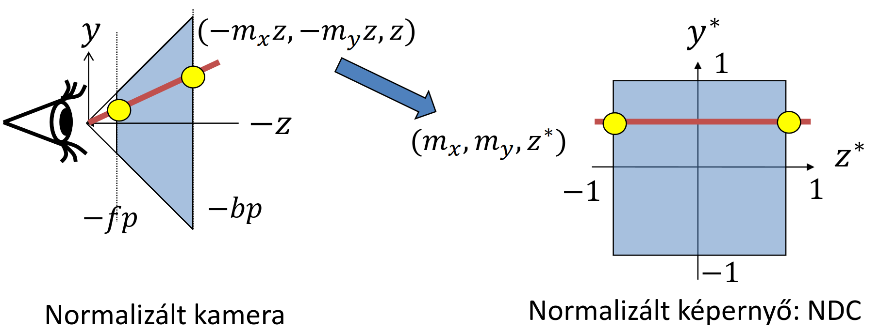

> A sugaraink jelenleg mind a kamerából indulnak, így viszont torz képet kapnánk. Ha azt szeretnénk, hogy tényleg pespektívának tűnjön, ahhoz párhuzamos sugarak kellenek.

Kis emlékeztető (egyenes egyenlete): $y = m \cdot x + b$

Origón átmenő: $y = m \cdot x$

Vízszintes: $y = b$

$(-m_x z, -m_y z, z)$ -ből kell tehát valahogyan $(m_x, m_y, z^*)$-ot előállítani

Homogén koordinátákkal ez úgy néz ki, hogy:

$[-m_x z, -m_y z, z, 1] \rightarrow [-m_x, -m_y, z^*, 1] \sim [-m_x z, -m_y z, -zz^*, -z]$

Ezt valamilyen

$$
\begin{bmatrix}
1 & 0 & 0 & 0\newline
0 & 1 & 0 & 0\newline
0 & 0 & \alpha & -1\newline
0 & 0 & \beta & 0\newline
\end{bmatrix}
$$

mátrixszal tudnák elérni.

Keressük tehát $\alpha$-t és $\beta$-t:

$-zz^* = \alpha z + \beta \rightarrow z^* = -\alpha -\beta / z$

Ábrán is látszik, hogy $-fp$-t tekintjük majd $-1$-nek, $-bp$-t pedig $1$-nek. 

Felírhatjuk ezeket egyenletekként:

$-1 = \alpha \cdot (-fp) + \beta$

$ 1 = \alpha \cdot (-bp) + \beta$

Átrendezve pedig kijön, hogy

$\alpha = \cfrac{(fp+bp)}{bpfp}​$

$\beta = \cfrac{2fp \cdot bp}{bpfp}$

Helyettesítsük be és szorozzuk meg a látószög normalizáláshoz használt mátrixszal:

$$
\bold{T}_P =
\begin{bmatrix}
\frac 1 {\tan(\frac {\text{fov}} 2 )\text{asp}} & 0 & 0 & 0\newline
0 & \frac 1 {\tan(\frac {\text{fov}} 2 )} & 0 & 0\newline
0 & 0 & \frac{(fp+bp)}{bp - fp} & -1\newline
0 & 0 & \frac{2fp \cdot bp}{bp - fp} & 0\newline
\end{bmatrix}
$$

Tömör gyönyör :3c

### Z-fighting

$z^*$ nem lineáris függvénye a $z$-nek, távolban lévő pontokról nem tudjuk eldönteni, hogy melyik van közelebb.

**$\cfrac{fp}{bp}$ nem lehet kicsi!**

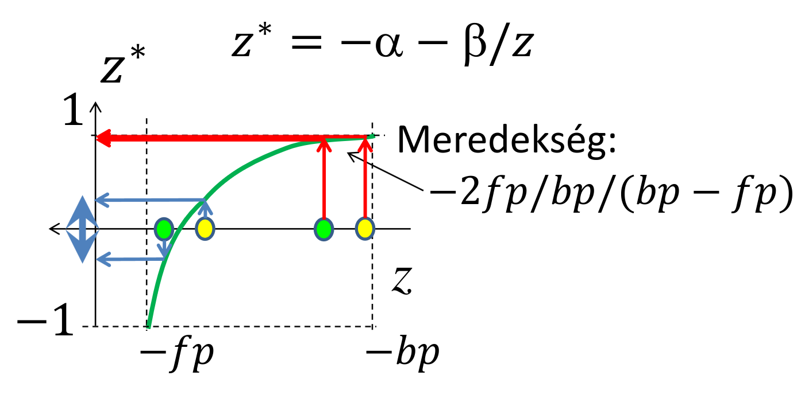

Perspektív torzítás = homogén osztás

$(x^*, y^*, z^*) = (X/w, Y/w, Z/w) \qquad \boxed{w = z_c}$

($z_c$: kamera szerinti koordináta)


## Implementáció
### Camera osztály
```cpp
class Camera
{
    vec3 wEye, wLookat, wVup; // extrinsic parameters
    float fov, asp, fp, bp;   // intrinsic parameters
public:
    mat4 V()
    { // view matrix
        vec3 w = normalize(wEye - wLookat);
        vec3 u = normalize(cross(wVup, w));
        vec3 v = cross(w, u);
        return TranslateMatrix(-wEye) * mat4(u.x, v.x, w.x, 0,
                                             u.y, v.y, w.y, 0,
                                             u.z, v.z, w.z, 0,
                                             0, 0, 0, 1);
    }
    mat4 P()
    { // projection matrix
        float sy = 1 / tanf(fov / 2);
        return mat4(sy / asp, 0, 0, 0,
                    0, sy, 0, 0,
                    0, 0, -(fp + bp) / (bp - fp), -1,
                    0, 0, -2 * fp * bp / (bp - fp), 0);
    }
};
```

## Transzformációk előkészítése a GPU-n
```cpp
void Draw()
{
    mat4 M = ScaleMatrix(scale) *
             RotationMatrix(rotAng, rotAxis) *
             TranslateMatrix(pos);
    mat4 Minv = TranslateMatrix(-pos) *
                RotationMatrix(-rotAngle, rotAxis) *
                ScaleMatrix(1 / scale);
    mat4 MVP = M * camera.V() * camera.P();
    shader->setUniform(M, "M");         // 
    shader->setUniform(Minv, "Minv");   // GPU változóinak állítása
    shader->setUniform(MVP, "MVP");     // 
    glBindVertexArray(vao);
    glDrawArrays(...);
}
```

A hozzá tartozó csúcspontárnyaló (vertex shader)
```c
uniform mat4 M, Minv, MVP;
layout(location = 0) in vec3 vtxPos;
layout(location = 1) in vec3 vtxNorm;
out vec4 color;
void main()
{
    gl_Position = vec4(vtxPos, 1) * MVP;
    vec4 wPos = vec4(vtxPos, 1) * M;
    vec4 wNormal = Minv * vec4(vtxNorm, 0);
    color = Illumination(wPos, wNormal);
}
```

## Vágás
> Mit látok? Normalizáltunk mindent is, minden tengelyen a $(-1, 1)$ intervallumot kell csak figyelembe vennem, hogy jó legyen.

A normalizált eszközkoordinátarendszerben, homogén koordinátákkal:

$$
-1 < X/w < 1 \\
-1 < Y/w < 1 \\
-1 < Z/w < 1 \\
\text{és}\\
\boxed{w = - z_c \quad (w > 0)}\\
\Downarrow \\
-w < X < w \\
-w < Y < w \\
-w < Z < w \\
$$

## Viewport transzformáció
Normalizáltból (NDC) képernyőkoordinátákba:

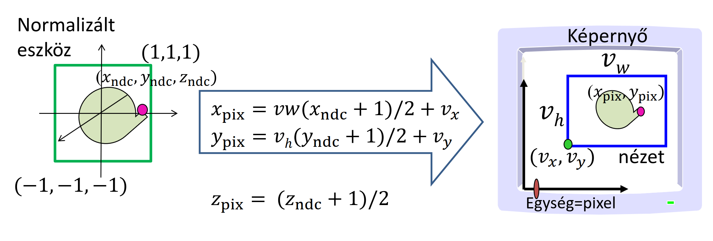

*$\text{Magyarázat: ...}$* <!-- triviális -->

## Transzformációs csővezeték
Az egyes transzformációkat külön a CPU-n:

- MVP
- Modell
- Modell-inverz

Ezeket átadjuk a csúcspontárnyalónak.
Vágás homogén koordinátákban, utána visszatérhetünk Descartes koordinátákba.

## Takarás
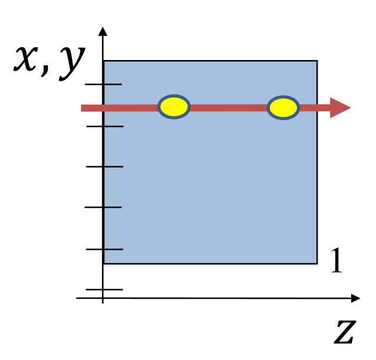

Képernyő koordinátarendszerben

- sugarak a $z$ tengyellyel párhuzamosak tehát
- sugárparaméter = $z$ koordináta
- $(x, y, z)$ pont az $(x, y)$ pixelben látszik

> Az alapján, hogy hogyan határozzuk meg, hogy mi látszik közelebb beszélhetünk:

Objektumtér algoritmusok (folytonos):

- láthatóságfelbontás nem függ a felbontástól

Képtér algoritmusok (diszkrét):

- mi látszik a pixelben?
- pl. sugárkövetésnél

## Backface culling (hátsólap eldobás)
> tldr: azon háromszögeket amik nem felénk néznek, azt fogjuk csinálni amit a tárgy okozta fájdalmainkkal: ignoráljuk


> *Fun fact: óramutató járásával megegyeznek a pontok, ezért van r3 és r2 más sorrendben.*

Nem felénk néző háromszögeket eldobjuk.
Felénk néz, ha $n_z < 0$

Feltételezés: kívülről általában a csúcsok óramutatóval megegyező körüljárásúak

<!-- beniii nézd zbuffer (benedek ezt az életben nem fogja elolvasni (szia beni :3)) -->
## Z-buffer
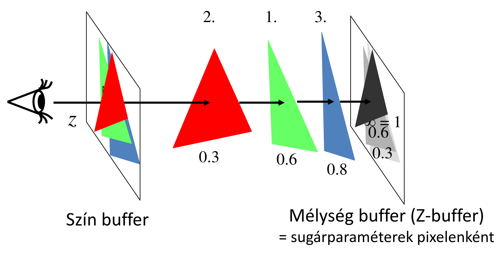

- objektumcentrikus
- a pixelek sugárparamétereit *(azaz $z$ koordinátáit, ezért z-buffer)* egy tömbben tartjuk nyilván
- ezt minimum kereséshez fogjuk használni, tehát maximális mélységűre ($1$-re) fogjuk inicializálni
- háromszögeket egyesével meglátogatjuk és jó prog1-et végzett hallgató módjára ha kisebbek vagyunk a minimumnál akkor felülírjuk stb.

### Lineáris interpoláció

<!-- mégis fontos :) -->
Minden egyes soron, azon belül az oszlopain végiglépegetünk, és kiszámoljuk $z$-t. Ez költséges művelet, amit úgy tudunk felgyorsítani, hogy kiszámoljuk a sor első $z$ koordinátáját, majd a következő cellánál ezt az eredményt felhasználjuk, hozzáadunk egy $a$ értéket. $a$ megadja, hogy egy pixelt az $x$ irányba lépve $z$ mennyit változik *(kvázi meredekség)*. Ezt azért tehetjük meg mert a háromszög felülete lapos, $z$ lineárisan változik.

Tehát $a = \cfrac{-n_x}{n_z}$

## Takarás OpenGL-ben
```cpp
int main(int argc, char *argv[])
{
    ...
    glutInitDisplayMode(GLUT_RGBA | GLUT_DOUBLE | GLUT_DEPTH);
    glEnable(GL_DEPTH_TEST); // z-buffer is on
    glDisable(GL_CULL_FACE); // backface culling is off
    ...
}
```

## Árnyalás
### Lokális illumináció árnyék nélkül
Röhögve tudjuk már a képletet fejből, hogy:

$L(V) \approx \sum_l {L^\text{in}}_l \cdot f_r(L_l, N, V) \cdot \cos^+ {\theta^\text{in}}_l$

Nade ezt mégse kéne pixelenként (lassú).

- csúcspontonként: csúcspontokon belül az $L$ "szín" interpolációja
    > Gouraud árnyalás (per-vertex shading)

- Pixelenként: belül a normál vektort interpoláljuk:
    > Phong árnyalás (per-pixel shading)

### Gouraud árnyalás
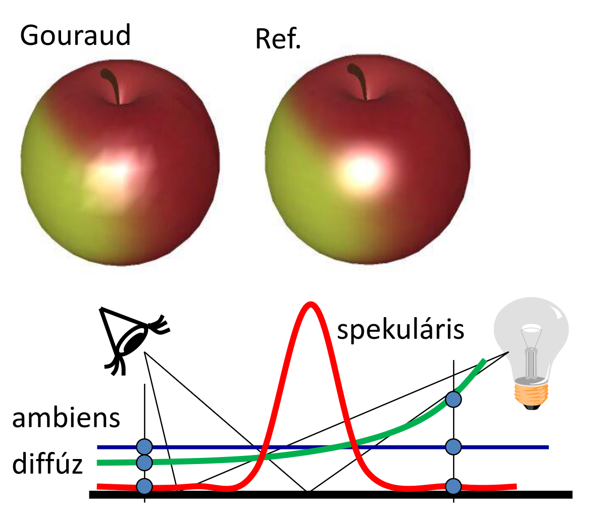

> yadda yadda megszokott módon csúcsokra kiszámoljuk, okos diák módjára tudjuk már hogy kell jól interpolálni stb stb, DE

Sok sebből vérzik:

- anyagtulajdonság konstans
- árnyék nincs *(nem tudna különben színt interpolálni)*
- durva tesszcelláció mellet csúnya a spekuláris *(a komponens huplija elveszhet, mert a függvény erősen nem lináris)*

Vertex shader:
```c
uniform mat4 MVP, M, Minv;            // MVP, Model, Model-inverse
uniform vec4 kd, ks, ka;              // diffuse, specular, ambient ref
uniform float shine;                  // shininess for specular ref
uniform vec4 La, Le;                  // ambient and point sources
uniform vec4 wLiPos;                  // pos of light source in world
uniform vec3 wEye;                    // pos of eye in world
layout(location = 0) in vec3 vtxPos;  // pos in modeling space
layout(location = 1) in vec3 vtxNorm; // normal in modeling space
out vec4 color;                       // computed vertex color
void main()
{
    gl_Position = vec4(vtxPos, 1) * MVP; // to NDC
    vec4 wPos = vec4(vtxPos, 1) * M;
    vec3 L = normalize(wLiPos.xyz * wPos.w - wPos.xyz * wLiPos.w);
    vec3 V = normalize(wEye - wPos.xyz / wPos.w);
    vec4 wNormal = Minv * vec4(vtxNorm, 0);
    vec3 N = normalize(wNormal.xyz);
    vec3 H = normalize(L + V);
    float cost = max(dot(N, L), 0), cosd = max(dot(N, H), 0);
    color = ka * La + (kd * cost + ks * pow(cosd, shine)) * Le;
}
```
Pixel shader:
```c
in vec4 color;          // interpolated color of vertex shader
out vec4 fragmentColor; // output goes to frame buffer
void main()
{
    fragmentColor = color;
}
```

### Phong árnyalás
> hasonló a történet

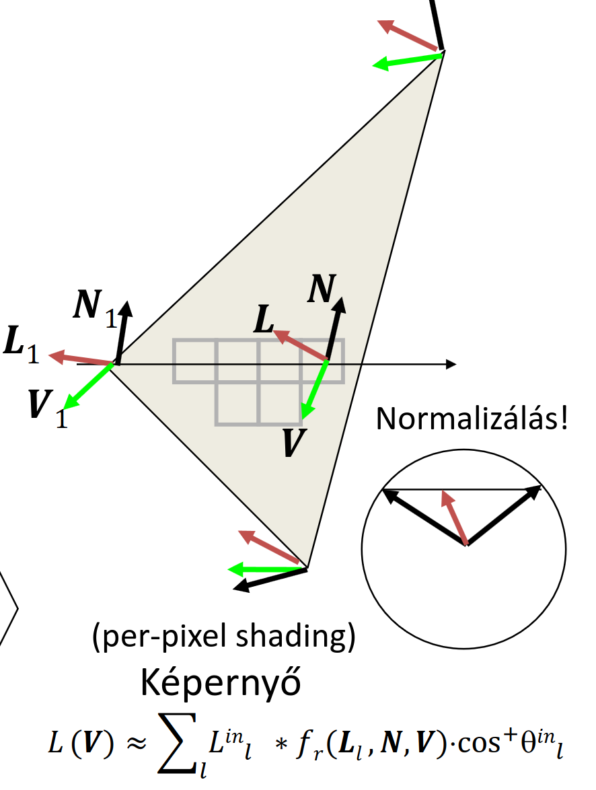

- csúcspontokban tehát tudjuk a tulajdonságait
- belső pixelenként elvégezzük a vektorok lineáris interpolációját
- nem felejtük el normalizálni a interpolációval kapott vektorokat, hogy egység hosszúak legyenek *(ugyanis ez nem garantált)*

Vertex shader:
```c
uniform mat4 MVP, M, Minv;            // MVP, Model, Model-inverse
uniform vec4 wLiPos;                  // pos of light source
uniform vec3 wEye;                    // pos of eye
layout(location = 0) in vec3 vtxPos;  // pos in model sp
layout(location = 1) in vec3 vtxNorm; // normal in model sp
out vec3 wNormal;                     // normal in world space
out vec3 wView;                       // view in world space
out vec3 wLight;                      // light dir in world space
void main()
{
    gl_Position = vec4(vtxPos, 1) * MVP; // to NDC
    vec4 wPos = vec4(vtxPos, 1) * M;
    wLight = wLiPos.xyz * wPos.w - wPos.xyz * wLiPos.w;
    wView = wEye - wPos.xyz / wPos.w;
    wNormal = (Minv * vec4(vtxNorm, 0)).xyz;
}
```
Pixel shader:
```c
uniform vec3 kd, ks, ka; // diffuse, specular, ambient ref
uniform float shine;     // shininess for specular ref
uniform vec3 La, Le;     // ambient and dir/point source rad
in vec3 wNormal;         // interpolated world sp normal
in vec3 wView;           // interpolated world sp view
in vec3 wLight;          // interpolated world sp illum dir
out vec4 fragmentColor;  // output goes to frame buffer
void main()
{
    vec3 N = normalize(wNormal);
    vec3 V = normalize(wView);
    vec3 L = normalize(wLight);
    vec3 H = normalize(L + V);
    float cost = max(dot(N, L), 0), cosd = max(dot(N, H), 0);
    vec3 color = ka * La + (kd * cost + ks * pow(cosd, shine)) * Le;
    fragmentColor = vec4(color, 1);
}
```

## 2D textúrázás ismét


Ez történik ha linárisan interpoláljuk a textúrát.

> nem követi a perspektívát
> oké de akkor hogy csináljuk jól?

Kiszámoljuk az affin transzformációt a 2D és a 3D háromszög között, ennek az inverzével meg tudjuk határozni a pixel pozícióját textúratérben.

## Inkrementális képszintézis csővezeték
Azért transzformáltunk, hogy a láthatósági feladatot és a vetítést képernyő koordináta-rendszerben oldhassuk meg

- Triviális hátsó lap eldobás
- Z-buffer algoritmus
- Vetítés = z eldobása, 3D háromszög = 2D háromszög

Per-pixel árnyalás:

- Vektorokat csúcspontonként számítjuk és pixelekre interpoláljuk
- Illuminációs képlet pixelenként

<!-- fuuu -->

# Kvíz
> 1\. A parametrikus felület tesszellációjánál a egységnégyzet paraméter tartományban 8x8 pontot vettünk fel szabályos rácsban. A felületet GL_TRIANGLES típussal jelentíjük meg. Hány csúcspontból fog állni a VBO.

*Megoldás:*

Vigyázunk hogy cselesen `GL_TRIANGLES`-t kér. Tehát háromszögenként 3 csúcs.

$8 \times 8$ **pont** rács, elképzelhetjük egy $7 \times 7$-es táblázatként, cellánként $2$ háromszög, háromszögenként $3$ csúcs, azaz

$7 \cdot 7 \cdot 2 \cdot 3 = 294$

---
> 2\. Egy paraméteres felület: 
$$
x(u,v)=3u+6.7v+3uv \newline
y(u,v)=6.5u+6.7v+3 uv \newline
z(u,v)=1.3u+6.7v+3 uv \newline
$$
Mekkora az nx/nz, azaz a normálvektor x és z komponensének aránya az (u,v)=(1,1) pontban?

*Megoldás:*

Meglátjuk, hogy paraméteres, és mint az őrült nekiállunk parciálisan deriválni:

$x(u, v)$:
$$
\cfrac{\partial x}{\partial u} = 3 + 3v\\ ~\\
\cfrac{\partial x}{\partial v} = 6.7 + 3u\\
$$
$y(u, v)$:
$$
\cfrac{\partial y}{\partial u} = 6.5 + 3v\\ ~\\
\cfrac{\partial y}{\partial v} = 6.7 + 3u\\
$$
$z(u, v)$:
$$
\cfrac{\partial z}{\partial u} = 1.3 + 3v\\~\\
\cfrac{\partial z}{\partial v} = 6.7 + 3u\\
$$

Emlékszünk, hogy

$N = \cfrac{\partial r(u, v)}{\partial u} \times \cfrac{\partial r(u, v)}{\partial v}$

Ez pedig nem más, mint

$$N = 
\bigg(
    \cfrac{\partial x}{\partial u}\bigg|_{(1, 1)},
    \cfrac{\partial y}{\partial u}\bigg|_{(1, 1)},
    \cfrac{\partial z}{\partial u}\bigg|_{(1, 1)}
\bigg)
\times
\bigg(
    \cfrac{\partial x}{\partial v}\bigg|_{(1, 1)},
    \cfrac{\partial y}{\partial v}\bigg|_{(1, 1)},
    \cfrac{\partial z}{\partial v}\bigg|_{(1, 1)}
\bigg)
\\~\\
= (6, 9.5, 4.3) \times (9.7, 9.7, 9.7) = (50.44, -16.49, -33.95)
$$

Tehát az arányuk
$\cfrac{n_x}{n_y} = \cfrac{50.44}{-33.95} = -1.485$


---
> 3\. A parametrikus felület tesszellációjánál a egységnégyzet paraméter tartományban 7x7 pontot vettünk fel szabályos rácsban. A felületet GL_TRIANGLE_STRIP típussal jelentíjük meg. Hány csúcspontból fog állni a VBO.

*Megoldás:*

Itt `GL_TRIANGLE_STRIP`-ben kéri.

Ezt legjobban a példakód magyarázza el.

$7 \times 7$ pontunk van, $6$ sor $7$ pont**páros**án megyünk végig, azaz $6 \cdot 7 \cdot 2 = 84$ pontunk lesz a VBO-ban.

---
> 4\. Egy háromszög három csúcsa képernyő koordinátarendszerben: 
<br>(13, 67, 0.6)
<br>(56, 80, 0.7)
<br>(78, 13, 0.9)

> Mennyivel változik a z koordináta, amikor a kitöltés során egy pixelről a jobboldali szomszéd pixelre lépünk?

*Megoldás:*

Interpolálni mindenki tud ügyebár, ki kell számolnunk az $a$ értékét. 

Előtte viszont szükségünk van a normálvektorra. Ez háromszögeknél:

$n = (r3 - r1) \times (r2 - r1) = (65, -54, 0.3) \times (43, 13, 0.1) = (-9.3, 6.4, 3167)$

$a$ pedig nem más, mint

$a = \cfrac{-n_x}{n_z} = \cfrac{9.3}{3167} = 0.003$

:people_hugging:

[Előző](./8.md)

[Következő](./10.md)