# Inkrementális 3D képszintézis

Az előző fejezetben tárgyalt sugárkövetés algoritmus egy [_pixelvezérelt_](./5.md#pixelvezérelt-képszintézis) algoritmus, most viszont objektum vezérelt algoritmusokról lesz szó. Itt végigmegyünk az objektumokon (háromszögek), meghatározzuk a képernyőre vett vetületüket, és az azon belüli pixeleket nézzük.

A legfőbb a célunk a sebesség, ennek alárendeljük a módszer általánosságát és egyszerűségét (ha általános és egyszerű módszert akarunk, akkor ott a pixelvezérelt sugárkövetéses algoritmus). Most csak lokális illuminációval fogunk foglalkozni, nem lesznek visszaverődő fények, se árnyékok és mindent rücskösnek fogunk venni.

Mit fogunk tenni azért, hogy gyorsabbak legyünk? Három fő stratégiánk lesz:

- koherencia: nem kell minden egy pixelre újra megoldani a feladatokat, hanem nagyobbak az egységeink (háromszögek),
- vágás: a nem látható objektumoknak az összes pixeljét ki tudjuk dobni, nem kell a sok milliónyi pixel mindegyikénél egyesével eldönteni, hogy "te most látszol?",
- transzformációk: mindent a megfelelő koordináta-rendszerben tudunk csinálni, azaz ahol egyszerű megcsinálni amit éppen akarunk.

??? example Megfelelő koordináta-rendszer?
    Például amikor Analízis II-ből polárkoordináta-rendszerbe váltottunk néhány integrál kiszámításához, annak is ez volt az alapja. Egy kört például euklideszi koordináta-rendszerben az $x^2 + y^2 = R^2$ képlettel tudunk kifejezni, viszont polárkoordinátákban elég csak annyi, hogy $r = R, \, \theta \in [0, 2\pi[$.

Azt fontos kiemelni, hogy vágni és transzformálni nem tudunk csak úgy vadul mindent mindenhogy. Korábban láttuk, hogy homogén lineáris transzformációkkal éri meg dolgozni, hiszen az egyenest egyenesbe, háromszöget háromszögbe visz. Ehhez először kelleni fog egy módszer, hogy komplexebb (akár háromdimenziós) alakzatokat háromszögekkel közelítsünk. Ez lesz a _tesszelláció_.

## Pipeline madártávlatból

Nézzük meg milyen lépésekből épül fel a pipeline.

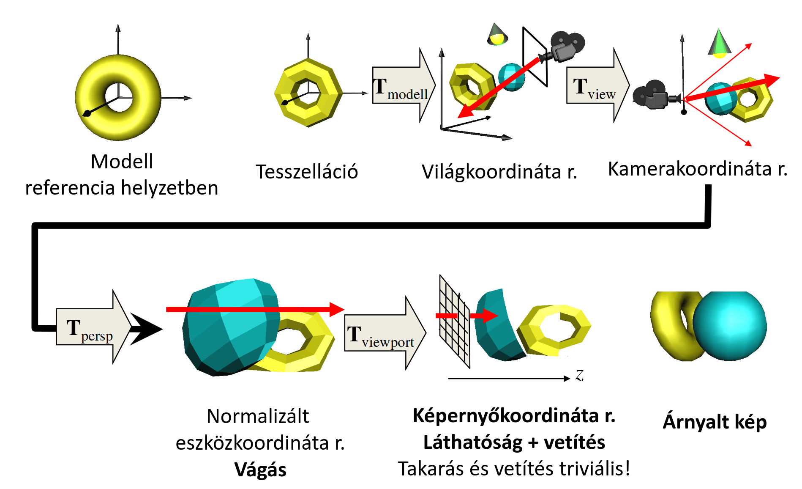

A kiindulási állapotunk az az, amikor a modell referencia helyzetben van a modellezési koordináta-rendszerben. Az első lépésünk a _tesszelláció_, ahol minden felületet háromszögekkel közelítünk. Most, hogy tudunk homogén lineáris transzformációkat használni, vegyünk is elő egyet: először a modellezési transzformációval transzformáljuk a tesszellált modellünket, ami elhelyezi a világ koordináta-rendszerben a "tényleges helyére". Itt fog találkozni a többi objektummal, a fényforrásokkal, illetve a kamerával.

Most kéne megoldanunk a sugárkövetés problémáját. Megtehetnénk ezt a mostani állapotunkban is, de sokkal egyszerűbb dolgunk lenne, ha egy kényelmesebb koordináta-rendszert választanánk. Vegyünk egy olyan koordináta-rendszert, ahol az összes sugár párhuzamos a $z$ tengellyel, és a sugarak $(x, y)$ koordinátái mind adott pixelek fizikai koordinátáinak felelnek meg. Ez az úgynevezett képernyőkoordináta-rendszer és itt szinte már triviális a takarás és vetítés problémák megoldása (két objektum akkor takarja egymást ha az $(x, y)$ koordinátáik megegyeznek, és az lesz előrébb, amelyiknek kisebb a $z$ koordinátája).

Ehhez a hasznos koordináta-rendszer több köztes transzformációval fogunk eljutni. Először a view transzformációval a kamerakoordináta-rendszerbe kerülünk, ahol a kameránk az origóban van, és a $-z$ irányba néz (a jobb kéz szabály miatt). Ez lényegében egy eltolás és egy elforgatás. Ezt (és az ezt követő) transzformációkat természetesen az összes objektumra (a kamerát bele értve) alkalmazzuk.

Ezután a projekciós transzformáció következik, amivel lényegében kitoljuk a kameránkat a $z$ tengely irányában lévő ideális pontba. Így érjük el azt, hogy ahelyett, hogy a sugaraink az origóban találkozzanak, a "végtelenben" fognak csak találkozni, azaz párhuzamosak lesznek. Ekkor normalizált eszközkoordináta-rendszert fogunk kapni (persze három dimenzióban, szóval egy $[-1, -1] \times [1, 1]$ négyzet helyett egy $[-1, -1, -1] \times [1, 1, 1]$ kockát fogunk kapni), itt pedig nagyon könnyen tud a hardware _vágni_.

Végezetül pedig a viewport transzformációt követően megérkeztünk a képernyőkoordináta-rendszerbe. Itt a takarás és vetítés után kétdimenziós háromszögeket kapunk, amiket a már korábban megismert algoritmusokkal ki tudunk színezni, és elő is állítottuk a végső képet.

Ha a gyorsaság volt az eredeti célunk, akkor ez a sok sok transzformáció nagyon pazarlónak tűnhet, viszont mivel ezek homogén lineáris transzformációk, ezért sokat össze tudunk vonni. Ilyen például az modell, view és projekciós transzformációk, amiket általában egy darab `MVP` mátrixszal írunk le.

Vizsgáljuk most részletesebben az egyes lépéseket.

## Tesszelláció

A pixelvezérelt megközelítésnél az implicit felület definíciókat preferáltuk, mert abba könnyebb behelyettesíteni a sugár egyenletét, és utána megoldani az egyváltozós nemlineáris egyenletet. Most viszont a parametrikus felületeket fogunk használni, mivel ezeket könnyű tesszellálni.
 
Egy parametrikus felület lényegében egy leképezés, ami a kétdimenziós $u, v$ tartományt (normalizált $[0,0] \times [1,1]$ a különböző felületek egységes kezelésének érdekében) megfelelteti a háromdimenziós tér egy kétdimenziós részhalmazának (mint pl egy kocka _lapja_). Egy elindulási pontot adhat az, ha vissza emlékezünk, hogy kétdimenzióban a parametrikus görbéket hogy vektorizáltuk, ami analóg azzal amit most csinálunk. Úgy jártunk el, hogy a paraméter tartományt felosztottuk diszkrét értékekre, és az egymás után következőeket egymáshoz rendeltük. Most is hasonlóan fogunk eljárni, csak egyel nagyobb dimenzióban: a paraméter térünk a $[0, 0] \times [1, 1]$ téglalap, innen fogunk diszkrét pontokat választani (színes, számozott pontok az alábbi képen):

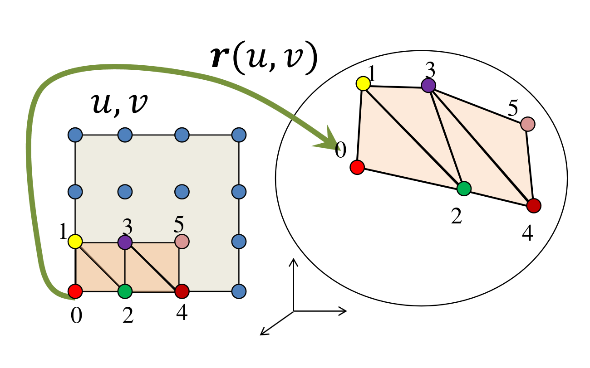
 
Ezeket a pontokat ha behelyettesítjük a parametrikus egyenletünkbe, akkor a háromdimenziós térben fogunk pontokat kapni a felületen. Ekkor azokat a pontokat kötjük össze háromszögekké, amik a paraméter térben szomszédosak (**nem távolság szerint szomszédosak, hanem számozás szerint**). Ha a teljes paramétertartományt lefedtük, akkor a teljes felületet tesszelláltuk.
 
Ha itt megállnánk, akkor a színezést és árnyalást követően nagyon látszanának a háromszög határok, mert a normálvektoraik között túl nagyok az ugrások. Ezt leplezhetjük azzal, hogy amikor kijelöljük a háromszög pontjait a paraméter térben, és behelyettesítjük a paraméteres egyenletbe, akkor azt is meghatározzuk, hogy magának a háromszögnek a csúcsaiban mi volt a felület normálvektora és eltároljuk a csúcspontokkal együtt ezt a normálvektort is. A normát a parciális deriváltak vektoriális szorzatával tudjuk kiszámolni:

$$
\bm{N} = \frac{\partial \bm{r}(u, v)}{\partial u} \times \frac{\partial \bm{r}(u, v)}{\partial v}
$$

Ezek az árnyalási normál vektorok. Amikor ki kell rajzolni a háromszög egy belső pontját, akkor az egész háromszög normálvektora helyett az adott pontban interpoláljuk a háromszög csúcsaiban tárolt normákat, így elkerülve a nagyon drasztikus határvonalak megjelenését.

### Implementáció (tesszelláció)

A geometriát, a virtuális világot a CPU-n tároljuk. A háromszögekre bontást szintén a CPU-n végezzük el. Az eredményt a GPU-ra küldjük, mert az fogja a csővezeték többi lépését végrehajtani. Az alábbi implementáció részletes magyarázata [itt](https://youtu.be/ZfQc4XWOQew?t=413) található, a jegyzet csak a fontosabb részleteket emeli ki.

```cpp
class Geometry {
   protected:
    unsigned int vao, vbo;

   public:
    Geometry() {
        glGenVertexArrays(1, &vao);
        glBindVertexArray(vao);
        glGenBuffers(1, &vbo);
    }

    virtual void Draw() = 0;

    ~Geometry() {
        glDeleteBuffers(1, &vbo);
        glDeleteVertexArrays(1, &vao);
    }
};
```

```cpp
class ParamSurface : public Geometry {
    unsigned int nVtxStrip, nStrips;

    struct VertexData {
        vec3 pos, norm;
        vec2 tex;
    };

    virtual VertexData GenVertexData(float u, float v) = 0;

   public:
    void Create(int N, int M); // Itt fogunk tesszellálni

    void Draw() {
        glBindVertexArray(vao);
        for (int i = 0; i < nStrips; i++)
            glDrawArrays(GL_TRIANGLE_STRIP, i * nVtxStrip, nVtxStrip);
    }
};
```

```cpp
void ParamSurface::Create(int N, int M) {
    nVtxStrip = (M + 1) * 2;
    nStrips = N;
    std::vector<VertexData> vtxData; // CPU-n tároljuk

    for (int i = 0; i < N; i++) for (int j = 0; j <= M; j++) {
        vtxData.push_back(GenVertexData((float)j / M, (float)i / N));
        vtxData.push_back(GenVertexData((float)j / M, (float)(i + 1) / N));
                                               // u          // v
    }

    glBindVertexArray(vao);
    glBindBuffer(GL_ARRAY_BUFFER, vbo);
    glBufferData(GL_ARRAY_BUFFER, vtxData.size() * sizeof(VertexData),
                 &vtxData[0], GL_STATIC_DRAW);

    glEnableVertexAttribArray(0); // AttArr 0 = POSITION
    glEnableVertexAttribArray(1); // AttArr 1 = NORMAL
    glEnableVertexAttribArray(2); // AttArr 2 = UV

    glVertexAttribPointer(0, 3, GL_FLOAT, GL_FALSE, sizeof(VertexData), (void *)offsetof(VertexData, pos));
    glVertexAttribPointer(1, 3, GL_FLOAT, GL_FALSE, sizeof(VertexData), (void *)offsetof(VertexData, norm));
    glVertexAttribPointer(2, 2, GL_FLOAT, GL_FALSE, sizeof(VertexData), (void *)offsetof(VertexData, tex));
}
```

A for ciklus releváns most számunkra, nézzük meg, hogy mi is történik benne: először kigeneráljuk a paraméter tér adott sorának és adott oszlopának térbeli pozícióját, majd rögtön a következő sorét is, még mielőtt a következő ciklusba lépnénk. Miért tesszük így?

Ha sorban haladnánk, akkor abból egymás utáni pontokat kapunk, amiket nem lehet háromszögként értelmezni; ehelyett a cikk-cakkos _legyező mintát_ követjük. Ezt `GL_TRIANGLE_STRIP`-ként kezelve egyszerűen ki tudjuk rajzolni:

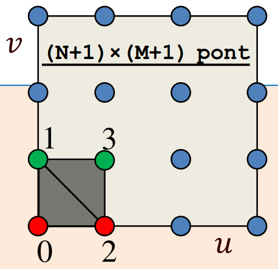  

Figyeljük meg hogy a csúcspontok generálásakor egy `VertexData` objektumot kapunk vissza, ez tartalmazza a pozíciót, a normált, és a textúra (UV) koordinátákat is. Ezután szét is szedjük ezeket három külön VBO-ba, a `VertexData` megfelelő értékeivel feltöltve őket.

Ha egy picit zavaros a legyezős rész, akkor a Mester [ebben a videóban](https://youtu.be/ZfQc4XWOQew?t=693) részletesen elmagyarázza.

## Transzformációk

Most, hogy a tesszellációt követően a GPU-n vannak a háromszögeink (csúcsai), itt az ideje transzformálni őket. Az egyes transzformációkat mátrixokként fogunk felírni, a fejezet során pedig meglátjuk, hogyan tudjuk ezeket össze vonni egy mátrixba. Az összes transzformációnk affin transzformáció lesz (a mátrixaik utolsó sora $[0,0,0,1]$) kivéve a projektív.

### Modellezési transzformáció

A modellezési transzformáció, amely $r$ referencia helyzetből világkoordinátákba viszi át az alakzatunkat:

$$
[\bm{r}, 1] \cdot \bm{T}_{\text{Model}} = [\bm{r}_{\text{world}}, 1]
$$

alakban írható fel. Fontos, hogy ilyenkor nem _csak_ a csúcspontokat transzformáljuk a $\bm{T}_{\text{Model}}$ mátrixszal, hanem a csúcsokhoz rendelt felületi/árnyaló normálvektorokat is, hiszen az árnyalást a világkoordináta-rendszerben fogjuk kiszámolni. Hogyan kell a normálvektorokat transzformálni? Ha van egy $\bm{N}$ normálvektorunk, akkor az alábbi módon kaphatjuk meg a világkoordináta-rendszerbeli alakját:

$$
\bm{T}^{-1}_{\text{Model}} \cdot [\bm{N}, 0]^{T} = [\bm{N}_{\text{world}}, d]^{T}
$$

azaz fogjuk a normálvektort, kiegészítjük egy $0$ koordinátával, utána mint oszlopvektor tekintünk rá, és megszorozzuk balról a modellezési transzformáció inverzével.

???+ question Miért egészíthetjük ki egy $0$-val a normált?
    Röviden azért, mert mivel $\bm{T}_{\text{Model}}$ egy affin transzformáció, ezért az inverze is az<sup>[[citation needed]](https://cdn.discordapp.com/emojis/1384476146636161065.webp?size=240)</sup>, tehát nem befolyásolja a normálvektortunk értékét a negyedik koordináta.

### Kamera transzformáció

Ez az a transzformáció, ami a kamerát az origóba helyez. Egy eltolás és egy elforgatás (mind a kettő affin). A következő alakban írható fel:

$$
[\bm{r}_{\text{world}}, 1] \cdot \bm{T}_{\text{View}} = [\bm{r}_{\text{camera}}, 1]
$$

### Projektív transzformáció

Ez a transzformációs lánc legizgalmasabb eleme: a kameránkat az origóból elvisszük a $z$ tengely mentén egy végtelen távoli ideális pontba. Ennek következtében azok a sugarak, amik eddig az origóban metszették egymást (onnan indultak ki) most párhuzamosak lesznek egymással és a $z$ tengellyel. Ehhez már egy affin transzformáció kevés lesz, itt valódi homogén lineáris transzformációt kell majd használnunk.

A negyedik homogén koordináta itt már nem marad $1$, ami továbbá azt is jelenti, hogy az első három koordináta nem marad Descartes koordinátákban mint az összes eddigi transzformáció után, hanem a Descartes koordináták meg vannak szorozva a negyedik extra koordinátával:

$$
[\bm{r}_{\text{camera}}, 1] \cdot \bm{T}_{\text{Proj}} = [\bm{r}_{\text{ndc}} \cdot w, w]
$$

A normalizált eszközkoordináta-rendszer koordinátáit kaptuk meg, csak ahhoz, hogy Descartes koordinátákban legyen, még el kell osztani az első három koordinátát a negyedikkel (homogén osztás).

### MVP

Persze ezeket a mátrixszorzásokat nem egyesével szokás elvégezni, hanem a három mátrix kiszámítása után összeszorozzuk őket a következő módon:

$$
\bm{T}_{\text{Model}} \cdot \bm{T}_{\text{View}} \cdot \bm{T}_{\text{Proj}} = \bm{T}_{\text{MVP}}
$$

Így pedig egyenesen $\bm{r}_{\text{ndc}}$ koordinátákat kaphatunk a kezdeti referencia helyzetből egyetlen egy mátrix szorzással.

Most, hogy láttuk, hogy hogyan kell alkalmazni az transzformációkat nézzük, hogy hogyan is kell kiszámolni őket. Fontos, hogy a mátrixok kiszámítása a CPU-n szokott történni, a GPU csupán elvégzi a szorzásokat minden pontra és vektorra.

### Modellezési transzformáció kiszámítása

Általában ez a lépés elemi affin transzformációk sorozata. A sorrend:

1. Skálázás ($x, y$ és $z$-koordináták mentén $s_x, s_y$ és $s_z$-vel skálázunk)
2. Forgatás (orientáció beállítása, egy origón átmenő, $\bm{d}$ irányú tengely mentén $\varphi$ szöggel forgatunk)
3. Eltolás (pozíció beállítása, egy $\bm{v}$ vektorral tolunk el)

Ezek mind elemi affin transzformációk, tehát megadhatóak a mátrixaik, és azok szorzatából össze is áll a modellezési transzformáció mátrixa:

$$
\bm{T}_{4 \times 4} =
\begin{bmatrix}
    s_x & 0 & 0 & 0 \\
    0 & s_y & 0 & 0 \\
    0 & 0 & s_z & 0 \\
    0 & 0 & 0 & 1
\end{bmatrix}
\begin{bmatrix}
    \bm{i'}_x & \bm{j'}_x & \bm{k'}_x & 0 \\
    \bm{i'}_y & \bm{j'}_y & \bm{k'}_y & 0 \\
    \bm{i'}_z & \bm{j'}_z & \bm{k'}_z & 0 \\
    0 & 0 & 0 & 1
\end{bmatrix}
\begin{bmatrix}
    1 & 0 & 0 & v_x \\
    0 & 1 & 0 & v_y \\
    0 & 0 & 1 & v_z \\
    0 & 0 & 0 & 1
\end{bmatrix}
$$

A forgatás mátrixát nézzük picit részletesebben: mivel itt egy tetszőleges $\bm{d}$ tengely körüli forgatást kell tudnunk modellezni, ezért a [Rodriguez formulát](./11.md/#rodriguez-formula) fogjuk használni:

$$
\bm{r'} = r \cos(\varphi) + \bm{d}(r \cdot \bm{d})(1 - \cos(\varphi)) + \bm{d} \times r \sin(\varphi)
$$

Ha a Rodriguez formulába a sima $r$ helyére az $(1,0,0)$ egységvektort írjuk be, akkor pont az $(\bm{i'}_x, \bm{i'}_y, \bm{i'}_z)$ koordinátákat kapjuk. Hasonlóan, ha a $(0,1,0)$ egységvektort adjuk meg $r$-nek, akkor a $(\bm{j'}_x, \bm{j'}_y, \bm{j'}_z)$ hármast kapjuk meg.

### Kamera modell

A kamera modellnél eddig a szem (egy pont) volt a kamera, de hasznos lehet egy realisztikusabb kamera modell, ahol egy kiterjedt téglalapra (filmre) vetítünk. Feltesszük hogy a lencse nyílása infinitezimálisan kicsi ([camera obscura](https://en.wikipedia.org/wiki/Camera_obscura)), ami azt fogja eredményezni, hogy minden felület abszolút élesen jelenik majd meg. Ez, és az eredeti "szem" modellünk ekvivalens, ha a szemet a lencse nyílásba helyezzük.

Itt a kamera optikai tengelye merőleges az képernyő síkjára. Vegyük észre, hogy ez a régi modellünknél közel sem adódik magától, hiszen a felhasználó bármilyen szögben ránézhet a képernyőjére.

Jelenítsük meg a kamerát és filmet a virtuális világban. Kihasználjuk a "szem" modellel való ekvivalenciát, és ahhoz hasonlóan fogjuk megjeleníteni. A kamerának kell helyvektor. A téglalap helyét egy `look_at` pont adja meg, mely a téglalap közepébe mutat. Kell továbbá egy `view_up` vektor (preferált függőleges irány), mely a film orientációját adja meg. Végül pedig a téglalap méretét több féle módon is megadhatnánk (`view_right` vektor, fov). Mi fov-ot fogunk használni (azaz mekkora szögben látszik film teteje és alja a kamerából) és aspektus arányt (a film oldalainak aránya). Ez azért jobb, mert a végén úgyis egy fényképünk lesz, aminek eleve van aspektus aránya. Ha már a képernyőnek is aspektus aránya van, akkor nem lesz torzítás a végén amikor meg akarjuk jeleníteni a fényképünket.

Ez már majdnem egy teljes modell, viszont még két apró módosítást be kell vezetnünk. Ami nagyon közel van a kamera pontjához (vagy mögötte van) azt nem látjuk, szóval bevezetünk egy síkot (_első vágó sík_) a kamera és a film között (a kamerához közel) ami "levágja" a szemhez nagyon közeli dolgokat. Hasonlóan járunk el a nagyon távoli objektumok kiküszöbölése érdekében is, csak ott egy nagyon távoli síkot (_második vágó sík_) vezetünk be, amin túl nem látunk semmit.

??? example Miért kell ezt?
    A perspektív torzítás miatt ami közelebb van a kamerához azt nagyobbnak látjuk, ami távolabb van azt kisebbnek. Ezzel a távolsággal valamilyen módon osztani fogunk a képszintézis során, viszont a kamerához közeli objektumok távolsága nagyon közel lenne $0$-hoz, és ha ilyen számokat tárolnánk és osztanánk, akkor az bizonyára numerikus instabilitáshoz vezetne.

A kamera transzformáció kiszámítása triviális, hiszen csak eltoljuk a kamerát az origóba, és elforgatjuk úgy, hogy a $-z$ tengely irányába nézzen.

### Perspektív transzformáció kiszámítása

Ennek a levezetéséhez induljunk ki a 2D egyenes explicit egyenletéből. Két esetet kell figyelembe vennünk:

1. Origón átmenő egyenesek: Ez a helyzet a transzformáció előtt, amikor a kameránk az origóban van, és a sugarak onnan indulnak ki. Itt valamiért a $z$ tengelyt választjuk független változónak (hogy a távolság alapján paraméterezzünk), így az egyenesek felírhatóak $x = -m_x \cdot z$ és $y = -m_y \cdot z$ alakban.
2. Vízszintes egyenesek: Ez az az állapot, amit a transzformáció után (a normalizált eszközkoordináta-rendszerben) el akarunk érni. Itt a sugarak párhuzamosak, azaz a kétdimenziós metszetükben vízszintes egyenesek. Ebben a térben az $x^*$ és $y^*$ koordináták éppen az előző eset meredekségei lesznek: $x^* = m_x$ és $y^* = m_y$.

Ahhoz, hogy az első esetből a másodikba jussunk, az egyenletünk nem lehet sima lineáris (affin) transzformáció. Az affin transzformációk nem képesek bármilyen véges távolságú pontot a végtelenbe (az ideális pontba) elvinni úgy, hogy közben az egyenesek egyenesek maradjanak. Kereshetnénk valami nemlineáris képletet, de a homogén lineáris transzformációk sokkal jobbak: ezek az ideális pontokat is tökéletesen kezelik, és garantálják, hogy az egyenesből egyenes marad. Mivel amúgy is mátrixokkal szorzunk, homogén koordinátákra fogalmazzuk meg a feltételt.

Először a látószög (FOV) normalizálását végezzük el, hogy a képaránnyal (aspect ratio) együtt egy torzításmentes $90^\circ$-os nézetet kapjunk:

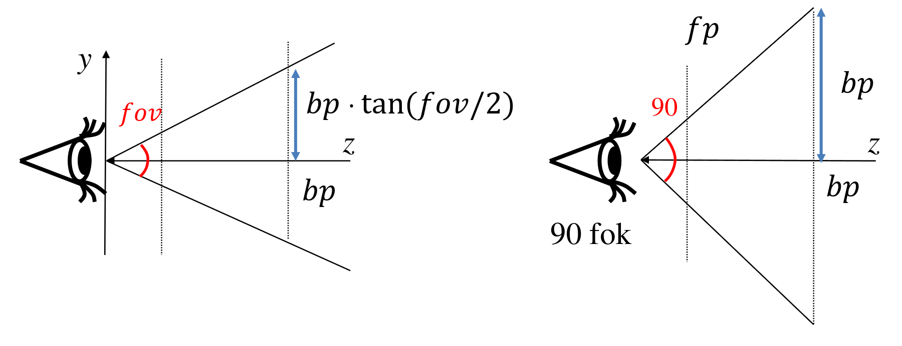

Ez a skálázó mátrix így néz ki:

$$
\begin{bmatrix}
\cfrac 1 {\tan(\frac {\text{fov}} 2 ) \cdot \text{asp}} & 0 & 0 & 0\newline
0 & \cfrac 1 {\tan(\frac {\text{fov}} 2 )} & 0 & 0\newline
0 & 0 & 1 & 0\newline
0 & 0 & 0 & 1\newline
\end{bmatrix}
$$

A következő lépés maga a perspektíva beállítása:

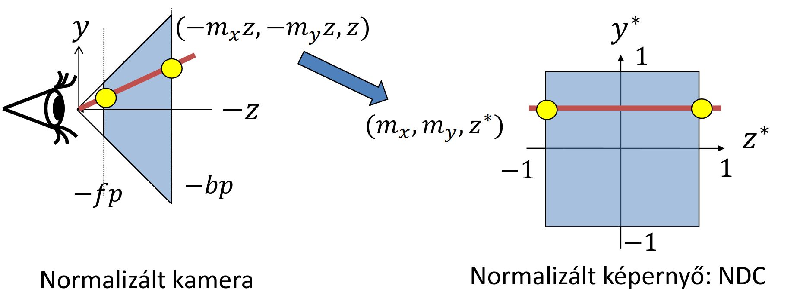

Láttuk, hogy a $[-m_x z, -m_y z, z, 1]$ pontból egy $[-m_x, -m_y, z^*, 1]$ pontot kell kapnunk. Homogén koordinátákkal felírva ez ekvivalens a $[-m_x z, -m_y z, -zz^*, -z]$ vektorral.
Ezt egy olyan mátrixszal tudjuk elérni, ami a $z$ koordinátát egy $\alpha z + \beta$ formába viszi át, azaz $-zz^* = \alpha z + \beta$, amiből $z^* = -\alpha -\frac{\beta}{z}$.

Keressük meg $\alpha$ és $\beta$ értékét! Tudjuk, hogy a látható tér első vágósíkját (front plane, $fp$) $-1$-be, a hátsó vágósíkját (back plane, $bp$) pedig $1$-be akarjuk leképezni. A $z$ tengely mentén ezek negatív értékek (mivel a kamera a $-z$ irányba néz), így behelyettesítve:

$$
\begin{align*}
-1 &= \alpha \cdot (-fp) + \beta \\
 1 &= \alpha \cdot (-bp) + \beta
\end{align*}
$$

Az egyenletrendszert megoldva kapjuk az együtthatókat:

$$
\alpha = \cfrac{fp+bp}{bp-fp}, \qquad \beta = \cfrac{2fp \cdot bp}{bp-fp}
$$

A látószög normalizálásával ezt összeszorozva kapjuk meg a végleges _projektív transzformáció mátrixát_ ($\bm{T}_{\text{Proj}}$):

$$
\bm{T}_{\text{Proj}} =
\begin{bmatrix}
\cfrac 1 {\tan(\frac {\text{fov}} 2 )\text{asp}} & 0 & 0 & 0\newline
0 & \cfrac 1 {\tan(\frac {\text{fov}} 2 )} & 0 & 0\newline
0 & 0 & \cfrac{fp+bp}{bp - fp} & -1\newline
0 & 0 & \cfrac{2fp \cdot bp}{bp - fp} & 0\newline
\end{bmatrix}
$$

### Z-fighting (Z-harc)

Vegyük észre a levezetésben kapott $z^* = -\alpha -\cfrac{\beta}{z}$ képletet! Ez azt jelenti, hogy a normalizált $z^*$ koordináta _nem lineáris_ függvénye az eredeti $z$-nek.

!!! warning Numerikus hibák
    A nemlineáris kapcsolat miatt a távolban lévő (a hátsó vágósík környezetébe eső) pontok nagyon sűrűn, minimális távolságra fognak egymásra vetülni. A lebegőpontos számábrázolás korlátai miatt numerikus hibák lépnek fel, és a rendszer nem fogja tudni megkülönböztetni két távoli, egymáshoz közeli felületről, hogy melyik van előrébb. A képernyőn ezek a felületek csúnyán elkezdenek villogni és "harcolni" az elsőségért. Ezt nevezzük _Z-fighting_nak.

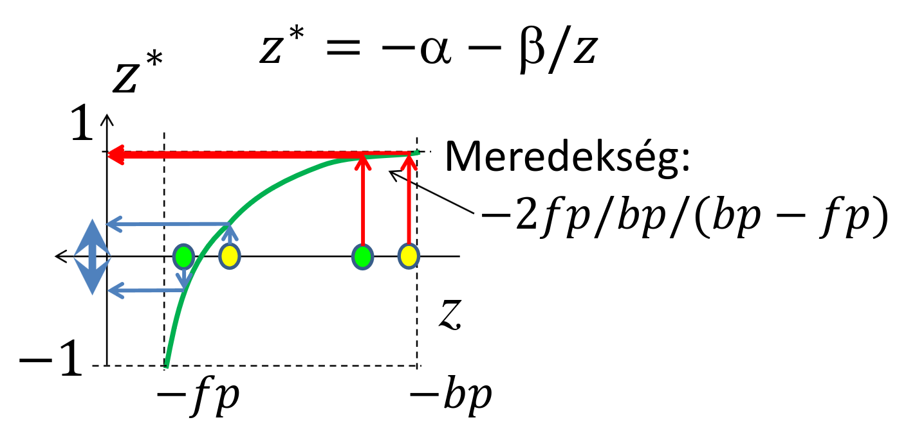

A Z-fighting elkerülése végett az $\cfrac{fp}{bp}$ arány nem lehet kicsi. Az első vágósíkot mindig rá kell tolni a kamerához legközelebbi tényleges objektumra, a hátsó vágósíkot pedig minél hamarabb "meg kell állítani".

### Kamera és Transzformációk implementációja

Ezeket a transzformációs mátrixokat a CPU-n, például egy `Camera` osztályban szokás előállítani:

```cpp
class Camera {
    vec3 wEye, wLookat, wVup; // extrinszik paraméterek
    float fov, asp, fp, bp;   // intrinszik paraméterek
public:
    mat4 V() { // Kamera (View) mátrix
        vec3 w = normalize(wEye - wLookat);
        vec3 u = normalize(cross(wVup, w));
        vec3 v = cross(w, u);
        return TranslateMatrix(-wEye) * mat4(u.x, v.x, w.x, 0,
                                             u.y, v.y, w.y, 0,
                                             u.z, v.z, w.z, 0,
                                             0, 0, 0, 1);
    }
    mat4 P() { // Projektív mátrix
        float sy = 1 / tanf(fov / 2);
        return mat4(sy / asp, 0, 0, 0,
                    0, sy, 0, 0,
                    0, 0, -(fp + bp) / (bp - fp), -1,
                    0, 0, -2 * fp * bp / (bp - fp), 0);
    }
};
```

A rajzolás (`Draw`) lépésben pedig a CPU kiszámolja a teljes $\bm{T}_{\text{MVP}}$ mátrixot, majd átküldi a GPU-ra:

```cpp
void Draw() {
    mat4 M = ScaleMatrix(scale) *
             RotationMatrix(rotAng, rotAxis) *
             TranslateMatrix(pos);
    mat4 Minv = TranslateMatrix(-pos) *
                RotationMatrix(-rotAngle, rotAxis) *
                ScaleMatrix(1 / scale);
    mat4 MVP = M * camera.V() * camera.P();
    
    shader->setUniform(M, "M");         
    shader->setUniform(Minv, "Minv");   // GPU változóinak állítása
    shader->setUniform(MVP, "MVP");     
    
    glBindVertexArray(vao);
    glDrawArrays(...);
}
```

## Vágás 3D-ben (GPU)

Megvan az MVP mátrixunk, átmentünk a normalizált eszközkoordináta-rendszerbe (NDC). Mivel a projektív mátrixunk legalsó sora nem $[0,0,0,1]$, a kimenet homogén koordinátákban lesz ($w \neq 1$), egészen pontosan $w = -z_c$. Nagy a kísértés, hogy azonnal elosszuk a vektorunkat $w$-vel (homogén osztás), és visszatérjünk Descartes-koordinátákba, de ezt a vágás előtt tilos megtenni.

Miért? Projektív geometriában, ha egy geometriai szakasz a kamera mögé lóg, akkor átmegy az ideális ponton (végtelenen). Euklideszi geometriában ilyen nincs, ezért ha a homogén osztással azonnal visszaváltanánk, a szakasz átfordulna, és egy ún. "komplementer szakaszként" a képernyő rossz oldalán, kifordítva jelenne meg.

Ha azonban a vágást a homogén koordináták terében csináljuk (konvex kombinációval, interpolációval paraméteresen átmegyünk az egyik pontból a másikba), az tökéletesen lekezeli az ideális ponton való áthaladást is. Tudjuk, hogy csak a szemünk előtt lévő dolgokat akarjuk látni, így feltételezhetjük, hogy a kamera $z$ koordinátája negatív, azaz $w = -z_c > 0$. A normál $[-1, 1]$ vágási tartományt felszorozva ezzel a pozitív $w$-vel egy rendkívül kellemes vágási dobozt kapunk a hardver számára:

$$
-w < X < w \\
-w < Y < w \\
-w < Z < w
$$

A hardver tehát ezen feltételek alapján levágja a nem látható geometriát, és a homogén osztást (ami maga a perspektív torzítás felelőse: "ami távolabb van, kisebbnek látszik") csak a vágás után végzi el. Ezt követi a Viewport transzformáció, ami a $[-1, 1]$ Descartes-koordinátákat ráfeszíti a képernyő valódi $(x, y)$ pixel-koordinátáira.

## Takarás

Most, hogy a képernyő koordináta-rendszerében vagyunk, a sugaraink mind párhuzamosak a $z$ tengellyel. A sugár paramétere maga a $z$ koordináta lett, és tudjuk, hogy az $(x, y, z)$ pont egyértelműen az $(x, y)$ pixelben fog látszani.

A takarási problémára alapvetően kétféle megoldási család létezik:

* Objektumtér algoritmusok: Folytonosak. Jövünk egy háromszöggel, beletesszük a térbe, és geometriailag kiszámoljuk, hogy teljesen, részben vagy egyáltalán nem látszik-e. Amit megtartunk, az abszolút precíz lesz, és nem függ a képernyő felbontásától, viszont algoritmikusan borzasztóan bonyolultak.
* Képtér algoritmusok: Diszkrétek (kvantáltak). Mivel a viewport (képernyő) felbontása véges, sokkal egyszerűbb egyesével megkérdezni a pixeleket, hogy: "Ki látszik itt?". Ezt fogjuk mi is használni.

### Backface culling

Ez valójában csak egy "fél" algoritmus, mert önmagában nem oldja meg a teljes takarást, de hihetetlenül hatékony teljesítményoptimalizáció. Zárt, lyukak nélküli 3D testek esetén minden háromszöglapnak két oldala van: egy külső (amit láthatunk) és egy belső, ami a test térfogata felé néz ("ragacsos" oldal). Ezt a belső oldalt a test többi része mindig eltakarja.

Ez azt jelenti, hogy ha a háromszögeket függetlenül vizsgáljuk, és észrevesszük egy háromszögről, hogy épp a "ragacsos" oldalát mutatja felénk, azt biztosan nem láthatjuk, tehát azonnal eldobható.

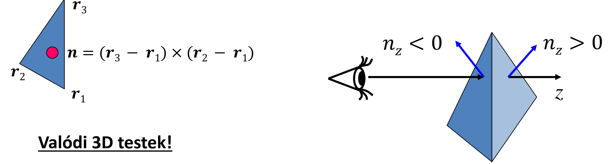

De hogyan kódoljuk le, hogy melyik az elülső oldal? Megállapodunk, hogy a modelltérben a csúcsokat mindig kívülről nézve, az óramutató járásával megegyező sorrendben adjuk meg. Ha ebben a sorrendben számoljuk ki a két élvektor vektoriális szorzatát, a kapott normálvektor iránya mindig a modellből kifelé fog mutatni.

Mivel mi a $-z$ tengely irányába nézünk, a lap akkor mutat "felénk", ha a normálvektor $z$ komponense negatív ($n_z < 0$). Ha nem negatív, a lapot eldobjuk.

Ezt OpenGL-ben ki is tudjuk használni:

```cpp
glEnable(GL_CULL_FACE); // Hátsólap eldobás bekapcsolása
```

### Z-buffer (Mélységtár) algoritmus

Ez már egy képprecíziós, teljes értékű takarási algoritmus. A sugárkövetés pixelvezérelt volt (minden pixelre megnéztük az összes objektumot), a Z-buffer viszont objektumvezérelt.

A memóriában minden pixelhez hozzárendelünk egy lebegőpontos tömbelemet (ez a Z-buffer), ami az adott pixelben eddig látott legkisebb $z$ (mélység) koordinátát tárolja. A minimumot keressük, ezért a buffert az algoritmus elején a maximális távolságra (általában `1.0`-ra) inicializáljuk.

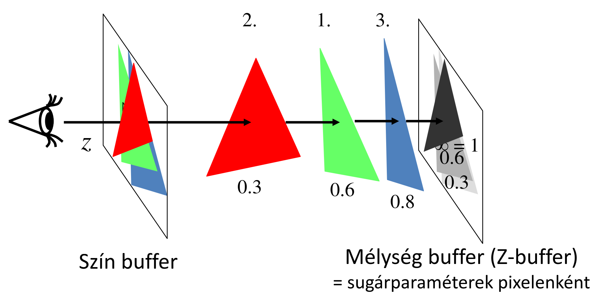

A folyamat a következő: Jön az első háromszög. Levetítjük a képernyőre, és amikor kitöltjük a pixeleket, minden pixelben meghatározzuk a felület $z$ koordinátáját. Ezt az értéket összehasonlítjuk a Z-bufferben lévő értékkel. Ha a háromszögünk $z$-je kisebb, akkor ez a pont közelebb van! Felülírjuk a Z-buffer értékét az új $z$-vel, a képbe (szín-bufferbe) pedig beleírjuk a háromszög színét. Jön a következő háromszög, levetítjük, megvizsgáljuk, és csak azokat a pixeleket írjuk felül, amik ténylegesen közelebb vannak az eddigieknél.

#### Inkrementális elv a lineáris interpolációban

Jogos a kérdés: ha minden egyes belső pixelre ki kell értékelni a sík egyenletét a $z$ koordinátához, az nem lesz túl lassú?

Itt vetjük be az _inkrementális elvet_. Mivel a háromszög egy sík felület, a $z$ koordináta lineárisan függ az $x$ és $y$ koordinátáktól. Nem kell minden pixelben drága matematikai műveleteket végeznünk! Ha az adott sorban lépünk egy pixelt jobbra ($x$ irányba), a $z$ értéke egy konstans $a$ értékkel fog megváltozni. Ezt az $a$ változást a sík normálvektorából egyértelműen ki tudjuk fejezni:

$$
a = \cfrac{-n_x}{n_z}
$$

Így a pixeleken végighaladva mindössze egyetlen összeadást kell elvégeznünk ($z_{új} = z_{régi} + a$).

A Z-buffer az OpenGL-ben egyszerűen bekapcsolható:

```cpp
int main(int argc, char *argv[]) {
    // ...
    glutInitDisplayMode(GLUT_RGBA | GLUT_DOUBLE | GLUT_DEPTH);
    glEnable(GL_DEPTH_TEST); // Z-buffer bekapcsolása
    // ...
}

```

## Árnyalás (Lokális illumináció árnyék nélkül)

Azt már tudjuk, hogy fizikailag a sugársűrűséget kell kiszámolni ahhoz, hogy reális képet kapjunk, a képlet pedig:

$$
L(V) \approx \sum_l {L^\text{in}}_l \cdot f_r(L_l, N, V) \cdot \cos^+ {\theta^\text{in}}_l
$$

Ez a képlet viszont borzasztóan sok műveletet tartalmaz. Ha ezt minden pixelre külön ki akarjuk számolni, az rengeteg időt venne igénybe. Emiatt két kompromisszumos szint alakult ki: a Gouraud és a Phong árnyalás.

### Gouraud árnyalás (per-vertex shading)

A világkoordináta-rendszerben kiszámoljuk az irányokat és a normálvektorokat a háromszög _három csúcspontjában_. A csúcspontokban kiértékeljük az illuminációs képletet is, így megkapjuk a három csúcs pontos színét. Ezt követően áttérünk a képernyőkoordináta-rendszerbe, és a háromszög kitöltése során a belső pixelekre a színeket a Z-koordinátához hasonlóan, lineárisan interpoláljuk. Ezt a Vertex Shaderben végezzük.

#### A Gouraud árnyalás problémái

1. A háromszög felületén az anyagtulajdonság végig konstans marad.
2. Árnyékot nem lehet vele számolni (bár ezt a mi lokális illuminációs modellünk amúgy sem tudja).
3. A legsúlyosabb probléma: A spekuláris foltok elmosódnak, eltűnnek vagy rendkívül szögletesek, gusztustalanok lesznek. Miért? Mert a spekuláris komponens (a $\cos^+$ függvény a magas hatványon) egy erősen _nemlineáris_*_ függvény. Ha mi a sarokpontokban kiszámolt értékeket egyszerűen _*_lineárisan_*_ összekötjük, a hupli a függvény közepén teljesen elvész.

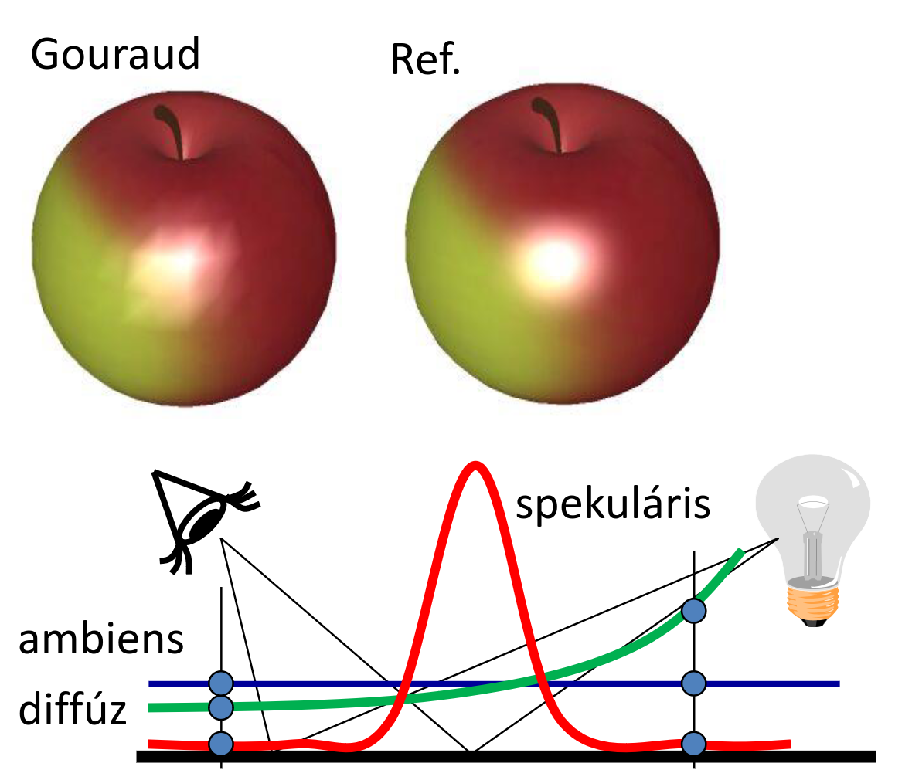

#### Gouraud implementálás

```cpp
// Gouraud Vertex Shader példa
uniform mat4 MVP, M, Minv;            
uniform vec4 kd, ks, ka;              
uniform float shine;                  
uniform vec4 La, Le;                  
uniform vec4 wLiPos;                  
uniform vec3 wEye;                    
layout(location = 0) in vec3 vtxPos;  
layout(location = 1) in vec3 vtxNorm; 
out vec4 color; // Kiszámolt szín, ami interpolálódni fog
void main() {
    gl_Position = vec4(vtxPos, 1) * MVP;
    vec4 wPos = vec4(vtxPos, 1) * M;
    vec3 L = normalize(wLiPos.xyz * wPos.w - wPos.xyz * wLiPos.w);
    vec3 V = normalize(wEye - wPos.xyz / wPos.w);
    vec4 wNormal = Minv * vec4(vtxNorm, 0);
    vec3 N = normalize(wNormal.xyz);
    vec3 H = normalize(L + V);
    float cost = max(dot(N, L), 0), cosd = max(dot(N, H), 0);
    // A színezés itt a vertex shaderben történik!
    color = ka * La + (kd * cost + ks * pow(cosd, shine)) * Le;
}

```

```cpp
// Gouraud Pixel Shader példa
in vec4 color; // Már a kész, interpolált színt kapja
out vec4 fragmentColor;
void main() {
    fragmentColor = color;
}
```

### Phong árnyalás (per-pixel shading)

A megoldás adja magát: ne a csúcspontokban kiszámolt színeket, hanem a geometriai vektorokat (Normál, Fényirány, Nézeti irány) interpoláljuk lineárisan! Ezek a vektorok simán és egyenletesen változnak a felületen.

Először a csúcspontokban előállítjuk az irányokat a világkoordináta-rendszerben. Az anyag tulajdonságait itt még nem bántjuk (és nem is lehet őket transzformálni, mert nem szögtartóak). Majd mintha csak egy "hátizsákban" vinnénk őket magunkkal, átvisszük ezeket a vektorokat a teljes transzformációs csővezetéken a raszterizálóig.

A raszterizáló lineárisan interpolálja a vektorokat a belső pixelekre. A pixel shader legelső dolga, hogy a kapott vektorokat újra normalizálja, hiszen két egységvektor lineáris interpolációjából kapott köztes vektor "beesik", rövidebb lesz $1$-nél. Csak ezután, minden egyes pixelben külön értékeljük ki az illuminációs képletet. Ez a legszámításigényesebb lépés a pipeline-ban, de a spekuláris foltok tökéletesen fognak mutatni.

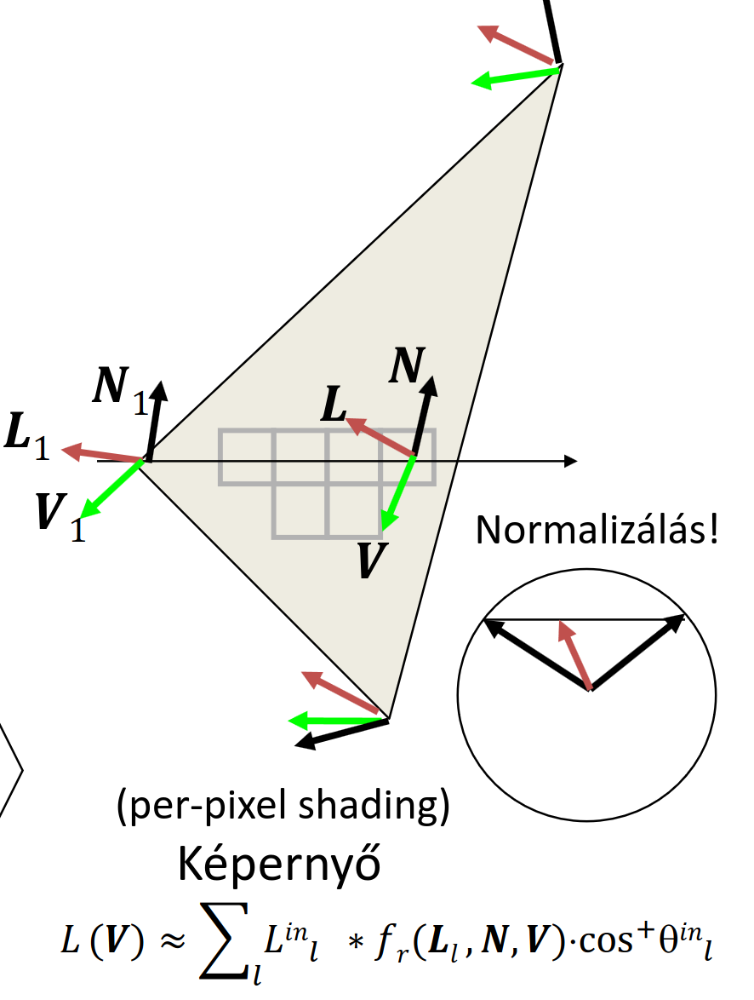

#### Phong implementálás

```c
// Phong Vertex Shader példa
uniform mat4 MVP, M, Minv;            
uniform vec4 wLiPos;                  
uniform vec3 wEye;                    
layout(location = 0) in vec3 vtxPos;  
layout(location = 1) in vec3 vtxNorm; 
out vec3 wNormal;                     // Ezeket a vektorokat visszük a "hátizsákban"
out vec3 wView;                       
out vec3 wLight;                      
void main() {
    gl_Position = vec4(vtxPos, 1) * MVP; 
    vec4 wPos = vec4(vtxPos, 1) * M;
    wLight = wLiPos.xyz * wPos.w - wPos.xyz * wLiPos.w;
    wView = wEye - wPos.xyz / wPos.w;
    wNormal = (Minv * vec4(vtxNorm, 0)).xyz;
}
```

```c
// Phong Pixel Shader példa
uniform vec3 kd, ks, ka; 
uniform float shine;     
uniform vec3 La, Le;     
in vec3 wNormal;         // Itt kapjuk meg az interpolált vektorokat
in vec3 wView;           
in vec3 wLight;          
out vec4 fragmentColor;  
void main() {
    // KÖTELEZŐ újra normalizálni őket az interpoláció után!
    vec3 N = normalize(wNormal);
    vec3 V = normalize(wView);
    vec3 L = normalize(wLight);
    vec3 H = normalize(L + V);
    float cost = max(dot(N, L), 0), cosd = max(dot(N, H), 0);
    // Az illumináció kiszámítása itt, pixelenként történik!
    vec3 color = ka * La + (kd * cost + ks * pow(cosd, shine)) * Le;
    fragmentColor = vec4(color, 1);
}
```

## 2D textúrázás perspektívahelyesen

Ha egy képet (textúrát) akarunk ráfeszíteni a háromszögre, az $u, v$ textúra-koordinátákat is hozzá kell rendelnünk a csúcsokhoz. Azt gondolhatnánk, hogy ezt is simán lehet lineárisan interpolálni a képernyőtéren, mint a színeket vagy a Z-koordinátát. De ha ezt tesszük, az eredmény így fog kinézni:

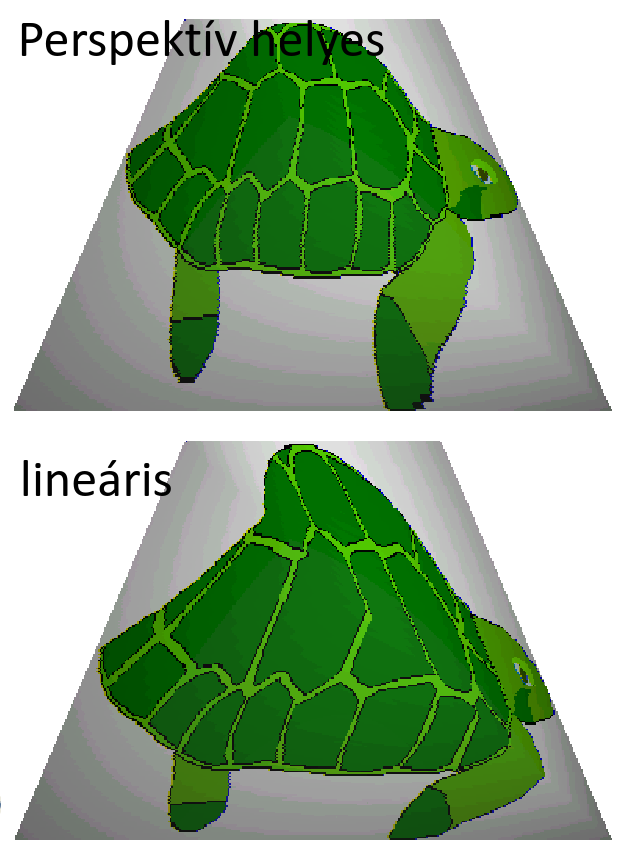

Mi a probléma? A textúra $\rightarrow$ model transzformáció (2D-ből 3D-be) egy egyszerű affin transzformáció ($9$ független kényszerünk és $9$ ismeretlenünk van). Azonban a model $\rightarrow$ képernyő transzformáció egy __homogén lineáris__ transzformáció a perspektíva miatt. Ha a textúra-kép felől indulunk a végső képernyő felé, két mátrixot szorzunk össze, és mivel az affin transzformáció a homogén lineáris egy részhalmaza, az eredmény egy homogén lineáris transzformáció lesz.

Ez visszafelé (a képernyőről a textúra felé) is igaz: osztunk a homogén $w$ koordinátával, majd $P^{-1}$-el szorzunk. Ha ezt az erősen torzító leképezést megpróbáljuk sima lineáris interpolációval helyettesíteni, a textúra nem követi a térbeli perspektívát.

A hardver ezt úgy oldja meg, hogy a csúcspontokban kiszámolt textúra-koordinátákat elosztja $w$-vel (tehát $u/w$ és $v/w$ értékeket képez), valamint interpolálja magát az $1/w$ értéket is. Ezek a hányadosok már lineárisan változnak a képernyőtéren. A pixelben aztán a hardver visszaszoroz a $w$-vel, és megkapjuk a tökéletesen perspektívahelyes $u, v$ koordinátákat.

## Kompozitálás és átlátszóság

Mi a helyzet akkor, ha nem átlátszatlan, hanem üveg vagy füst jellegű objektumokat rajzolunk? Amikor a pixel árnyaló kiszámítja egy felületpont új színét, az megérkezik a rasztertárba (frame-bufferbe). Ha átlátszóságról van szó, ez az új (forrás) szín nem írhatja felül egyszerűen az eddig ott lévő (cél) színt. A kettő között egy súlyozott átlagot (alpha blending) kell képeznünk.

Ezt egy általunk beállított függvénnyel tehetjük meg, például az új színt megszorozzuk az alpha (átlátszatlanság) értékével, a már ott lévő színt pedig az $(1 - \text{alpha})$ értékével, és a kettőt összeadjuk.

```cpp
glEnable(GL_BLEND); // Kompozitálás engedélyezése
glBlendFunc(GL_SRC_ALPHA, GL_ONE_MINUS_SRC_ALPHA);

```

!!! warning Sorrendiség az átlátszóságnál
    Amíg csak átlátszatlan testeket rajzoltunk (és működött a Z-buffer), teljesen mindegy volt, milyen sorrendben küldjük a háromszögeket a GPU-nak. Az átlátszóságnál ez már nem igaz! A súlyozott átlagolás nem kommutatív művelet. Ahhoz, hogy az üveg mögötti tárgyak színei helyesen szűrődjenek át az üvegen, mindig _hátulról előrefelé_ kell kirajzolnunk az objektumokat. Előbb a mögötte lévőt kell a rasztertárba tenni, és utána rákeverni az előtte lévő átlátszó felület színét.

---

# Kvíz

!!! question 1\. A parametrikus felület tesszellációjánál a egységnégyzet paraméter tartományban $8 \times 8$ pontot vettünk fel szabályos rácsban. A felületet `GL_TRIANGLES` típussal jelentíjük meg. Hány csúcspontból fog állni a VBO?

??? tip Megoldás
    Vigyázunk hogy cselesen `GL_TRIANGLES`-t kér. Tehát háromszögenként $3$ csúcs.

    $8 \times 8$ **pont** rács, elképzelhetjük egy $7 \times 7$-es táblázatként, cellánként $2$ háromszög, háromszögenként $3$ csúcs, azaz:

    $$
    7 \cdot 7 \cdot 2 \cdot 3 = 294
    $$

---

!!! question 2\. Egy paraméteres felület az alábbi egyenletekkel van megadva. Mekkora az $n_x/n_z$, azaz a normálvektor $x$ és $z$ komponensének aránya az $(u,v)=(1,1)$ pontban?
    $$
    x(u,v)=3u+6.7v+3uv \\
    y(u,v)=6.5u+6.7v+3 uv \\
    z(u,v)=1.3u+6.7v+3 uv
    $$

??? tip Megoldás
    Meglátjuk, hogy paraméteres, és mint az őrült nekiállunk parciálisan deriválni:

    $x(u, v)$:

    $$
    \frac{\partial x}{\partial u} = 3 + 3v\\[2.75ex]
    \frac{\partial x}{\partial v} = 6.7 + 3u\\
    $$

    $y(u, v)$:

    $$
    \cfrac{\partial y}{\partial u} = 6.5 + 3v\\[2.75ex]
    \cfrac{\partial y}{\partial v} = 6.7 + 3u\\
    $$

    $z(u, v)$:

    $$
    \cfrac{\partial z}{\partial u} = 1.3 + 3v\\[2.75ex]
    \cfrac{\partial z}{\partial v} = 6.7 + 3u\\
    $$

    Emlékszünk, hogy:

    $$
    N = \frac{\partial r(u, v)}{\partial u} \times \frac{\partial r(u, v)}{\partial v}
    $$

    Ez pedig nem más, mint:

    $$
    \begin{align*}
    N &=
    \left(
        \frac{\partial x}{\partial u}\bigg|_{(1, 1)},
        \frac{\partial y}{\partial u}\bigg|_{(1, 1)},
        \frac{\partial z}{\partial u}\bigg|_{(1, 1)}
    \right)
    \times
    \left(
        \frac{\partial x}{\partial v}\bigg|_{(1, 1)},
        \frac{\partial y}{\partial v}\bigg|_{(1, 1)},
        \frac{\partial z}{\partial v}\bigg|_{(1, 1)}
    \right) \\
    &= (6, 9.5, 4.3) \times (9.7, 9.7, 9.7) = (50.44, -16.49, -33.95)
    \end{align*}
    $$

    Tehát az arányuk:

    $$
    \frac{n_x}{n_z} = \frac{50.44}{-33.95} = -1.485
    $$

---

!!! question 3\. A parametrikus felület tesszellációjánál a egységnégyzet paraméter tartományban $7 \times 7$ pontot vettünk fel szabályos rácsban. A felületet ``GL_TRIANGLE_STRIP`` típussal jelentíjük meg. Hány csúcspontból fog állni a VBO?

??? tip Megoldás
    Itt `GL_TRIANGLE_STRIP`-ben kéri.

    Ezt legjobban a példakód magyarázza el.

    $7 \times 7$ pontunk van, $6$ sor $7$ pont**páros**án megyünk végig, azaz:
    
    $$
    6 \cdot 7 \cdot 2 = 84
    $$
    
    pontunk lesz a VBO-ban.

---

!!! question 4\. Egy háromszög három csúcsa képernyő koordináta-rendszerben alább látható. Mennyivel változik a $z$ koordináta, amikor a kitöltés során egy pixelről a jobboldali szomszéd pixelre lépünk?
    $$
    \begin{align*}
    r_1 = (13, 67, 0.6) \\
    r_2 = (56, 80, 0.7) \\
    r_3 = (78, 13, 0.9)
    \end{align*}
    $$

??? tip Megoldás
    Interpolálni mindenki tud ugyebár, ki kell számolnunk az $a$ értékét.

    Előtte viszont szükségünk lesz a normálvektorra. Ez háromszögeknél:

    $$
    n = (r_3 - r_1) \times (r_2 - r_1) = (65, -54, 0.3) \times (43, 13, 0.1) = (-9.3, 6.4, 3167)
    $$

    Ekkor $a$ pedig nem más, mint:

    $$
    a = \frac{-n_x}{n_z} = \frac{9.3}{3167} = 0.003
    $$
