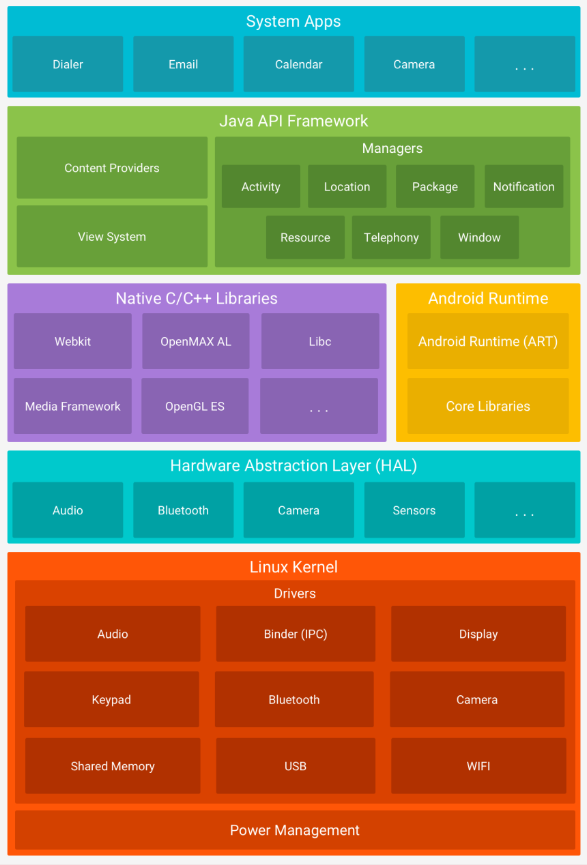
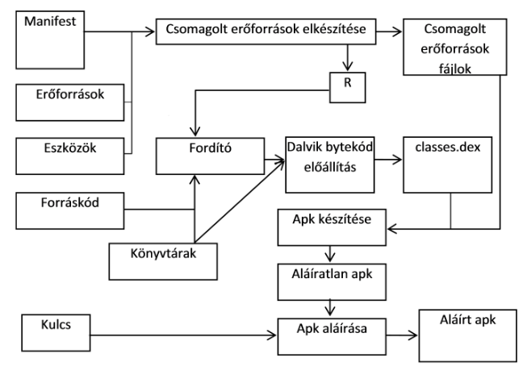
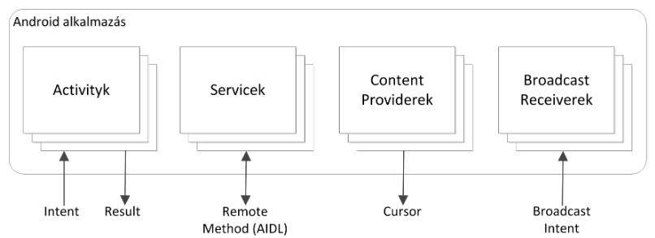
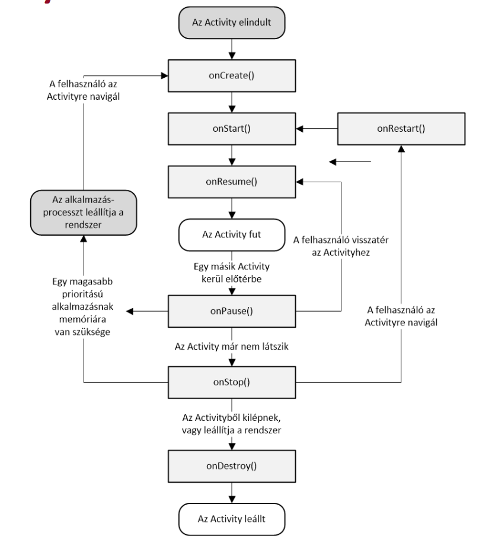

# Mobil szoftverfejlesztés

> [VIK Wiki kikérdező](https://vik.wiki/Mobil-_%C3%A9s_webes_szoftverek_mobil_kikerdezo)

## Platformok


### Mobilpiaci szereplők
- hálózat operátorok: kiépíti, karbantartja (tkom, yettel stb.)
- szolgáltatók: h. operátor is lehet, (Google, alkalmazások stb.)
- készülékgyártók
- felhasználók

### Android
- Android az OS és az azt futtató rendszerek összessége
- mobil, tablet, fedélzeti számítógép, óra, hűtő
- moduláris 
- linux kernel alapú
- felépítése:
    

    - C/C++ lib-ekre épül az Android Runtime
    - a java forrást a VM futtatja

- Fejlesztői eszközök: SDK (emulátor, java, kotlin), NDK (native, C++), ADK (accessory, kiegészítő eszközök)

### UI
1. xml view: imperatív
2. jetpack compose: deklaratív


??? note XML View
    - `findViewById` lassú $\Rightarrow$ **`Binding`** (ami segít elemeket megtalálni egy nézetben)
        1.  Engedélyezés:
            ```kotlin
            buildFeatures {
                viewBinding true
            }
            ```
        2. Az `activity_main.xml` $\to$ `ActivityMainBindig` lesz generálva
        3. Ezt használjuk a kódban:
            ```kotlin
            class MainActivity : AppCompatActivity() {
                private lateinit var binding: ActivityMainBinding

                override fun onCreate(savedInstanceState: Bundle?) {
                    super.onCreate(savedInstanceState)

                    binding = ActivityMainBinding.inflate(layoutInflater)
                    val view = binding.root
                    setContentView(view)

                    binding.tvHello.text="DEMO"
                }
            }
            ```

## Kotlin

> csak részletek
> bátran ajánlom a kotlin alapú szoftverfejlesztés szabvált

- fordul JVM byte code-ra vagy JS-re
- automatikus konverzió java-ról kotlin-ra (használhatunk Java osztályokat, könyvtárakat)
- nullsafe

```kotlin
// 1x értékadás
val score: Int = 1  // azonnal
val age = 3         // kitalálja a típust
val number
number = 3          // későbbi (1x) értékadás

// változó
var pLow: Int

// string interpolálás
val scoreText "$score pont"
val twiceYourAge "${age * 2} is double your age"

// null safety
var szam: Int? = null   // nullable
szam?.inc()             // nullsafe function call
val szoveg = szam?.toString() ?: "" // ?: elvis operator :3
szam!!.toString()       // mindenképp hívjuk, akkor is ha null

// fv
fun foo1(a : Int) : Int { return 2 * a }
fun foo2(a : Int ) = 2 * a
// "void" fv
fun bar1() : Unit { ... }
fun bar2() { ... }

// lambda
val l1 : () -> Unit = { ... }
val l2 : (Int, Int) -> Int = { a, b -> a + b }

// osztályok
class Car {
    val type: String
    constructor(type: String) {
        this.type = type
    }
}
// ugyan ez szebben 
class Car(val type: String)

// extrák
class Car(val type: String)
{
    val typeUpper = type.toUpperCase()

    // inicializáló blokk
    init {
        Log.d("innit?")
    }

    // secondary constructor
    constructor(type: String, model: String) : this(type) {
        ...
    }
}

// példányosítás
val car = Car("cat")

// származtatás
// alapból minden osztály final, csak openből lehet származi
open class Item(price: Int) {
    // csak opent lehet overrideolni
    open fun calc() { ... }
    fun load() { ... }
}
                                // ős konstruktorának hívsása
class SpecialItem(price: Int) : Item(price) {
    override fun calc() { ... }
}


// propertyk
class Car {
    var type: String? = null
        get() = field.toString() ?: "N/A"
        set(value) {
            println("ayaya")
            field = value // field kulcsszó a property valódi értéke
        }
}
```

### Android LogCat :cat: :3c (logolás)
`Log` osztály segítségével
```kotlin
Log.v(String, String) // (verbose)
Log.d(String, String) // (debug)
Log.i(String, String) // (information)
Log.w(String, String) // (warning)
Log.e(String, String) // (error)

// pl
Log.i("MyActivity", "Pos: " + position)
```


## Android fordítás


- apk: tömörített állomány, az alábbi mappákkal
    - `META-INF`: Manifest.MF, CERT.RSA, CERT.SF (erőforrások listája, sha-1 hash értékkel)
    - `res`: erőforrások
        - az xml layoutok is beszámítanak
        - minden erőforrásnak egyedi erőforrás azonosító generálódik
        - Erőforrás típusok: drawable, hangok, videók, felület leírás, raw, animáció, stílusok, szöveges erőforrások (paraméterezhető)
    - `resources.arsc`: erőforrások indexe, lefordított erőforrások
    - `classes.dex`: VM számára lefordított osztályok 
    - `AndroidManifest.xml`: név, verzió, jogosultságok, könyvtárak 
        - kötelező: komponensek listája, minimális android verzió, szükséges hardware konfiguráció
        - az alkalmazás packaget is meg kell adni
        - engedélyek is definiálhatók (intent elérés, névjegyzék stb.)
        - külső api könyvtárak is ide kerülnek
        - komponens indítás előtt a rendszer leellenőrzi, hogy definiálva van-e a manifest-ben
        ```xml
        <!--activity regisztráció-->
        <activity
            android:name=".AndHelloWorldActivity"
            android:label="@string/app_name"
        >
            <intent-filter>
                <!--alkalmazás belépési pont-->
                <action android:name="android.intent.action.MAIN"/>
                <!--futtatható alkalmazások közé kerül-->
                <category android:name="android.intent.category.LAUNCHER"/>
            </intent-filter>
        </activity>
        ```

## Alkalmazások felépítése

### Komponensek



#### Activity
- különálló nézet saját ui-jal (egy ablak)
- fő activityvel kezd az alkalmazás (ált.), amiből a többi elérhető
- bármelyik indíthat egy új activityt
- `Activity` osztályból örököl
- activity életciklus:
    
    
    - `onCreate()`  (opening app)
    - `onStart()`   ((re)gained visibility)
    - `onPause()`*  (lost focus)
    - `onResume()`  (regained focus)
    - `onStop()`    (lost visibility)
    - `onDestory`*  (exiting app)
    - stb.
    - \* = ide csak rövid kódot
    
    - paused vagy stopped állapotban a rendszer leállíthatja (memóriafelszabadítás, finish() hívás vagy process kill)
    - bezárás utáni újranyitáskor ezért újra létrejön
    - a callbackeket a rendszer hívja, a függvények "hook" jellegűek *(ősét is meg kell hívni!)*
    - > *portrait módba váltáskor is bezárul az activity és egy új jön létre*
   
    - `onStart`: az activity már látható, vezérlők is, BroadcastReciever-ekre ilyenkor érdemes feliratkozni
    - `onStop`: érdemes elengedni a nagy objektumokat (pl. DB kapcsolat)
    - leállítás: paused / stopped állapotban `finish()` hívással vagy Process leállításával

- pl. váltás A és B activityk között:
    - 1\.: **A** Activity `onPause()` függvénye
    - 2\.: **B** Activity `onCreate()`,` onStart()` és `onResume()` függvénye (**B**
    Activity-n van már a focus)
    - 3\.: **A** Activity `onStop()` függvénye, mivel már nem látható


- Back Stack (LIFO): erre kerülnek az activity-k, váltásnál az előző activity lejjebb kerül, vissza gombbal poppol
    - manifestben felüldefiniálható

#### Service
- `Service` osztályból
- háttérben hosszabb ideig futó, UI nélküli feladat
- más komponens (pl. Activity) indítja, bind-al vezérelheti

#### Content Provider
- `ContentProvider` osztályból
- megosztott adatforrások kezelése (fájlrendszer, adatb., web stb.)
- rajta keresztül lehet hozzáférni, módosítani

#### Broadcast Receiver
- `BroadcastReceiver` osztályból
- rendszer szintű eseményekre (pl. battery low) reagál
- alkalmazás figyelhet, de akár indíthat is saját broadcastet
- nincs ui
- az esemény intent formában érhető el


## Képernyő méretezés
- screen size: small, normal, large, extra large
- orientáció: portrait / landscape
- screen density (dpi): low, medium, high, extra high, xxhigh, xxxhigh
- felbontás (px)
    - ne használjunk beégetett pixel value-kat, se absolute layoutot
- sűrűség független: a felületek fizikai méretük megőrzik különböző sűrűségeken
    - sűrűség független pixel (density-independent pixel - dp):
        - $px = dp \cdot(dpi / 160)$
    - sűrűség független méretezés szövegekhez (sp)
        - *an sp is the same base unit, but is scaled by the user's preferred text size*


## Erőforrások
- képek, localization szöveg, hangok
- de akár stílus, animáció, szín, stb. amit nem hardcodeolunk
- `res/` mappába, amit kódbol `R.` után érünk el (és milyen jó mert típusbiztos)

### Erőforrás minősítő
- készülékhez igazodik az alkalmazás
- adott erőforrásokat tölt be az állapota alapján
    - nyelv, lod, orientation
- minősítőkkel láthatjuk el az adott mappát
    - pl. `res/values/` `res/values-hu/` `res/values-hu-land` *(magyar nyelv, landscape mód)*


## Méretezés
- képernyő méret (fizikai)
    - small, normal, large, extra large
- orientáció
    - landscape/portrait
- pixelsűrűség (dpi): low, medium, high, extra high, xxhigh, xxxhigh
    - sűrűségfüggetlen: a felület megőrzi fizikai méretét különböző sűrűségeknél
    - `dp`/`sp` azért jó mert nem `pixel` hanem adott méret dpi-től független (sp ráadásul követi a rendszerszinten beállított szövegméretet)
    - $px = dp \cdot (dpi / 160)$

- felbontás
    - **ne** használjunk beégetett `px` értékeket
        - helyette: `dp`, `sp`, `wrap_content`, `match_parent`


## Layoutok
- `LinearLayout`:
   

- `ConstraintLayout`:


## Jetpack Compose
- Kotlinban
- **deklaratív**: *mit* és nem *hogyan*
- Compose motor generálja a felületet, könnyű a UI frissítés 
    - kevesebb kód, nem kell XML, ugyanúgy használ erőforrásokat
- `@Composable` annontáció függvények elején
- `@Preview` annotiáció: egy komponens előnézetét segíti
- adhatunk meg lambdákat mint paraméter

!!! tip 
    :candy:: általában utolsó paraméternek rakját a lambdák, híváskor a zárójelen belül veszső után **helyett** zárójel után codeblockba: 

    ```kt
    // def
    fun demo(..., lambda1)

    // call
    demo(...) {
        //lambda1 here
    }
    ```


### Layoutok
- Linear
    - Column
    - Row
- Box
    - overlappelhetnek benne dolgok :+1:

#### Linear
- Row/Column
    - Alignment (mellékirány)
        - sor: függőleges tengely
        - oszlop: vízszintes tengely
    - Arrangement (főtengely)
        - sor: vízszintes tengely
        - oszlop: függőleges tengely
- Lazy Row/Column/Grid:
    - csak a látható elemeket renderelje
    - importálni nekünk kell: `androidx.compose.foundation.lazy.items`

különböző modifierek arragement és alignmentre, szép responsive uihoz

#### Box
alignment: 9 pozíció

#### Modifierek
díszítés, config, kiegészítés stb.

- szín, padding, margin, layout, alignment, arragement, ...
- típusbiztos

```kotlin
@Composable
fun Movie() {
    Column(
        modifier = Modifier
            .padding(10.dp)
            .fillMaxWidth()
            .clickable(onClick = {})
    ) {
        ...
    }
}
```

#### Layout extrák
- Linear Layout (pl. Row, Column)
    - != lista
    - súlyozási érték (arányok)
    - 0dp = **match constraint**, és megadjuk a `layout_weight`-et
    - ne nagyon ágyazzuk egymásba (rossz performance)
- Constraint Layout
    - kötelező megadni a méretét
    - vertikális és horizontális constraintek (mihez képest merre van és mennyire)
        - szülőhöz képest
        - másik view széléhez
        - másik view alapvonalához
        - guidelineokhoz
    - pros: responsive
- Scrollable Layout
- Slot-based Layout
- Scaffold
    - generic material ui
        - top bar, bottom bar, floating action button, content, drawer stb.
        - mindegyiknek saját Composablet adhatunk meg


### Állapotkezelés

- State = állapot
    - lehet bármilyen érték, ami idővel változhat
    - ha megváltozik az állapot, lehet, hogy újra kell renderelni
    - compose deklaratív $\rightarrow$ változtatáshoz újra létre kell hozni (**recomposition**)

#### Remember, mutableStateOf
- `remember`: az így kötött objektumok túlélik a recompositiont
- `mutableStateOf`: megfigyelhető `MutableState<T>` típus lesz belőle
- ilyen érték változásakor ütemez egy megfelelő recompositiont
- pl.
```kotlin
var text by remember { mutableStateOf("") }
// vagy
var text = remember { mutableStateOf("") }
```

- **de** a konfigurációs módosításokat **nem** éli túl: erre remember helyett `rememberSaveable`

#### Stateful v. Stateless
- ha van rememberrel belső állapota akkor a Composable stateful

#### State hoisting
- *hogyan lehet composable állapotmentes?*
- az állapot változót két függvény argumentummal váltjuk ki
    - `value: T`: a megjelenítendő érték
    - `onValueChange: (T) -> Unit`: "kívülről" megkapott esemény, amit változáskor meg kell hívni

<table>
<tr><th style="width:50%">Before</th><th style="width:50%">After</th></tr>
<tr>
<td>

```kotlin
@Composable
fun ShowTime() {
    var dateTime by rememberSaveable {
        mutableStateOf("")
    }
    Column {
        Text(text = "$dateTime")
        Button(onClick = {
            dateTime = Date(System.currentTimeMillis()).toString()
        }) {
            Text(text = "Show time")
        }
    }
}
```

</td>
<td>

```kotlin
@Composable
fun ShowTimeScreen() {
    var dateTime by rememberSaveable {
        mutableStateOf("")
    }
    ShowTextWhenClicked(dateTime, onChange = {
        dateTime = Date(System.currentTimeMillis()).toString()
    })
}

@Composable
fun ShowTextWhenClicked(dataText: String, onChange: () -> Unit) {
    Column {
        Text(text = "$dataText")
        Button(onClick = onChange) {
            Text(text = "Show time")
        }
    }
}
```

</td>
</tr>
</table>

??? note Magyarázat
    - az afterben az alsó composable stateless mert nem történik benne állapotváltozás, csak megadjuk neki, hogy gombnyomásra milyen callbacket hívjon meg és a megjelenítendő szöveget
    - a felső composable kezeli az állapotváltozást, amikor megváltozik akkor a benne tartalmazott composable is újra létrejön, már más értékkel
    - tehát így abban nincs state

    oké de mégis miért jó ez nekem?

    - single source of truth, kiszervezhetjük, megoszthatjuk mással
    - elkülönül az állapotváltozás
    - felülbírálható az állapotváltozás recompose előtt
    - leválaszthatjuk akár viewmodelbe

### Compose elemek

elemek kompozíciójából áll, az elemeket layout-ok tárolják, egyedileg vannak az elemek kirajzolva

#### Layout elemek
```kotlin
Column(Modifier.padding(16.dp)) { /* elemek, súlyozást ők kezelik */ }
Row()

// box tud stack-elni
// elem elhelyezés: Modifier.align(Alignment.BottomStart)
Box() 

// Scrollable:
Column(Modifier.verticalScroll(rememberScrollState())) {}

// Slotokkal
Scaffold(
    topBar = {}
    drawerContent = {}
    bodyContent = {}
    floatingActionButton = {}
    bottomBar = {}
)
```
- Vannak lazyLoading változatok is

#### További elemek
```kotlin
Text(stringResource(id = R.string.my_string_name))
Image(painter = painterResource(id = R.drawable.icon))

// ha csak 1 paraméter van akkor nem kell kitenni a lambdában
// a {param -> ...}-ot, hanem elég az `it` változót használni
TextField(value = "aaa", onValueChange = { a.value = it })
```

### Kódszervezés
javasolt mappák a fő packagen belül:
- ui
    - preview
    - screen
    - theme
    - view
- ...

### Compose alapelvek
- nincsenek ID-k (nem érjük el az objektumokat)
- a felület a Composable függvény (más argumentumú) újrahívásával frissül
- az állapotot tipikusan ViewModel tárlolja 
    ```kotlin    
    class MyViewModel : ViewModel() {
        private val num by remember { mutatableStateOf(0) }

        fun incrementNum (by : Int) { num.value += by }
    }

    // Usage:
    @Composable
    fun MyComponent(viewModel: MyViewModel = viewModel()) {
        Text("${viewModel.num.value}")
        // ...
    }
    ```
    - A viewModel olyan adatokat tárol, amiket a `@Composable` megfigyelhet

### A Compose függvények 5 szabálya:
1. A Composable függvények bármilyen sorrendben végrehajthatók.
2. A Composable függvények párhuzamosan (is) végrehajthatók.
3. A Recomposition kihagyja a lehető legtöbb Composable függvényt
és lambdát.
4. A Recomposition optimista, és leállítható menet közben.
5. Egy Composable függvény nagyon gyakran is futhat/ismétlődhet,
olyan gyakran is, mint egy animáció minden képkockája.

Továbbá:

- minden Composable függvénynek önállónak kell lennie
- okos, törekszik a gyorsaságra, látható részek prioritizálására, de lehet hogy kioptimalizál valamit
- kerüljük a kirajzoláskor történő mellékhatásokat
- adatokat paraméterként adjuk át neki ahol lehet
- gyakran is futhat recompose, a költséges műveleteket másik szálba tegyük

- a recomposition optimista:
    - feltételezi, hogy befejezi a kirajzolást az adatok ismételt változása előtt
    - ha egy paraméter mégis megváltozik recomposition befejezése előtt, akkor a Compose megszakítja a kirajzolást és újraindítja az új paraméterrel
    - a recomposition megszakításakor a compose elveti a felhasználói felületi fát az újrajalzolásból
- `SideEffect` / `LaunchedEffect`: nem szabad side effect-et csinálni, de akkor hol foglalkozzunk adatbázissal és hasonlókkal?
    - a `@Composable` függvény `SideEffect { ... }`-et minden recomposeon meghívja, a `LaunchedEffect(key1 = Unit) { ... }`-t pedig amikor a megadott kulcs változik
    - `DisposableEffect`: akkor lesz végrehajtva, amikor az elem kikerül a hierarchiából


### Navigáció
```kotlin
// ezt tesszük bele utána a MainActivity setContent részébe
@Composable
fun MyAppNavHost(
    modifier: Modifier = Modifier,
    navController: NavHostController = rememberNavController(),
    startDestination: String = "mainmenu"
) {
    NavHost(
        modifier = modifier,
        navController = navController,
        startDestination = startDestination
    ) {
        composable("mainmenu") { MainMenuScreen() }
        composable("game") { GameScreen() }
    }
}

// használat 
navController.naviage("game")
```

- támogat paramétereket `profile/{userId}`, opcionális argumentumokat
- visszagombot kezeli
- deep linkel nyitható másik alkalmazás is
- lehet több, egymásba ágyazott navhost

### Perzisztens tárolás

opciók:

- SharedPreferences / DataStore: kulcs-érték
- privát lemezterület: nem publikus adatok fájlrendszeren
- external storage: nagy méretű adatok nyilvánosan
- SQLite adatbázis: struktúrált adatokhoz
- hálózat: webszerver

### SQLite

- androidba beépített
- de nincs alapvető ORM, nekünk kell külső könyvtárként importálni vagy megírni a saját Query-ket
- relációs adatbázis
    - SQL szintaxis
    - tranzakciók
    - prepared statementek
- oszlop típusok: TEXT, INTEGER, REAL (nincs típus ellenőrzés)
- hosszú ideig is tarthatnak a műveletek $\Rightarrow$ asszinkron ajánlott
- használathoz `SQLiteOpenHelper`, `fun someQuery(db : SQLiteDatabase)`, `db.execSQL("SELECT * FROM table")`
- Cursorral tér vissza, amit így kéne használni:
```kotlin
if(cursor.moveToFirst())
while (!cursor.isAfterLast) { 
    // ... 
    cursor.moveToNext()
}
cursor.close()
```
#### SQLite használata
- kell egy adatbázis kezelő osztály `...DBHelper extends SQLiteOpenHelper`
    - ez határozza meg az adatbázis állomány nevét (`some_name.db`) és verzióját
- DAO data access object `public class ...DataSource`
    - van referenciája a database-re és a dbHelperre
    - ez tárolja a create, update, insert ... dolgokat az adatokhoz

### ORM - Room-al:
- SQLite felett absztrakciós réteg
- annotációkat használ
1. Az entitásokat data classokban tárolja
```kotlin
@Entity(tableName = "grade")
data class Grade(
    @PrimaryKey(autoGenerate = true) var gradeId: Long?,
    @ColumnInfo(name = "studentid") var studentId: String,
    @ColumnInfo(name = "grade") var grade: String
)
```
1. itt is van DAO
```kotlin
@Dao
interface GradeDAO {
    @Query("""SELECT * FROM grade WHERE grade="B"""")
    fun getBGrades(): List<Grade>

    @Query("SELECT * FROM grade")
    fun getAllGrades(): List<Grade>

    @Insert
    fun insertGrades(vararg grades: Grade)

    @Delete
    fun deleteGrade(grade: Grade)
}
```
1. itt is van Database Helper
```kotlin
// Listába vannak felsorolva a @entity annotációval ellátott osztályok
@Database(entities = [Grade::class], version = 1)
abstract class AppDatabase : RoomDatabase() {

    abstract fun gradeDao(): GradeDAO

    // a companion object a kotlinos static változó
    companion object {
        @Volatile
        private var INSTANCE: AppDatabase? = null

        fun getInstance(context: Context): AppDatabase {
            return INSTANCE ?: synchronized(this) {
                // a builder a perzisztens adatbázist építi, paraméterként kapja a
                // @Database-el jelölt osztályt és az adatbázis fájl nevét
                INSTANCE ?: Room.databaseBuilder(
                    context.applicationContext,
                    AppDatabase::class.java, "grade_database"
                )
                .fallbackToDestructiveMigration()
                .build()
                .also { INSTANCE = it }
            }
        }
    }
}
```
- A DAO támogatja a Flow-kat $\Rightarrow$ ha Flow-val térünk vissza, az Coroutine-okkal dolgozik és nem szenvedős annyira a szálkezelés

### SharedPreferences
- key-value értékpárok, állítható láthatósággal (MODE_PRIVATE/MODE_WORLD_READABLE/MODE_WORLD_WRITABLE)
- alkalmazásonként akár több ilyen fájl is lehet
    - `getSharedPreferences(String name, int mode)`
- ha csak egy van akkor lehet
    - `getPreferences()`
- ideális esetben csak primitív típusokkal reprezentálható adatokra
    - settings


### Fájlkezelés
- internal storage 
    - írás: `openFileOutput(String filename, int mode)`
        - módok
            - Context.MODE_PRIVATE: default, felülír ha létezik
            - Context.MODE_APPEND: hozzáfűz
        - kiterjesztés elhagyható, más úgyse fogja nézni
    - olvasás: `openFileInput(String filename)`
        - bytestream vagy exception
        - `.read()`
        - `.close()`!
    - cache:
        - `getCacheDir()` visszaad egy file objectet ami a cache könyvtár
            - ebben hozunk létre cache fájlokat
        - a rendszer felszabadíthatja
- external storage (felhasználó is eléri)
    - bárki írhat / olvashat nem számíthatunk rá, hogy a felhasználó nem törli / módosítja
    - használat előtt tudnunk kell, hogy hozzáférhetünk-e a tárhelyhez
    - vannak beépített type-okhoz könyvtárak
- statikus fájlok: 
    - valami bináris fájl ami nem illene a `res/`-be
    - fejlesztéskor `res/raw/` mappába
        - `resources.openRawResource(R.raw.myfile)`
    - telepítéskor kerül be az internal storageba, readonly lesz
